  

**PURPOSE:**

**OBJECTIVES:**

### Population breakdown by journey characteristics 

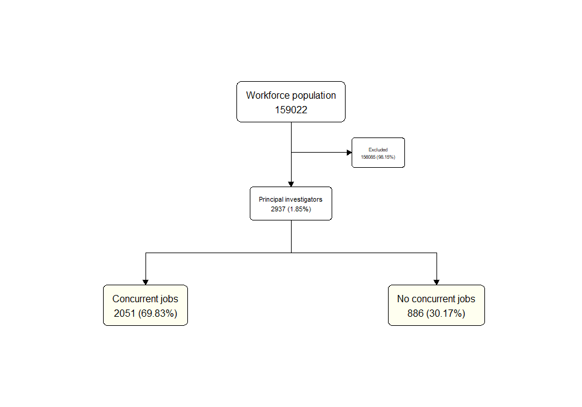<!-- --><!-- --><!-- -->

### Individual journeys 

#### **EXCLUSIVE JOURNEY**

***No work break, no leave***

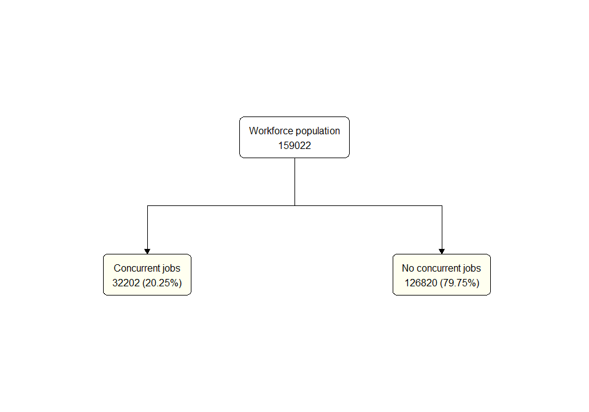<!-- --><!-- -->

***Work break, no leave***

<!-- -->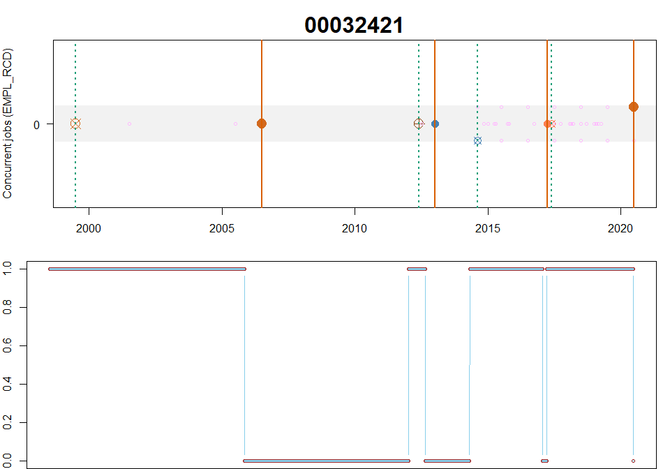<!-- -->

***No work break, leave***

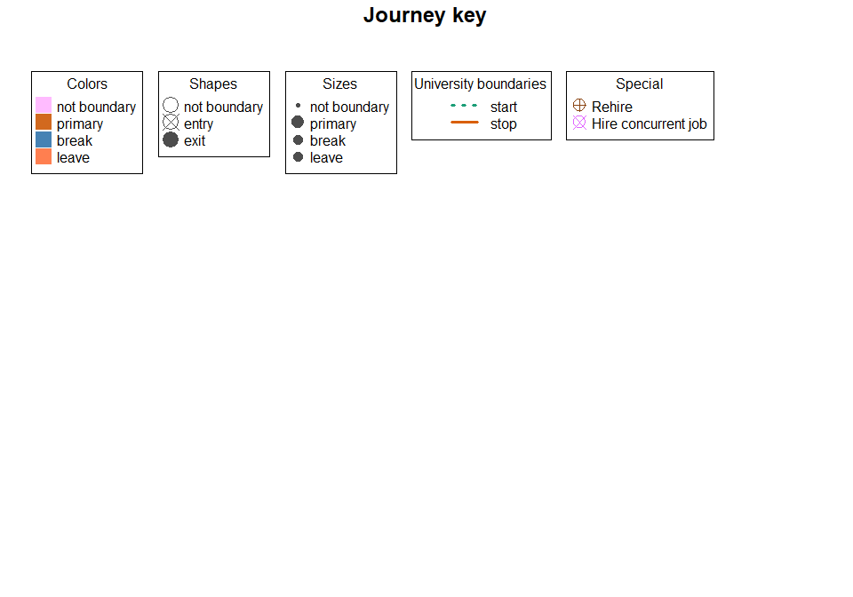<!-- --><!-- -->

***Work break and leave***  

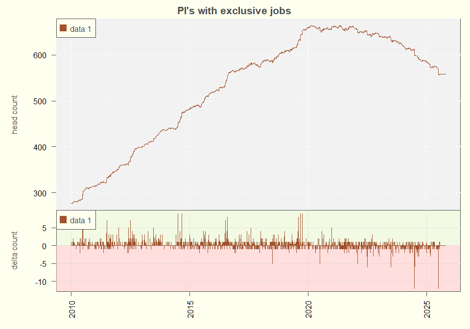<!-- --><!-- -->

#### **CONCURRENT JOURNEY**

***No work break, no leave***

<!-- -->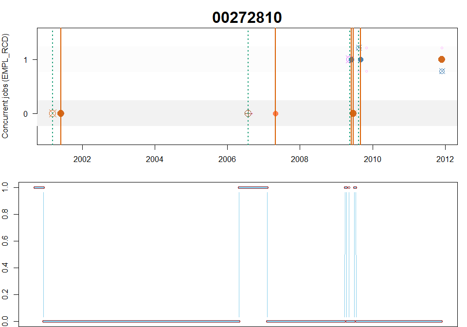<!-- -->

***Work break, no leave***

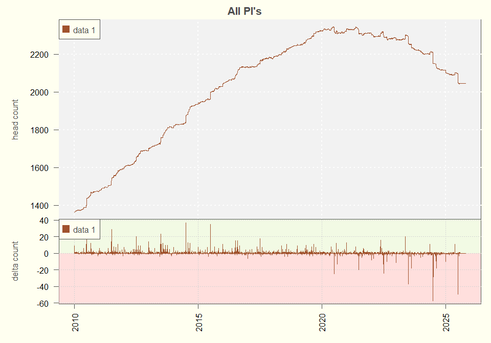<!-- --><!-- -->

***No work break, leave***

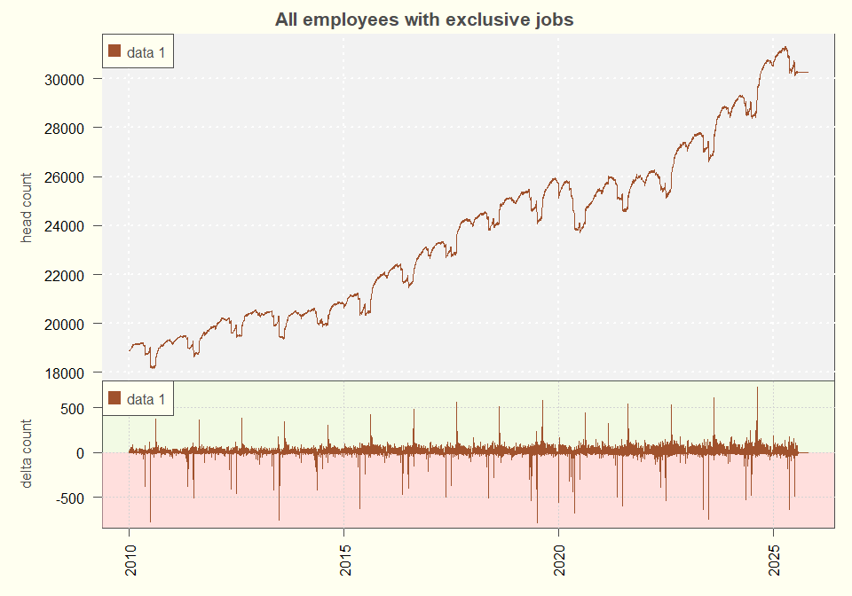<!-- --><!-- -->

***Work break and leave***  

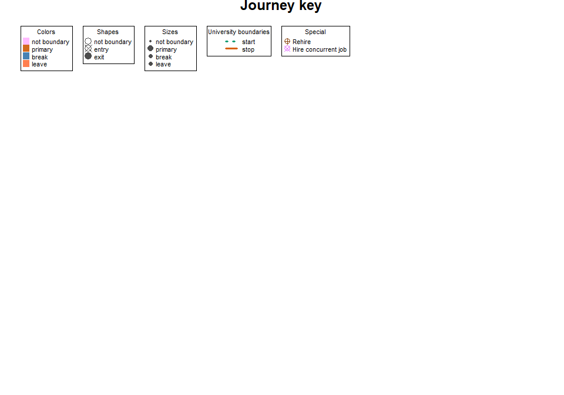<!-- -->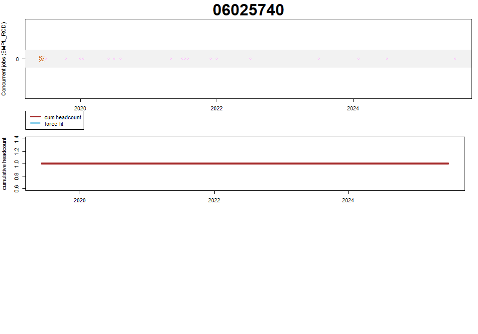<!-- -->

### Headcount Metrics 

#### **EXCLUSIVE JOURNEY**

#### **CONCURRENT JOURNEY**

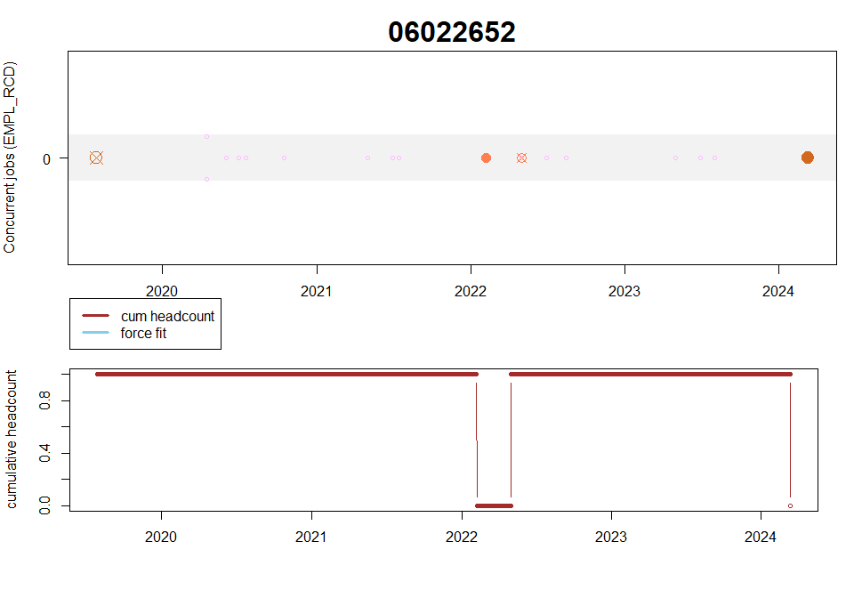<!-- -->

### Explain HeadCount

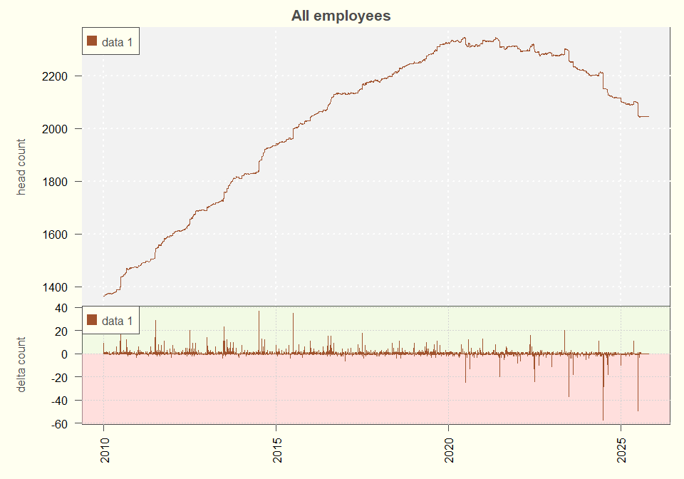<!-- -->

'Exit' condition needs to be modified to accommodate the transfer to volunteer positions

*Per Brian Gelsinger, Teams message on 14 Oct 2025:*

I can't remember if we included the field UU_BEN_IND in the SQL we provided, but that would be my recommendation to use. A Benefit Indicator of "30 " means that job code is considered "Non-Employee". I'm happy to add that field to the SQL if you'd like, but below is a list of all the job codes in Ben Ind 30, so you could just try excluding those job codes as well. I've also provided the current headcount of employees in these job codes
 
Job Code	Job Title	UU Ben Ind	UU Ben Ind Descr	Count Distinct EE
0233	Field Instructor	30	Non-Employee	15
6000	Volunteer Staff	30	Non-Employee	21
6001	Volunteer Faculty	30	Non-Employee	34
6002	Adjunct Professor	30	Non-Employee	474
6003	Adjunct Associate Professor	30	Non-Employee	371
6004	Adjunct Assistant Professor	30	Non-Employee	748
6005	Adjunct Instructor	30	Non-Employee	588
6006	Shared Faculty (Unpaid)	30	Non-Employee	17
6100	Univ Asia Staff	30	Non-Employee	56
6102	Adjunct Professor (Ext)	30	Non-Employee	134
6103	Adjunct Assoc Professor (Ext)	30	Non-Employee	126
6104	Adjunct Asst Professor (Ext)	30	Non-Employee	784
6105	Adjunct Instructor (Ext)	30	Non-Employee	416
7993	Surviving Spouse	30	Non-Employee	0
9261	COBRA Beneficiary	30	Non-Employee	0
799999	Volunteer Staff	30	Non-Employee	0

