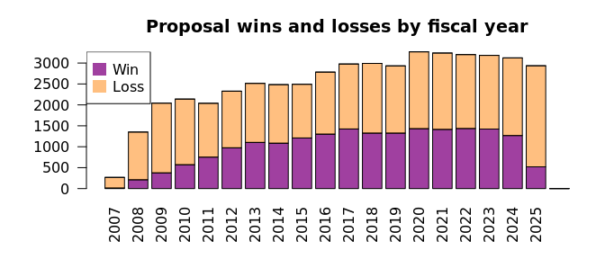

**PURPOSE:**  The purpose of this document is to describe in detail cleaning, filtering, and processing of proposals data.

**OBJECTIVES:**

  1.  Describe the initial data set.
  2.  Briefly list the cleaning and processing steps.
  3.  Describe the cleaning and processing steps in detail.     
  4.  Describe the cleaned data set.

### **(1) INITIAL DATA DESCRIPTION**

As of 2 October 2024, the raw proposal data contains 114,022 rows with 64 columns.  It ranges from the year 2007 to 2025.  It contains 48,283 unique proposals submitted by 3,983 principal investigators from 761 organizations belonging to 44 college-level units.

### **(2) CLEANING AND PROCESSSING STEPS BRIEF**

  (a) Identify win/loss status per proposal.
  (b) Remove a proposal with unusual values.
  (c) Sum monetary values over all budget periods per proposal.
  (d) Filter out proposals with no budget listed (an empty value) or a total sponsor budget less than $150.
  (e) Include the name of the highest government agency for each federally-sponsored grant.       
  (f) Filter out proposals before FY 2014 or after FY 2023.
  (g) Keep certain columns and remove others.

### **(3) CLEANING AND PROCESSSING STEPS DETAIL**

#### (a) Identify win/loss

A "win/loss" column is added to the proposal data based on the absence or presence of the proposal ID in the "awards" data.   

Overall, this raw data has a 39.7% win rate.

<!-- -->

#### (b) Remove unusual proposal

A single proposal that is duplicated with "NA" values for college and organization for unclear reasons is removed.

<table class="table table-striped table-hover" style="color: black; width: auto !important; margin-left: auto; margin-right: auto;">
<caption>Proposal with Multiple Organization Values Is Filtered Out</caption>
 <thead>
  <tr>
   <th style="text-align:left;"> PROPOSAL_ID </th>
   <th style="text-align:left;"> PI_NAME </th>
   <th style="text-align:left;"> SHORT_TITLE </th>
   <th style="text-align:right;"> FISCAL_YEAR </th>
   <th style="text-align:left;"> COLLEGE </th>
   <th style="text-align:left;"> ORG </th>
  </tr>
 </thead>
<tbody>
  <tr>

  </tr>
</tbody>
</table>

#### (c) Sum monetary values

Out of 48,283 unique proposals, 26,103 (54%)  have multiple rows.

These multiple rows per proposal reflect different monetary values over different budget periods.  These varying values include the budget period itself, direct cost, facilities and administrative (F&A) cost, total sponsor budget, university cost share, and third-party cost share.

Monetary values for proposals that have multiple budget periods are summed over all periods per proposal.  The monetary values are also calculated as a fraction of the "total sponsor budget", and these fractions are merged back into the proposals data.

Budget periods typically (but not necessarily) reflect years, with a steep decline after five years.

Budget periods of -1 and 0 are filtered out.  This consists of 75 proposals with a total sponsor budget of \$53,622.

<table class="table table-striped table-hover" style="color: black; width: auto !important; margin-left: auto; margin-right: auto;">
<caption>Count of proposals and median monetary values per budget period in raw proposal data</caption>
 <thead>
  <tr>
   <th style="text-align:left;"> Budget period </th>
   <th style="text-align:right;"> Proposal count </th>
   <th style="text-align:right;"> Direct cost </th>
   <th style="text-align:right;"> FA cost </th>
   <th style="text-align:right;"> Total budget </th>
   <th style="text-align:right;"> University cost share </th>
   <th style="text-align:right;"> Third pary cost share </th>
  </tr>
 </thead>
<tbody>
  <tr>
   <td style="text-align:left;"> -1 </td>
   <td style="text-align:right;"> 72 </td>
   <td style="text-align:right;"> 0.0 </td>
   <td style="text-align:right;"> 0.0 </td>
   <td style="text-align:right;"> 0.0 </td>
   <td style="text-align:right;"> 0 </td>
   <td style="text-align:right;"> 0 </td>
  </tr>
  <tr>
   <td style="text-align:left;"> 0 </td>
   <td style="text-align:right;"> 3 </td>
   <td style="text-align:right;"> 0.0 </td>
   <td style="text-align:right;"> 0.0 </td>
   <td style="text-align:right;"> 0.0 </td>
   <td style="text-align:right;"> 0 </td>
   <td style="text-align:right;"> 0 </td>
  </tr>
  <tr>
   <td style="text-align:left;"> 1 </td>
   <td style="text-align:right;"> 48210 </td>
   <td style="text-align:right;"> 74356.5 </td>
   <td style="text-align:right;"> 18381.5 </td>
   <td style="text-align:right;"> 98845.5 </td>
   <td style="text-align:right;"> 0 </td>
   <td style="text-align:right;"> 0 </td>
  </tr>
  <tr>
   <td style="text-align:left;"> 2 </td>
   <td style="text-align:right;"> 26102 </td>
   <td style="text-align:right;"> 120097.5 </td>
   <td style="text-align:right;"> 41895.0 </td>
   <td style="text-align:right;"> 161792.0 </td>
   <td style="text-align:right;"> 0 </td>
   <td style="text-align:right;"> 0 </td>
  </tr>
  <tr>
   <td style="text-align:left;"> 3 </td>
   <td style="text-align:right;"> 19138 </td>
   <td style="text-align:right;"> 137006.0 </td>
   <td style="text-align:right;"> 49720.0 </td>
   <td style="text-align:right;"> 187391.5 </td>
   <td style="text-align:right;"> 0 </td>
   <td style="text-align:right;"> 0 </td>
  </tr>
  <tr>
   <td style="text-align:left;"> 4 </td>
   <td style="text-align:right;"> 11401 </td>
   <td style="text-align:right;"> 229186.0 </td>
   <td style="text-align:right;"> 84536.0 </td>
   <td style="text-align:right;"> 310285.0 </td>
   <td style="text-align:right;"> 0 </td>
   <td style="text-align:right;"> 0 </td>
  </tr>
  <tr>
   <td style="text-align:left;"> 5 </td>
   <td style="text-align:right;"> 8612 </td>
   <td style="text-align:right;"> 250000.0 </td>
   <td style="text-align:right;"> 103279.0 </td>
   <td style="text-align:right;"> 372500.0 </td>
   <td style="text-align:right;"> 0 </td>
   <td style="text-align:right;"> 0 </td>
  </tr>
  <tr>
   <td style="text-align:left;"> 6 </td>
   <td style="text-align:right;"> 286 </td>
   <td style="text-align:right;"> 112290.5 </td>
   <td style="text-align:right;"> 32993.0 </td>
   <td style="text-align:right;"> 162796.5 </td>
   <td style="text-align:right;"> 0 </td>
   <td style="text-align:right;"> 0 </td>
  </tr>
  <tr>
   <td style="text-align:left;"> 7 </td>
   <td style="text-align:right;"> 128 </td>
   <td style="text-align:right;"> 190018.0 </td>
   <td style="text-align:right;"> 82485.5 </td>
   <td style="text-align:right;"> 282500.5 </td>
   <td style="text-align:right;"> 0 </td>
   <td style="text-align:right;"> 0 </td>
  </tr>
  <tr>
   <td style="text-align:left;"> 8 </td>
   <td style="text-align:right;"> 38 </td>
   <td style="text-align:right;"> 152760.5 </td>
   <td style="text-align:right;"> 56925.5 </td>
   <td style="text-align:right;"> 208943.5 </td>
   <td style="text-align:right;"> 0 </td>
   <td style="text-align:right;"> 0 </td>
  </tr>
  <tr>
   <td style="text-align:left;"> 9 </td>
   <td style="text-align:right;"> 15 </td>
   <td style="text-align:right;"> 195982.0 </td>
   <td style="text-align:right;"> 67690.0 </td>
   <td style="text-align:right;"> 301812.0 </td>
   <td style="text-align:right;"> 0 </td>
   <td style="text-align:right;"> 0 </td>
  </tr>
  <tr>
   <td style="text-align:left;"> 10 </td>
   <td style="text-align:right;"> 13 </td>
   <td style="text-align:right;"> 190161.0 </td>
   <td style="text-align:right;"> 69514.0 </td>
   <td style="text-align:right;"> 292848.0 </td>
   <td style="text-align:right;"> 0 </td>
   <td style="text-align:right;"> 0 </td>
  </tr>
  <tr>
   <td style="text-align:left;"> 11 </td>
   <td style="text-align:right;"> 2 </td>
   <td style="text-align:right;"> 179879.0 </td>
   <td style="text-align:right;"> 88140.5 </td>
   <td style="text-align:right;"> 268019.5 </td>
   <td style="text-align:right;"> 0 </td>
   <td style="text-align:right;"> 0 </td>
  </tr>
  <tr>
   <td style="text-align:left;"> 12 </td>
   <td style="text-align:right;"> 2 </td>
   <td style="text-align:right;"> 197352.0 </td>
   <td style="text-align:right;"> 96702.5 </td>
   <td style="text-align:right;"> 294054.5 </td>
   <td style="text-align:right;"> 0 </td>
   <td style="text-align:right;"> 0 </td>
  </tr>
</tbody>
</table>

### (d) Remove proposals with low and missing budgets

Proposals with total sponsor budget values less than \$150 or with no value ("NA") are filtered out.  This removes 925 proposals (2%) with zero or NA values and 1,165 proposals (2%) with values between \$0 and \$150.

<!-- -->

### (e) Include federal agencies

The names of sponsoring federal agencies are included.

<table class="table table-striped table-hover" style="color: black; width: auto !important; margin-left: auto; margin-right: auto;">
<caption>Table of proposals per government agency</caption>
 <thead>
  <tr>
   <th style="text-align:left;"> Agency </th>
   <th style="text-align:right;"> Count </th>
  </tr>
 </thead>
<tbody>
  <tr>
   <td style="text-align:left;"> DHS </td>
   <td style="text-align:right;"> 33 </td>
  </tr>
  <tr>
   <td style="text-align:left;"> DOC </td>
   <td style="text-align:right;"> 122 </td>
  </tr>
  <tr>
   <td style="text-align:left;"> DOD </td>
   <td style="text-align:right;"> 1343 </td>
  </tr>
  <tr>
   <td style="text-align:left;"> DOE </td>
   <td style="text-align:right;"> 1424 </td>
  </tr>
  <tr>
   <td style="text-align:left;"> DOI </td>
   <td style="text-align:right;"> 228 </td>
  </tr>
  <tr>
   <td style="text-align:left;"> DOJ </td>
   <td style="text-align:right;"> 74 </td>
  </tr>
  <tr>
   <td style="text-align:left;"> DOL </td>
   <td style="text-align:right;"> 15 </td>
  </tr>
  <tr>
   <td style="text-align:left;"> DOS </td>
   <td style="text-align:right;"> 39 </td>
  </tr>
  <tr>
   <td style="text-align:left;"> DOT </td>
   <td style="text-align:right;"> 64 </td>
  </tr>
  <tr>
   <td style="text-align:left;"> ED </td>
   <td style="text-align:right;"> 175 </td>
  </tr>
  <tr>
   <td style="text-align:left;"> HHS </td>
   <td style="text-align:right;"> 10696 </td>
  </tr>
  <tr>
   <td style="text-align:left;"> HUD </td>
   <td style="text-align:right;"> 11 </td>
  </tr>
  <tr>
   <td style="text-align:left;"> NASA </td>
   <td style="text-align:right;"> 489 </td>
  </tr>
  <tr>
   <td style="text-align:left;"> NSF </td>
   <td style="text-align:right;"> 5338 </td>
  </tr>
  <tr>
   <td style="text-align:left;"> OTHER </td>
   <td style="text-align:right;"> 400 </td>
  </tr>
  <tr>
   <td style="text-align:left;"> USDA </td>
   <td style="text-align:right;"> 130 </td>
  </tr>
  <tr>
   <td style="text-align:left;"> USDT </td>
   <td style="text-align:right;"> 1 </td>
  </tr>
  <tr>
   <td style="text-align:left;"> VA </td>
   <td style="text-align:right;"> 2101 </td>
  </tr>
  <tr>
   <td style="text-align:left;"> NA </td>
   <td style="text-align:right;"> 25527 </td>
  </tr>
</tbody>
</table>

### (f) Remove some fiscal years

Proposals before fiscal year 2014 or after fiscal year 2023 are excluded. Missing values ("NA") are also filtered out.  

The data before 2014 is not believed to be as carefully maintained, with a win rate much lower than later years.  As well, a time lag between submitting a proposal and receiving an award can be over a year.  The new Trump administration of January 2025 halted Notice of Awards, meaning the 2024 data and later is not yet complete.

The proposals (5,558) with missing values in the other "date" columns are kept and will be managed with feature engineering and imputed values.

<!-- -->

### (g) Select columns

Certain columns are kept and others are excluded.  Many of the discarded columns are repetitive  (representing an identification number where the name was kept instead).  Other discarded columns may represent a "data leak" that contains information about whether the proposal was won (such as "PROPOSAL_STATUS"). Other columns ("PROPOSAL_PI_FACULTY_LINE_CAREER_BREAKOUT" and "PROPOSAL_PI_APPOINTMENT_SNAPSHOT_DT") have a very high proportion of missing values.  

<table class="table table-striped table-hover" style="color: black; width: auto !important; margin-left: auto; margin-right: auto;">
<caption>Kept columns</caption>
 <thead>
  <tr>
   <th style="text-align:left;position: sticky; top:0; background-color: #FFFFFF;position: sticky; top:0; background-color: #FFFFFF;"> Kept column names </th>
  </tr>
 </thead>
<tbody>
  <tr>
   <td style="text-align:left;"> PROPOSAL_ID </td>
  </tr>
  <tr>
   <td style="text-align:left;"> win </td>
  </tr>
  <tr>
   <td style="text-align:left;"> PROPOSAL_DIRECT_COST </td>
  </tr>
  <tr>
   <td style="text-align:left;"> PROPOSAL_FA_COST </td>
  </tr>
  <tr>
   <td style="text-align:left;"> PROPOSAL_TOTAL_SPONSOR_BUDGET </td>
  </tr>
  <tr>
   <td style="text-align:left;"> PROPOSAL_UNIVERSITY_COSTSHARE </td>
  </tr>
  <tr>
   <td style="text-align:left;"> PROPOSAL_3RD_PARTY_COSTSHARE </td>
  </tr>
  <tr>
   <td style="text-align:left;"> PROPOSAL_DIRECT_COST_prop </td>
  </tr>
  <tr>
   <td style="text-align:left;"> PROPOSAL_FA_COST_prop </td>
  </tr>
  <tr>
   <td style="text-align:left;"> PROPOSAL_UNIVERSITY_COSTSHARE_prop </td>
  </tr>
  <tr>
   <td style="text-align:left;"> PROPOSAL_3RD_PARTY_COSTSHARE_prop </td>
  </tr>
  <tr>
   <td style="text-align:left;"> PROPOSAL_SHORT_TITLE </td>
  </tr>
  <tr>
   <td style="text-align:left;"> PROPOSAL_TYPE </td>
  </tr>
  <tr>
   <td style="text-align:left;"> PROPOSAL_PURPOSE </td>
  </tr>
  <tr>
   <td style="text-align:left;"> PROPOSAL_RECIPIENT_FUNDING_TYPE </td>
  </tr>
  <tr>
   <td style="text-align:left;"> PROPOSAL_COST_SHARE_INDICATOR </td>
  </tr>
  <tr>
   <td style="text-align:left;"> PROPOSAL_FANDA_WAIVER_INDIVATOR </td>
  </tr>
  <tr>
   <td style="text-align:left;"> PROPOSAL_FANDA_OFF_CAMPUS_RATE_INDICATOR </td>
  </tr>
  <tr>
   <td style="text-align:left;"> PROPOSAL_UPLOAD_DATE_FISCAL_YEAR </td>
  </tr>
  <tr>
   <td style="text-align:left;"> PROPOSAL_PI_EMPLID </td>
  </tr>
  <tr>
   <td style="text-align:left;"> PROPOSAL_PI_NAME </td>
  </tr>
  <tr>
   <td style="text-align:left;"> PROPOSAL_PI_APPOINTMENT_DEPT </td>
  </tr>
  <tr>
   <td style="text-align:left;"> PROPOSAL_PI_APPOINTMENT_COLLEGE </td>
  </tr>
  <tr>
   <td style="text-align:left;"> PROPOSAL_PI_ACADEMIC_RANK </td>
  </tr>
  <tr>
   <td style="text-align:left;"> PROPOSAL_PI_TENURE_STATUS </td>
  </tr>
  <tr>
   <td style="text-align:left;"> PROPOSAL_PI_FACULTY_CATEGORY </td>
  </tr>
  <tr>
   <td style="text-align:left;"> PROPOSAL_PI_FACULTY_SUBCATEGORY </td>
  </tr>
  <tr>
   <td style="text-align:left;"> PROPOSAL_PI_ACADEMIC_RANK_LEVEL </td>
  </tr>
  <tr>
   <td style="text-align:left;"> PROPOSAL_PI_RANK_SORTED </td>
  </tr>
  <tr>
   <td style="text-align:left;"> PROPOSAL_PI_FACULTY_LINE_SORTED </td>
  </tr>
  <tr>
   <td style="text-align:left;"> PROPOSAL_ORG </td>
  </tr>
  <tr>
   <td style="text-align:left;"> PROPOSAL_DEPT </td>
  </tr>
  <tr>
   <td style="text-align:left;"> PROPOSAL_COLLEGE </td>
  </tr>
  <tr>
   <td style="text-align:left;"> VPR_PROPOSAL_COLLEGE </td>
  </tr>
  <tr>
   <td style="text-align:left;"> PROPOSAL_VP </td>
  </tr>
  <tr>
   <td style="text-align:left;"> VPR_PROPOSAL_VP </td>
  </tr>
  <tr>
   <td style="text-align:left;"> PROPOSAL_SPONSOR_ID </td>
  </tr>
  <tr>
   <td style="text-align:left;"> PROPOSAL_SPONSOR_NAME </td>
  </tr>
  <tr>
   <td style="text-align:left;"> PROPOSAL_SPONSOR_TYPE_CODE </td>
  </tr>
  <tr>
   <td style="text-align:left;"> PROPOSAL_SPONSOR_TYPE </td>
  </tr>
  <tr>
   <td style="text-align:left;"> PROPOSAL_IACUC_IRB_DIM_KEY </td>
  </tr>
  <tr>
   <td style="text-align:left;"> PROPOSAL_SPO_EMPLID </td>
  </tr>
  <tr>
   <td style="text-align:left;"> PROPOSAL_SPO_NAME </td>
  </tr>
  <tr>
   <td style="text-align:left;"> PROPOSAL_CREATION_DATE </td>
  </tr>
  <tr>
   <td style="text-align:left;"> PROPOSAL_OSP_RECEIVED_DATE </td>
  </tr>
  <tr>
   <td style="text-align:left;"> PROPOSAL_OSP_REVIEW_DATE </td>
  </tr>
  <tr>
   <td style="text-align:left;"> PROPOSAL_UPLOAD_DATE </td>
  </tr>
  <tr>
   <td style="text-align:left;"> PROPOSAL_PROJECT_START_DATE </td>
  </tr>
  <tr>
   <td style="text-align:left;"> PROPOSAL_PROJECT_END_DATE </td>
  </tr>
  <tr>
   <td style="text-align:left;"> PROPOSAL_SPONSOR_DUE_DATE </td>
  </tr>
  <tr>
   <td style="text-align:left;"> HIGHEST_GOVERNMENT_AGENCY_ACRONYM </td>
  </tr>
  <tr>
   <td style="text-align:left;"> NEXT_HIGHEST_GOVERNMENT_AGENCY_ACRONYM </td>
  </tr>
</tbody>
</table>

<table class="table table-striped table-hover" style="color: black; width: auto !important; margin-left: auto; margin-right: auto;">
<caption>Discarded columns</caption>
 <thead>
  <tr>
   <th style="text-align:left;position: sticky; top:0; background-color: #FFFFFF;position: sticky; top:0; background-color: #FFFFFF;"> Discarded column names </th>
  </tr>
 </thead>
<tbody>
  <tr>
   <td style="text-align:left;"> EPROPOSAL_DIM_KEY </td>
  </tr>
  <tr>
   <td style="text-align:left;"> PROPOSAL_TYPE_CODE </td>
  </tr>
  <tr>
   <td style="text-align:left;"> PROPOSAL_STATUS_CODE </td>
  </tr>
  <tr>
   <td style="text-align:left;"> PROPOSAL_STATUS </td>
  </tr>
  <tr>
   <td style="text-align:left;"> PROPOSAL_PURPOSE_CODE </td>
  </tr>
  <tr>
   <td style="text-align:left;"> PROPOSAL_RECIPIENT_FUNDING_TYPE_CODE </td>
  </tr>
  <tr>
   <td style="text-align:left;"> PROPOSAL_BUDGET_PERIOD </td>
  </tr>
  <tr>
   <td style="text-align:left;"> PROPOSAL_PI_IS_CURRENT_UU_EMP </td>
  </tr>
  <tr>
   <td style="text-align:left;"> PROPOSAL_PI_APPOINTMENT_DEPT_ID </td>
  </tr>
  <tr>
   <td style="text-align:left;"> PROPOSAL_PI_APPOINTMENT_COLLEGE_ID </td>
  </tr>
  <tr>
   <td style="text-align:left;"> PROPOSAL_PI_ACADEMIC_RANK_CD </td>
  </tr>
  <tr>
   <td style="text-align:left;"> PROPOSAL_PI_FACULTY_LINE_CAREER_BREAKOUT </td>
  </tr>
  <tr>
   <td style="text-align:left;"> PROPOSAL_PI_APPOINTMENT_SNAPSHOT_DT </td>
  </tr>
  <tr>
   <td style="text-align:left;"> PROPOSAL_ORGID </td>
  </tr>
  <tr>
   <td style="text-align:left;"> PROPOSAL_DEPTID </td>
  </tr>
  <tr>
   <td style="text-align:left;"> PROPOSAL_COLLEGEID </td>
  </tr>
  <tr>
   <td style="text-align:left;"> VPR_PROPOSAL_COLLEGEID </td>
  </tr>
  <tr>
   <td style="text-align:left;"> PROPOSAL_VPID </td>
  </tr>
  <tr>
   <td style="text-align:left;"> VPR_PROPOSAL_VPID </td>
  </tr>
</tbody>
</table>

### **(4) CLEANED DATA DESCRIPTION**

The cleaned proposal data contains 28,789 rows with 52 columns.  It ranges from the fiscal year 2014 to 2023.  It contains 28,789 unique proposals submitted by 2,937 principal investigators from 631 organizations belonging to 42 college-level units.    

Overall, 46% of the proposals won.

Table: Data summary

|                         |          |
|:------------------------|:---------|
|Name                     |cleanData |
|Number of rows           |28789     |
|Number of columns        |52        |
|_______________________  |          |
|Column type frequency:   |          |
|factor                   |36        |
|numeric                  |9         |
|POSIXct                  |7         |
|________________________ |          |
|Group variables          |None      |

**Variable type: factor**

|skim_variable                            | n_missing| complete_rate|ordered | n_unique|top_counts                                  |
|:----------------------------------------|---------:|-------------:|:-------|--------:|:-------------------------------------------|
|PROPOSAL_ID                              |         0|             1|FALSE   |    28789|100: 1, 100: 1, 100: 1, 100: 1              |
|win                                      |         0|             1|FALSE   |        2|los: 15680, win: 13109                      |
|PROPOSAL_SHORT_TITLE                     |         0|             1|FALSE   |    27634|Ne: 20, New: 20, CAR: 13,  NS: 9            |
|PROPOSAL_TYPE                            |         0|             1|FALSE   |        6|New: 25550, Res: 2109, Com: 628, Pre: 305   |
|PROPOSAL_PURPOSE                         |         0|             1|FALSE   |        5|Res: 23352, Cli: 2813, Oth: 1818, Ins: 803  |
|PROPOSAL_RECIPIENT_FUNDING_TYPE          |         0|             1|FALSE   |        4|PI : 27278, Fel: 865, Fel: 643, (No: 3      |
|PROPOSAL_COST_SHARE_INDICATOR            |         0|             1|FALSE   |        2|Not: 28225, Cos: 564                        |
|PROPOSAL_FANDA_WAIVER_INDIVATOR          |         0|             1|FALSE   |        3|Wai: 27858, Wai: 929, Not: 2                |
|PROPOSAL_FANDA_OFF_CAMPUS_RATE_INDICATOR |         0|             1|FALSE   |        2|On : 26014, Off: 2775                       |
|PROPOSAL_UPLOAD_DATE_FISCAL_YEAR         |         0|             1|FALSE   |       10|202: 3210, 202: 3195, 202: 3133, 202: 3127  |
|PROPOSAL_PI_EMPLID                       |         0|             1|FALSE   |     2937|003: 211, 001: 105, 000: 102, 002: 96       |
|PROPOSAL_PI_NAME                         |         0|             1|FALSE   |     2937|LON: 211, SAM: 105, CAS: 102, BON: 96       |
|PROPOSAL_PI_APPOINTMENT_DEPT             |         0|             1|FALSE   |      113|NNN: 13264, Int: 2441, Ped: 1236, Ele: 689  |
|PROPOSAL_PI_APPOINTMENT_COLLEGE          |         0|             1|FALSE   |       37|NNN: 13264, Sch: 8404, Col: 3049, Col: 1414 |
|PROPOSAL_PI_ACADEMIC_RANK                |         0|             1|FALSE   |       34|NNN: 13560, Pro: 4996, Ass: 3553, Ass: 3299 |
|PROPOSAL_PI_TENURE_STATUS                |         0|             1|FALSE   |        4|NNN: 13571, Ten: 7640, Non: 4563, Not: 3015 |
|PROPOSAL_PI_FACULTY_CATEGORY             |         0|             1|FALSE   |        8|NNN: 13571, Ten: 9967, Car: 2247, Ten: 2227 |
|PROPOSAL_PI_FACULTY_SUBCATEGORY          |         0|             1|FALSE   |       10|NNN: 13571, Ten: 6254, Ten: 4563, Cli: 1472 |
|PROPOSAL_PI_ACADEMIC_RANK_LEVEL          |         0|             1|FALSE   |        5|NNN: 13571, Pro: 5862, Ass: 4911, Ass: 4354 |
|PROPOSAL_PI_RANK_SORTED                  |         0|             1|FALSE   |        6|NNN: 13560, Pro: 5850, Ass: 4910, Ass: 4350 |
|PROPOSAL_PI_FACULTY_LINE_SORTED          |         0|             1|FALSE   |        6|NNN: 13560, Ten: 12199, Car: 2784, Adj: 196 |
|PROPOSAL_ORG                             |         0|             1|FALSE   |      631|Ele: 1058, Mec: 933, HCI: 798, Civ: 748     |
|PROPOSAL_DEPT                            |         0|             1|FALSE   |      131|Int: 2916, Hun: 2752, Ped: 2093, Ele: 1058  |
|PROPOSAL_COLLEGE                         |         0|             1|FALSE   |       42|Spe: 12683, The: 4495, Col: 2834, Hun: 2752 |
|VPR_PROPOSAL_COLLEGE                     |         0|             1|FALSE   |       24|Spe: 12683, The: 4495, Col: 2834, Hun: 2752 |
|PROPOSAL_VP                              |         0|             1|FALSE   |       10|Sen: 15198, Sen: 10336, Uni: 2805, VP : 406 |
|VPR_PROPOSAL_VP                          |         0|             1|FALSE   |        4|Sen: 15198, Sen: 10336, OTH: 3250, NNN: 5   |
|PROPOSAL_SPONSOR_ID                      |         0|             1|FALSE   |     3526|100: 3110, 101: 2697, 111: 955, 112: 709    |
|PROPOSAL_SPONSOR_NAME                    |         0|             1|FALSE   |     3526|NAT: 3110, DHH: 2697, VA : 955, NIH: 709    |
|PROPOSAL_SPONSOR_TYPE_CODE               |         0|             1|FALSE   |       10|FED: 13443, IND: 4799, FDT: 4365, UNI: 3702 |
|PROPOSAL_SPONSOR_TYPE                    |         0|             1|FALSE   |       10|Fed: 13443, Ind: 4799, Ass: 4365, Uni: 3702 |
|PROPOSAL_IACUC_IRB_DIM_KEY               |         0|             1|FALSE   |        9|1: 11245, 9: 9714, 4: 4132, 6: 3013         |
|PROPOSAL_SPO_EMPLID                      |         0|             1|FALSE   |       69|003: 2453, 001: 1850, 006: 1596, 001: 1549  |
|PROPOSAL_SPO_NAME                        |         0|             1|FALSE   |       69|BJO: 2453, ERN: 1850, DAL: 1596, GUD: 1549  |
|HIGHEST_GOVERNMENT_AGENCY_ACRONYM        |         0|             1|FALSE   |       19|NNN: 15346, HHS: 6365, NSF: 3110, VA: 1383  |
|NEXT_HIGHEST_GOVERNMENT_AGENCY_ACRONYM   |         0|             1|FALSE   |       29|NNN: 15346, NIH: 5963, NSF: 3110, VA: 1383  |

**Variable type: numeric**

|skim_variable                      | n_missing| complete_rate|      mean|         sd|  p0|      p25|       p50|       p75|         p100|hist  |
|:----------------------------------|---------:|-------------:|---------:|----------:|---:|--------:|---------:|---------:|------------:|:-----|
|PROPOSAL_DIRECT_COST               |         0|             1| 491372.67| 1677773.26|   0| 40000.00| 150000.00| 442017.00| 153840637.00|▇▁▁▁▁ |
|PROPOSAL_FA_COST                   |         0|             1| 178075.47|  431047.00|   0|   400.00|  36365.00| 157500.00|  16469841.00|▇▁▁▁▁ |
|PROPOSAL_TOTAL_SPONSOR_BUDGET      |         0|             1| 669448.14| 2022026.64| 151| 49984.00| 192495.00| 600000.00| 167639391.00|▇▁▁▁▁ |
|PROPOSAL_UNIVERSITY_COSTSHARE      |         0|             1|   5701.90|  153125.66|   0|     0.00|      0.00|      0.00|  18366015.00|▇▁▁▁▁ |
|PROPOSAL_3RD_PARTY_COSTSHARE       |         0|             1|   3689.95|  306590.50|   0|     0.00|      0.00|      0.00|  51053978.00|▇▁▁▁▁ |
|PROPOSAL_DIRECT_COST_prop          |         0|             1|      0.78|       0.14|   0|     0.66|      0.73|      0.91|         1.00|▁▁▁▇▅ |
|PROPOSAL_FA_COST_prop              |         0|             1|      0.22|       0.14|   0|     0.09|      0.27|      0.34|         1.00|▅▇▁▁▁ |
|PROPOSAL_UNIVERSITY_COSTSHARE_prop |         0|             1|      0.02|       0.20|   0|     0.00|      0.00|      0.00|        22.74|▇▁▁▁▁ |
|PROPOSAL_3RD_PARTY_COSTSHARE_prop  |         0|             1|      0.00|       0.07|   0|     0.00|      0.00|      0.00|         9.23|▇▁▁▁▁ |

**Variable type: POSIXct**

|skim_variable               | n_missing| complete_rate|min        |max        |median     | n_unique|
|:---------------------------|---------:|-------------:|:----------|:----------|:----------|--------:|
|PROPOSAL_CREATION_DATE      |         0|          1.00|2011-06-09 |2023-06-29 |2018-10-02 |     3119|
|PROPOSAL_OSP_RECEIVED_DATE  |         2|          1.00|2012-01-31 |2023-06-30 |2018-10-22 |     3055|
|PROPOSAL_OSP_REVIEW_DATE    |         1|          1.00|2011-06-09 |2023-06-29 |2018-10-12 |     3090|
|PROPOSAL_UPLOAD_DATE        |         0|          1.00|2013-07-01 |2023-06-30 |2018-11-07 |     2514|
|PROPOSAL_PROJECT_START_DATE |         1|          1.00|2010-04-01 |2024-10-01 |2019-03-13 |     1623|
|PROPOSAL_PROJECT_END_DATE   |         3|          1.00|2012-06-30 |2038-09-30 |2021-09-30 |     1723|
|PROPOSAL_SPONSOR_DUE_DATE   |      5555|          0.81|2009-08-05 |2024-07-13 |2019-01-15 |     2960|

<table class="table table-striped table-hover" style="color: black; width: auto !important; margin-left: auto; margin-right: auto;">
<caption>Federal agencies</caption>
 <thead>
  <tr>
   <th style="text-align:left;position: sticky; top:0; background-color: #FFFFFF;position: sticky; top:0; background-color: #FFFFFF;">   </th>
   <th style="text-align:left;position: sticky; top:0; background-color: #FFFFFF;position: sticky; top:0; background-color: #FFFFFF;"> HIGHEST_GOVERNMENT_AGENCY_ACRONYM </th>
   <th style="text-align:left;position: sticky; top:0; background-color: #FFFFFF;position: sticky; top:0; background-color: #FFFFFF;"> HIGHEST_GOVERNMENT_AGENCY </th>
   <th style="text-align:left;position: sticky; top:0; background-color: #FFFFFF;position: sticky; top:0; background-color: #FFFFFF;"> NEXT_HIGHEST_GOVERNMENT_AGENCY_ACRONYM </th>
   <th style="text-align:left;position: sticky; top:0; background-color: #FFFFFF;position: sticky; top:0; background-color: #FFFFFF;"> NEXT_HIGHEST_GOVERNMENT_AGENCY </th>
   <th style="text-align:left;position: sticky; top:0; background-color: #FFFFFF;position: sticky; top:0; background-color: #FFFFFF;"> SPONSOR_ID </th>
   <th style="text-align:left;position: sticky; top:0; background-color: #FFFFFF;position: sticky; top:0; background-color: #FFFFFF;"> SPONSOR_NAME </th>
  </tr>
 </thead>
<tbody>
  <tr>
   <td style="text-align:left;"> 827 </td>
   <td style="text-align:left;"> DHS </td>
   <td style="text-align:left;"> DEPARTMENT OF HOMELAND SECURITY </td>
   <td style="text-align:left;"> DHS </td>
   <td style="text-align:left;"> DEPARTMENT OF HOMELAND SECURITY </td>
   <td style="text-align:left;"> 10204 </td>
   <td style="text-align:left;"> US DEPARTMENT OF HOMELAND SECURITY </td>
  </tr>
  <tr>
   <td style="text-align:left;"> 13352 </td>
   <td style="text-align:left;"> DHS </td>
   <td style="text-align:left;"> DEPARTMENT OF HOMELAND SECURITY </td>
   <td style="text-align:left;"> DHS </td>
   <td style="text-align:left;"> DEPARTMENT OF HOMELAND SECURITY </td>
   <td style="text-align:left;"> 10646 </td>
   <td style="text-align:left;"> DHS FEDERAL EMERGENCY MANAGEMENT AGENCY </td>
  </tr>
  <tr>
   <td style="text-align:left;"> 22 </td>
   <td style="text-align:left;"> DOC </td>
   <td style="text-align:left;"> DEPARTMENT OF COMMERCE </td>
   <td style="text-align:left;"> DOC </td>
   <td style="text-align:left;"> DEPARTMENT OF COMMERCE </td>
   <td style="text-align:left;"> 10092 </td>
   <td style="text-align:left;"> DOC NATL OCEANIC &amp; ATMOSPHERIC ADMIN </td>
  </tr>
  <tr>
   <td style="text-align:left;"> 255 </td>
   <td style="text-align:left;"> DOC </td>
   <td style="text-align:left;"> DEPARTMENT OF COMMERCE </td>
   <td style="text-align:left;"> DOC </td>
   <td style="text-align:left;"> DEPARTMENT OF COMMERCE </td>
   <td style="text-align:left;"> 13558 </td>
   <td style="text-align:left;"> US DEPARTMENT OF COMMERCE </td>
  </tr>
  <tr>
   <td style="text-align:left;"> 315 </td>
   <td style="text-align:left;"> DOC </td>
   <td style="text-align:left;"> DEPARTMENT OF COMMERCE </td>
   <td style="text-align:left;"> DOC </td>
   <td style="text-align:left;"> DEPARTMENT OF COMMERCE </td>
   <td style="text-align:left;"> 10205 </td>
   <td style="text-align:left;"> DOC OFFICE OF NATL GEODETIC SURVEY </td>
  </tr>
  <tr>
   <td style="text-align:left;"> 539 </td>
   <td style="text-align:left;"> DOC </td>
   <td style="text-align:left;"> DEPARTMENT OF COMMERCE </td>
   <td style="text-align:left;"> DOC </td>
   <td style="text-align:left;"> DEPARTMENT OF COMMERCE </td>
   <td style="text-align:left;"> 10093 </td>
   <td style="text-align:left;"> DOC NATIONAL MARINE FISHERIES SVC </td>
  </tr>
  <tr>
   <td style="text-align:left;"> 730 </td>
   <td style="text-align:left;"> DOC </td>
   <td style="text-align:left;"> DEPARTMENT OF COMMERCE </td>
   <td style="text-align:left;"> DOC </td>
   <td style="text-align:left;"> DEPARTMENT OF COMMERCE </td>
   <td style="text-align:left;"> 10091 </td>
   <td style="text-align:left;"> DOC ECONOMIC DEVELOPMENT ADMINISTRATION </td>
  </tr>
  <tr>
   <td style="text-align:left;"> 2581 </td>
   <td style="text-align:left;"> DOC </td>
   <td style="text-align:left;"> DEPARTMENT OF COMMERCE </td>
   <td style="text-align:left;"> DOC </td>
   <td style="text-align:left;"> DEPARTMENT OF COMMERCE </td>
   <td style="text-align:left;"> 15026 </td>
   <td style="text-align:left;"> DOC NATIONAL WEATHER SERVICE </td>
  </tr>
  <tr>
   <td style="text-align:left;"> 3102 </td>
   <td style="text-align:left;"> DOC </td>
   <td style="text-align:left;"> DEPARTMENT OF COMMERCE </td>
   <td style="text-align:left;"> DOC </td>
   <td style="text-align:left;"> DEPARTMENT OF COMMERCE </td>
   <td style="text-align:left;"> 14959 </td>
   <td style="text-align:left;"> DOC NATL INST OF STANDARDS AND TECH </td>
  </tr>
  <tr>
   <td style="text-align:left;"> 6955 </td>
   <td style="text-align:left;"> DOC </td>
   <td style="text-align:left;"> DEPARTMENT OF COMMERCE </td>
   <td style="text-align:left;"> DOC </td>
   <td style="text-align:left;"> DEPARTMENT OF COMMERCE </td>
   <td style="text-align:left;"> 11130 </td>
   <td style="text-align:left;"> DOC NATL TELECOM INFO ADM </td>
  </tr>
  <tr>
   <td style="text-align:left;"> 17128 </td>
   <td style="text-align:left;"> DOC </td>
   <td style="text-align:left;"> DEPARTMENT OF COMMERCE </td>
   <td style="text-align:left;"> DOC </td>
   <td style="text-align:left;"> DEPARTMENT OF COMMERCE </td>
   <td style="text-align:left;"> 00017677 </td>
   <td style="text-align:left;"> DOC US CENSUS BUREAU </td>
  </tr>
  <tr>
   <td style="text-align:left;"> 6 </td>
   <td style="text-align:left;"> DOD </td>
   <td style="text-align:left;"> DEPARTMENT OF DEFENSE </td>
   <td style="text-align:left;"> NAVY </td>
   <td style="text-align:left;"> NAVY </td>
   <td style="text-align:left;"> 10117 </td>
   <td style="text-align:left;"> OFFICE OF NAVAL RESEARCH </td>
  </tr>
  <tr>
   <td style="text-align:left;"> 37 </td>
   <td style="text-align:left;"> DOD </td>
   <td style="text-align:left;"> DEPARTMENT OF DEFENSE </td>
   <td style="text-align:left;"> ARMY </td>
   <td style="text-align:left;"> ARMY </td>
   <td style="text-align:left;"> 14063 </td>
   <td style="text-align:left;"> ARMY MEDICAL RESEARCH ACQUISITION ACTVTY </td>
  </tr>
  <tr>
   <td style="text-align:left;"> 40 </td>
   <td style="text-align:left;"> DOD </td>
   <td style="text-align:left;"> DEPARTMENT OF DEFENSE </td>
   <td style="text-align:left;"> GENERAL DOD </td>
   <td style="text-align:left;"> GENERAL DOD </td>
   <td style="text-align:left;"> 10095 </td>
   <td style="text-align:left;"> US DEPARTMENT OF DEFENSE </td>
  </tr>
  <tr>
   <td style="text-align:left;"> 65 </td>
   <td style="text-align:left;"> DOD </td>
   <td style="text-align:left;"> DEPARTMENT OF DEFENSE </td>
   <td style="text-align:left;"> ARMY </td>
   <td style="text-align:left;"> ARMY </td>
   <td style="text-align:left;"> 10109 </td>
   <td style="text-align:left;"> ARMY RESEARCH OFFICE </td>
  </tr>
  <tr>
   <td style="text-align:left;"> 107 </td>
   <td style="text-align:left;"> DOD </td>
   <td style="text-align:left;"> DEPARTMENT OF DEFENSE </td>
   <td style="text-align:left;"> GENERAL DOD </td>
   <td style="text-align:left;"> GENERAL DOD </td>
   <td style="text-align:left;"> 10698 </td>
   <td style="text-align:left;"> DOD DEFENSE ADVANCED RESRCH PRJCTS AGCY </td>
  </tr>
  <tr>
   <td style="text-align:left;"> 134 </td>
   <td style="text-align:left;"> DOD </td>
   <td style="text-align:left;"> DEPARTMENT OF DEFENSE </td>
   <td style="text-align:left;"> AIR FORCE </td>
   <td style="text-align:left;"> AIR FORCE </td>
   <td style="text-align:left;"> 10098 </td>
   <td style="text-align:left;"> AIR FORCE OFFICE OF SCIENTIFIC RESEARCH </td>
  </tr>
  <tr>
   <td style="text-align:left;"> 266 </td>
   <td style="text-align:left;"> DOD </td>
   <td style="text-align:left;"> DEPARTMENT OF DEFENSE </td>
   <td style="text-align:left;"> ARMY </td>
   <td style="text-align:left;"> ARMY </td>
   <td style="text-align:left;"> 10108 </td>
   <td style="text-align:left;"> ARMY MEDICAL RESEARCH &amp; MATERIEL COMMAND </td>
  </tr>
  <tr>
   <td style="text-align:left;"> 280 </td>
   <td style="text-align:left;"> DOD </td>
   <td style="text-align:left;"> DEPARTMENT OF DEFENSE </td>
   <td style="text-align:left;"> GENERAL DOD </td>
   <td style="text-align:left;"> GENERAL DOD </td>
   <td style="text-align:left;"> 10110 </td>
   <td style="text-align:left;"> DOD MISSILE DEFENSE AGENCY </td>
  </tr>
  <tr>
   <td style="text-align:left;"> 421 </td>
   <td style="text-align:left;"> DOD </td>
   <td style="text-align:left;"> DEPARTMENT OF DEFENSE </td>
   <td style="text-align:left;"> ARMY </td>
   <td style="text-align:left;"> ARMY </td>
   <td style="text-align:left;"> 10102 </td>
   <td style="text-align:left;"> US ARMY </td>
  </tr>
  <tr>
   <td style="text-align:left;"> 571 </td>
   <td style="text-align:left;"> DOD </td>
   <td style="text-align:left;"> DEPARTMENT OF DEFENSE </td>
   <td style="text-align:left;"> GENERAL DOD </td>
   <td style="text-align:left;"> GENERAL DOD </td>
   <td style="text-align:left;"> 14920 </td>
   <td style="text-align:left;"> DOD DEFENSE THREAT REDUCTION AGENCY </td>
  </tr>
  <tr>
   <td style="text-align:left;"> 587 </td>
   <td style="text-align:left;"> DOD </td>
   <td style="text-align:left;"> DEPARTMENT OF DEFENSE </td>
   <td style="text-align:left;"> NSA </td>
   <td style="text-align:left;"> NATIONAL SECURITY AGENCY </td>
   <td style="text-align:left;"> 10125 </td>
   <td style="text-align:left;"> NATIONAL SECURITY AGENCY </td>
  </tr>
  <tr>
   <td style="text-align:left;"> 1022 </td>
   <td style="text-align:left;"> DOD </td>
   <td style="text-align:left;"> DEPARTMENT OF DEFENSE </td>
   <td style="text-align:left;"> AIR FORCE </td>
   <td style="text-align:left;"> AIR FORCE </td>
   <td style="text-align:left;"> 10099 </td>
   <td style="text-align:left;"> AIR FORCE RESEARCH LABORATORY </td>
  </tr>
  <tr>
   <td style="text-align:left;"> 1042 </td>
   <td style="text-align:left;"> DOD </td>
   <td style="text-align:left;"> DEPARTMENT OF DEFENSE </td>
   <td style="text-align:left;"> NAVY </td>
   <td style="text-align:left;"> NAVY </td>
   <td style="text-align:left;"> 10510 </td>
   <td style="text-align:left;"> NAVAL SURFACE WARFARE CENTER </td>
  </tr>
  <tr>
   <td style="text-align:left;"> 1213 </td>
   <td style="text-align:left;"> DOD </td>
   <td style="text-align:left;"> DEPARTMENT OF DEFENSE </td>
   <td style="text-align:left;"> GENERAL DOD </td>
   <td style="text-align:left;"> GENERAL DOD </td>
   <td style="text-align:left;"> 10348 </td>
   <td style="text-align:left;"> DOD STRATEGIC ENVRNMNTL RSRCH &amp; DEV PRGM </td>
  </tr>
  <tr>
   <td style="text-align:left;"> 1974 </td>
   <td style="text-align:left;"> DOD </td>
   <td style="text-align:left;"> DEPARTMENT OF DEFENSE </td>
   <td style="text-align:left;"> GENERAL DOD </td>
   <td style="text-align:left;"> GENERAL DOD </td>
   <td style="text-align:left;"> 10123 </td>
   <td style="text-align:left;"> NATIONAL GEOSPATIAL-INTELLIGENCE AGCY </td>
  </tr>
  <tr>
   <td style="text-align:left;"> 2025 </td>
   <td style="text-align:left;"> DOD </td>
   <td style="text-align:left;"> DEPARTMENT OF DEFENSE </td>
   <td style="text-align:left;"> NAVY </td>
   <td style="text-align:left;"> NAVY </td>
   <td style="text-align:left;"> 10118 </td>
   <td style="text-align:left;"> NAVAL RESEARCH LABORATORY </td>
  </tr>
  <tr>
   <td style="text-align:left;"> 2560 </td>
   <td style="text-align:left;"> DOD </td>
   <td style="text-align:left;"> DEPARTMENT OF DEFENSE </td>
   <td style="text-align:left;"> NAVY </td>
   <td style="text-align:left;"> NAVY </td>
   <td style="text-align:left;"> 10114 </td>
   <td style="text-align:left;"> US NAVY </td>
  </tr>
  <tr>
   <td style="text-align:left;"> 2739 </td>
   <td style="text-align:left;"> DOD </td>
   <td style="text-align:left;"> DEPARTMENT OF DEFENSE </td>
   <td style="text-align:left;"> NAVY </td>
   <td style="text-align:left;"> NAVY </td>
   <td style="text-align:left;"> 10115 </td>
   <td style="text-align:left;"> NAVAL AIR SYSTEMS COMMAND </td>
  </tr>
  <tr>
   <td style="text-align:left;"> 2940 </td>
   <td style="text-align:left;"> DOD </td>
   <td style="text-align:left;"> DEPARTMENT OF DEFENSE </td>
   <td style="text-align:left;"> AIR FORCE </td>
   <td style="text-align:left;"> AIR FORCE </td>
   <td style="text-align:left;"> 11336 </td>
   <td style="text-align:left;"> AIR FORCE HILL AIR FORCE BASE </td>
  </tr>
  <tr>
   <td style="text-align:left;"> 3590 </td>
   <td style="text-align:left;"> DOD </td>
   <td style="text-align:left;"> DEPARTMENT OF DEFENSE </td>
   <td style="text-align:left;"> AIR FORCE </td>
   <td style="text-align:left;"> AIR FORCE </td>
   <td style="text-align:left;"> 10096 </td>
   <td style="text-align:left;"> US AIR FORCE </td>
  </tr>
  <tr>
   <td style="text-align:left;"> 3989 </td>
   <td style="text-align:left;"> DOD </td>
   <td style="text-align:left;"> DEPARTMENT OF DEFENSE </td>
   <td style="text-align:left;"> ARMY </td>
   <td style="text-align:left;"> ARMY </td>
   <td style="text-align:left;"> 11180 </td>
   <td style="text-align:left;"> ARMY DUGWAY PROVING GROUNDS </td>
  </tr>
  <tr>
   <td style="text-align:left;"> 4748 </td>
   <td style="text-align:left;"> DOD </td>
   <td style="text-align:left;"> DEPARTMENT OF DEFENSE </td>
   <td style="text-align:left;"> AIR FORCE </td>
   <td style="text-align:left;"> AIR FORCE </td>
   <td style="text-align:left;"> 10100 </td>
   <td style="text-align:left;"> AIR FORCE INSTITUTE OF TECHNOLOGY </td>
  </tr>
  <tr>
   <td style="text-align:left;"> 4955 </td>
   <td style="text-align:left;"> DOD </td>
   <td style="text-align:left;"> DEPARTMENT OF DEFENSE </td>
   <td style="text-align:left;"> NAVY </td>
   <td style="text-align:left;"> NAVY </td>
   <td style="text-align:left;"> 10116 </td>
   <td style="text-align:left;"> NAVY SPACE &amp; NAVAL WARFARE SYSTEM CTR </td>
  </tr>
  <tr>
   <td style="text-align:left;"> 5545 </td>
   <td style="text-align:left;"> DOD </td>
   <td style="text-align:left;"> DEPARTMENT OF DEFENSE </td>
   <td style="text-align:left;"> GENERAL DOD </td>
   <td style="text-align:left;"> GENERAL DOD </td>
   <td style="text-align:left;"> 00016730 </td>
   <td style="text-align:left;"> DOD OFFICE OF ECONOMIC ADJUSTMENT </td>
  </tr>
  <tr>
   <td style="text-align:left;"> 5691 </td>
   <td style="text-align:left;"> DOD </td>
   <td style="text-align:left;"> DEPARTMENT OF DEFENSE </td>
   <td style="text-align:left;"> GENERAL DOD </td>
   <td style="text-align:left;"> GENERAL DOD </td>
   <td style="text-align:left;"> 10314 </td>
   <td style="text-align:left;"> DOD UNIFORMED SERVS UNIV OF THE HLTH SCI </td>
  </tr>
  <tr>
   <td style="text-align:left;"> 7674 </td>
   <td style="text-align:left;"> DOD </td>
   <td style="text-align:left;"> DEPARTMENT OF DEFENSE </td>
   <td style="text-align:left;"> GENERAL DOD </td>
   <td style="text-align:left;"> GENERAL DOD </td>
   <td style="text-align:left;"> 10124 </td>
   <td style="text-align:left;"> DOD DEFENSE LOGISTICS AGENCY </td>
  </tr>
  <tr>
   <td style="text-align:left;"> 8165 </td>
   <td style="text-align:left;"> DOD </td>
   <td style="text-align:left;"> DEPARTMENT OF DEFENSE </td>
   <td style="text-align:left;"> GENERAL DOD </td>
   <td style="text-align:left;"> GENERAL DOD </td>
   <td style="text-align:left;"> 00018785 </td>
   <td style="text-align:left;"> MILITARY HEALTH SYSTEM </td>
  </tr>
  <tr>
   <td style="text-align:left;"> 9321 </td>
   <td style="text-align:left;"> DOD </td>
   <td style="text-align:left;"> DEPARTMENT OF DEFENSE </td>
   <td style="text-align:left;"> NAVY </td>
   <td style="text-align:left;"> NAVY </td>
   <td style="text-align:left;"> 00018258 </td>
   <td style="text-align:left;"> NAVAL HEALTH RESEARCH CENTER </td>
  </tr>
  <tr>
   <td style="text-align:left;"> 9924 </td>
   <td style="text-align:left;"> DOD </td>
   <td style="text-align:left;"> DEPARTMENT OF DEFENSE </td>
   <td style="text-align:left;"> NAVY </td>
   <td style="text-align:left;"> NAVY </td>
   <td style="text-align:left;"> 00015222 </td>
   <td style="text-align:left;"> US MARINE CORP </td>
  </tr>
  <tr>
   <td style="text-align:left;"> 10443 </td>
   <td style="text-align:left;"> DOD </td>
   <td style="text-align:left;"> DEPARTMENT OF DEFENSE </td>
   <td style="text-align:left;"> ARMY </td>
   <td style="text-align:left;"> ARMY </td>
   <td style="text-align:left;"> 11132 </td>
   <td style="text-align:left;"> ARMY TOOELE ARMY DEPOT </td>
  </tr>
  <tr>
   <td style="text-align:left;"> 10985 </td>
   <td style="text-align:left;"> DOD </td>
   <td style="text-align:left;"> DEPARTMENT OF DEFENSE </td>
   <td style="text-align:left;"> NAVY </td>
   <td style="text-align:left;"> NAVY </td>
   <td style="text-align:left;"> 00019316 </td>
   <td style="text-align:left;"> NAVY US NAVAL ACADEMY </td>
  </tr>
  <tr>
   <td style="text-align:left;"> 11295 </td>
   <td style="text-align:left;"> DOD </td>
   <td style="text-align:left;"> DEPARTMENT OF DEFENSE </td>
   <td style="text-align:left;"> ARMY </td>
   <td style="text-align:left;"> ARMY </td>
   <td style="text-align:left;"> 00016305 </td>
   <td style="text-align:left;"> ARMY MED RSCH INST OF CHEMICAL DEFENSE </td>
  </tr>
  <tr>
   <td style="text-align:left;"> 13026 </td>
   <td style="text-align:left;"> DOD </td>
   <td style="text-align:left;"> DEPARTMENT OF DEFENSE </td>
   <td style="text-align:left;"> ARMY </td>
   <td style="text-align:left;"> ARMY </td>
   <td style="text-align:left;"> 00019568 </td>
   <td style="text-align:left;"> ARMY ENGINEER RESH &amp; DEVELOPMENT CTR </td>
  </tr>
  <tr>
   <td style="text-align:left;"> 14174 </td>
   <td style="text-align:left;"> DOD </td>
   <td style="text-align:left;"> DEPARTMENT OF DEFENSE </td>
   <td style="text-align:left;"> ARMY </td>
   <td style="text-align:left;"> ARMY </td>
   <td style="text-align:left;"> 10103 </td>
   <td style="text-align:left;"> ARMY CORPS OF ENGINEERS </td>
  </tr>
  <tr>
   <td style="text-align:left;"> 16335 </td>
   <td style="text-align:left;"> DOD </td>
   <td style="text-align:left;"> DEPARTMENT OF DEFENSE </td>
   <td style="text-align:left;"> GENERAL DOD </td>
   <td style="text-align:left;"> GENERAL DOD </td>
   <td style="text-align:left;"> 10292 </td>
   <td style="text-align:left;"> DOD US SPECIAL OPERATIONS COMMAND </td>
  </tr>
  <tr>
   <td style="text-align:left;"> 16415 </td>
   <td style="text-align:left;"> DOD </td>
   <td style="text-align:left;"> DEPARTMENT OF DEFENSE </td>
   <td style="text-align:left;"> ARMY </td>
   <td style="text-align:left;"> ARMY </td>
   <td style="text-align:left;"> 00019526 </td>
   <td style="text-align:left;"> ARMY COMBAT CAPBLTS DVLP COMM ARL </td>
  </tr>
  <tr>
   <td style="text-align:left;"> 16532 </td>
   <td style="text-align:left;"> DOD </td>
   <td style="text-align:left;"> DEPARTMENT OF DEFENSE </td>
   <td style="text-align:left;"> GENERAL DOD </td>
   <td style="text-align:left;"> GENERAL DOD </td>
   <td style="text-align:left;"> 13023 </td>
   <td style="text-align:left;"> DOD POLYGRAPH INSTITUTE </td>
  </tr>
  <tr>
   <td style="text-align:left;"> 19993 </td>
   <td style="text-align:left;"> DOD </td>
   <td style="text-align:left;"> DEPARTMENT OF DEFENSE </td>
   <td style="text-align:left;"> AIR FORCE </td>
   <td style="text-align:left;"> AIR FORCE </td>
   <td style="text-align:left;"> 10244 </td>
   <td style="text-align:left;"> AIR FORCE RSRCH LAB-KIRTLAND RSRCH SITE </td>
  </tr>
  <tr>
   <td style="text-align:left;"> 20836 </td>
   <td style="text-align:left;"> DOD </td>
   <td style="text-align:left;"> DEPARTMENT OF DEFENSE </td>
   <td style="text-align:left;"> ARMY </td>
   <td style="text-align:left;"> ARMY </td>
   <td style="text-align:left;"> 10826 </td>
   <td style="text-align:left;"> ARMY CONSTRUCTION ENGINEERING RSRCH LAB </td>
  </tr>
  <tr>
   <td style="text-align:left;"> 22479 </td>
   <td style="text-align:left;"> DOD </td>
   <td style="text-align:left;"> DEPARTMENT OF DEFENSE </td>
   <td style="text-align:left;"> AIR FORCE </td>
   <td style="text-align:left;"> AIR FORCE </td>
   <td style="text-align:left;"> 00017619 </td>
   <td style="text-align:left;"> AIR FORCE TECHNICAL APPLICATIONS CTR </td>
  </tr>
  <tr>
   <td style="text-align:left;"> 11 </td>
   <td style="text-align:left;"> DOE </td>
   <td style="text-align:left;"> DEPARTMENT OF ENERGY </td>
   <td style="text-align:left;"> DOE </td>
   <td style="text-align:left;"> DEPARTMENT OF ENERGY </td>
   <td style="text-align:left;"> 11332 </td>
   <td style="text-align:left;"> DOE LAWRENCE LIVERMORE NATIONAL LAB </td>
  </tr>
  <tr>
   <td style="text-align:left;"> 21 </td>
   <td style="text-align:left;"> DOE </td>
   <td style="text-align:left;"> DEPARTMENT OF ENERGY </td>
   <td style="text-align:left;"> DOE </td>
   <td style="text-align:left;"> DEPARTMENT OF ENERGY </td>
   <td style="text-align:left;"> 10142 </td>
   <td style="text-align:left;"> US DEPARTMENT OF ENERGY </td>
  </tr>
  <tr>
   <td style="text-align:left;"> 29 </td>
   <td style="text-align:left;"> DOE </td>
   <td style="text-align:left;"> DEPARTMENT OF ENERGY </td>
   <td style="text-align:left;"> DOE </td>
   <td style="text-align:left;"> DEPARTMENT OF ENERGY </td>
   <td style="text-align:left;"> 11272 </td>
   <td style="text-align:left;"> DOE CHICAGO OPERATIONS OFFICE </td>
  </tr>
  <tr>
   <td style="text-align:left;"> 45 </td>
   <td style="text-align:left;"> DOE </td>
   <td style="text-align:left;"> DEPARTMENT OF ENERGY </td>
   <td style="text-align:left;"> DOE </td>
   <td style="text-align:left;"> DEPARTMENT OF ENERGY </td>
   <td style="text-align:left;"> 11349 </td>
   <td style="text-align:left;"> DOE GOLDEN FIELD OFFICE </td>
  </tr>
  <tr>
   <td style="text-align:left;"> 78 </td>
   <td style="text-align:left;"> DOE </td>
   <td style="text-align:left;"> DEPARTMENT OF ENERGY </td>
   <td style="text-align:left;"> DOE </td>
   <td style="text-align:left;"> DEPARTMENT OF ENERGY </td>
   <td style="text-align:left;"> 00015478 </td>
   <td style="text-align:left;"> DOE BATTELLE ENERGY ALLIANCE, LLC </td>
  </tr>
  <tr>
   <td style="text-align:left;"> 111 </td>
   <td style="text-align:left;"> DOE </td>
   <td style="text-align:left;"> DEPARTMENT OF ENERGY </td>
   <td style="text-align:left;"> DOE </td>
   <td style="text-align:left;"> DEPARTMENT OF ENERGY </td>
   <td style="text-align:left;"> 13777 </td>
   <td style="text-align:left;"> DOE OFC ENERGY EFFICIENCY &amp; RENEW ENGRY </td>
  </tr>
  <tr>
   <td style="text-align:left;"> 172 </td>
   <td style="text-align:left;"> DOE </td>
   <td style="text-align:left;"> DEPARTMENT OF ENERGY </td>
   <td style="text-align:left;"> DOE </td>
   <td style="text-align:left;"> DEPARTMENT OF ENERGY </td>
   <td style="text-align:left;"> 14987 </td>
   <td style="text-align:left;"> DOE ADVANCED RSRCH PROJECTS AGENCY-ENRGY </td>
  </tr>
  <tr>
   <td style="text-align:left;"> 302 </td>
   <td style="text-align:left;"> DOE </td>
   <td style="text-align:left;"> DEPARTMENT OF ENERGY </td>
   <td style="text-align:left;"> DOE </td>
   <td style="text-align:left;"> DEPARTMENT OF ENERGY </td>
   <td style="text-align:left;"> 10144 </td>
   <td style="text-align:left;"> DOE NATIONAL ENERGY TECHNOLOGY LAB </td>
  </tr>
  <tr>
   <td style="text-align:left;"> 472 </td>
   <td style="text-align:left;"> DOE </td>
   <td style="text-align:left;"> DEPARTMENT OF ENERGY </td>
   <td style="text-align:left;"> DOE </td>
   <td style="text-align:left;"> DEPARTMENT OF ENERGY </td>
   <td style="text-align:left;"> 11178 </td>
   <td style="text-align:left;"> DOE OFFICE OF BASIC ENERGY SCEINCES </td>
  </tr>
  <tr>
   <td style="text-align:left;"> 473 </td>
   <td style="text-align:left;"> DOE </td>
   <td style="text-align:left;"> DEPARTMENT OF ENERGY </td>
   <td style="text-align:left;"> DOE </td>
   <td style="text-align:left;"> DEPARTMENT OF ENERGY </td>
   <td style="text-align:left;"> 11085 </td>
   <td style="text-align:left;"> DOE PACIFIC NORTHWEST NATIONAL LAB </td>
  </tr>
  <tr>
   <td style="text-align:left;"> 475 </td>
   <td style="text-align:left;"> DOE </td>
   <td style="text-align:left;"> DEPARTMENT OF ENERGY </td>
   <td style="text-align:left;"> DOE </td>
   <td style="text-align:left;"> DEPARTMENT OF ENERGY </td>
   <td style="text-align:left;"> 00017966 </td>
   <td style="text-align:left;"> DOE BROOKHAVEN NATIONAL LABORATORY </td>
  </tr>
  <tr>
   <td style="text-align:left;"> 491 </td>
   <td style="text-align:left;"> DOE </td>
   <td style="text-align:left;"> DEPARTMENT OF ENERGY </td>
   <td style="text-align:left;"> DOE </td>
   <td style="text-align:left;"> DEPARTMENT OF ENERGY </td>
   <td style="text-align:left;"> 00015821 </td>
   <td style="text-align:left;"> DOE NUCLEAR ENERGY UNIVERSITY PROGRAM </td>
  </tr>
  <tr>
   <td style="text-align:left;"> 511 </td>
   <td style="text-align:left;"> DOE </td>
   <td style="text-align:left;"> DEPARTMENT OF ENERGY </td>
   <td style="text-align:left;"> DOE </td>
   <td style="text-align:left;"> DEPARTMENT OF ENERGY </td>
   <td style="text-align:left;"> 13734 </td>
   <td style="text-align:left;"> DOE ARGONNE NATIONAL LABORATORY </td>
  </tr>
  <tr>
   <td style="text-align:left;"> 733 </td>
   <td style="text-align:left;"> DOE </td>
   <td style="text-align:left;"> DEPARTMENT OF ENERGY </td>
   <td style="text-align:left;"> DOE </td>
   <td style="text-align:left;"> DEPARTMENT OF ENERGY </td>
   <td style="text-align:left;"> 11233 </td>
   <td style="text-align:left;"> DOE OFFICE OF SCIENCE </td>
  </tr>
  <tr>
   <td style="text-align:left;"> 750 </td>
   <td style="text-align:left;"> DOE </td>
   <td style="text-align:left;"> DEPARTMENT OF ENERGY </td>
   <td style="text-align:left;"> DOE </td>
   <td style="text-align:left;"> DEPARTMENT OF ENERGY </td>
   <td style="text-align:left;"> 12782 </td>
   <td style="text-align:left;"> DOE NATIONAL NUCLEAR SECURITY ADMN </td>
  </tr>
  <tr>
   <td style="text-align:left;"> 772 </td>
   <td style="text-align:left;"> DOE </td>
   <td style="text-align:left;"> DEPARTMENT OF ENERGY </td>
   <td style="text-align:left;"> DOE </td>
   <td style="text-align:left;"> DEPARTMENT OF ENERGY </td>
   <td style="text-align:left;"> 14075 </td>
   <td style="text-align:left;"> DOE IDAHO NATIONAL LAB </td>
  </tr>
  <tr>
   <td style="text-align:left;"> 804 </td>
   <td style="text-align:left;"> DOE </td>
   <td style="text-align:left;"> DEPARTMENT OF ENERGY </td>
   <td style="text-align:left;"> DOE </td>
   <td style="text-align:left;"> DEPARTMENT OF ENERGY </td>
   <td style="text-align:left;"> 10143 </td>
   <td style="text-align:left;"> DOE LOS ALAMOS NATIONAL LABORATORY </td>
  </tr>
  <tr>
   <td style="text-align:left;"> 961 </td>
   <td style="text-align:left;"> DOE </td>
   <td style="text-align:left;"> DEPARTMENT OF ENERGY </td>
   <td style="text-align:left;"> DOE </td>
   <td style="text-align:left;"> DEPARTMENT OF ENERGY </td>
   <td style="text-align:left;"> 00017365 </td>
   <td style="text-align:left;"> DOE JOINT GENOME INSTITUTE </td>
  </tr>
  <tr>
   <td style="text-align:left;"> 1011 </td>
   <td style="text-align:left;"> DOE </td>
   <td style="text-align:left;"> DEPARTMENT OF ENERGY </td>
   <td style="text-align:left;"> DOE </td>
   <td style="text-align:left;"> DEPARTMENT OF ENERGY </td>
   <td style="text-align:left;"> 11026 </td>
   <td style="text-align:left;"> DOE FERMI NATIONAL ACCELERATOR LAB </td>
  </tr>
  <tr>
   <td style="text-align:left;"> 1266 </td>
   <td style="text-align:left;"> DOE </td>
   <td style="text-align:left;"> DEPARTMENT OF ENERGY </td>
   <td style="text-align:left;"> DOE </td>
   <td style="text-align:left;"> DEPARTMENT OF ENERGY </td>
   <td style="text-align:left;"> 10505 </td>
   <td style="text-align:left;"> DOE NATIONAL RENEWABLE ENERGY LAB </td>
  </tr>
  <tr>
   <td style="text-align:left;"> 1311 </td>
   <td style="text-align:left;"> DOE </td>
   <td style="text-align:left;"> DEPARTMENT OF ENERGY </td>
   <td style="text-align:left;"> DOE </td>
   <td style="text-align:left;"> DEPARTMENT OF ENERGY </td>
   <td style="text-align:left;"> 11248 </td>
   <td style="text-align:left;"> DOE SANDIA NATIONAL LABORATORIES </td>
  </tr>
  <tr>
   <td style="text-align:left;"> 2244 </td>
   <td style="text-align:left;"> DOE </td>
   <td style="text-align:left;"> DEPARTMENT OF ENERGY </td>
   <td style="text-align:left;"> DOE </td>
   <td style="text-align:left;"> DEPARTMENT OF ENERGY </td>
   <td style="text-align:left;"> 10976 </td>
   <td style="text-align:left;"> DOE OAKRIDGE NATIONAL LABORATORY </td>
  </tr>
  <tr>
   <td style="text-align:left;"> 2299 </td>
   <td style="text-align:left;"> DOE </td>
   <td style="text-align:left;"> DEPARTMENT OF ENERGY </td>
   <td style="text-align:left;"> DOE </td>
   <td style="text-align:left;"> DEPARTMENT OF ENERGY </td>
   <td style="text-align:left;"> 11199 </td>
   <td style="text-align:left;"> DOE LAWRENCE BERKELEY NATIONAL LAB </td>
  </tr>
  <tr>
   <td style="text-align:left;"> 2552 </td>
   <td style="text-align:left;"> DOE </td>
   <td style="text-align:left;"> DEPARTMENT OF ENERGY </td>
   <td style="text-align:left;"> DOE </td>
   <td style="text-align:left;"> DEPARTMENT OF ENERGY </td>
   <td style="text-align:left;"> 11243 </td>
   <td style="text-align:left;"> DOE IDAHO OPERATIONS OFFICE </td>
  </tr>
  <tr>
   <td style="text-align:left;"> 2969 </td>
   <td style="text-align:left;"> DOE </td>
   <td style="text-align:left;"> DEPARTMENT OF ENERGY </td>
   <td style="text-align:left;"> DOE </td>
   <td style="text-align:left;"> DEPARTMENT OF ENERGY </td>
   <td style="text-align:left;"> 10811 </td>
   <td style="text-align:left;"> DOE OFFICE OF BIOLOGICAL &amp; ENVIRON RSRCH </td>
  </tr>
  <tr>
   <td style="text-align:left;"> 4164 </td>
   <td style="text-align:left;"> DOE </td>
   <td style="text-align:left;"> DEPARTMENT OF ENERGY </td>
   <td style="text-align:left;"> DOE </td>
   <td style="text-align:left;"> DEPARTMENT OF ENERGY </td>
   <td style="text-align:left;"> 00017506 </td>
   <td style="text-align:left;"> DOE SOLAR ENERGY TECHNOLOGIES OFFICE </td>
  </tr>
  <tr>
   <td style="text-align:left;"> 4233 </td>
   <td style="text-align:left;"> DOE </td>
   <td style="text-align:left;"> DEPARTMENT OF ENERGY </td>
   <td style="text-align:left;"> DOE </td>
   <td style="text-align:left;"> DEPARTMENT OF ENERGY </td>
   <td style="text-align:left;"> 14317 </td>
   <td style="text-align:left;"> DOE CLIMATE CHANGE RESEARCH DIVISION </td>
  </tr>
  <tr>
   <td style="text-align:left;"> 4739 </td>
   <td style="text-align:left;"> DOE </td>
   <td style="text-align:left;"> DEPARTMENT OF ENERGY </td>
   <td style="text-align:left;"> DOE </td>
   <td style="text-align:left;"> DEPARTMENT OF ENERGY </td>
   <td style="text-align:left;"> 11050 </td>
   <td style="text-align:left;"> DOE BATTELLE MEMORIAL INSTITUTE </td>
  </tr>
  <tr>
   <td style="text-align:left;"> 4963 </td>
   <td style="text-align:left;"> DOE </td>
   <td style="text-align:left;"> DEPARTMENT OF ENERGY </td>
   <td style="text-align:left;"> DOE </td>
   <td style="text-align:left;"> DEPARTMENT OF ENERGY </td>
   <td style="text-align:left;"> 00016120 </td>
   <td style="text-align:left;"> DOE Y-12 NATIONAL SECURITY COMPLEX </td>
  </tr>
  <tr>
   <td style="text-align:left;"> 5246 </td>
   <td style="text-align:left;"> DOE </td>
   <td style="text-align:left;"> DEPARTMENT OF ENERGY </td>
   <td style="text-align:left;"> DOE </td>
   <td style="text-align:left;"> DEPARTMENT OF ENERGY </td>
   <td style="text-align:left;"> 00018358 </td>
   <td style="text-align:left;"> DOE PRINCETON PLASMA PHYSICS LAB </td>
  </tr>
  <tr>
   <td style="text-align:left;"> 5513 </td>
   <td style="text-align:left;"> DOE </td>
   <td style="text-align:left;"> DEPARTMENT OF ENERGY </td>
   <td style="text-align:left;"> DOE </td>
   <td style="text-align:left;"> DEPARTMENT OF ENERGY </td>
   <td style="text-align:left;"> 14984 </td>
   <td style="text-align:left;"> DOE OAK RIDGE INST FOR SCNCE AND EDUC </td>
  </tr>
  <tr>
   <td style="text-align:left;"> 8844 </td>
   <td style="text-align:left;"> DOE </td>
   <td style="text-align:left;"> DEPARTMENT OF ENERGY </td>
   <td style="text-align:left;"> DOE </td>
   <td style="text-align:left;"> DEPARTMENT OF ENERGY </td>
   <td style="text-align:left;"> 00019436 </td>
   <td style="text-align:left;"> NAVAL NUCLEAR LABORATORY </td>
  </tr>
  <tr>
   <td style="text-align:left;"> 10740 </td>
   <td style="text-align:left;"> DOE </td>
   <td style="text-align:left;"> DEPARTMENT OF ENERGY </td>
   <td style="text-align:left;"> DOE </td>
   <td style="text-align:left;"> DEPARTMENT OF ENERGY </td>
   <td style="text-align:left;"> 00017333 </td>
   <td style="text-align:left;"> DOE UT-BATTELLE LLC </td>
  </tr>
  <tr>
   <td style="text-align:left;"> 14786 </td>
   <td style="text-align:left;"> DOE </td>
   <td style="text-align:left;"> DEPARTMENT OF ENERGY </td>
   <td style="text-align:left;"> DOE </td>
   <td style="text-align:left;"> DEPARTMENT OF ENERGY </td>
   <td style="text-align:left;"> 00018672 </td>
   <td style="text-align:left;"> ENVIRONMENTAL MOLECULAR SCIENCES LAB </td>
  </tr>
  <tr>
   <td style="text-align:left;"> 17285 </td>
   <td style="text-align:left;"> DOE </td>
   <td style="text-align:left;"> DEPARTMENT OF ENERGY </td>
   <td style="text-align:left;"> DOE </td>
   <td style="text-align:left;"> DEPARTMENT OF ENERGY </td>
   <td style="text-align:left;"> 00016926 </td>
   <td style="text-align:left;"> DOE OFFICE OF RIVER PROTECTION </td>
  </tr>
  <tr>
   <td style="text-align:left;"> 57 </td>
   <td style="text-align:left;"> DOI </td>
   <td style="text-align:left;"> DEPARTMENT OF THE INTERIOR </td>
   <td style="text-align:left;"> DOI </td>
   <td style="text-align:left;"> DEPARTMENT OF THE INTERIOR </td>
   <td style="text-align:left;"> 10189 </td>
   <td style="text-align:left;"> DOI US GEOLOGICAL SURVEY </td>
  </tr>
  <tr>
   <td style="text-align:left;"> 285 </td>
   <td style="text-align:left;"> DOI </td>
   <td style="text-align:left;"> DEPARTMENT OF THE INTERIOR </td>
   <td style="text-align:left;"> DOI </td>
   <td style="text-align:left;"> DEPARTMENT OF THE INTERIOR </td>
   <td style="text-align:left;"> 10190 </td>
   <td style="text-align:left;"> DOI NATIONAL PARK SERVICE </td>
  </tr>
  <tr>
   <td style="text-align:left;"> 312 </td>
   <td style="text-align:left;"> DOI </td>
   <td style="text-align:left;"> DEPARTMENT OF THE INTERIOR </td>
   <td style="text-align:left;"> DOI </td>
   <td style="text-align:left;"> DEPARTMENT OF THE INTERIOR </td>
   <td style="text-align:left;"> 11062 </td>
   <td style="text-align:left;"> DOI US FISH &amp; WILDLIFE SERVICE </td>
  </tr>
  <tr>
   <td style="text-align:left;"> 499 </td>
   <td style="text-align:left;"> DOI </td>
   <td style="text-align:left;"> DEPARTMENT OF THE INTERIOR </td>
   <td style="text-align:left;"> DOI </td>
   <td style="text-align:left;"> DEPARTMENT OF THE INTERIOR </td>
   <td style="text-align:left;"> 11342 </td>
   <td style="text-align:left;"> DOI BUREAU OF LAND MANAGEMENT </td>
  </tr>
  <tr>
   <td style="text-align:left;"> 504 </td>
   <td style="text-align:left;"> DOI </td>
   <td style="text-align:left;"> DEPARTMENT OF THE INTERIOR </td>
   <td style="text-align:left;"> DOI </td>
   <td style="text-align:left;"> DEPARTMENT OF THE INTERIOR </td>
   <td style="text-align:left;"> 10191 </td>
   <td style="text-align:left;"> DOI BUREAU OF RECLAMATION </td>
  </tr>
  <tr>
   <td style="text-align:left;"> 791 </td>
   <td style="text-align:left;"> DOI </td>
   <td style="text-align:left;"> DEPARTMENT OF THE INTERIOR </td>
   <td style="text-align:left;"> DOI </td>
   <td style="text-align:left;"> DEPARTMENT OF THE INTERIOR </td>
   <td style="text-align:left;"> 15062 </td>
   <td style="text-align:left;"> JOINT FIRE SCIENCE PROGRAM </td>
  </tr>
  <tr>
   <td style="text-align:left;"> 1299 </td>
   <td style="text-align:left;"> DOI </td>
   <td style="text-align:left;"> DEPARTMENT OF THE INTERIOR </td>
   <td style="text-align:left;"> DOI </td>
   <td style="text-align:left;"> DEPARTMENT OF THE INTERIOR </td>
   <td style="text-align:left;"> 00015579 </td>
   <td style="text-align:left;"> DOI OFC SURFACE MINING RECL &amp; ENFRCMT </td>
  </tr>
  <tr>
   <td style="text-align:left;"> 2166 </td>
   <td style="text-align:left;"> DOI </td>
   <td style="text-align:left;"> DEPARTMENT OF THE INTERIOR </td>
   <td style="text-align:left;"> DOI </td>
   <td style="text-align:left;"> DEPARTMENT OF THE INTERIOR </td>
   <td style="text-align:left;"> 13731 </td>
   <td style="text-align:left;"> US DEPARTMENT OF THE INTERIOR </td>
  </tr>
  <tr>
   <td style="text-align:left;"> 2394 </td>
   <td style="text-align:left;"> DOI </td>
   <td style="text-align:left;"> DEPARTMENT OF THE INTERIOR </td>
   <td style="text-align:left;"> DOI </td>
   <td style="text-align:left;"> DEPARTMENT OF THE INTERIOR </td>
   <td style="text-align:left;"> 00016264 </td>
   <td style="text-align:left;"> PIPE SPRING NATIONAL MONUMENT </td>
  </tr>
  <tr>
   <td style="text-align:left;"> 5141 </td>
   <td style="text-align:left;"> DOI </td>
   <td style="text-align:left;"> DEPARTMENT OF THE INTERIOR </td>
   <td style="text-align:left;"> DOI </td>
   <td style="text-align:left;"> DEPARTMENT OF THE INTERIOR </td>
   <td style="text-align:left;"> 00018726 </td>
   <td style="text-align:left;"> DOI COOPERATIVE ECOSYSTEM STUDIES UNITS </td>
  </tr>
  <tr>
   <td style="text-align:left;"> 9148 </td>
   <td style="text-align:left;"> DOI </td>
   <td style="text-align:left;"> DEPARTMENT OF THE INTERIOR </td>
   <td style="text-align:left;"> DOI </td>
   <td style="text-align:left;"> DEPARTMENT OF THE INTERIOR </td>
   <td style="text-align:left;"> 00015578 </td>
   <td style="text-align:left;"> DOI NATL TECHNOLOGY TRANSFER TEAM </td>
  </tr>
  <tr>
   <td style="text-align:left;"> 9500 </td>
   <td style="text-align:left;"> DOI </td>
   <td style="text-align:left;"> DEPARTMENT OF THE INTERIOR </td>
   <td style="text-align:left;"> DOI </td>
   <td style="text-align:left;"> DEPARTMENT OF THE INTERIOR </td>
   <td style="text-align:left;"> 00016905 </td>
   <td style="text-align:left;"> DOI USGS NORTHERN ROCKY MTN SCI CTR </td>
  </tr>
  <tr>
   <td style="text-align:left;"> 9865 </td>
   <td style="text-align:left;"> DOI </td>
   <td style="text-align:left;"> DEPARTMENT OF THE INTERIOR </td>
   <td style="text-align:left;"> DOI </td>
   <td style="text-align:left;"> DEPARTMENT OF THE INTERIOR </td>
   <td style="text-align:left;"> 10192 </td>
   <td style="text-align:left;"> DOI OFC OF SURFC MIN RCLMTN &amp; ENFCMNT </td>
  </tr>
  <tr>
   <td style="text-align:left;"> 10152 </td>
   <td style="text-align:left;"> DOI </td>
   <td style="text-align:left;"> DEPARTMENT OF THE INTERIOR </td>
   <td style="text-align:left;"> DOI </td>
   <td style="text-align:left;"> DEPARTMENT OF THE INTERIOR </td>
   <td style="text-align:left;"> 14759 </td>
   <td style="text-align:left;"> DOI US GEOLOGICAL SURVEY IDAHO NATL LAB </td>
  </tr>
  <tr>
   <td style="text-align:left;"> 180 </td>
   <td style="text-align:left;"> DOJ </td>
   <td style="text-align:left;"> DEPARTMENT OF JUSTICE </td>
   <td style="text-align:left;"> DOJ </td>
   <td style="text-align:left;"> DEPARTMENT OF JUSTICE </td>
   <td style="text-align:left;"> 10666 </td>
   <td style="text-align:left;"> DOJ NATIONAL INSTITUTE OF JUSTICE </td>
  </tr>
  <tr>
   <td style="text-align:left;"> 853 </td>
   <td style="text-align:left;"> DOJ </td>
   <td style="text-align:left;"> DEPARTMENT OF JUSTICE </td>
   <td style="text-align:left;"> DOJ </td>
   <td style="text-align:left;"> DEPARTMENT OF JUSTICE </td>
   <td style="text-align:left;"> 10194 </td>
   <td style="text-align:left;"> US DEPARTMENT OF JUSTICE </td>
  </tr>
  <tr>
   <td style="text-align:left;"> 2149 </td>
   <td style="text-align:left;"> DOJ </td>
   <td style="text-align:left;"> DEPARTMENT OF JUSTICE </td>
   <td style="text-align:left;"> DOJ </td>
   <td style="text-align:left;"> DEPARTMENT OF JUSTICE </td>
   <td style="text-align:left;"> 00018394 </td>
   <td style="text-align:left;"> NATIONAL INSTITUTE OF CORRECTIONS </td>
  </tr>
  <tr>
   <td style="text-align:left;"> 7683 </td>
   <td style="text-align:left;"> DOJ </td>
   <td style="text-align:left;"> DEPARTMENT OF JUSTICE </td>
   <td style="text-align:left;"> DOJ </td>
   <td style="text-align:left;"> DEPARTMENT OF JUSTICE </td>
   <td style="text-align:left;"> 11019 </td>
   <td style="text-align:left;"> DOJ OFF OF JVNL JSTC &amp; DELNQNCY PRVNTN </td>
  </tr>
  <tr>
   <td style="text-align:left;"> 13405 </td>
   <td style="text-align:left;"> DOJ </td>
   <td style="text-align:left;"> DEPARTMENT OF JUSTICE </td>
   <td style="text-align:left;"> DOJ </td>
   <td style="text-align:left;"> DEPARTMENT OF JUSTICE </td>
   <td style="text-align:left;"> 10667 </td>
   <td style="text-align:left;"> DOJ OFFICE ON VIOLENCE AGAINST WOMEN </td>
  </tr>
  <tr>
   <td style="text-align:left;"> 3686 </td>
   <td style="text-align:left;"> DOL </td>
   <td style="text-align:left;"> DEPARTMENT OF LABOR </td>
   <td style="text-align:left;"> DOL </td>
   <td style="text-align:left;"> DEPARTMENT OF LABOR </td>
   <td style="text-align:left;"> 10197 </td>
   <td style="text-align:left;"> DOL OCCUPATIONAL SAFETY &amp; HEALTH ADMN </td>
  </tr>
  <tr>
   <td style="text-align:left;"> 3921 </td>
   <td style="text-align:left;"> DOL </td>
   <td style="text-align:left;"> DEPARTMENT OF LABOR </td>
   <td style="text-align:left;"> DOL </td>
   <td style="text-align:left;"> DEPARTMENT OF LABOR </td>
   <td style="text-align:left;"> 10196 </td>
   <td style="text-align:left;"> US DEPARTMENT OF LABOR </td>
  </tr>
  <tr>
   <td style="text-align:left;"> 4645 </td>
   <td style="text-align:left;"> DOL </td>
   <td style="text-align:left;"> DEPARTMENT OF LABOR </td>
   <td style="text-align:left;"> DOL </td>
   <td style="text-align:left;"> DEPARTMENT OF LABOR </td>
   <td style="text-align:left;"> 10670 </td>
   <td style="text-align:left;"> DOL MINE SAFETY &amp; HEALTH ADMINISTRATION </td>
  </tr>
  <tr>
   <td style="text-align:left;"> 885 </td>
   <td style="text-align:left;"> DOS </td>
   <td style="text-align:left;"> DEPARTMENT OF STATE </td>
   <td style="text-align:left;"> DOS </td>
   <td style="text-align:left;"> DEPARTMENT OF STATE </td>
   <td style="text-align:left;"> 10199 </td>
   <td style="text-align:left;"> US DEPARTMENT OF STATE </td>
  </tr>
  <tr>
   <td style="text-align:left;"> 2912 </td>
   <td style="text-align:left;"> DOS </td>
   <td style="text-align:left;"> DEPARTMENT OF STATE </td>
   <td style="text-align:left;"> DOS </td>
   <td style="text-align:left;"> DEPARTMENT OF STATE </td>
   <td style="text-align:left;"> 10010 </td>
   <td style="text-align:left;"> US AGENCY FOR INTERNATIONAL DEVELOPMENT </td>
  </tr>
  <tr>
   <td style="text-align:left;"> 12718 </td>
   <td style="text-align:left;"> DOS </td>
   <td style="text-align:left;"> DEPARTMENT OF STATE </td>
   <td style="text-align:left;"> DOS </td>
   <td style="text-align:left;"> DEPARTMENT OF STATE </td>
   <td style="text-align:left;"> 00017696 </td>
   <td style="text-align:left;"> DOS US EMBASSY KABUL </td>
  </tr>
  <tr>
   <td style="text-align:left;"> 14673 </td>
   <td style="text-align:left;"> DOS </td>
   <td style="text-align:left;"> DEPARTMENT OF STATE </td>
   <td style="text-align:left;"> DOS </td>
   <td style="text-align:left;"> DEPARTMENT OF STATE </td>
   <td style="text-align:left;"> 10200 </td>
   <td style="text-align:left;"> DOS BUREAU OF EDUCL &amp; CULTURAL AFFAIRS </td>
  </tr>
  <tr>
   <td style="text-align:left;"> 15 </td>
   <td style="text-align:left;"> DOT </td>
   <td style="text-align:left;"> DEPARTMENT OF TRANSPORTATION </td>
   <td style="text-align:left;"> DOT </td>
   <td style="text-align:left;"> DEPARTMENT OF TRANSPORTATION </td>
   <td style="text-align:left;"> 10207 </td>
   <td style="text-align:left;"> DOT NATL HIGHWAY TRAFFIC SAFETY ADMN </td>
  </tr>
  <tr>
   <td style="text-align:left;"> 51 </td>
   <td style="text-align:left;"> DOT </td>
   <td style="text-align:left;"> DEPARTMENT OF TRANSPORTATION </td>
   <td style="text-align:left;"> DOT </td>
   <td style="text-align:left;"> DEPARTMENT OF TRANSPORTATION </td>
   <td style="text-align:left;"> 10645 </td>
   <td style="text-align:left;"> DOT FEDERAL AVIATION ADMINISTRATION </td>
  </tr>
  <tr>
   <td style="text-align:left;"> 1404 </td>
   <td style="text-align:left;"> DOT </td>
   <td style="text-align:left;"> DEPARTMENT OF TRANSPORTATION </td>
   <td style="text-align:left;"> DOT </td>
   <td style="text-align:left;"> DEPARTMENT OF TRANSPORTATION </td>
   <td style="text-align:left;"> 10202 </td>
   <td style="text-align:left;"> DOT FEDERAL HIGHWAY ADMINISTRATION </td>
  </tr>
  <tr>
   <td style="text-align:left;"> 1576 </td>
   <td style="text-align:left;"> DOT </td>
   <td style="text-align:left;"> DEPARTMENT OF TRANSPORTATION </td>
   <td style="text-align:left;"> DOT </td>
   <td style="text-align:left;"> DEPARTMENT OF TRANSPORTATION </td>
   <td style="text-align:left;"> 10201 </td>
   <td style="text-align:left;"> US DEPARTMENT OF TRANSPORTATION </td>
  </tr>
  <tr>
   <td style="text-align:left;"> 1738 </td>
   <td style="text-align:left;"> DOT </td>
   <td style="text-align:left;"> DEPARTMENT OF TRANSPORTATION </td>
   <td style="text-align:left;"> DOT </td>
   <td style="text-align:left;"> DEPARTMENT OF TRANSPORTATION </td>
   <td style="text-align:left;"> 00017585 </td>
   <td style="text-align:left;"> DOT FEDERAL RAILROAD ADMINISTRATION </td>
  </tr>
  <tr>
   <td style="text-align:left;"> 2616 </td>
   <td style="text-align:left;"> DOT </td>
   <td style="text-align:left;"> DEPARTMENT OF TRANSPORTATION </td>
   <td style="text-align:left;"> DOT </td>
   <td style="text-align:left;"> DEPARTMENT OF TRANSPORTATION </td>
   <td style="text-align:left;"> 10570 </td>
   <td style="text-align:left;"> DOT INTERNAL REVENUE SERVICE </td>
  </tr>
  <tr>
   <td style="text-align:left;"> 14315 </td>
   <td style="text-align:left;"> DOT </td>
   <td style="text-align:left;"> DEPARTMENT OF TRANSPORTATION </td>
   <td style="text-align:left;"> DOT </td>
   <td style="text-align:left;"> DEPARTMENT OF TRANSPORTATION </td>
   <td style="text-align:left;"> 00016645 </td>
   <td style="text-align:left;"> DOT FEDERAL TRANSIT ADMINISTRATION </td>
  </tr>
  <tr>
   <td style="text-align:left;"> 114 </td>
   <td style="text-align:left;"> ED </td>
   <td style="text-align:left;"> DEPARTMENT OF EDUCATION </td>
   <td style="text-align:left;"> ED </td>
   <td style="text-align:left;"> DEPARTMENT OF EDUCATION </td>
   <td style="text-align:left;"> 10130 </td>
   <td style="text-align:left;"> US DEPARTMENT OF EDUCATION </td>
  </tr>
  <tr>
   <td style="text-align:left;"> 338 </td>
   <td style="text-align:left;"> ED </td>
   <td style="text-align:left;"> DEPARTMENT OF EDUCATION </td>
   <td style="text-align:left;"> ED </td>
   <td style="text-align:left;"> DEPARTMENT OF EDUCATION </td>
   <td style="text-align:left;"> 11083 </td>
   <td style="text-align:left;"> ED OFFICE OF INDIAN EDUCATION </td>
  </tr>
  <tr>
   <td style="text-align:left;"> 488 </td>
   <td style="text-align:left;"> ED </td>
   <td style="text-align:left;"> DEPARTMENT OF EDUCATION </td>
   <td style="text-align:left;"> ED </td>
   <td style="text-align:left;"> DEPARTMENT OF EDUCATION </td>
   <td style="text-align:left;"> 10131 </td>
   <td style="text-align:left;"> ED INSTITUTE OF EDUCATION SCIENCES </td>
  </tr>
  <tr>
   <td style="text-align:left;"> 3289 </td>
   <td style="text-align:left;"> ED </td>
   <td style="text-align:left;"> DEPARTMENT OF EDUCATION </td>
   <td style="text-align:left;"> ED </td>
   <td style="text-align:left;"> DEPARTMENT OF EDUCATION </td>
   <td style="text-align:left;"> 10138 </td>
   <td style="text-align:left;"> ED OFFICE OF SPECIAL EDUCATION PRGRMS </td>
  </tr>
  <tr>
   <td style="text-align:left;"> 3320 </td>
   <td style="text-align:left;"> ED </td>
   <td style="text-align:left;"> DEPARTMENT OF EDUCATION </td>
   <td style="text-align:left;"> ED </td>
   <td style="text-align:left;"> DEPARTMENT OF EDUCATION </td>
   <td style="text-align:left;"> 11215 </td>
   <td style="text-align:left;"> ED OFFICE OF SPECIAL EDCTN &amp; REHAB SVC </td>
  </tr>
  <tr>
   <td style="text-align:left;"> 7333 </td>
   <td style="text-align:left;"> ED </td>
   <td style="text-align:left;"> DEPARTMENT OF EDUCATION </td>
   <td style="text-align:left;"> ED </td>
   <td style="text-align:left;"> DEPARTMENT OF EDUCATION </td>
   <td style="text-align:left;"> 10140 </td>
   <td style="text-align:left;"> ED NATIONAL INST ON DSBLTY &amp; REHAB RSRCH </td>
  </tr>
  <tr>
   <td style="text-align:left;"> 13756 </td>
   <td style="text-align:left;"> ED </td>
   <td style="text-align:left;"> DEPARTMENT OF EDUCATION </td>
   <td style="text-align:left;"> ED </td>
   <td style="text-align:left;"> DEPARTMENT OF EDUCATION </td>
   <td style="text-align:left;"> 10132 </td>
   <td style="text-align:left;"> ED OFFICE OF POSTSECONDARY EDUCATION </td>
  </tr>
  <tr>
   <td style="text-align:left;"> 3 </td>
   <td style="text-align:left;"> HHS </td>
   <td style="text-align:left;"> DEPARTMENT OF HEALTH AND HUMAN SERVICES </td>
   <td style="text-align:left;"> NIH </td>
   <td style="text-align:left;"> NATIONAL INSTITUTES OF HEALTH </td>
   <td style="text-align:left;"> 10154 </td>
   <td style="text-align:left;"> DHHS NATIONAL INSTITUTES OF HEALTH </td>
  </tr>
  <tr>
   <td style="text-align:left;"> 12 </td>
   <td style="text-align:left;"> HHS </td>
   <td style="text-align:left;"> DEPARTMENT OF HEALTH AND HUMAN SERVICES </td>
   <td style="text-align:left;"> NIH </td>
   <td style="text-align:left;"> NATIONAL INSTITUTES OF HEALTH </td>
   <td style="text-align:left;"> 10164 </td>
   <td style="text-align:left;"> NIH NATIONAL EYE INSTITUTE </td>
  </tr>
  <tr>
   <td style="text-align:left;"> 13 </td>
   <td style="text-align:left;"> HHS </td>
   <td style="text-align:left;"> DEPARTMENT OF HEALTH AND HUMAN SERVICES </td>
   <td style="text-align:left;"> NIH </td>
   <td style="text-align:left;"> NATIONAL INSTITUTES OF HEALTH </td>
   <td style="text-align:left;"> 11259 </td>
   <td style="text-align:left;"> NIH NATIONAL CANCER INSTITUTE </td>
  </tr>
  <tr>
   <td style="text-align:left;"> 14 </td>
   <td style="text-align:left;"> HHS </td>
   <td style="text-align:left;"> DEPARTMENT OF HEALTH AND HUMAN SERVICES </td>
   <td style="text-align:left;"> NIH </td>
   <td style="text-align:left;"> NATIONAL INSTITUTES OF HEALTH </td>
   <td style="text-align:left;"> 10160 </td>
   <td style="text-align:left;"> NIH NATIONAL INST OF GENERAL MEDICAL SCI </td>
  </tr>
  <tr>
   <td style="text-align:left;"> 20 </td>
   <td style="text-align:left;"> HHS </td>
   <td style="text-align:left;"> DEPARTMENT OF HEALTH AND HUMAN SERVICES </td>
   <td style="text-align:left;"> NIH </td>
   <td style="text-align:left;"> NATIONAL INSTITUTES OF HEALTH </td>
   <td style="text-align:left;"> 10171 </td>
   <td style="text-align:left;"> NIH NATL INST DEAF &amp; OTHER COMM DISORDER </td>
  </tr>
  <tr>
   <td style="text-align:left;"> 27 </td>
   <td style="text-align:left;"> HHS </td>
   <td style="text-align:left;"> DEPARTMENT OF HEALTH AND HUMAN SERVICES </td>
   <td style="text-align:left;"> NIH </td>
   <td style="text-align:left;"> NATIONAL INSTITUTES OF HEALTH </td>
   <td style="text-align:left;"> 10173 </td>
   <td style="text-align:left;"> NIH NATIONAL INSTITUTE ON DRUG ABUSE </td>
  </tr>
  <tr>
   <td style="text-align:left;"> 33 </td>
   <td style="text-align:left;"> HHS </td>
   <td style="text-align:left;"> DEPARTMENT OF HEALTH AND HUMAN SERVICES </td>
   <td style="text-align:left;"> NIH </td>
   <td style="text-align:left;"> NATIONAL INSTITUTES OF HEALTH </td>
   <td style="text-align:left;"> 11202 </td>
   <td style="text-align:left;"> NIH NATIONAL INSTITUTE ENVIRONL HLTH SCI </td>
  </tr>
  <tr>
   <td style="text-align:left;"> 35 </td>
   <td style="text-align:left;"> HHS </td>
   <td style="text-align:left;"> DEPARTMENT OF HEALTH AND HUMAN SERVICES </td>
   <td style="text-align:left;"> NIH </td>
   <td style="text-align:left;"> NATIONAL INSTITUTES OF HEALTH </td>
   <td style="text-align:left;"> 14738 </td>
   <td style="text-align:left;"> NIH NATL INST ON MNRT HLTH &amp; HLTH DISPAR </td>
  </tr>
  <tr>
   <td style="text-align:left;"> 58 </td>
   <td style="text-align:left;"> HHS </td>
   <td style="text-align:left;"> DEPARTMENT OF HEALTH AND HUMAN SERVICES </td>
   <td style="text-align:left;"> NIH </td>
   <td style="text-align:left;"> NATIONAL INSTITUTES OF HEALTH </td>
   <td style="text-align:left;"> 10159 </td>
   <td style="text-align:left;"> NIH NATIONAL INST CHILD HLTH &amp; HUMAN DEV </td>
  </tr>
  <tr>
   <td style="text-align:left;"> 66 </td>
   <td style="text-align:left;"> HHS </td>
   <td style="text-align:left;"> DEPARTMENT OF HEALTH AND HUMAN SERVICES </td>
   <td style="text-align:left;"> NIH </td>
   <td style="text-align:left;"> NATIONAL INSTITUTES OF HEALTH </td>
   <td style="text-align:left;"> 00015658 </td>
   <td style="text-align:left;"> NIH OFFICE OF THE DIRECTOR </td>
  </tr>
  <tr>
   <td style="text-align:left;"> 67 </td>
   <td style="text-align:left;"> HHS </td>
   <td style="text-align:left;"> DEPARTMENT OF HEALTH AND HUMAN SERVICES </td>
   <td style="text-align:left;"> NIH </td>
   <td style="text-align:left;"> NATIONAL INSTITUTES OF HEALTH </td>
   <td style="text-align:left;"> 10172 </td>
   <td style="text-align:left;"> NIH NATIONAL INSTITUTE OF MENTAL HEALTH </td>
  </tr>
  <tr>
   <td style="text-align:left;"> 72 </td>
   <td style="text-align:left;"> HHS </td>
   <td style="text-align:left;"> DEPARTMENT OF HEALTH AND HUMAN SERVICES </td>
   <td style="text-align:left;"> NIH </td>
   <td style="text-align:left;"> NATIONAL INSTITUTES OF HEALTH </td>
   <td style="text-align:left;"> 10161 </td>
   <td style="text-align:left;"> NIH NATL INST NEUROLOG DISORDERS STROKE </td>
  </tr>
  <tr>
   <td style="text-align:left;"> 73 </td>
   <td style="text-align:left;"> HHS </td>
   <td style="text-align:left;"> DEPARTMENT OF HEALTH AND HUMAN SERVICES </td>
   <td style="text-align:left;"> NIH </td>
   <td style="text-align:left;"> NATIONAL INSTITUTES OF HEALTH </td>
   <td style="text-align:left;"> 11280 </td>
   <td style="text-align:left;"> NIH NATL INST ALLERGY &amp; INFECTIOUS DIS </td>
  </tr>
  <tr>
   <td style="text-align:left;"> 87 </td>
   <td style="text-align:left;"> HHS </td>
   <td style="text-align:left;"> DEPARTMENT OF HEALTH AND HUMAN SERVICES </td>
   <td style="text-align:left;"> NIH </td>
   <td style="text-align:left;"> NATIONAL INSTITUTES OF HEALTH </td>
   <td style="text-align:left;"> 10156 </td>
   <td style="text-align:left;"> NIH NATIONAL HEART LUNG &amp; BLOOD INST </td>
  </tr>
  <tr>
   <td style="text-align:left;"> 105 </td>
   <td style="text-align:left;"> HHS </td>
   <td style="text-align:left;"> DEPARTMENT OF HEALTH AND HUMAN SERVICES </td>
   <td style="text-align:left;"> HRSA </td>
   <td style="text-align:left;"> HEALTH RESOURCES AND SERVICES ADMINISTRATION </td>
   <td style="text-align:left;"> 11326 </td>
   <td style="text-align:left;"> HRSA MATERNAL &amp; CHILD HEALTH BUREAU </td>
  </tr>
  <tr>
   <td style="text-align:left;"> 106 </td>
   <td style="text-align:left;"> HHS </td>
   <td style="text-align:left;"> DEPARTMENT OF HEALTH AND HUMAN SERVICES </td>
   <td style="text-align:left;"> NIH </td>
   <td style="text-align:left;"> NATIONAL INSTITUTES OF HEALTH </td>
   <td style="text-align:left;"> 10175 </td>
   <td style="text-align:left;"> NIH NATIONAL HUMAN GENOME RESEARCH INST </td>
  </tr>
  <tr>
   <td style="text-align:left;"> 108 </td>
   <td style="text-align:left;"> HHS </td>
   <td style="text-align:left;"> DEPARTMENT OF HEALTH AND HUMAN SERVICES </td>
   <td style="text-align:left;"> NIH </td>
   <td style="text-align:left;"> NATIONAL INSTITUTES OF HEALTH </td>
   <td style="text-align:left;"> 10158 </td>
   <td style="text-align:left;"> NIH NATL INST DIABETES DIGEST KIDNEY DIS </td>
  </tr>
  <tr>
   <td style="text-align:left;"> 115 </td>
   <td style="text-align:left;"> HHS </td>
   <td style="text-align:left;"> DEPARTMENT OF HEALTH AND HUMAN SERVICES </td>
   <td style="text-align:left;"> NIH </td>
   <td style="text-align:left;"> NATIONAL INSTITUTES OF HEALTH </td>
   <td style="text-align:left;"> 11213 </td>
   <td style="text-align:left;"> NIH NATL INST DENTAL CRANIOFACIAL RSRCH </td>
  </tr>
  <tr>
   <td style="text-align:left;"> 163 </td>
   <td style="text-align:left;"> HHS </td>
   <td style="text-align:left;"> DEPARTMENT OF HEALTH AND HUMAN SERVICES </td>
   <td style="text-align:left;"> GENERAL HHS </td>
   <td style="text-align:left;"> GENERAL HHS </td>
   <td style="text-align:left;"> 11338 </td>
   <td style="text-align:left;"> DHHS AGNCY FOR HEALTHCARE RESH &amp; QUALITY </td>
  </tr>
  <tr>
   <td style="text-align:left;"> 176 </td>
   <td style="text-align:left;"> HHS </td>
   <td style="text-align:left;"> DEPARTMENT OF HEALTH AND HUMAN SERVICES </td>
   <td style="text-align:left;"> NIH </td>
   <td style="text-align:left;"> NATIONAL INSTITUTES OF HEALTH </td>
   <td style="text-align:left;"> 10167 </td>
   <td style="text-align:left;"> NIH NATIONAL INSTITUTE ON AGING </td>
  </tr>
  <tr>
   <td style="text-align:left;"> 205 </td>
   <td style="text-align:left;"> HHS </td>
   <td style="text-align:left;"> DEPARTMENT OF HEALTH AND HUMAN SERVICES </td>
   <td style="text-align:left;"> NIH </td>
   <td style="text-align:left;"> NATIONAL INSTITUTES OF HEALTH </td>
   <td style="text-align:left;"> 10177 </td>
   <td style="text-align:left;"> NIH NATL INST BIOMEDICL IMAGING &amp; BIOENG </td>
  </tr>
  <tr>
   <td style="text-align:left;"> 211 </td>
   <td style="text-align:left;"> HHS </td>
   <td style="text-align:left;"> DEPARTMENT OF HEALTH AND HUMAN SERVICES </td>
   <td style="text-align:left;"> NIH </td>
   <td style="text-align:left;"> NATIONAL INSTITUTES OF HEALTH </td>
   <td style="text-align:left;"> 10170 </td>
   <td style="text-align:left;"> NIH NATL INST ARTHRIT MUSCOSKEL SKIN DIS </td>
  </tr>
  <tr>
   <td style="text-align:left;"> 232 </td>
   <td style="text-align:left;"> HHS </td>
   <td style="text-align:left;"> DEPARTMENT OF HEALTH AND HUMAN SERVICES </td>
   <td style="text-align:left;"> GENERAL HHS </td>
   <td style="text-align:left;"> GENERAL HHS </td>
   <td style="text-align:left;"> 10145 </td>
   <td style="text-align:left;"> US DEPARTMENT OF HEALTH &amp; HUMAN SERVICES </td>
  </tr>
  <tr>
   <td style="text-align:left;"> 241 </td>
   <td style="text-align:left;"> HHS </td>
   <td style="text-align:left;"> DEPARTMENT OF HEALTH AND HUMAN SERVICES </td>
   <td style="text-align:left;"> NIH </td>
   <td style="text-align:left;"> NATIONAL INSTITUTES OF HEALTH </td>
   <td style="text-align:left;"> 10169 </td>
   <td style="text-align:left;"> NIH NATIONAL INSTITUTE OF NURSING RSRCH </td>
  </tr>
  <tr>
   <td style="text-align:left;"> 262 </td>
   <td style="text-align:left;"> HHS </td>
   <td style="text-align:left;"> DEPARTMENT OF HEALTH AND HUMAN SERVICES </td>
   <td style="text-align:left;"> HRSA </td>
   <td style="text-align:left;"> HEALTH RESOURCES AND SERVICES ADMINISTRATION </td>
   <td style="text-align:left;"> 10179 </td>
   <td style="text-align:left;"> HRSA BUREAU OF HEALTH PROFESSIONS </td>
  </tr>
  <tr>
   <td style="text-align:left;"> 292 </td>
   <td style="text-align:left;"> HHS </td>
   <td style="text-align:left;"> DEPARTMENT OF HEALTH AND HUMAN SERVICES </td>
   <td style="text-align:left;"> CDC </td>
   <td style="text-align:left;"> CENTERS FOR DISEASE CONTROL AND PREVENTION </td>
   <td style="text-align:left;"> 10182 </td>
   <td style="text-align:left;"> CDC NATL INST OCCUPATIONAL SAFETY &amp; HLTH </td>
  </tr>
  <tr>
   <td style="text-align:left;"> 303 </td>
   <td style="text-align:left;"> HHS </td>
   <td style="text-align:left;"> DEPARTMENT OF HEALTH AND HUMAN SERVICES </td>
   <td style="text-align:left;"> GENERAL HHS </td>
   <td style="text-align:left;"> GENERAL HHS </td>
   <td style="text-align:left;"> 10178 </td>
   <td style="text-align:left;"> DHHS HEALTH RESOURCES &amp; SERVICES ADMN </td>
  </tr>
  <tr>
   <td style="text-align:left;"> 304 </td>
   <td style="text-align:left;"> HHS </td>
   <td style="text-align:left;"> DEPARTMENT OF HEALTH AND HUMAN SERVICES </td>
   <td style="text-align:left;"> NIH </td>
   <td style="text-align:left;"> NATIONAL INSTITUTES OF HEALTH </td>
   <td style="text-align:left;"> 10163 </td>
   <td style="text-align:left;"> NIH NATIONAL CENTER FOR RESEARCH RESRCS </td>
  </tr>
  <tr>
   <td style="text-align:left;"> 486 </td>
   <td style="text-align:left;"> HHS </td>
   <td style="text-align:left;"> DEPARTMENT OF HEALTH AND HUMAN SERVICES </td>
   <td style="text-align:left;"> NIH </td>
   <td style="text-align:left;"> NATIONAL INSTITUTES OF HEALTH </td>
   <td style="text-align:left;"> 00016763 </td>
   <td style="text-align:left;"> NIH NATL CTR FOR COMPLMT &amp; INTEGTV HLTH </td>
  </tr>
  <tr>
   <td style="text-align:left;"> 494 </td>
   <td style="text-align:left;"> HHS </td>
   <td style="text-align:left;"> DEPARTMENT OF HEALTH AND HUMAN SERVICES </td>
   <td style="text-align:left;"> GENERAL HHS </td>
   <td style="text-align:left;"> GENERAL HHS </td>
   <td style="text-align:left;"> 10181 </td>
   <td style="text-align:left;"> DHHS CENTERS FOR DISEASE CONTROL &amp; PREV </td>
  </tr>
  <tr>
   <td style="text-align:left;"> 529 </td>
   <td style="text-align:left;"> HHS </td>
   <td style="text-align:left;"> DEPARTMENT OF HEALTH AND HUMAN SERVICES </td>
   <td style="text-align:left;"> NIH </td>
   <td style="text-align:left;"> NATIONAL INSTITUTES OF HEALTH </td>
   <td style="text-align:left;"> 11194 </td>
   <td style="text-align:left;"> NIH JOHN E FOGARTY INTERNATIONAL CENTER </td>
  </tr>
  <tr>
   <td style="text-align:left;"> 584 </td>
   <td style="text-align:left;"> HHS </td>
   <td style="text-align:left;"> DEPARTMENT OF HEALTH AND HUMAN SERVICES </td>
   <td style="text-align:left;"> HRSA </td>
   <td style="text-align:left;"> HEALTH RESOURCES AND SERVICES ADMINISTRATION </td>
   <td style="text-align:left;"> 11021 </td>
   <td style="text-align:left;"> HRSA EMRGCY MED SRVCS CHLD NATL RESR CTR </td>
  </tr>
  <tr>
   <td style="text-align:left;"> 661 </td>
   <td style="text-align:left;"> HHS </td>
   <td style="text-align:left;"> DEPARTMENT OF HEALTH AND HUMAN SERVICES </td>
   <td style="text-align:left;"> NIH </td>
   <td style="text-align:left;"> NATIONAL INSTITUTES OF HEALTH </td>
   <td style="text-align:left;"> 00015656 </td>
   <td style="text-align:left;"> NIH NATL CTR FOR ADVNCING TRANSLT SCNCES </td>
  </tr>
  <tr>
   <td style="text-align:left;"> 686 </td>
   <td style="text-align:left;"> HHS </td>
   <td style="text-align:left;"> DEPARTMENT OF HEALTH AND HUMAN SERVICES </td>
   <td style="text-align:left;"> CDC </td>
   <td style="text-align:left;"> CENTERS FOR DISEASE CONTROL AND PREVENTION </td>
   <td style="text-align:left;"> 14998 </td>
   <td style="text-align:left;"> CDC NATL CENTER FOR ENVIR HEALTH </td>
  </tr>
  <tr>
   <td style="text-align:left;"> 757 </td>
   <td style="text-align:left;"> HHS </td>
   <td style="text-align:left;"> DEPARTMENT OF HEALTH AND HUMAN SERVICES </td>
   <td style="text-align:left;"> NIH </td>
   <td style="text-align:left;"> NATIONAL INSTITUTES OF HEALTH </td>
   <td style="text-align:left;"> 10162 </td>
   <td style="text-align:left;"> NIH NATIONAL LIBRARY OF MEDICINE </td>
  </tr>
  <tr>
   <td style="text-align:left;"> 946 </td>
   <td style="text-align:left;"> HHS </td>
   <td style="text-align:left;"> DEPARTMENT OF HEALTH AND HUMAN SERVICES </td>
   <td style="text-align:left;"> NIH </td>
   <td style="text-align:left;"> NATIONAL INSTITUTES OF HEALTH </td>
   <td style="text-align:left;"> 10176 </td>
   <td style="text-align:left;"> NIH NATL CTR COMPLEMENTARY &amp; ALTRN MEDCN </td>
  </tr>
  <tr>
   <td style="text-align:left;"> 960 </td>
   <td style="text-align:left;"> HHS </td>
   <td style="text-align:left;"> DEPARTMENT OF HEALTH AND HUMAN SERVICES </td>
   <td style="text-align:left;"> GENERAL HHS </td>
   <td style="text-align:left;"> GENERAL HHS </td>
   <td style="text-align:left;"> 10184 </td>
   <td style="text-align:left;"> DHHS ADMIN FOR CHILDREN &amp; FAMILIES </td>
  </tr>
  <tr>
   <td style="text-align:left;"> 1173 </td>
   <td style="text-align:left;"> HHS </td>
   <td style="text-align:left;"> DEPARTMENT OF HEALTH AND HUMAN SERVICES </td>
   <td style="text-align:left;"> NIH </td>
   <td style="text-align:left;"> NATIONAL INSTITUTES OF HEALTH </td>
   <td style="text-align:left;"> 00016901 </td>
   <td style="text-align:left;"> NIH OFF OF BHVRL &amp; SOCIAL SCIENCES RESH </td>
  </tr>
  <tr>
   <td style="text-align:left;"> 1269 </td>
   <td style="text-align:left;"> HHS </td>
   <td style="text-align:left;"> DEPARTMENT OF HEALTH AND HUMAN SERVICES </td>
   <td style="text-align:left;"> GENERAL HHS </td>
   <td style="text-align:left;"> GENERAL HHS </td>
   <td style="text-align:left;"> 10153 </td>
   <td style="text-align:left;"> DHHS FOOD &amp; DRUG ADMINISTRATION </td>
  </tr>
  <tr>
   <td style="text-align:left;"> 1426 </td>
   <td style="text-align:left;"> HHS </td>
   <td style="text-align:left;"> DEPARTMENT OF HEALTH AND HUMAN SERVICES </td>
   <td style="text-align:left;"> CDC </td>
   <td style="text-align:left;"> CENTERS FOR DISEASE CONTROL AND PREVENTION </td>
   <td style="text-align:left;"> 00015867 </td>
   <td style="text-align:left;"> CDC NATL CTR FOR CHRONIC DISEASE PRVNTN </td>
  </tr>
  <tr>
   <td style="text-align:left;"> 1508 </td>
   <td style="text-align:left;"> HHS </td>
   <td style="text-align:left;"> DEPARTMENT OF HEALTH AND HUMAN SERVICES </td>
   <td style="text-align:left;"> CDC </td>
   <td style="text-align:left;"> CENTERS FOR DISEASE CONTROL AND PREVENTION </td>
   <td style="text-align:left;"> 00015225 </td>
   <td style="text-align:left;"> CDC NATL CENTER FOR INJ PREV &amp; CONTROL </td>
  </tr>
  <tr>
   <td style="text-align:left;"> 1539 </td>
   <td style="text-align:left;"> HHS </td>
   <td style="text-align:left;"> DEPARTMENT OF HEALTH AND HUMAN SERVICES </td>
   <td style="text-align:left;"> GENERAL HHS </td>
   <td style="text-align:left;"> GENERAL HHS </td>
   <td style="text-align:left;"> 10384 </td>
   <td style="text-align:left;"> DHHS SUBSTANCE ABUSE &amp; MNTL HLTH SVC ADM </td>
  </tr>
  <tr>
   <td style="text-align:left;"> 1630 </td>
   <td style="text-align:left;"> HHS </td>
   <td style="text-align:left;"> DEPARTMENT OF HEALTH AND HUMAN SERVICES </td>
   <td style="text-align:left;"> GENERAL HHS </td>
   <td style="text-align:left;"> GENERAL HHS </td>
   <td style="text-align:left;"> 10689 </td>
   <td style="text-align:left;"> DHHS CENTERS FOR MEDICARE &amp; MEDICAID SVC </td>
  </tr>
  <tr>
   <td style="text-align:left;"> 1814 </td>
   <td style="text-align:left;"> HHS </td>
   <td style="text-align:left;"> DEPARTMENT OF HEALTH AND HUMAN SERVICES </td>
   <td style="text-align:left;"> NIH </td>
   <td style="text-align:left;"> NATIONAL INSTITUTES OF HEALTH </td>
   <td style="text-align:left;"> 10174 </td>
   <td style="text-align:left;"> NIH NATL INST ALCOHOL ABUSE &amp; ALOCHOLISM </td>
  </tr>
  <tr>
   <td style="text-align:left;"> 2168 </td>
   <td style="text-align:left;"> HHS </td>
   <td style="text-align:left;"> DEPARTMENT OF HEALTH AND HUMAN SERVICES </td>
   <td style="text-align:left;"> NIH </td>
   <td style="text-align:left;"> NATIONAL INSTITUTES OF HEALTH </td>
   <td style="text-align:left;"> 00015782 </td>
   <td style="text-align:left;"> NIH NATL CNTR ADVANCING TRANSLATIONALSCI </td>
  </tr>
  <tr>
   <td style="text-align:left;"> 2205 </td>
   <td style="text-align:left;"> HHS </td>
   <td style="text-align:left;"> DEPARTMENT OF HEALTH AND HUMAN SERVICES </td>
   <td style="text-align:left;"> CDC </td>
   <td style="text-align:left;"> CENTERS FOR DISEASE CONTROL AND PREVENTION </td>
   <td style="text-align:left;"> 10183 </td>
   <td style="text-align:left;"> CDC NATIONAL CTR FOR INFECTIOUS DISEASES </td>
  </tr>
  <tr>
   <td style="text-align:left;"> 2522 </td>
   <td style="text-align:left;"> HHS </td>
   <td style="text-align:left;"> DEPARTMENT OF HEALTH AND HUMAN SERVICES </td>
   <td style="text-align:left;"> HRSA </td>
   <td style="text-align:left;"> HEALTH RESOURCES AND SERVICES ADMINISTRATION </td>
   <td style="text-align:left;"> 10637 </td>
   <td style="text-align:left;"> HRSA BHPR GERIATRIC EDUCATION CENTERS </td>
  </tr>
  <tr>
   <td style="text-align:left;"> 2661 </td>
   <td style="text-align:left;"> HHS </td>
   <td style="text-align:left;"> DEPARTMENT OF HEALTH AND HUMAN SERVICES </td>
   <td style="text-align:left;"> HRSA </td>
   <td style="text-align:left;"> HEALTH RESOURCES AND SERVICES ADMINISTRATION </td>
   <td style="text-align:left;"> 10589 </td>
   <td style="text-align:left;"> HRSA RURAL HEALTH POLICY </td>
  </tr>
  <tr>
   <td style="text-align:left;"> 2962 </td>
   <td style="text-align:left;"> HHS </td>
   <td style="text-align:left;"> DEPARTMENT OF HEALTH AND HUMAN SERVICES </td>
   <td style="text-align:left;"> GENERAL HHS </td>
   <td style="text-align:left;"> GENERAL HHS </td>
   <td style="text-align:left;"> 10148 </td>
   <td style="text-align:left;"> DHHS PUBLIC HEALTH SERVICE </td>
  </tr>
  <tr>
   <td style="text-align:left;"> 3438 </td>
   <td style="text-align:left;"> HHS </td>
   <td style="text-align:left;"> DEPARTMENT OF HEALTH AND HUMAN SERVICES </td>
   <td style="text-align:left;"> GENERAL HHS </td>
   <td style="text-align:left;"> GENERAL HHS </td>
   <td style="text-align:left;"> 10597 </td>
   <td style="text-align:left;"> DHHS INDIAN HEALTH SERVICE </td>
  </tr>
  <tr>
   <td style="text-align:left;"> 3599 </td>
   <td style="text-align:left;"> HHS </td>
   <td style="text-align:left;"> DEPARTMENT OF HEALTH AND HUMAN SERVICES </td>
   <td style="text-align:left;"> GENERAL HHS </td>
   <td style="text-align:left;"> GENERAL HHS </td>
   <td style="text-align:left;"> 00015665 </td>
   <td style="text-align:left;"> DHHS ADMINISTRATION FOR COMMUNITY LIVING </td>
  </tr>
  <tr>
   <td style="text-align:left;"> 3691 </td>
   <td style="text-align:left;"> HHS </td>
   <td style="text-align:left;"> DEPARTMENT OF HEALTH AND HUMAN SERVICES </td>
   <td style="text-align:left;"> GENERAL HHS </td>
   <td style="text-align:left;"> GENERAL HHS </td>
   <td style="text-align:left;"> 10185 </td>
   <td style="text-align:left;"> DHHS ADMIN ON CHLDRN YOUTH &amp; FAMILIES </td>
  </tr>
  <tr>
   <td style="text-align:left;"> 4216 </td>
   <td style="text-align:left;"> HHS </td>
   <td style="text-align:left;"> DEPARTMENT OF HEALTH AND HUMAN SERVICES </td>
   <td style="text-align:left;"> GENERAL HHS </td>
   <td style="text-align:left;"> GENERAL HHS </td>
   <td style="text-align:left;"> 00018989 </td>
   <td style="text-align:left;"> HHS ADVANCED RSRCH PRJCTS AGNCY-HEALTH </td>
  </tr>
  <tr>
   <td style="text-align:left;"> 4273 </td>
   <td style="text-align:left;"> HHS </td>
   <td style="text-align:left;"> DEPARTMENT OF HEALTH AND HUMAN SERVICES </td>
   <td style="text-align:left;"> GENERAL HHS </td>
   <td style="text-align:left;"> GENERAL HHS </td>
   <td style="text-align:left;"> 14908 </td>
   <td style="text-align:left;"> DHHS OFFICE ON WOMEN'S HEALTH </td>
  </tr>
  <tr>
   <td style="text-align:left;"> 5241 </td>
   <td style="text-align:left;"> HHS </td>
   <td style="text-align:left;"> DEPARTMENT OF HEALTH AND HUMAN SERVICES </td>
   <td style="text-align:left;"> HRSA </td>
   <td style="text-align:left;"> HEALTH RESOURCES AND SERVICES ADMINISTRATION </td>
   <td style="text-align:left;"> 13795 </td>
   <td style="text-align:left;"> HRSA HIV/AIDS BUREAU </td>
  </tr>
  <tr>
   <td style="text-align:left;"> 5331 </td>
   <td style="text-align:left;"> HHS </td>
   <td style="text-align:left;"> DEPARTMENT OF HEALTH AND HUMAN SERVICES </td>
   <td style="text-align:left;"> SAMHSA </td>
   <td style="text-align:left;"> SUBSTANCE ABUSE AND MENTHAL HEALTH SERVICES ADMINISTRATION </td>
   <td style="text-align:left;"> 10912 </td>
   <td style="text-align:left;"> SAMHSA CENTER FOR SUBSTANCE ABUSE PRVNTN </td>
  </tr>
  <tr>
   <td style="text-align:left;"> 5550 </td>
   <td style="text-align:left;"> HHS </td>
   <td style="text-align:left;"> DEPARTMENT OF HEALTH AND HUMAN SERVICES </td>
   <td style="text-align:left;"> GENERAL HHS </td>
   <td style="text-align:left;"> GENERAL HHS </td>
   <td style="text-align:left;"> 00017495 </td>
   <td style="text-align:left;"> DHHS FEDERAL OCCUPATIONAL HEALTH </td>
  </tr>
  <tr>
   <td style="text-align:left;"> 5614 </td>
   <td style="text-align:left;"> HHS </td>
   <td style="text-align:left;"> DEPARTMENT OF HEALTH AND HUMAN SERVICES </td>
   <td style="text-align:left;"> CDC </td>
   <td style="text-align:left;"> CENTERS FOR DISEASE CONTROL AND PREVENTION </td>
   <td style="text-align:left;"> 14429 </td>
   <td style="text-align:left;"> CDC AGCY FOR TOXIC SUBSTNCES &amp; DIS RGSTY </td>
  </tr>
  <tr>
   <td style="text-align:left;"> 5766 </td>
   <td style="text-align:left;"> HHS </td>
   <td style="text-align:left;"> DEPARTMENT OF HEALTH AND HUMAN SERVICES </td>
   <td style="text-align:left;"> CDC </td>
   <td style="text-align:left;"> CENTERS FOR DISEASE CONTROL AND PREVENTION </td>
   <td style="text-align:left;"> 00016951 </td>
   <td style="text-align:left;"> CDC NATL CTR FOR IMMUN &amp; RESPTRY DIS </td>
  </tr>
  <tr>
   <td style="text-align:left;"> 6746 </td>
   <td style="text-align:left;"> HHS </td>
   <td style="text-align:left;"> DEPARTMENT OF HEALTH AND HUMAN SERVICES </td>
   <td style="text-align:left;"> ACL </td>
   <td style="text-align:left;"> ADMINISTRATION FOR COMMUNITY LIVING </td>
   <td style="text-align:left;"> 00017624 </td>
   <td style="text-align:left;"> ACL NATL INST ON DSLTY IND LVG &amp; RHB RES </td>
  </tr>
  <tr>
   <td style="text-align:left;"> 7712 </td>
   <td style="text-align:left;"> HHS </td>
   <td style="text-align:left;"> DEPARTMENT OF HEALTH AND HUMAN SERVICES </td>
   <td style="text-align:left;"> GENERAL HHS </td>
   <td style="text-align:left;"> GENERAL HHS </td>
   <td style="text-align:left;"> 00016197 </td>
   <td style="text-align:left;"> DHHS OFFICE OF MINORITY HEALTH </td>
  </tr>
  <tr>
   <td style="text-align:left;"> 7877 </td>
   <td style="text-align:left;"> HHS </td>
   <td style="text-align:left;"> DEPARTMENT OF HEALTH AND HUMAN SERVICES </td>
   <td style="text-align:left;"> ASPR </td>
   <td style="text-align:left;"> ADMINISTRATION FOR STRATEGIC PREPARDNESS AND RESPONSE </td>
   <td style="text-align:left;"> 00016082 </td>
   <td style="text-align:left;"> ASPR BIOMED ADVCD RESH &amp; DVLPMNT ATHRTY </td>
  </tr>
  <tr>
   <td style="text-align:left;"> 7887 </td>
   <td style="text-align:left;"> HHS </td>
   <td style="text-align:left;"> DEPARTMENT OF HEALTH AND HUMAN SERVICES </td>
   <td style="text-align:left;"> GENERAL HHS </td>
   <td style="text-align:left;"> GENERAL HHS </td>
   <td style="text-align:left;"> 14979 </td>
   <td style="text-align:left;"> DHHS ADMINISTRATION ON AGING </td>
  </tr>
  <tr>
   <td style="text-align:left;"> 8122 </td>
   <td style="text-align:left;"> HHS </td>
   <td style="text-align:left;"> DEPARTMENT OF HEALTH AND HUMAN SERVICES </td>
   <td style="text-align:left;"> HRSA </td>
   <td style="text-align:left;"> HEALTH RESOURCES AND SERVICES ADMINISTRATION </td>
   <td style="text-align:left;"> 11303 </td>
   <td style="text-align:left;"> HRSA BUREAU OF PRIMARY HEALTH CARE </td>
  </tr>
  <tr>
   <td style="text-align:left;"> 11473 </td>
   <td style="text-align:left;"> HHS </td>
   <td style="text-align:left;"> DEPARTMENT OF HEALTH AND HUMAN SERVICES </td>
   <td style="text-align:left;"> CDC </td>
   <td style="text-align:left;"> CENTERS FOR DISEASE CONTROL AND PREVENTION </td>
   <td style="text-align:left;"> 00019315 </td>
   <td style="text-align:left;"> NATL CTR ON BRTH DFCTS AND DVLPM DSABLTS </td>
  </tr>
  <tr>
   <td style="text-align:left;"> 11759 </td>
   <td style="text-align:left;"> HHS </td>
   <td style="text-align:left;"> DEPARTMENT OF HEALTH AND HUMAN SERVICES </td>
   <td style="text-align:left;"> NIH </td>
   <td style="text-align:left;"> NATIONAL INSTITUTES OF HEALTH </td>
   <td style="text-align:left;"> 00019366 </td>
   <td style="text-align:left;"> OFFICE OF RESEARCH INFRSTCTR PRGMS </td>
  </tr>
  <tr>
   <td style="text-align:left;"> 12217 </td>
   <td style="text-align:left;"> HHS </td>
   <td style="text-align:left;"> DEPARTMENT OF HEALTH AND HUMAN SERVICES </td>
   <td style="text-align:left;"> GENERAL HHS </td>
   <td style="text-align:left;"> GENERAL HHS </td>
   <td style="text-align:left;"> 00016081 </td>
   <td style="text-align:left;"> DHHS ASST SEC FOR PREPAREDNESS &amp; RSPNS </td>
  </tr>
  <tr>
   <td style="text-align:left;"> 14080 </td>
   <td style="text-align:left;"> HHS </td>
   <td style="text-align:left;"> DEPARTMENT OF HEALTH AND HUMAN SERVICES </td>
   <td style="text-align:left;"> HRSA </td>
   <td style="text-align:left;"> HEALTH RESOURCES AND SERVICES ADMINISTRATION </td>
   <td style="text-align:left;"> 10986 </td>
   <td style="text-align:left;"> HRSA OFFICE FOR THE ADVMNT OF TELEHEALTH </td>
  </tr>
  <tr>
   <td style="text-align:left;"> 14525 </td>
   <td style="text-align:left;"> HHS </td>
   <td style="text-align:left;"> DEPARTMENT OF HEALTH AND HUMAN SERVICES </td>
   <td style="text-align:left;"> SAMHSA </td>
   <td style="text-align:left;"> SUBSTANCE ABUSE AND MENTHAL HEALTH SERVICES ADMINISTRATION </td>
   <td style="text-align:left;"> 10913 </td>
   <td style="text-align:left;"> SAMHSA CENTER FOR MENTAL HEALTH SERVICES </td>
  </tr>
  <tr>
   <td style="text-align:left;"> 16269 </td>
   <td style="text-align:left;"> HHS </td>
   <td style="text-align:left;"> DEPARTMENT OF HEALTH AND HUMAN SERVICES </td>
   <td style="text-align:left;"> GENERAL HHS </td>
   <td style="text-align:left;"> GENERAL HHS </td>
   <td style="text-align:left;"> 00016935 </td>
   <td style="text-align:left;"> OFFICE OF THE ASST SECRETARY FOR HEALTH </td>
  </tr>
  <tr>
   <td style="text-align:left;"> 18115 </td>
   <td style="text-align:left;"> HHS </td>
   <td style="text-align:left;"> DEPARTMENT OF HEALTH AND HUMAN SERVICES </td>
   <td style="text-align:left;"> GENERAL HHS </td>
   <td style="text-align:left;"> GENERAL HHS </td>
   <td style="text-align:left;"> 10709 </td>
   <td style="text-align:left;"> DHHS PROGRAM SUPPORT CENTER </td>
  </tr>
  <tr>
   <td style="text-align:left;"> 19693 </td>
   <td style="text-align:left;"> HHS </td>
   <td style="text-align:left;"> DEPARTMENT OF HEALTH AND HUMAN SERVICES </td>
   <td style="text-align:left;"> GENERAL HHS </td>
   <td style="text-align:left;"> GENERAL HHS </td>
   <td style="text-align:left;"> 00015427 </td>
   <td style="text-align:left;"> OFF OF THE NATL COOR FOR HLTH INFO TECH </td>
  </tr>
  <tr>
   <td style="text-align:left;"> 20755 </td>
   <td style="text-align:left;"> HHS </td>
   <td style="text-align:left;"> DEPARTMENT OF HEALTH AND HUMAN SERVICES </td>
   <td style="text-align:left;"> IHS </td>
   <td style="text-align:left;"> INDIAN HEALTH SERVICE </td>
   <td style="text-align:left;"> 00018360 </td>
   <td style="text-align:left;"> INDIAN HEALTH SERVICE, ROSEBUD SRV UNIT </td>
  </tr>
  <tr>
   <td style="text-align:left;"> 46 </td>
   <td style="text-align:left;"> HUD </td>
   <td style="text-align:left;"> DEPARTMENT OF HOUSING AND URBAN DEVELOPMENT </td>
   <td style="text-align:left;"> HUD </td>
   <td style="text-align:left;"> DEPARTMENT OF HOUSING AND URBAN DEVELOPMENT </td>
   <td style="text-align:left;"> 10987 </td>
   <td style="text-align:left;"> US DEPARTMENT OF HOUSING &amp; URBAN DEV </td>
  </tr>
  <tr>
   <td style="text-align:left;"> 17 </td>
   <td style="text-align:left;"> NASA </td>
   <td style="text-align:left;"> NATIONAL AERONAUTICS AND SPACE ADMINISTRATION </td>
   <td style="text-align:left;"> NASA </td>
   <td style="text-align:left;"> NATIONAL AERONAUTICS AND SPACE ADMINISTRATION </td>
   <td style="text-align:left;"> 10962 </td>
   <td style="text-align:left;"> NASA SCIENCE MISSION DIRECTORATE </td>
  </tr>
  <tr>
   <td style="text-align:left;"> 31 </td>
   <td style="text-align:left;"> NASA </td>
   <td style="text-align:left;"> NATIONAL AERONAUTICS AND SPACE ADMINISTRATION </td>
   <td style="text-align:left;"> NASA </td>
   <td style="text-align:left;"> NATIONAL AERONAUTICS AND SPACE ADMINISTRATION </td>
   <td style="text-align:left;"> 10020 </td>
   <td style="text-align:left;"> NATIONAL AERONAUTICS &amp; SPACE ADMN </td>
  </tr>
  <tr>
   <td style="text-align:left;"> 449 </td>
   <td style="text-align:left;"> NASA </td>
   <td style="text-align:left;"> NATIONAL AERONAUTICS AND SPACE ADMINISTRATION </td>
   <td style="text-align:left;"> NASA </td>
   <td style="text-align:left;"> NATIONAL AERONAUTICS AND SPACE ADMINISTRATION </td>
   <td style="text-align:left;"> 14061 </td>
   <td style="text-align:left;"> NASA AERONAUTICS RESEARCH DIRECTORATE </td>
  </tr>
  <tr>
   <td style="text-align:left;"> 569 </td>
   <td style="text-align:left;"> NASA </td>
   <td style="text-align:left;"> NATIONAL AERONAUTICS AND SPACE ADMINISTRATION </td>
   <td style="text-align:left;"> NASA </td>
   <td style="text-align:left;"> NATIONAL AERONAUTICS AND SPACE ADMINISTRATION </td>
   <td style="text-align:left;"> 10021 </td>
   <td style="text-align:left;"> NASA MARSHALL SPACE FLIGHT CENTER </td>
  </tr>
  <tr>
   <td style="text-align:left;"> 1567 </td>
   <td style="text-align:left;"> NASA </td>
   <td style="text-align:left;"> NATIONAL AERONAUTICS AND SPACE ADMINISTRATION </td>
   <td style="text-align:left;"> NASA </td>
   <td style="text-align:left;"> NATIONAL AERONAUTICS AND SPACE ADMINISTRATION </td>
   <td style="text-align:left;"> 10961 </td>
   <td style="text-align:left;"> NASA LANGLEY RESEARCH CENTER </td>
  </tr>
  <tr>
   <td style="text-align:left;"> 1589 </td>
   <td style="text-align:left;"> NASA </td>
   <td style="text-align:left;"> NATIONAL AERONAUTICS AND SPACE ADMINISTRATION </td>
   <td style="text-align:left;"> NASA </td>
   <td style="text-align:left;"> NATIONAL AERONAUTICS AND SPACE ADMINISTRATION </td>
   <td style="text-align:left;"> 10018 </td>
   <td style="text-align:left;"> NASA AMES RESEARCH CENTER </td>
  </tr>
  <tr>
   <td style="text-align:left;"> 1983 </td>
   <td style="text-align:left;"> NASA </td>
   <td style="text-align:left;"> NATIONAL AERONAUTICS AND SPACE ADMINISTRATION </td>
   <td style="text-align:left;"> NASA </td>
   <td style="text-align:left;"> NATIONAL AERONAUTICS AND SPACE ADMINISTRATION </td>
   <td style="text-align:left;"> 10963 </td>
   <td style="text-align:left;"> NASA SPACE OPERATIONS DIRECTORATE </td>
  </tr>
  <tr>
   <td style="text-align:left;"> 2054 </td>
   <td style="text-align:left;"> NASA </td>
   <td style="text-align:left;"> NATIONAL AERONAUTICS AND SPACE ADMINISTRATION </td>
   <td style="text-align:left;"> NASA </td>
   <td style="text-align:left;"> NATIONAL AERONAUTICS AND SPACE ADMINISTRATION </td>
   <td style="text-align:left;"> 11328 </td>
   <td style="text-align:left;"> NASA GODDARD SPACE FLIGHT CENTER </td>
  </tr>
  <tr>
   <td style="text-align:left;"> 2076 </td>
   <td style="text-align:left;"> NASA </td>
   <td style="text-align:left;"> NATIONAL AERONAUTICS AND SPACE ADMINISTRATION </td>
   <td style="text-align:left;"> NASA </td>
   <td style="text-align:left;"> NATIONAL AERONAUTICS AND SPACE ADMINISTRATION </td>
   <td style="text-align:left;"> 10025 </td>
   <td style="text-align:left;"> NASA JET PROPULSION LABORATORY </td>
  </tr>
  <tr>
   <td style="text-align:left;"> 3110 </td>
   <td style="text-align:left;"> NASA </td>
   <td style="text-align:left;"> NATIONAL AERONAUTICS AND SPACE ADMINISTRATION </td>
   <td style="text-align:left;"> NASA </td>
   <td style="text-align:left;"> NATIONAL AERONAUTICS AND SPACE ADMINISTRATION </td>
   <td style="text-align:left;"> 10022 </td>
   <td style="text-align:left;"> NASA JOHNSON SPACE CENTER </td>
  </tr>
  <tr>
   <td style="text-align:left;"> 11121 </td>
   <td style="text-align:left;"> NASA </td>
   <td style="text-align:left;"> NATIONAL AERONAUTICS AND SPACE ADMINISTRATION </td>
   <td style="text-align:left;"> NASA </td>
   <td style="text-align:left;"> NATIONAL AERONAUTICS AND SPACE ADMINISTRATION </td>
   <td style="text-align:left;"> 10494 </td>
   <td style="text-align:left;"> NASA JOHN H GLENN RSRCH CTR AT LEWIS FLD </td>
  </tr>
  <tr>
   <td style="text-align:left;"> 12284 </td>
   <td style="text-align:left;"> NASA </td>
   <td style="text-align:left;"> NATIONAL AERONAUTICS AND SPACE ADMINISTRATION </td>
   <td style="text-align:left;"> NASA </td>
   <td style="text-align:left;"> NATIONAL AERONAUTICS AND SPACE ADMINISTRATION </td>
   <td style="text-align:left;"> 00017483 </td>
   <td style="text-align:left;"> INTL SPACE STATION NATIONAL LAB </td>
  </tr>
  <tr>
   <td style="text-align:left;"> 15775 </td>
   <td style="text-align:left;"> NASA </td>
   <td style="text-align:left;"> NATIONAL AERONAUTICS AND SPACE ADMINISTRATION </td>
   <td style="text-align:left;"> NASA </td>
   <td style="text-align:left;"> NATIONAL AERONAUTICS AND SPACE ADMINISTRATION </td>
   <td style="text-align:left;"> 00017484 </td>
   <td style="text-align:left;"> NASA CTR FOR THE ADVNCMT OF SCI IN SPACE </td>
  </tr>
  <tr>
   <td style="text-align:left;"> 1 </td>
   <td style="text-align:left;"> NSF </td>
   <td style="text-align:left;"> NATIONAL SCIENCE FOUNDATION </td>
   <td style="text-align:left;"> NSF </td>
   <td style="text-align:left;"> NATIONAL SCIENCE FOUNDATION </td>
   <td style="text-align:left;"> 10029 </td>
   <td style="text-align:left;"> NATIONAL SCIENCE FOUNDATION </td>
  </tr>
  <tr>
   <td style="text-align:left;"> 9 </td>
   <td style="text-align:left;"> OTHER </td>
   <td style="text-align:left;"> OTHER </td>
   <td style="text-align:left;"> OTHER </td>
   <td style="text-align:left;"> OTHER </td>
   <td style="text-align:left;"> 14730 </td>
   <td style="text-align:left;"> US TRADE AND DEVELOPMENT AGENCY </td>
  </tr>
  <tr>
   <td style="text-align:left;"> 210 </td>
   <td style="text-align:left;"> OTHER </td>
   <td style="text-align:left;"> OTHER </td>
   <td style="text-align:left;"> OTHER </td>
   <td style="text-align:left;"> OTHER </td>
   <td style="text-align:left;"> 11351 </td>
   <td style="text-align:left;"> INSTITUTE OF MUSEUM &amp; LIBRARY SERVICES </td>
  </tr>
  <tr>
   <td style="text-align:left;"> 214 </td>
   <td style="text-align:left;"> OTHER </td>
   <td style="text-align:left;"> OTHER </td>
   <td style="text-align:left;"> OTHER </td>
   <td style="text-align:left;"> OTHER </td>
   <td style="text-align:left;"> 11319 </td>
   <td style="text-align:left;"> NATIONAL ENDOWMENT FOR THE HUMANITIES </td>
  </tr>
  <tr>
   <td style="text-align:left;"> 257 </td>
   <td style="text-align:left;"> OTHER </td>
   <td style="text-align:left;"> OTHER </td>
   <td style="text-align:left;"> OTHER </td>
   <td style="text-align:left;"> OTHER </td>
   <td style="text-align:left;"> 10009 </td>
   <td style="text-align:left;"> US NUCLEAR REGULATORY COMMISSION </td>
  </tr>
  <tr>
   <td style="text-align:left;"> 374 </td>
   <td style="text-align:left;"> OTHER </td>
   <td style="text-align:left;"> OTHER </td>
   <td style="text-align:left;"> OTHER </td>
   <td style="text-align:left;"> OTHER </td>
   <td style="text-align:left;"> 10028 </td>
   <td style="text-align:left;"> NATIONAL ENDOWMENT FOR THE ARTS </td>
  </tr>
  <tr>
   <td style="text-align:left;"> 425 </td>
   <td style="text-align:left;"> OTHER </td>
   <td style="text-align:left;"> OTHER </td>
   <td style="text-align:left;"> OTHER </td>
   <td style="text-align:left;"> OTHER </td>
   <td style="text-align:left;"> 10015 </td>
   <td style="text-align:left;"> US ENVIRONMENTAL PROTECTION AGENCY </td>
  </tr>
  <tr>
   <td style="text-align:left;"> 874 </td>
   <td style="text-align:left;"> OTHER </td>
   <td style="text-align:left;"> OTHER </td>
   <td style="text-align:left;"> OTHER </td>
   <td style="text-align:left;"> OTHER </td>
   <td style="text-align:left;"> 14668 </td>
   <td style="text-align:left;"> RESEARCH PARTNERSHIP TO SECURE ENERGY </td>
  </tr>
  <tr>
   <td style="text-align:left;"> 1818 </td>
   <td style="text-align:left;"> OTHER </td>
   <td style="text-align:left;"> OTHER </td>
   <td style="text-align:left;"> OTHER </td>
   <td style="text-align:left;"> OTHER </td>
   <td style="text-align:left;"> 11061 </td>
   <td style="text-align:left;"> US EGYPT JOINT SCIENCE &amp; TECHNOLOGY FUND </td>
  </tr>
  <tr>
   <td style="text-align:left;"> 2502 </td>
   <td style="text-align:left;"> OTHER </td>
   <td style="text-align:left;"> OTHER </td>
   <td style="text-align:left;"> OTHER </td>
   <td style="text-align:left;"> OTHER </td>
   <td style="text-align:left;"> 00015492 </td>
   <td style="text-align:left;"> CORP FOR NATL AND COMMUNITY SVC </td>
  </tr>
  <tr>
   <td style="text-align:left;"> 2745 </td>
   <td style="text-align:left;"> OTHER </td>
   <td style="text-align:left;"> OTHER </td>
   <td style="text-align:left;"> OTHER </td>
   <td style="text-align:left;"> OTHER </td>
   <td style="text-align:left;"> 00017923 </td>
   <td style="text-align:left;"> GLOBAL ENERGY INSTITUTE </td>
  </tr>
  <tr>
   <td style="text-align:left;"> 2788 </td>
   <td style="text-align:left;"> OTHER </td>
   <td style="text-align:left;"> OTHER </td>
   <td style="text-align:left;"> OTHER </td>
   <td style="text-align:left;"> OTHER </td>
   <td style="text-align:left;"> 14256 </td>
   <td style="text-align:left;"> USGOVT VIETNAM EDUCATION FOUNDATION </td>
  </tr>
  <tr>
   <td style="text-align:left;"> 3068 </td>
   <td style="text-align:left;"> OTHER </td>
   <td style="text-align:left;"> OTHER </td>
   <td style="text-align:left;"> OTHER </td>
   <td style="text-align:left;"> OTHER </td>
   <td style="text-align:left;"> 10147 </td>
   <td style="text-align:left;"> SOCIAL SECURITY ADMINISTRATION </td>
  </tr>
  <tr>
   <td style="text-align:left;"> 3146 </td>
   <td style="text-align:left;"> OTHER </td>
   <td style="text-align:left;"> OTHER </td>
   <td style="text-align:left;"> OTHER </td>
   <td style="text-align:left;"> OTHER </td>
   <td style="text-align:left;"> 00018973 </td>
   <td style="text-align:left;"> COUNCIL OF ECONOMIC ADVISERS </td>
  </tr>
  <tr>
   <td style="text-align:left;"> 3977 </td>
   <td style="text-align:left;"> OTHER </td>
   <td style="text-align:left;"> OTHER </td>
   <td style="text-align:left;"> OTHER </td>
   <td style="text-align:left;"> OTHER </td>
   <td style="text-align:left;"> 90000 </td>
   <td style="text-align:left;"> OTHER FEDERAL AGENCIES </td>
  </tr>
  <tr>
   <td style="text-align:left;"> 5278 </td>
   <td style="text-align:left;"> OTHER </td>
   <td style="text-align:left;"> OTHER </td>
   <td style="text-align:left;"> OTHER </td>
   <td style="text-align:left;"> OTHER </td>
   <td style="text-align:left;"> 00016181 </td>
   <td style="text-align:left;"> OIG CONSUMER FINANCIAL PROTECTION BUREAU </td>
  </tr>
  <tr>
   <td style="text-align:left;"> 5544 </td>
   <td style="text-align:left;"> OTHER </td>
   <td style="text-align:left;"> OTHER </td>
   <td style="text-align:left;"> OTHER </td>
   <td style="text-align:left;"> OTHER </td>
   <td style="text-align:left;"> 00016814 </td>
   <td style="text-align:left;"> US SECURITIES AND EXCHANGE COMMISSION </td>
  </tr>
  <tr>
   <td style="text-align:left;"> 5828 </td>
   <td style="text-align:left;"> OTHER </td>
   <td style="text-align:left;"> OTHER </td>
   <td style="text-align:left;"> OTHER </td>
   <td style="text-align:left;"> OTHER </td>
   <td style="text-align:left;"> 00015685 </td>
   <td style="text-align:left;"> ODNI INTELLIG ADVCD RSCH PROJ ACTVTY </td>
  </tr>
  <tr>
   <td style="text-align:left;"> 6065 </td>
   <td style="text-align:left;"> OTHER </td>
   <td style="text-align:left;"> OTHER </td>
   <td style="text-align:left;"> OTHER </td>
   <td style="text-align:left;"> OTHER </td>
   <td style="text-align:left;"> 10193 </td>
   <td style="text-align:left;"> NATIONAL INTERAGENCY FIRE CENTER </td>
  </tr>
  <tr>
   <td style="text-align:left;"> 6280 </td>
   <td style="text-align:left;"> OTHER </td>
   <td style="text-align:left;"> OTHER </td>
   <td style="text-align:left;"> OTHER </td>
   <td style="text-align:left;"> OTHER </td>
   <td style="text-align:left;"> 10487 </td>
   <td style="text-align:left;"> EPA OFFICE OF POLICY ECONOMICS &amp; INNVTN </td>
  </tr>
  <tr>
   <td style="text-align:left;"> 8364 </td>
   <td style="text-align:left;"> OTHER </td>
   <td style="text-align:left;"> OTHER </td>
   <td style="text-align:left;"> OTHER </td>
   <td style="text-align:left;"> OTHER </td>
   <td style="text-align:left;"> 10006 </td>
   <td style="text-align:left;"> US SMALL BUSINESS ADMINISTRATION </td>
  </tr>
  <tr>
   <td style="text-align:left;"> 9029 </td>
   <td style="text-align:left;"> OTHER </td>
   <td style="text-align:left;"> OTHER </td>
   <td style="text-align:left;"> OTHER </td>
   <td style="text-align:left;"> OTHER </td>
   <td style="text-align:left;"> 00015501 </td>
   <td style="text-align:left;"> OFFICE OF THE DIR OF NATL INTELLIGENCE </td>
  </tr>
  <tr>
   <td style="text-align:left;"> 9897 </td>
   <td style="text-align:left;"> OTHER </td>
   <td style="text-align:left;"> OTHER </td>
   <td style="text-align:left;"> OTHER </td>
   <td style="text-align:left;"> OTHER </td>
   <td style="text-align:left;"> 10506 </td>
   <td style="text-align:left;"> EPA NATIONAL RISK MANAGEMENT RSRCH LAB </td>
  </tr>
  <tr>
   <td style="text-align:left;"> 10215 </td>
   <td style="text-align:left;"> OTHER </td>
   <td style="text-align:left;"> OTHER </td>
   <td style="text-align:left;"> OTHER </td>
   <td style="text-align:left;"> OTHER </td>
   <td style="text-align:left;"> 10504 </td>
   <td style="text-align:left;"> NARA NATL HSTRCL PBLCTNS &amp; RECRDS COMM </td>
  </tr>
  <tr>
   <td style="text-align:left;"> 12871 </td>
   <td style="text-align:left;"> OTHER </td>
   <td style="text-align:left;"> OTHER </td>
   <td style="text-align:left;"> OTHER </td>
   <td style="text-align:left;"> OTHER </td>
   <td style="text-align:left;"> 10011 </td>
   <td style="text-align:left;"> CENTRAL INTELLIGENCE AGENCY </td>
  </tr>
  <tr>
   <td style="text-align:left;"> 16664 </td>
   <td style="text-align:left;"> OTHER </td>
   <td style="text-align:left;"> OTHER </td>
   <td style="text-align:left;"> OTHER </td>
   <td style="text-align:left;"> OTHER </td>
   <td style="text-align:left;"> 00016440 </td>
   <td style="text-align:left;"> US MISSIONS TO INDIA </td>
  </tr>
  <tr>
   <td style="text-align:left;"> 22434 </td>
   <td style="text-align:left;"> OTHER </td>
   <td style="text-align:left;"> OTHER </td>
   <td style="text-align:left;"> OTHER </td>
   <td style="text-align:left;"> OTHER </td>
   <td style="text-align:left;"> 00018667 </td>
   <td style="text-align:left;"> US CONSUMER PRODUCT SAFETY COMM </td>
  </tr>
  <tr>
   <td style="text-align:left;"> 10 </td>
   <td style="text-align:left;"> USDA </td>
   <td style="text-align:left;"> DEPARTMENT OF AGRICULTURE </td>
   <td style="text-align:left;"> USDA </td>
   <td style="text-align:left;"> DEPARTMENT OF AGRICULTURE </td>
   <td style="text-align:left;"> 10079 </td>
   <td style="text-align:left;"> USDA AGRICULTURAL RESEARCH SERVICE </td>
  </tr>
  <tr>
   <td style="text-align:left;"> 533 </td>
   <td style="text-align:left;"> USDA </td>
   <td style="text-align:left;"> DEPARTMENT OF AGRICULTURE </td>
   <td style="text-align:left;"> USDA </td>
   <td style="text-align:left;"> DEPARTMENT OF AGRICULTURE </td>
   <td style="text-align:left;"> 10087 </td>
   <td style="text-align:left;"> USDA RURAL DEVELOPMENT </td>
  </tr>
  <tr>
   <td style="text-align:left;"> 1713 </td>
   <td style="text-align:left;"> USDA </td>
   <td style="text-align:left;"> DEPARTMENT OF AGRICULTURE </td>
   <td style="text-align:left;"> USDA </td>
   <td style="text-align:left;"> DEPARTMENT OF AGRICULTURE </td>
   <td style="text-align:left;"> 10206 </td>
   <td style="text-align:left;"> US DEPARTMENT OF AGRICULTURE </td>
  </tr>
  <tr>
   <td style="text-align:left;"> 2040 </td>
   <td style="text-align:left;"> USDA </td>
   <td style="text-align:left;"> DEPARTMENT OF AGRICULTURE </td>
   <td style="text-align:left;"> USDA </td>
   <td style="text-align:left;"> DEPARTMENT OF AGRICULTURE </td>
   <td style="text-align:left;"> 00015554 </td>
   <td style="text-align:left;"> USDA NATL INST OF FOOD AND AGRICULTURE </td>
  </tr>
  <tr>
   <td style="text-align:left;"> 2074 </td>
   <td style="text-align:left;"> USDA </td>
   <td style="text-align:left;"> DEPARTMENT OF AGRICULTURE </td>
   <td style="text-align:left;"> USDA </td>
   <td style="text-align:left;"> DEPARTMENT OF AGRICULTURE </td>
   <td style="text-align:left;"> 10071 </td>
   <td style="text-align:left;"> USDA FOREST SERVICE </td>
  </tr>
  <tr>
   <td style="text-align:left;"> 10852 </td>
   <td style="text-align:left;"> USDA </td>
   <td style="text-align:left;"> DEPARTMENT OF AGRICULTURE </td>
   <td style="text-align:left;"> USDA </td>
   <td style="text-align:left;"> DEPARTMENT OF AGRICULTURE </td>
   <td style="text-align:left;"> 00016723 </td>
   <td style="text-align:left;"> ASHLEY NATIONAL FOREST SERVICE </td>
  </tr>
  <tr>
   <td style="text-align:left;"> 11491 </td>
   <td style="text-align:left;"> USDA </td>
   <td style="text-align:left;"> DEPARTMENT OF AGRICULTURE </td>
   <td style="text-align:left;"> USDA </td>
   <td style="text-align:left;"> DEPARTMENT OF AGRICULTURE </td>
   <td style="text-align:left;"> 10250 </td>
   <td style="text-align:left;"> USDA RURAL DEVELOPMENT RURAL UTLTIES SVC </td>
  </tr>
  <tr>
   <td style="text-align:left;"> 13365 </td>
   <td style="text-align:left;"> USDA </td>
   <td style="text-align:left;"> DEPARTMENT OF AGRICULTURE </td>
   <td style="text-align:left;"> USDA </td>
   <td style="text-align:left;"> DEPARTMENT OF AGRICULTURE </td>
   <td style="text-align:left;"> 10083 </td>
   <td style="text-align:left;"> USDA ECONOMIC RESEARCH SERVICE </td>
  </tr>
  <tr>
   <td style="text-align:left;"> 14172 </td>
   <td style="text-align:left;"> USDA </td>
   <td style="text-align:left;"> DEPARTMENT OF AGRICULTURE </td>
   <td style="text-align:left;"> USDA </td>
   <td style="text-align:left;"> DEPARTMENT OF AGRICULTURE </td>
   <td style="text-align:left;"> 10078 </td>
   <td style="text-align:left;"> USDA INIT FOR FUTURE AGRCT &amp; FOOD SYS </td>
  </tr>
  <tr>
   <td style="text-align:left;"> 15466 </td>
   <td style="text-align:left;"> USDA </td>
   <td style="text-align:left;"> DEPARTMENT OF AGRICULTURE </td>
   <td style="text-align:left;"> USDA </td>
   <td style="text-align:left;"> DEPARTMENT OF AGRICULTURE </td>
   <td style="text-align:left;"> 10905 </td>
   <td style="text-align:left;"> USDA COOP ST RES EDUC &amp; EXTENSION SVC </td>
  </tr>
  <tr>
   <td style="text-align:left;"> 22104 </td>
   <td style="text-align:left;"> USDA </td>
   <td style="text-align:left;"> DEPARTMENT OF AGRICULTURE </td>
   <td style="text-align:left;"> USDA </td>
   <td style="text-align:left;"> DEPARTMENT OF AGRICULTURE </td>
   <td style="text-align:left;"> 10080 </td>
   <td style="text-align:left;"> USDA NATURAL RESOURCES CONSERVATION SVC </td>
  </tr>
  <tr>
   <td style="text-align:left;"> 2300 </td>
   <td style="text-align:left;"> USDT </td>
   <td style="text-align:left;"> DEPARTMENT OF THE TREASURY </td>
   <td style="text-align:left;"> USDT </td>
   <td style="text-align:left;"> DEPARTMENT OF THE TREASURY </td>
   <td style="text-align:left;"> 13732 </td>
   <td style="text-align:left;"> US DEPARTMENT OF THE TREASURY </td>
  </tr>
  <tr>
   <td style="text-align:left;"> 41 </td>
   <td style="text-align:left;"> VA </td>
   <td style="text-align:left;"> DEPARTMENT OF VETERANS AFFIARS </td>
   <td style="text-align:left;"> VA </td>
   <td style="text-align:left;"> DEPARTMENT OF VETERANS AFFIARS </td>
   <td style="text-align:left;"> 11177 </td>
   <td style="text-align:left;"> VA SALT LAKE CITY HEALTH CARE SYSTEM </td>
  </tr>
  <tr>
   <td style="text-align:left;"> 562 </td>
   <td style="text-align:left;"> VA </td>
   <td style="text-align:left;"> DEPARTMENT OF VETERANS AFFIARS </td>
   <td style="text-align:left;"> VA </td>
   <td style="text-align:left;"> DEPARTMENT OF VETERANS AFFIARS </td>
   <td style="text-align:left;"> 10007 </td>
   <td style="text-align:left;"> US DEPARTMENT OF VETERANS AFFAIRS </td>
  </tr>
  <tr>
   <td style="text-align:left;"> 1187 </td>
   <td style="text-align:left;"> VA </td>
   <td style="text-align:left;"> DEPARTMENT OF VETERANS AFFIARS </td>
   <td style="text-align:left;"> VA </td>
   <td style="text-align:left;"> DEPARTMENT OF VETERANS AFFIARS </td>
   <td style="text-align:left;"> 00015686 </td>
   <td style="text-align:left;"> VA HEALTH SERVICES RSCH &amp; DVLPMT VINCI </td>
  </tr>
  <tr>
   <td style="text-align:left;"> 2565 </td>
   <td style="text-align:left;"> VA </td>
   <td style="text-align:left;"> DEPARTMENT OF VETERANS AFFIARS </td>
   <td style="text-align:left;"> VA </td>
   <td style="text-align:left;"> DEPARTMENT OF VETERANS AFFIARS </td>
   <td style="text-align:left;"> 00016825 </td>
   <td style="text-align:left;"> VA SEATTLE HEALTH CARE SYSTEM </td>
  </tr>
  <tr>
   <td style="text-align:left;"> 2926 </td>
   <td style="text-align:left;"> VA </td>
   <td style="text-align:left;"> DEPARTMENT OF VETERANS AFFIARS </td>
   <td style="text-align:left;"> VA </td>
   <td style="text-align:left;"> DEPARTMENT OF VETERANS AFFIARS </td>
   <td style="text-align:left;"> 00017636 </td>
   <td style="text-align:left;"> CORP MICHAEL J CRESCENZ VAMC-PHILADELPHI </td>
  </tr>
  <tr>
   <td style="text-align:left;"> 3668 </td>
   <td style="text-align:left;"> VA </td>
   <td style="text-align:left;"> DEPARTMENT OF VETERANS AFFIARS </td>
   <td style="text-align:left;"> VA </td>
   <td style="text-align:left;"> DEPARTMENT OF VETERANS AFFIARS </td>
   <td style="text-align:left;"> 00019358 </td>
   <td style="text-align:left;"> VA PACIFIC ISLANDS HEALTHCARE SYSTEM </td>
  </tr>
  <tr>
   <td style="text-align:left;"> 5226 </td>
   <td style="text-align:left;"> VA </td>
   <td style="text-align:left;"> DEPARTMENT OF VETERANS AFFIARS </td>
   <td style="text-align:left;"> VA </td>
   <td style="text-align:left;"> DEPARTMENT OF VETERANS AFFIARS </td>
   <td style="text-align:left;"> 00016945 </td>
   <td style="text-align:left;"> CANANDAIGUA VA MEDICAL CENTER </td>
  </tr>
  <tr>
   <td style="text-align:left;"> 5618 </td>
   <td style="text-align:left;"> VA </td>
   <td style="text-align:left;"> DEPARTMENT OF VETERANS AFFIARS </td>
   <td style="text-align:left;"> VA </td>
   <td style="text-align:left;"> DEPARTMENT OF VETERANS AFFIARS </td>
   <td style="text-align:left;"> 00017379 </td>
   <td style="text-align:left;"> VA HEALTH SERVICES RSCH &amp; DVLPMT COIN </td>
  </tr>
  <tr>
   <td style="text-align:left;"> 5641 </td>
   <td style="text-align:left;"> VA </td>
   <td style="text-align:left;"> DEPARTMENT OF VETERANS AFFIARS </td>
   <td style="text-align:left;"> VA </td>
   <td style="text-align:left;"> DEPARTMENT OF VETERANS AFFIARS </td>
   <td style="text-align:left;"> 00016473 </td>
   <td style="text-align:left;"> VA BOSTON HEALTH CARE SYSTEM </td>
  </tr>
  <tr>
   <td style="text-align:left;"> 5696 </td>
   <td style="text-align:left;"> VA </td>
   <td style="text-align:left;"> DEPARTMENT OF VETERANS AFFIARS </td>
   <td style="text-align:left;"> VA </td>
   <td style="text-align:left;"> DEPARTMENT OF VETERANS AFFIARS </td>
   <td style="text-align:left;"> 00017373 </td>
   <td style="text-align:left;"> VA MEDICAL CENTER ANN ARBOR </td>
  </tr>
  <tr>
   <td style="text-align:left;"> 5953 </td>
   <td style="text-align:left;"> VA </td>
   <td style="text-align:left;"> DEPARTMENT OF VETERANS AFFIARS </td>
   <td style="text-align:left;"> VA </td>
   <td style="text-align:left;"> DEPARTMENT OF VETERANS AFFIARS </td>
   <td style="text-align:left;"> 00017939 </td>
   <td style="text-align:left;"> RAYMOND G MURPHY VA MEDICAL CENTER </td>
  </tr>
  <tr>
   <td style="text-align:left;"> 8090 </td>
   <td style="text-align:left;"> VA </td>
   <td style="text-align:left;"> DEPARTMENT OF VETERANS AFFIARS </td>
   <td style="text-align:left;"> VA </td>
   <td style="text-align:left;"> DEPARTMENT OF VETERANS AFFIARS </td>
   <td style="text-align:left;"> 00016296 </td>
   <td style="text-align:left;"> VA REHABILITATION RESEARCH AND DVLPMNT </td>
  </tr>
  <tr>
   <td style="text-align:left;"> 8535 </td>
   <td style="text-align:left;"> VA </td>
   <td style="text-align:left;"> DEPARTMENT OF VETERANS AFFIARS </td>
   <td style="text-align:left;"> VA </td>
   <td style="text-align:left;"> DEPARTMENT OF VETERANS AFFIARS </td>
   <td style="text-align:left;"> 00019149 </td>
   <td style="text-align:left;"> VETERANS RURAL HLTH RESC CTR-GAINESVILLE </td>
  </tr>
  <tr>
   <td style="text-align:left;"> 14243 </td>
   <td style="text-align:left;"> VA </td>
   <td style="text-align:left;"> DEPARTMENT OF VETERANS AFFIARS </td>
   <td style="text-align:left;"> VA </td>
   <td style="text-align:left;"> DEPARTMENT OF VETERANS AFFIARS </td>
   <td style="text-align:left;"> 00016717 </td>
   <td style="text-align:left;"> VA PUGET SOUND HEALTH CARE SYSTEM </td>
  </tr>
  <tr>
   <td style="text-align:left;"> 22935 </td>
   <td style="text-align:left;"> VA </td>
   <td style="text-align:left;"> DEPARTMENT OF VETERANS AFFIARS </td>
   <td style="text-align:left;"> VA </td>
   <td style="text-align:left;"> DEPARTMENT OF VETERANS AFFIARS </td>
   <td style="text-align:left;"> 00018846 </td>
   <td style="text-align:left;"> VA PALO ALTO HEALTH CARE SYSTEM </td>
  </tr>
</tbody>
</table>

