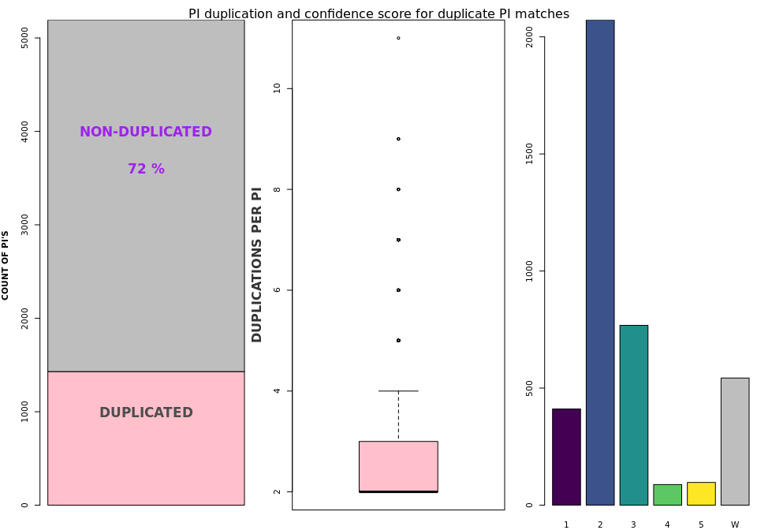
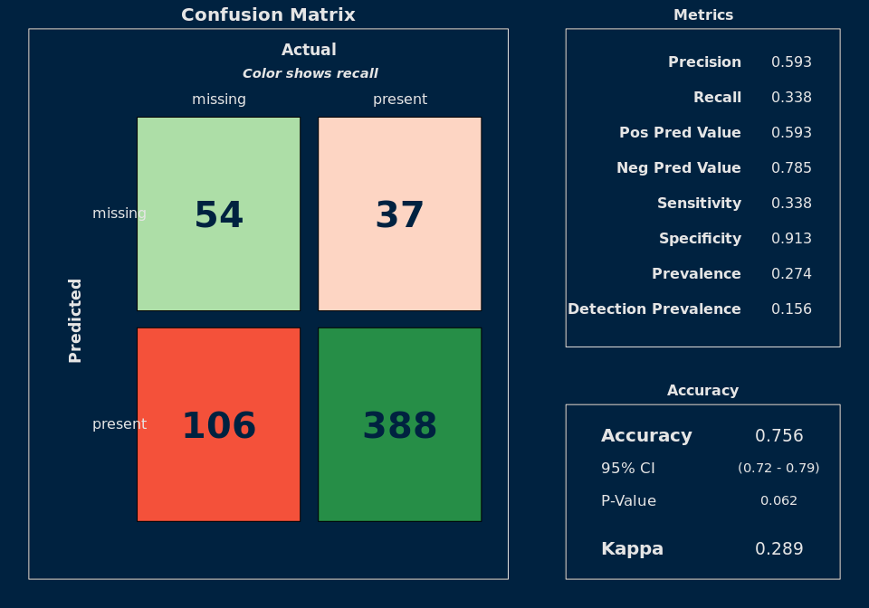
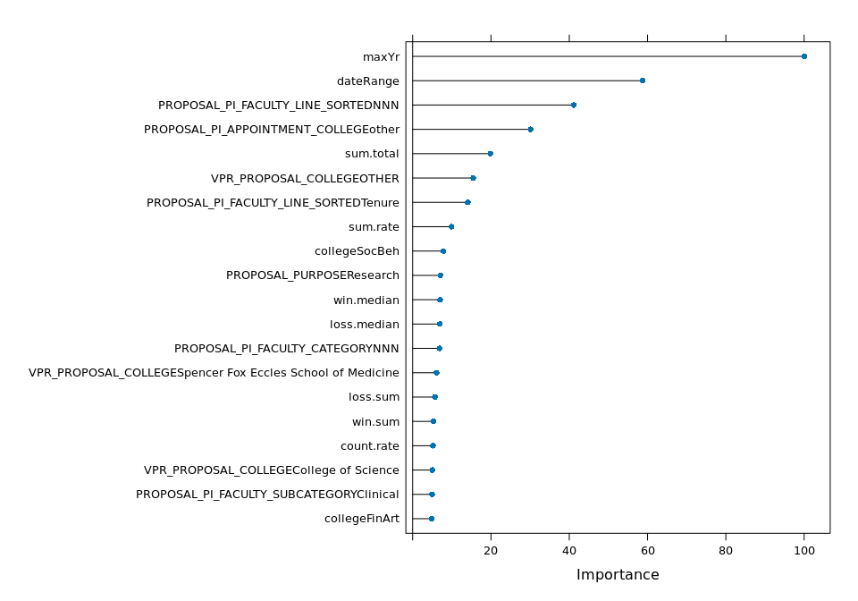

Table: Data summary

|                         |        |
|:------------------------|:-------|
|Name                     |ageData |
|Number of rows           |7741    |
|Number of columns        |12      |
|_______________________  |        |
|Column type frequency:   |        |
|character                |5       |
|factor                   |1       |
|numeric                  |6       |
|________________________ |        |
|Group variables          |None    |

**Variable type: character**

|skim_variable   | n_missing| complete_rate| min| max| empty| n_unique| whitespace|
|:---------------|---------:|-------------:|---:|---:|-----:|--------:|----------:|
|EMPLID          |         0|          1.00|   8|   8|     0|     5192|          0|
|FIRST_PUB_TITLE |      1234|          0.84|   2| 648|     0|     6228|          0|
|FIRST_PUB_ID    |      1234|          0.84|  14|  14|     0|     6239|          0|
|DIM_ID          |         0|          1.00|  15|  18|     0|     7632|          0|
|CONFIDENCE_DESC |         0|          1.00|  28| 108|     0|        6|          0|

**Variable type: factor**

|skim_variable | n_missing| complete_rate|ordered | n_unique|top_counts                       |
|:-------------|---------:|-------------:|:-------|--------:|:--------------------------------|
|CONFIDENCE    |         0|             1|FALSE   |        6|1: 3851, 2: 2169, 3: 833, W: 654 |

**Variable type: numeric**

|skim_variable      | n_missing| complete_rate|    mean|    sd|   p0|  p25|  p50|  p75| p100|hist  |
|:------------------|---------:|-------------:|-------:|-----:|----:|----:|----:|----:|----:|:-----|
|FIRST_PUB_YR       |       902|          0.88| 2006.67| 14.57| 1935| 1999| 2010| 2018| 2025|▁▁▂▃▇ |
|LAST_PUB_YR        |       902|          0.88| 2019.40| 10.06| 1950| 2019| 2024| 2025| 2025|▁▁▁▁▇ |
|TOTAL_PUBLICATIONS |       602|          0.92|   49.52| 94.31|    0|    2|   12|   56| 1615|▇▁▁▁▁ |
|FIRST_GRANT_YR     |      5574|          0.28| 2003.91| 14.97| 1967| 1992| 2008| 2017| 2025|▂▃▃▇▇ |
|LAST_GRANT_YR      |      5574|          0.28| 2018.67| 11.31| 1971| 2014| 2024| 2026| 2030|▁▁▁▂▇ |
|TOTAL_GRANTS       |       602|          0.92|    1.48|  3.74|    0|    0|    0|    1|   48|▇▁▁▁▁ |

### Grants and publication dates

<!-- -->

### Grants and publications

<!-- -->

### Matching confidence

I need a table of the description

<table>
<caption>Confidence ratings and description</caption>
 <thead>
  <tr>
   <th style="text-align:left;">  </th>
   <th style="text-align:left;"> DESCRIPTION </th>
  </tr>
 </thead>
<tbody>
  <tr>
   <td style="text-align:left;"> 1 </td>
   <td style="text-align:left;padding-left: 1em;"> High confidence: ORCID, PubMed, or exact Name + Department (1:1 match) </td>
  </tr>
  <tr>
   <td style="text-align:left;"> 2 </td>
   <td style="text-align:left;padding-left: 1em;"> Moderate confidence: One-to-many Name + Dept matches, strong Name + Middle Name match, or manually validated </td>
  </tr>
  <tr>
   <td style="text-align:left;"> 3 </td>
   <td style="text-align:left;padding-left: 1em;"> Low confidence: Likely correct Name match with limited department info </td>
  </tr>
  <tr>
   <td style="text-align:left;"> 4 </td>
   <td style="text-align:left;padding-left: 1em;"> Very low confidence: Common/duplicate Name-only match; no department info </td>
  </tr>
  <tr>
   <td style="text-align:left;"> 5 </td>
   <td style="text-align:left;padding-left: 1em;"> Likely incorrect: Duplicate Names with no middle name or good department information available </td>
  </tr>
  <tr>
   <td style="text-align:left;"> W </td>
   <td style="text-align:left;padding-left: 1em;"> Ambiguous or incorrect match </td>
  </tr>
</tbody>
</table>

<!-- -->

<!-- -->

<!-- -->

<!-- -->

### VARIABLES THAT PREDICT MISSING VALUES

Conclusion: Missing values aren't random.

<!-- -->

<!-- -->

To Do:

Create some simple visualizations of some of the columns.

Find the most prolific/high win rate individuals who are still missing.

Clean up the visualizations that I have.

For my own edification, compare differences per variable and statistical significance.

