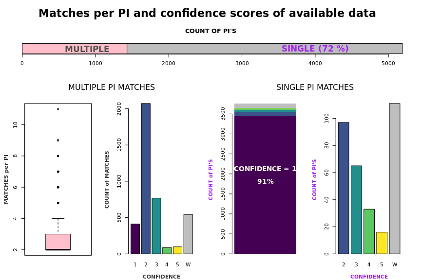
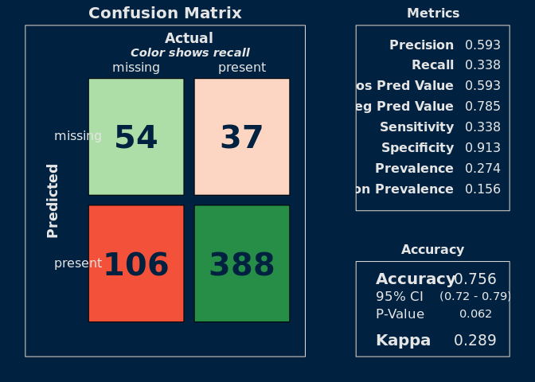

**PURPOSE:**  The purpose of this report is to describe an aspect of the external Dimensions data set and its alignment with internal proposal data.


**OBJECTIVES:**   

  1.  Describe the Dimensions data.   
  2.  Describe alignment with internal data.    
  3.  Identify patterns in alignment.   
  
**SUMMARY:**   

The Dimensions data set is an external data set that tracks activity by researchers.  It is described [here.] (Find a link.)  

Internally, the Office of Sponsored Projects similarly tracks proposal activity by principal investigators.

The internal and external data sets can be aligned in order to have a more comprehensive evaluation of an individual's activity, both preceding and succeeding their time at the U.

For the purposes of evaluating PI turnover and retention, it is hoped that an "academic age" per PI can be derived from this data set based on their earliest publication [or grant?].  The "academic age" will be used as a proxy for actual age, as although employees' birthdates are known this information is considered PPI and subject to maximum restriction.

The internal and external data sets are aligned by matching researcher identification through clues such as name, department, and publication title.  However, external data sets are never perfect and often require manual curation.  A perfect alignment is not expected.

For the purposes of this analysis, date fields describing first and last publishing year or grant year, total number of publications and grants, and an alignment confidence score are extracted from the external data set.

The publication dates range from the year 1935 to 2025, and the grant dates range from the year 1967 to 2030.  353,524 publications and 10,567 grants are tallied.

The combined data set attempts to align 5192 internal employee identification numbers with 7632 external researcher identification numbers and provides a score of confidence in the alignment.  It aligns 3,440 (66%) internal EMPLIDs with a one-to-one match at the highest confidence score.  The remaining 1752 EMPLID's are aligned with multiple potential external ID's at reduced confidence levels.  

(Oddly, 361 EMPLID's are aligned with multiple external ID's with a confidence level of 1.)

However, internally OSP has tracked the research activity 


This evaluation found that 


Wow I'm struggling to write anything coherent.

The intent is to identify the first publication date per PI.

I actually don't need many words on this one.  The point is to get it done.  It's just a quick look at what we have.

Where's my graphic of how many are matched and un-matched?


Table: Data summary

|                         |        |
|:------------------------|:-------|
|Name                     |ageData |
|Number of rows           |7741    |
|Number of columns        |12      |
|_______________________  |        |
|Column type frequency:   |        |
|character                |5       |
|factor                   |1       |
|numeric                  |6       |
|________________________ |        |
|Group variables          |None    |


**Variable type: character**

|skim_variable   | n_missing| complete_rate| min| max| empty| n_unique| whitespace|
|:---------------|---------:|-------------:|---:|---:|-----:|--------:|----------:|
|EMPLID          |         0|          1.00|   8|   8|     0|     5192|          0|
|FIRST_PUB_TITLE |      1234|          0.84|   2| 648|     0|     6228|          0|
|FIRST_PUB_ID    |      1234|          0.84|  14|  14|     0|     6239|          0|
|DIM_ID          |         0|          1.00|  15|  18|     0|     7632|          0|
|CONFIDENCE_DESC |         0|          1.00|  28| 108|     0|        6|          0|


**Variable type: factor**

|skim_variable | n_missing| complete_rate|ordered | n_unique|top_counts                       |
|:-------------|---------:|-------------:|:-------|--------:|:--------------------------------|
|CONFIDENCE    |         0|             1|FALSE   |        6|1: 3851, 2: 2169, 3: 833, W: 654 |


**Variable type: numeric**

|skim_variable      | n_missing| complete_rate|    mean|    sd|   p0|  p25|  p50|  p75| p100|hist  |
|:------------------|---------:|-------------:|-------:|-----:|----:|----:|----:|----:|----:|:-----|
|FIRST_PUB_YR       |       902|          0.88| 2006.67| 14.57| 1935| 1999| 2010| 2018| 2025|▁▁▂▃▇ |
|LAST_PUB_YR        |       902|          0.88| 2019.40| 10.06| 1950| 2019| 2024| 2025| 2025|▁▁▁▁▇ |
|TOTAL_PUBLICATIONS |       602|          0.92|   49.52| 94.31|    0|    2|   12|   56| 1615|▇▁▁▁▁ |
|FIRST_GRANT_YR     |      5574|          0.28| 2003.91| 14.97| 1967| 1992| 2008| 2017| 2025|▂▃▃▇▇ |
|LAST_GRANT_YR      |      5574|          0.28| 2018.67| 11.31| 1971| 2014| 2024| 2026| 2030|▁▁▁▂▇ |
|TOTAL_GRANTS       |       602|          0.92|    1.48|  3.74|    0|    0|    0|    1|   48|▇▁▁▁▁ |


### Grants and publication dates

<!-- -->

### Grants and publications

<!-- -->

### Matching confidence

I need a table of the description

<table>
<caption>Confidence ratings and description</caption>
 <thead>
  <tr>
   <th style="text-align:left;">  </th>
   <th style="text-align:left;"> DESCRIPTION </th>
  </tr>
 </thead>
<tbody>
  <tr>
   <td style="text-align:left;"> 1 </td>
   <td style="text-align:left;padding-left: 1em;"> High confidence: ORCID, PubMed, or exact Name + Department (1:1 match) </td>
  </tr>
  <tr>
   <td style="text-align:left;"> 2 </td>
   <td style="text-align:left;padding-left: 1em;"> Moderate confidence: One-to-many Name + Dept matches, strong Name + Middle Name match, or manually validated </td>
  </tr>
  <tr>
   <td style="text-align:left;"> 3 </td>
   <td style="text-align:left;padding-left: 1em;"> Low confidence: Likely correct Name match with limited department info </td>
  </tr>
  <tr>
   <td style="text-align:left;"> 4 </td>
   <td style="text-align:left;padding-left: 1em;"> Very low confidence: Common/duplicate Name-only match; no department info </td>
  </tr>
  <tr>
   <td style="text-align:left;"> 5 </td>
   <td style="text-align:left;padding-left: 1em;"> Likely incorrect: Duplicate Names with no middle name or good department information available </td>
  </tr>
  <tr>
   <td style="text-align:left;"> W </td>
   <td style="text-align:left;padding-left: 1em;"> Ambiguous or incorrect match </td>
  </tr>
</tbody>
</table>

<!-- -->


<!-- -->

# SUBSET OF INTEREST

Not all 5,192 PI's available in the Dimensions data are of immediate interest.  A previous study examined 2,937 PI's who submitted proposals between FY2013 and FY2023.  


```
## [1] FALSE
```

```
## [1] 812
```


<!-- -->

<!-- -->

### VARIABLES THAT PREDICT MISSING VALUES

Conclusion: Missing values aren't random.

<!-- -->

<!-- -->


To Do:

Create some simple visualizations of some of the columns.

Find the most prolific/high win rate individuals who are still missing.

Clean up the visualizations that I have.

For my own edification, compare differences per variable and statistical significance.


