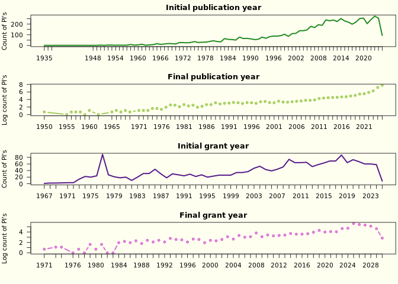
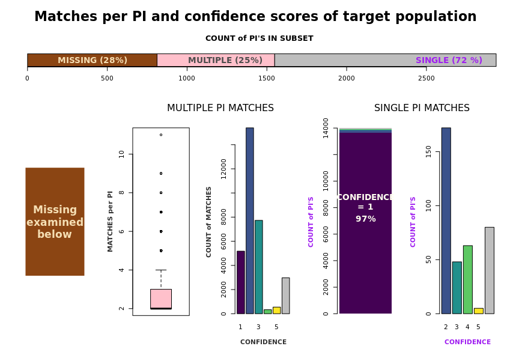
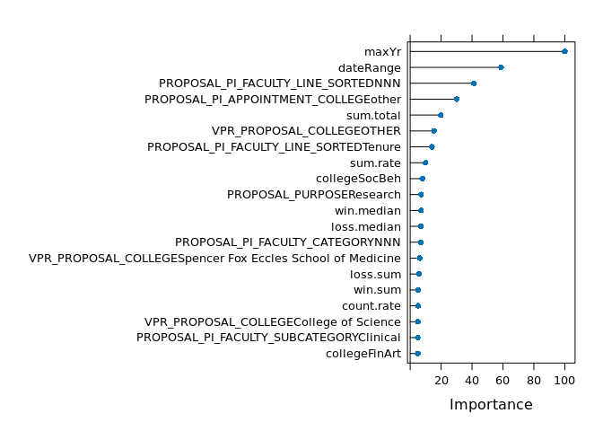
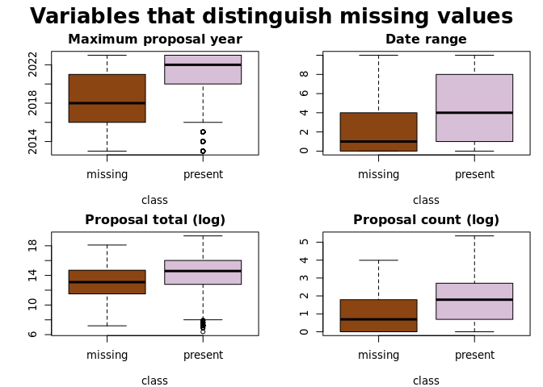

To Do:
Limit the query to a date
Remove the "As of today" phrase
Adjust plot sizes
A few more words and it's done
Refer to "target population"

**PURPOSE:**  The purpose of this report is to describe aligning the "Dimensions" data set with the target population of PI's and draw conclusions on its utility. 

**OBJECTIVES:**   

  1.  Describe the Dimensions data.   
  2.  Describe alignment with the target population.    
  3.  Identify patterns in missing matches.

**EXECUTIVE SUMMARY:**

The Dimensions data set is an external data set that tracks activity by researchers.  It could be used to identify the first publication (grant?) by a researcher, and use this date as a proxy for the birthdate, deriving an "academic age" per PI.

This Dimensions data set is manually curated and aligned with internal PI's using clues like name, department, and title.  However, the alignment is time-consuming and imperfect.

As of today, 2025-06-19, 5,192 PI's have potential matches with 7,632 researchers identified in Dimensions with varying counts of matches and varying levels of confidence.  

However, of the target population of 2,937 PI's, some 28% have no matches.   Further complicating an analysis, these missing matches are not random.  A predictive machine learning model scored a Kappa value of 0.29 where a Kappa value of less than 0.1 would indicate randomness.  Instead, the missing PI's tend to be older, with a sparser activity record outside of the main researching institutions at the U. 

As well, there are internal inconsistencies in the confidence rating, where PI's have multiple potential matches but are scored as having a one-to-one match.

In conclusion, the data set is unattractive to use in further analysis, specifically in determining an "academic age" per PI, because it is too incomplete, too biased in missing values, and too inconsistent.  Alternative data should be explored before using this data.   

  
**SUMMARY:**   

The Dimensions data set is an external data set that tracks activity by researchers.  It is described [here.] (Find a link.)  

Internally, the Office of Sponsored Projects similarly tracks proposal activity by principal investigators.

The internal and external data sets can be aligned in order to have a more comprehensive evaluation of an individual's activity, both preceding and succeeding their time at the U.

For the purposes of evaluating PI turnover and retention, it is hoped that an "academic age" per PI can be derived from this data set based on their earliest publication [or grant?].  The "academic age" will be used as a proxy for actual age, as the employees' birthdates is unavailable for analyses because this information is considered sensitive and subject to maximum restriction.

The internal and external data sets are aligned by matching researcher identification through clues such as name, department, and publication title.  However, external data sets are created through a mish mash of methods and adhere to varying rules and quality standards. A perfect alignment with internal data, which verifiably follows a number of rules and quality standards, is not expected.

For the purposes of this analysis, date fields describing first and last publishing year or grant year, total number of publications and grants, and an alignment confidence score are extracted from the external data set.

The publication dates range from the year 1935 to 2025, and the grant dates range from the year 1967 to 2030.  353,524 publications and 10,567 grants are tallied.

The combined data set attempts to align 5192 internal employee identification numbers with 7632 external researcher identification numbers and provides a score of confidence in the alignment.  It aligns 3,440 (66%) internal EMPLIDs with a one-to-one match at the highest confidence score.  The remaining 1752 EMPLID's are aligned with multiple potential external ID's at reduced confidence levels.  

(Oddly, 361 EMPLID's are aligned with multiple external ID's with a confidence level of 1.)

However, internally OSP has tracked the research activity 

This evaluation found that 

Wow I'm struggling to write anything coherent.

The intent is to identify the first publication date per PI.

I actually don't need many words on this one.  The point is to get it done.  It's just a quick look at what we have.

Where's my graphic of how many are matched and un-matched?

It's like, instead of three tiles describing "duplicate" I need to add a fourth one on the right, the first one, which is

... is ....

... hold on ...

..."subset of interest" that is "found" and "not found" ?

I guess it's just another row of three.

Let's do that, first, and see what it looks like.

I'm getting tired of this.

I need to simply conclude that this external data set is not usable for the purposes of this study due to a large proportion of non-random missing data in the target population.  As well, concerns about consistency of definitions are noted (where PI's with multiple matches are scored with a self-contradictory 'one-to-one' match rating.)

## (1) DESCRIBE THE DIMENSIONS DATA

### Data summary

Table: Data summary

|                         |        |
|:------------------------|:-------|
|Name                     |ageData |
|Number of rows           |7741    |
|Number of columns        |12      |
|_______________________  |        |
|Column type frequency:   |        |
|character                |5       |
|factor                   |1       |
|numeric                  |6       |
|________________________ |        |
|Group variables          |None    |

**Variable type: character**

|skim_variable   | n_missing| complete_rate| min| max| empty| n_unique| whitespace|
|:---------------|---------:|-------------:|---:|---:|-----:|--------:|----------:|
|EMPLID          |         0|          1.00|   8|   8|     0|     5192|          0|
|FIRST_PUB_TITLE |      1234|          0.84|   2| 648|     0|     6228|          0|
|FIRST_PUB_ID    |      1234|          0.84|  14|  14|     0|     6239|          0|
|DIM_ID          |         0|          1.00|  15|  18|     0|     7632|          0|
|CONFIDENCE_DESC |         0|          1.00|  28| 108|     0|        6|          0|

**Variable type: factor**

|skim_variable | n_missing| complete_rate|ordered | n_unique|top_counts                       |
|:-------------|---------:|-------------:|:-------|--------:|:--------------------------------|
|CONFIDENCE    |         0|             1|FALSE   |        6|1: 3851, 2: 2169, 3: 833, W: 654 |

**Variable type: numeric**

|skim_variable      | n_missing| complete_rate|    mean|    sd|   p0|  p25|  p50|  p75| p100|hist  |
|:------------------|---------:|-------------:|-------:|-----:|----:|----:|----:|----:|----:|:-----|
|FIRST_PUB_YR       |       902|          0.88| 2006.67| 14.57| 1935| 1999| 2010| 2018| 2025|▁▁▂▃▇ |
|LAST_PUB_YR        |       902|          0.88| 2019.40| 10.06| 1950| 2019| 2024| 2025| 2025|▁▁▁▁▇ |
|TOTAL_PUBLICATIONS |       602|          0.92|   49.52| 94.31|    0|    2|   12|   56| 1615|▇▁▁▁▁ |
|FIRST_GRANT_YR     |      5574|          0.28| 2003.91| 14.97| 1967| 1992| 2008| 2017| 2025|▂▃▃▇▇ |
|LAST_GRANT_YR      |      5574|          0.28| 2018.67| 11.31| 1971| 2014| 2024| 2026| 2030|▁▁▁▂▇ |
|TOTAL_GRANTS       |       602|          0.92|    1.48|  3.74|    0|    0|    0|    1|   48|▇▁▁▁▁ |

### Grants and publication dates

<!-- -->

### Grants and publications

<!-- -->

### Matching confidence explained

<table>
<caption>Confidence ratings and description</caption>
 <thead>
  <tr>
   <th style="text-align:left;">  </th>
   <th style="text-align:left;"> DESCRIPTION </th>
  </tr>
 </thead>
<tbody>
  <tr>
   <td style="text-align:left;"> 1 </td>
   <td style="text-align:left;padding-left: 1em;"> High confidence: ORCID, PubMed, or exact Name + Department (1:1 match) </td>
  </tr>
  <tr>
   <td style="text-align:left;"> 2 </td>
   <td style="text-align:left;padding-left: 1em;"> Moderate confidence: One-to-many Name + Dept matches, strong Name + Middle Name match, or manually validated </td>
  </tr>
  <tr>
   <td style="text-align:left;"> 3 </td>
   <td style="text-align:left;padding-left: 1em;"> Low confidence: Likely correct Name match with limited department info </td>
  </tr>
  <tr>
   <td style="text-align:left;"> 4 </td>
   <td style="text-align:left;padding-left: 1em;"> Very low confidence: Common/duplicate Name-only match; no department info </td>
  </tr>
  <tr>
   <td style="text-align:left;"> 5 </td>
   <td style="text-align:left;padding-left: 1em;"> Likely incorrect: Duplicate Names with no middle name or good department information available </td>
  </tr>
  <tr>
   <td style="text-align:left;"> W </td>
   <td style="text-align:left;padding-left: 1em;"> Ambiguous or incorrect match </td>
  </tr>
</tbody>
</table>

### Matches and confidence scores of the available data

<!-- -->

## (2) DESCRIBE ALLIGNMENT WITH THE TARGET POPULATION

Not all 5,192 PI's available in the Dimensions data are of immediate interest.  A previous study examined 2,937 PI's who submitted proposals between FY2013 and FY2023.  

<!-- -->

### (3) IDENTIFY PATTERNS IN MISSING MATCHES

Out of the target population of 2,937 some 812 (28%) do not have matches.

Machine learning was used to identify patterns in the missing data.  If no patterns were found, and the missing matches were random, then the missing values could be imputed or the records with missing values removed with less impact on study conclusions. However, the presence of patterns in missing data would undermine study conclusions due to not fully scoping the situation.

Identifying patterns could also help efforts to find matches.   

Extreme gradient boosting was used with default settings to detect whether a PI was "missing" or "present" in Dimensions data using 40 variables, 15 numeric and 25 character. 

The most common character value was chosen per PI. The minimum and maximum proposal year (between 2013 and 2023 per population filter criteria), and the range between, was extracted or calculated.  Values like the number of proposals won or lost, and the median amount requested, was calculated per PI.

The machine learning model had an overall accuracy of 76%, precision of 59%, and recall of 34%.  Of most relevance was the Kappa score, a measure of agreement beyond chance, at 0.29 which greatly exceeded the 0.1 threshold.  This suggests the presence of patterns or underyling structure that describe  which PI's were missing matches.

### Data set used to in machine learning

Table: Data summary

|                         |       |
|:------------------------|:------|
|Name                     |fullPI |
|Number of rows           |2937   |
|Number of columns        |42     |
|_______________________  |       |
|Column type frequency:   |       |
|AsIs                     |1      |
|character                |25     |
|factor                   |1      |
|numeric                  |15     |
|________________________ |       |
|Group variables          |None   |

**Variable type: AsIs**

|skim_variable      | n_missing| complete_rate| n_unique| min_length| max_length|
|:------------------|---------:|-------------:|--------:|----------:|----------:|
|PROPOSAL_PI_EMPLID |         0|             1|     2937|          1|          1|

**Variable type: character**

|skim_variable                            | n_missing| complete_rate| min| max| empty| n_unique| whitespace|
|:----------------------------------------|---------:|-------------:|---:|---:|-----:|--------:|----------:|
|PROPOSAL_PURPOSE                         |         0|             1|   8|  20|     0|        4|          0|
|PROPOSAL_TYPE                            |         0|             1|   3|  22|     0|        5|          0|
|college                                  |         0|             1|   3|   7|     0|       23|          0|
|PROPOSAL_RECIPIENT_FUNDING_TYPE          |         0|             1|  19|  23|     0|        3|          0|
|PROPOSAL_FANDA_WAIVER_INDIVATOR          |         0|             1|  13|  30|     0|        3|          0|
|PROPOSAL_COST_SHARE_INDICATOR            |         0|             1|  10|  14|     0|        2|          0|
|PROPOSAL_FANDA_OFF_CAMPUS_RATE_INDICATOR |         0|             1|  14|  15|     0|        2|          0|
|PROPOSAL_UPLOAD_DATE_FISCAL_YEAR         |         0|             1|   4|   4|     0|       10|          0|
|PROPOSAL_PI_APPOINTMENT_COLLEGE          |         0|             1|   3|  22|     0|        5|          0|
|PROPOSAL_PI_ACADEMIC_RANK                |         0|             1|   3|  19|     0|        5|          0|
|PROPOSAL_PI_TENURE_STATUS                |         0|             1|   3|  20|     0|        4|          0|
|PROPOSAL_PI_FACULTY_CATEGORY             |         0|             1|   3|  11|     0|        8|          0|
|PROPOSAL_PI_FACULTY_SUBCATEGORY          |         0|             1|   3|  12|     0|       10|          0|
|PROPOSAL_PI_ACADEMIC_RANK_LEVEL          |         0|             1|   3|  19|     0|        5|          0|
|PROPOSAL_PI_RANK_SORTED                  |         0|             1|   3|  11|     0|        6|          0|
|PROPOSAL_PI_FACULTY_LINE_SORTED          |         0|             1|   3|   8|     0|        6|          0|
|VPR_PROPOSAL_COLLEGE                     |         0|             1|   5|  54|     0|       23|          0|
|PROPOSAL_VP                              |         0|             1|  15|  30|     0|        9|          0|
|VPR_PROPOSAL_VP                          |         0|             1|   5|  30|     0|        3|          0|
|PROPOSAL_SPONSOR_TYPE                    |         0|             1|   8|  26|     0|        9|          0|
|PROPOSAL_IACUC_IRB_DIM_KEY               |         0|             1|   1|   1|     0|        8|          0|
|HIGHEST_GOVERNMENT_AGENCY_ACRONYM        |         0|             1|   2|   5|     0|       15|          0|
|NEXT_HIGHEST_GOVERNMENT_AGENCY_ACRONYM   |         0|             1|   2|   5|     0|        5|          0|
|complex_cluster                          |         0|             1|   1|  10|     0|        6|          0|
|rate_cluster                             |         0|             1|   1|  10|     0|        9|          0|

**Variable type: factor**

|skim_variable | n_missing| complete_rate|ordered | n_unique|top_counts          |
|:-------------|---------:|-------------:|:-------|--------:|:-------------------|
|class         |         0|             1|FALSE   |        2|pre: 2125, mis: 812 |

**Variable type: numeric**

|skim_variable | n_missing| complete_rate|       mean|          sd|   p0|       p25|        p50|        p75|      p100|hist  |
|:-------------|---------:|-------------:|----------:|-----------:|----:|---------:|----------:|----------:|---------:|:-----|
|win.sum       |         0|             1| 1845352.41|  4631427.13|    0|  10000.00|  303120.00| 1628130.00|  74656143|▇▁▁▁▁ |
|win.count     |         0|             1|       4.46|        7.86|    0|      1.00|       2.00|       5.00|       182|▇▁▁▁▁ |
|win.mean      |         0|             1|  348026.49|   700490.45|    0|   7833.33|  105122.50|  399535.00|  16000000|▇▁▁▁▁ |
|win.median    |         0|             1|  262419.81|   622855.38|    0|   3390.00|   62500.00|  255914.00|  16000000|▇▁▁▁▁ |
|loss.sum      |         0|             1| 4716698.13| 10670425.95|    0|  30000.00|  699590.00| 4660296.00| 205473297|▇▁▁▁▁ |
|loss.count    |         0|             1|       5.34|        7.81|    0|      1.00|       2.00|       7.00|        72|▇▁▁▁▁ |
|loss.mean     |         0|             1|  574297.11|   967992.29|    0|  23300.00|  277375.00|  775679.18|  17222084|▇▁▁▁▁ |
|loss.median   |         0|             1|  453701.04|   793280.80|    0|  15450.00|  196297.00|  485536.50|  12132861|▇▁▁▁▁ |
|sum.rate      |         0|             1|       0.42|        0.39|    0|      0.03|       0.31|       0.82|         1|▇▃▂▁▅ |
|count.rate    |         0|             1|       0.47|        0.35|    0|      0.17|       0.46|       0.78|         1|▇▆▅▃▇ |
|count.total   |         0|             1|       9.80|       13.35|    1|      2.00|       5.00|      13.00|       211|▇▁▁▁▁ |
|sum.total     |         0|             1| 6562050.54| 13559384.77|  594| 205578.00| 1433381.00| 7214486.00| 248731678|▇▁▁▁▁ |
|minYr         |         0|             1|    2016.42|        3.14| 2013|   2014.00|    2016.00|    2019.00|      2023|▇▂▂▂▂ |
|maxYr         |         0|             1|    2020.19|        2.98| 2013|   2018.00|    2021.00|    2023.00|      2023|▂▂▂▃▇ |
|dateRange     |         0|             1|       3.77|        3.41|    0|      0.00|       3.00|       7.00|        10|▇▃▂▂▂ |

<!-- -->

### Variable importance to the machine learning model

<!-- -->

### VARIABLES THAT PREDICT MISSING VALUES

Conclusion: Missing values aren't random.

<!-- -->

<!-- -->

To Do:

Create some simple visualizations of some of the columns.

Find the most prolific/high win rate individuals who are still missing.

Clean up the visualizations that I have.

For my own edification, compare differences per variable and statistical significance.

