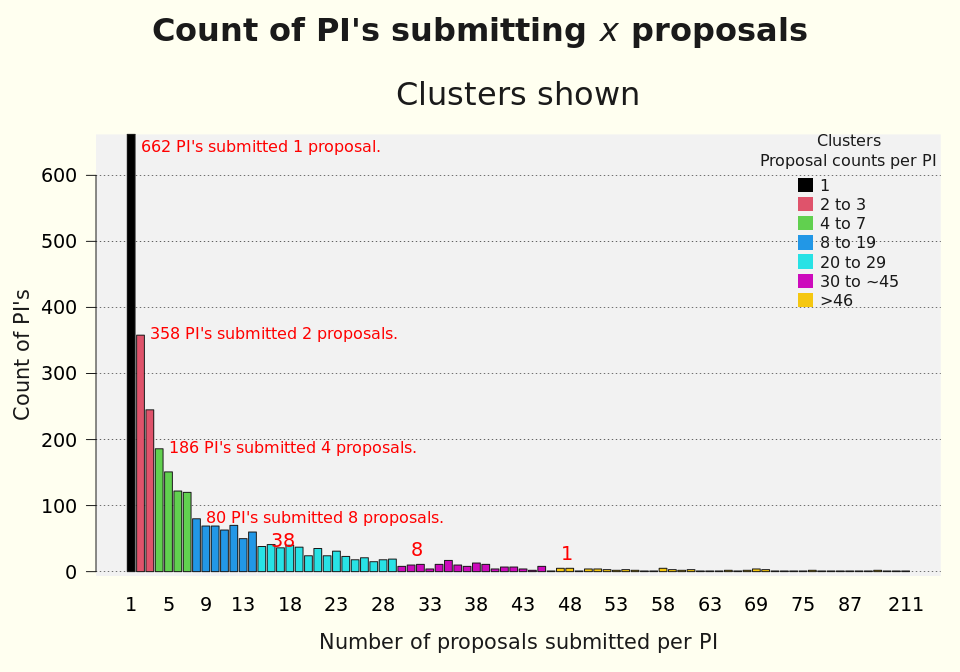
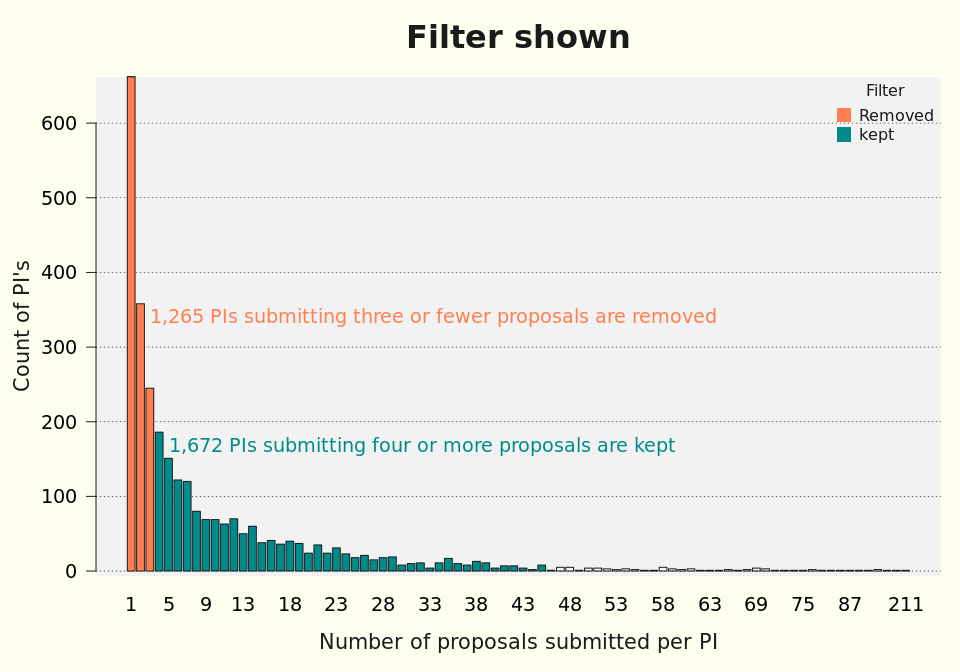

---
output:
  html_document:
    keep_md: true
---

# Filtering based on the count of proposals per principal investigator

### EXECUTIVE SUMMARY

Using the natural breaks identified in clustering the counts of proposals per principal investigators, 1,264 principal investigators submitting three or fewer proposals are filtered out.  1,672 principal investigators submitting four or more proposals are kept for further clustering.

<!-- -->

<!-- -->

