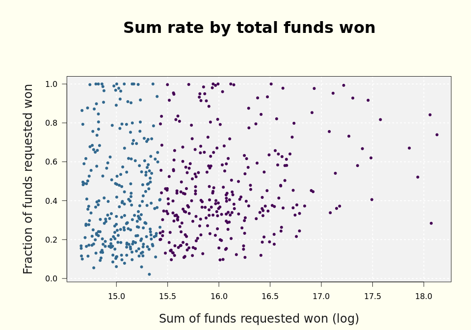

---
output:
  html_document:
    keep_md: true
---


# Low Performers

Low performers are in Rates Cluster 1 (<20% win rates by count and sum.)

**Strike outs:**

These PI's have never won a proposal.  Strike-outs are located in the overlap with Complex Cluster 3 ("Pipe Dreams").

**Sputtering:**

These PI's submit a decent number of proposals with relatively few wins.

They are located in the overlap with Complex Cluster 4 ("Plucky"). 


**Many at bats, few hits:**

These PI's submit a large number of proposals with relatively few wins.

They are located in the overlap with Complex Cluster 5 ("Prolific"). 

# "Inefficent" Performers

These PI's simultaneously carry less than a 20% win rate while also being a Top 20% performer.  They contribute to 80% of the total funds won over the last ten years.  (Maybe exclude them from the other clusters?)


Notes:

Try showing the boxplots, win and loss, for each of these sub-categories

I need to set the same scale for timeDots
I need to modify timeDots according to my new and improved functions
I should show the tick marks (timeLine) as well as the timeDots


<!-- -->

<!-- -->

<!-- -->

<!-- -->


What about people with a low rate of wins, but have a high total sum?  At the bottom right of "Funds requested" graph?

Maybe I have two criteria for low performers --
(1)  Low win rate (what I have so far)
(2)  Low total funds requested won (who would this be?  I guess I want a pareto already!)

I need to see these by "total funds requested won" per PI


<!-- -->


<!-- -->


I need to examine the values that have a very low win rate, but have still pulled in enough money
to be a significant contributor to the U

I can color the ones in the graph above according to 80th percentile ....?

It would be really cool to replace my background gray grid with transparently changing viridis bands according to the percentiles, or the cumulative percentile or something like that.

I need to include complex cluster 2, it's just incomplete otherwise.

And maybe we don't call these "low performers" but we call them "wasted effort" or something like that?

I mean, how can you call someone a low performer when they are in the 90th percentile for funds brought in?

And how can you call someone a low performer when they nabbed 75% of their proposals, but are in the cumulative 10th percentile?

"Low" would be a measure of performance against your own potential, or of your peers'.

I guess I'd want to carefully designate the "low" performers that are above the 80th percentile.  That's a curious sub-set.


<!-- -->


<!-- -->

<!-- -->


<!-- -->


<!-- --><!-- -->


```
## [[1]]
## NULL
## 
## [[2]]
## NULL
## 
## [[3]]
## NULL
## 
## [[4]]
## NULL
## 
## [[5]]
## NULL
## 
## [[6]]
## NULL
## 
## [[7]]
## NULL
## 
## [[8]]
## NULL
```

<!-- -->


<!-- -->


<!-- --><!-- -->


