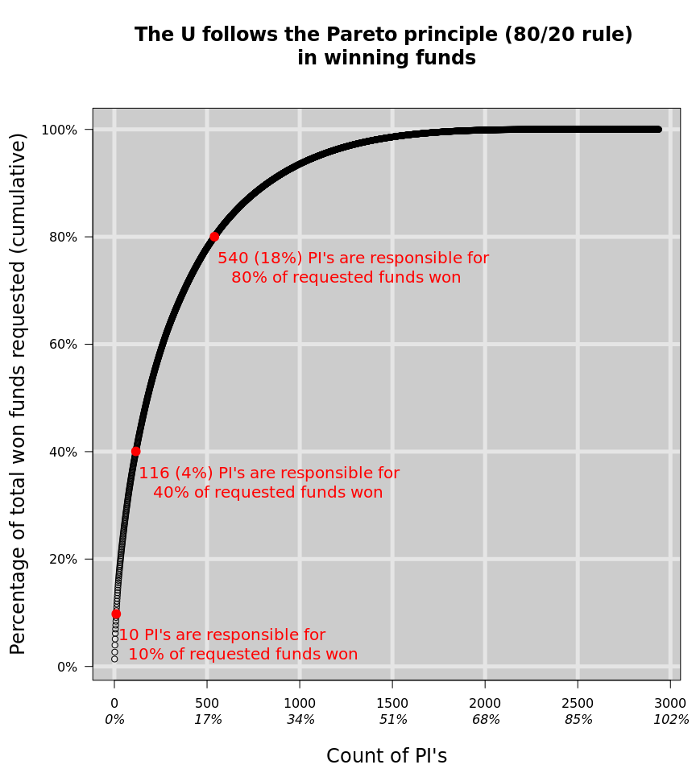

---
output:
  html_document:
    keep_md: true
---

**EXECUTIVE SUMMARY:** 

Over the last ten years, the U has requested some ~\$5.5 B that received some level of support or funding, and are called "won" for this report.

Only 540 PI's, or 18% of all PI's, are responsible for 80% of these 'won' funds requested.

This follows a standard 80/20 rule or Pareto principle, and suggests prioritizing principal investigators based on their productivity.

<!-- -->

