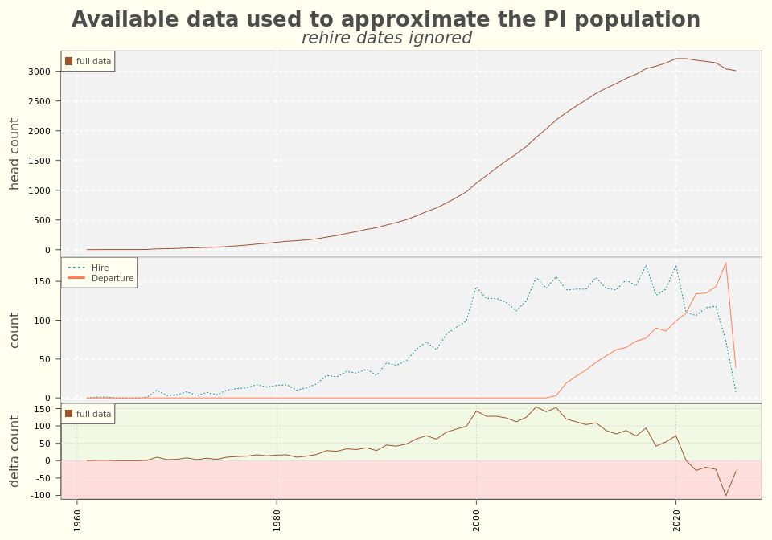
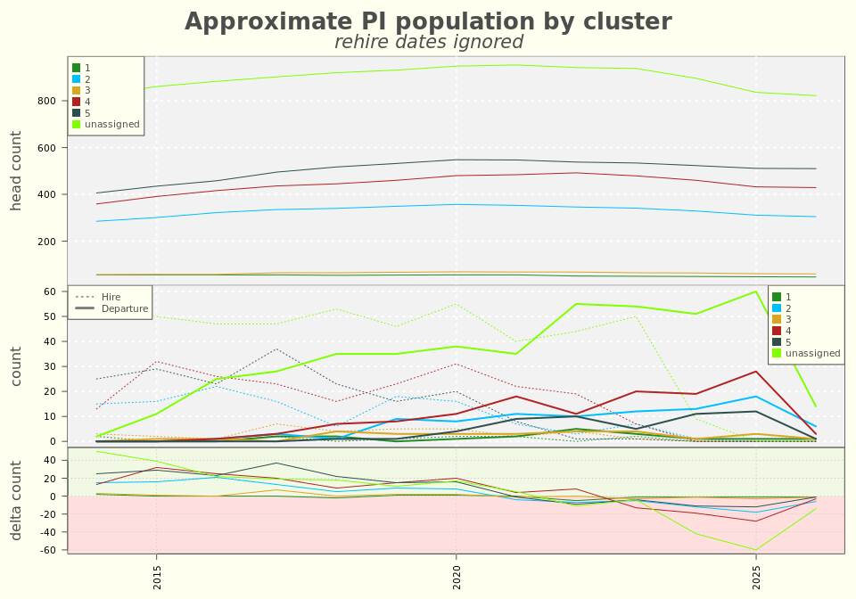

**PURPOSE:**  The purpose of this document is to describe the incomplete retention data of principal investigators originally available to the Office of Sponsored Projects.  This is a truncated report and demonstrates a stage in the process.  It is useful as a milestone or reference but should not be used to draw conclusions.    

**OBJECTIVES:**   

  1.  Describe the retention data.
  2.  Calculate and compare turnover    
      a.  By colleges    ***DONE***  
      b.  By PI clusters ***DONE***   
      c.  By percentiles ***DONE***   
      
**NOT PERFORMED IN THIS REPORT:**

  1.  Compare the retention data and the proposal data. 
  2.  Re-calculate and compare turnover using estimated hire dates from the comparison.   
  3.  Statistical tests
  

# EXECUTIVE SUMMARY

All graphics produced in this report used incomplete data, and no conclusions should be drawn.

This incomplete data set shows a decline in the estimated headcount of principal investigators starting in about 2020 due to reduced hires and increased departures.  No investigation or explanation is attempted in this report.

It also shows that Cluster 5 PI's (nick-named "Prolific" for being the workhorses of U research), and the population above the 90th percentile for funds won during a ten year period, are more stable with fewer departure counts than other clusters or percentiles.  This creates a "chicken-or-the-egg" question as to whether their proclivity led to their stability or vice versa.

Upon re-analyzing with complete data, valid conclusions can be drawn.

# SUMMARY

The retention data contains records for 4,485 principal investigators, where principal investigators are extracted from the table "osp.d_pi_vw" and are presumably identified according to the definitions and designations found in [Rule R7-200B](https://regulations.utah.edu/research/rules_7/r7-200b.php#a.II).  The definition of a principal investigator and inclusion in this data set is being reviewed.

This data set includes all 2,937 principal investigators who submitted proposals after FY2013 as described in the Grants Exploratory project, and contains an additional 1,548 principal investigators who presumably submitted proposals before 2013.  Although additional information from HR is forthcoming, and the designation of "principal investigator" in OSP data is being reviewed, it may be prudent to exclude the additional PI's from future projects due to incomplete data on their proposal submissions.

The data contains up to three dates per PI:  initial hire date, one re-hire date, and the most recent termination date (if it exists.)  Because not all termination and re-hire dates are included, it is impossible to accurately tabulate head count.  This prevents accurate calculation of metrics that use the headcount as a denominator, such as the turnover rate.  Instead, re-hire dates are ignored and headcount is estimated using the initial hire date.

As well, action reasons (such as an explanation for termination) are not included, making it impossible to distinguish "voluntary" and "involuntary" separation.

***Dates and intervals:***    
The earliest hire date reaches back to  1958, and the earliest termination date is in 2007.  The largest interval between initial hire and rehire date is 51 years, and the largest interval between hire date and termination date is 59 years.

***Seasonality:***    
The data shows most hire or termination activity happening in the middle of the year around July 1st.

***Apparent population decline overall:***   
Population head count appears to decline from 2020 onwards due to an increase in terminations and a decrease in hiring.  Because re-hires are ignored, head count is roughly estimated.

***Estimated population by college:***    
Among the colleges, the count of departures increased dramatically in 2024 at Engineering and Science, and remained stable (though elevated) at the School of Medicine and at the Huntsman Cancer Institute. 

***Estimated population by cluster:***    
The description of the clusters is contained in a report titled "Clustering principal investigators without time variables." 

Among the clusters, departure counts among PI's not assigned to a cluster (due to too few proposals) are highest, and lowest in Cluster 5 "Prolific" (the workhorses of research at the U.)   

***Estimated population by percentile:***   
A description of the percentiles is yet to be written. Percentiles were originally calculated based on ten years' of performance.  The 90th percentile or higher population has the lowest departure counts and what appears to be the most stable population.  Because the percentiles were calculated based on ten years' of performance, it introduces a chicken-or-egg question:  is this population considered successful because they have been stable, or are they made stable because they are successful?  In other words, are highly successful researchers not part of the ten-year 90th percentile because they left after only three years?

To answer this question, percentiles were then re-calculated on an annual basis.  About 40% of the PI's consistently win funds within a five percentile range of themselves in any given year.  However, a very strong alternating pattern was discovered where a PI wins at a high percentile in one year followed by a low percentile in the next year.  This pattern is noted in this report and deferred to examine in a yet-to-be-written report examining annual performance.    

# 1) DESCRIBE THE RETENTION DATA   

### QUERY

VPR.D_PI_EMP_DT_VW as
  SELECT pi."PI_DIM_KEY",    
         pi."PI_EMPLID",    
         pi."PI_FIRST_NAME",    
         pi."PI_MIDDLE_NAME",    
         pi."PI_LAST_NAME",    
         pi."PI_NAME",    
         pi."PI_EMAIL_ADDRESS",    
         pi."PI_PHONE",    
         pi."PI_INDICATOR",    
         pi."IS_PI",    
         pi."PI_LOAD_DATE_TIME",    
         pi."PI_UPDATE_DATE_TIME",    
         emp.hire_dt,    
         emp.rehire_dt,    
         emp.termination_dt
         FROM osp.d_pi_vw pi
         LEFT JOIN uuetl_hr.PS_UU_EMPLOYMENT_VW emp ON pi.pi_emplid = emp.emplid

### DATA SUMMARY

Table: Data summary

|                         |        |
|:------------------------|:-------|
|Name                     |retData |
|Number of rows           |4485    |
|Number of columns        |18      |
|_______________________  |        |
|Column type frequency:   |        |
|character                |9       |
|numeric                  |4       |
|POSIXct                  |5       |
|________________________ |        |
|Group variables          |None    |

**Variable type: character**

|skim_variable    | n_missing| complete_rate| min| max| empty| n_unique| whitespace|
|:----------------|---------:|-------------:|---:|---:|-----:|--------:|----------:|
|PI_EMPLID        |         0|             1|   1|   9|     0|     4483|          1|
|PI_FIRST_NAME    |         0|             1|   1|  29|     0|     2126|          0|
|PI_MIDDLE_NAME   |         0|             1|   1|  20|     0|      994|       1552|
|PI_LAST_NAME     |         0|             1|   2|  22|     0|     3579|          0|
|PI_NAME          |         0|             1|   5|  50|     0|     4481|          0|
|PI_EMAIL_ADDRESS |         0|             1|   7|  39|     0|     4482|          0|
|PI_PHONE         |         0|             1|   5|  16|     0|     1757|          0|
|PI_INDICATOR     |         0|             1|   7|  22|     0|        3|          0|
|IS_PI            |         0|             1|   3|   3|     0|        2|          0|

**Variable type: numeric**

|skim_variable | n_missing| complete_rate|    mean|      sd| p0|     p25|     p50|     p75|    p100|hist  |
|:-------------|---------:|-------------:|-------:|-------:|--:|-------:|-------:|-------:|-------:|:-----|
|PI_DIM_KEY    |         0|          1.00| 2860.88| 2356.40| -2| 1135.00| 2286.00| 3429.00| 7935.00|▇▇▃▁▃ |
|initial       |      3228|          0.28|   10.99|    9.38|  0|    4.46|    8.18|   14.88|   50.77|▇▃▁▁▁ |
|rehire        |      4039|          0.10|    7.67|    6.57| -2|    2.34|    5.76|   12.00|   25.70|▇▇▅▂▂ |
|hire          |      3013|          0.33|   16.26|   12.21|  0|    6.50|   12.79|   23.92|   59.47|▇▅▃▁▁ |

**Variable type: POSIXct**

|skim_variable       | n_missing| complete_rate|min                 |max                 |median              | n_unique|
|:-------------------|---------:|-------------:|:-------------------|:-------------------|:-------------------|--------:|
|PI_LOAD_DATE_TIME   |         0|          1.00|2020-05-12 16:02:38 |2025-06-03 05:01:16 |2022-04-07 14:09:46 |      452|
|PI_UPDATE_DATE_TIME |       303|          0.93|2023-06-16 12:37:17 |2025-06-06 05:00:55 |2025-01-31 05:01:10 |      198|
|HIRE_DT             |         4|          1.00|1958-09-01 00:00:00 |2025-05-01 00:00:00 |2008-06-24 00:00:00 |     1777|
|REHIRE_DT           |      3228|          0.28|1998-07-20 00:00:00 |2027-02-15 00:00:00 |2012-08-01 00:00:00 |      612|
|TERMINATION_DT      |      3013|          0.33|2007-08-01 00:00:00 |2025-06-01 00:00:00 |2019-11-17 12:00:00 |      630|

### Retention dates

<!-- -->

### Retention intervals

<!-- -->

### Seasonality

<!-- -->

# 2) CALCULATE AND COMPARE TURNOVER

### Approximate tabulations of the principal investigator population

<!-- --><!-- -->

  

### Approximate tabulations of the principal investigator population by college

<!-- --><!-- --><!-- -->

### Approximate tabulations of the principal investigator population by cluster

Please see the report "Clustering principal investigators without time variables" for a lengthier description of the clusters. 
The cluster nicknames and percent of total funds requested won (over ten years) are as follows:

  * "Perfect" (Cluster 1) (2% of funds requested won)
  * "Precise" (Cluster 2) (13% of funds requested won)
  * "Pipe dreams" (Cluster 3) (0% of funds requested won)
  * "Plucky" (Cluster 4) (14% of funds requested won)
  * "Prolific" (Cluster 5) (71% of funds requested won)

<!-- --><!-- --><!-- --><!-- --><!-- -->

### Approximate tabulations of the principal investigator population by percentiles.

Percentiles are calculated based on the ten year sum of funds requested won per PI.  A lengthier description is yet to be written.    

<!-- -->

<!-- -->

<!-- --><!-- --><!-- --><!-- -->

