**PURPOSE:**  The purpose of this report is to describe the "workforce journey" data for employees according to several filters:  First, that they have had some activity after Jan 1, 2010.  Second, that they only have had one employee record value of zero, meaning no concurrent jobs or possible mis-use of the "EMPL_RCD" field.

**OBJECTIVES:**   

  1.  Describe the "Workforce Journey" data for employees who had some activity after the cut-off date of 1 Jan 2010 and never had a concurrent job after the cut-off date of 1 Jan 2010.    
  2.  Define "boundary" actions and check for internal consistency.   

**EXECUTIVE SUMMARY:**

The "workforce journey" data is examined. The records are queried to identify all employees who have activity after 1 Jan 2010, and then their entire work history is pulled.  The earliest date is 1945-09-30 and the maximum date is 2025-07-31.  It is filtered according to the condition of no concurrent jobs.  (More specifically, that the employee only ever had a EMPL_RCD value of zero and never had an action reason of "HCJ" ("Hire Concurrent Job") after the cut-off date.)  

In this data set, some 1,877,979 rows use 21 distinct actions to describe the employment experience of 126,650 employees.

Of particular interest are the so-called "boundary actions" that define entry and exit into the workforce.  These include "primary" actions like hiring and retiring; "break" actions that describe a "short work break"; and "leave" actions for long term disability or a paid leave of absence.   

**SUMMARY:**   

1,877,980 rows covering dates between 1945-09-30 and 2025-07-31 are queried.

All employees had activity after a cut-off date of 1 January 2010.  All employees that had employee record values other than zero, or action reasons of "HCJ" ("Hire Concurrent Job"), are filtered out.  This removes employees who had concurrent positions or erroneous data entry. These employees will be treated separately due to their more complex work journeys.        

The remaining data describes 126,650 employees in 3,764 job codes in 2,328 departments, and every employment "action" that defines their experience (such as transfers, pay raises, leave of absence, and eventual termination or retirement.)  21 distinct actions are further explained with 130 unique "action reasons." Employees have a median count of 9 of these "actions" in their employment history. (At an extreme, one employee (00031235)  has 328 actions.)    

Overwhelmingly, an action of "Data Change" ("DTA") is the most common, followed by "Pay Rate Change" ("PAY") and distantly "Termination" ("TER"), "Hire" ("HIR"), and "Transfer" ("XFR").  The "Termination" ("TER") action has the most "action reasons" (46).

An age band of the employee is provided of the decade of their age at the time of the action. The most frequent band is the decade of the twenties.   

Termination is almost exclusively flagged as "voluntary", with only 5.4% of the flagged rows described as "involuntary."    

A strong seasonal spike in actions is seen around July 1st.  A consistent bi-weekly pattern in actions is also noted.    

Boundary actions are defined as actions that signify entering or leaving the workforce.  This includes "primary" entry actions of hire or rehire, and exit actions of terminate or retire; "break" actions of a "short work break" or "return from work break"; and "leave" actions of paid leave of absence, leave of absence, or long-term disability, and "return from leave."  Leave of absence actions that are explained with the action reason of "extension" are excluded as they do not signify a new boundary event.  

A check for internal consistency compares the number of boundary actions per type per employee.  There should never be more exits than entries, for example, and never more than one additional entry than exits.  A tabulation of entries and exits per employee shows a large number of employees with too many exits.  However, this tabulation is much lower for this query than for previous query iterations.  It bears further examination.   

 
## (1) DESCRIBE THE WORKFORCE JOURNEY DATA

### Data summary

Table: Data summary

|                         |            |
|:------------------------|:-----------|
|Name                     |journeyData |
|Number of rows           |1877979     |
|Number of columns        |17          |
|_______________________  |            |
|Column type frequency:   |            |
|character                |13          |
|factor                   |1           |
|numeric                  |2           |
|POSIXct                  |1           |
|________________________ |            |
|Group variables          |None        |

**Variable type: character**

|skim_variable        | n_missing| complete_rate| min| max| empty| n_unique| whitespace|
|:--------------------|---------:|-------------:|---:|---:|-----:|--------:|----------:|
|ACTION               |         0|          1.00|   3|   3|     0|       21|          0|
|EMPLID               |         0|          1.00|   8|   8|     0|   126650|          0|
|ACTION_DESCR         |         0|          1.00|   4|  30|     0|       21|          0|
|ACTION_REASON        |         0|          1.00|   2|   3|     0|      130|          0|
|ACTION_REASON_DESCR  |         0|          1.00|   5|  30|     0|      146|          0|
|JOBCODE              |         0|          1.00|   4|   6|     0|     3764|          0|
|JOB_TITLE            |         0|          1.00|   3|  30|     0|     3461|          0|
|DEPTID               |         0|          1.00|   5|   5|     0|     2328|          0|
|DEPT_NAME            |         0|          1.00|   2|  30|     0|     2315|          0|
|VOLUNTARY_FLAG       |   1756737|          0.06|   9|  11|     0|        2|          0|
|UCAREER_JOBCODE_FLAG |   1877171|          0.00|  16|  16|     0|        1|          0|
|boundary             |   1467007|          0.22|   4|   5|     0|        2|          0|
|boundary_type        |   1467007|          0.22|   5|   7|     0|        3|          0|

**Variable type: factor**

|skim_variable | n_missing| complete_rate|ordered | n_unique|top_counts                                         |
|:-------------|---------:|-------------:|:-------|--------:|:--------------------------------------------------|
|AGE_BAND      |         0|             1|FALSE   |        9|20s: 639208, 30s: 490608, 40s: 317524, 50s: 231479 |

**Variable type: numeric**

|skim_variable | n_missing| complete_rate| mean|  sd| p0| p25| p50| p75| p100|hist  |
|:-------------|---------:|-------------:|----:|---:|--:|---:|---:|---:|----:|:-----|
|EMPL_RCD      |         0|             1| 0.00| 0.0|  0|   0|   0|   0|    0|▁▁▇▁▁ |
|EFFSEQ        |         0|             1| 0.13| 0.4|  0|   0|   0|   0|   30|▇▁▁▁▁ |

**Variable type: POSIXct**

|skim_variable | n_missing| complete_rate|min        |max        |median     | n_unique|
|:-------------|---------:|-------------:|:----------|:----------|:----------|--------:|
|EFFDT         |         0|             1|1945-09-30 |2025-07-31 |2017-07-01 |    12830|

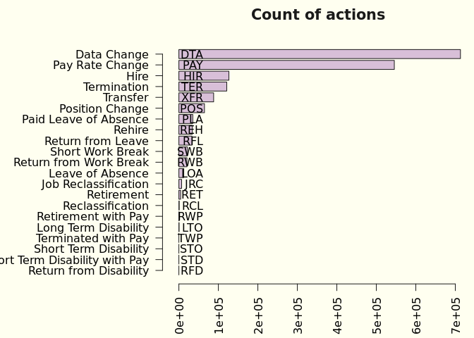<!-- -->

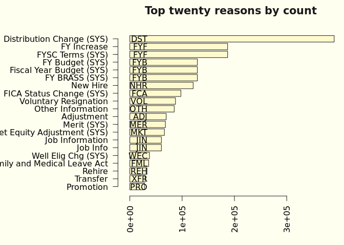<!-- -->

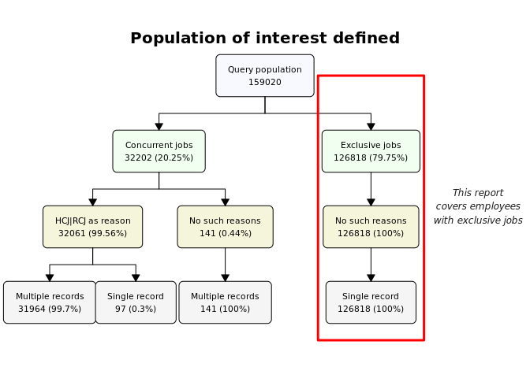<!-- -->

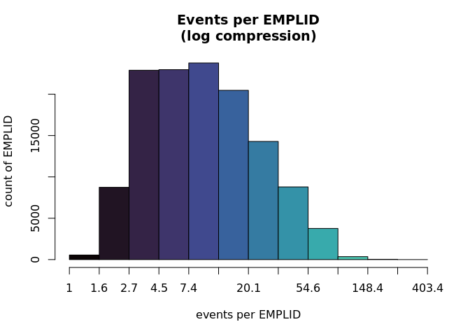<!-- -->

<!-- -->

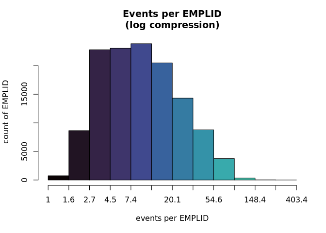<!-- -->

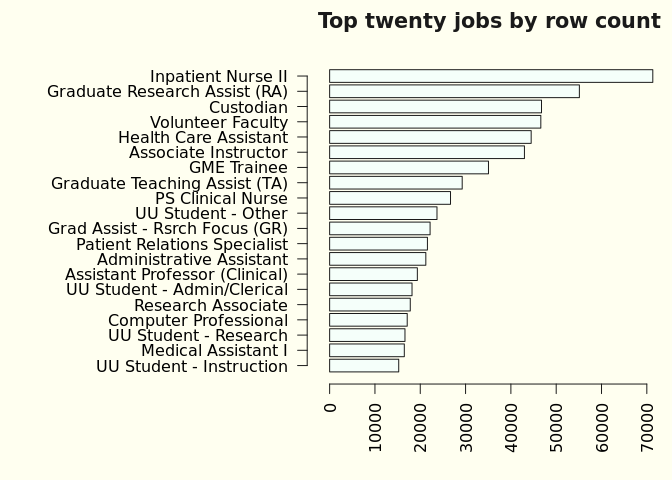<!-- -->

### Count of actions per date

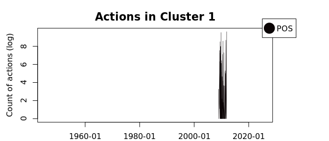<!-- -->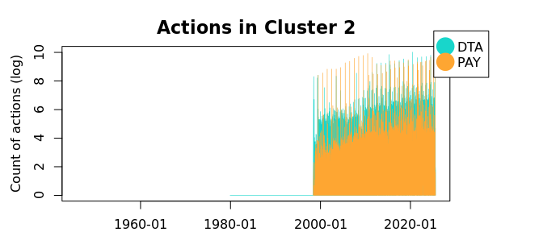<!-- -->

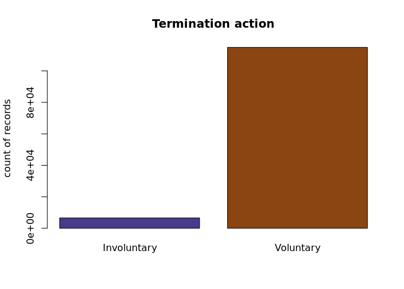<!-- -->

### Seasonality

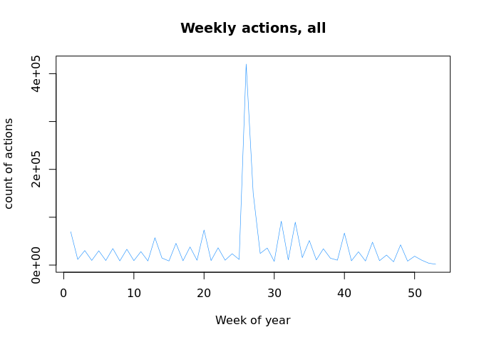<!-- -->

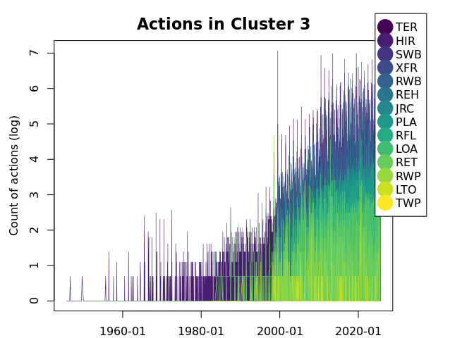<!-- -->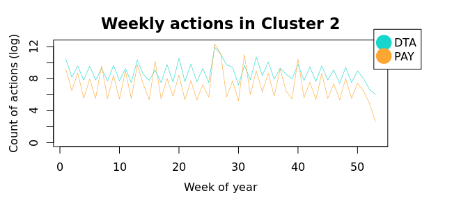<!-- -->

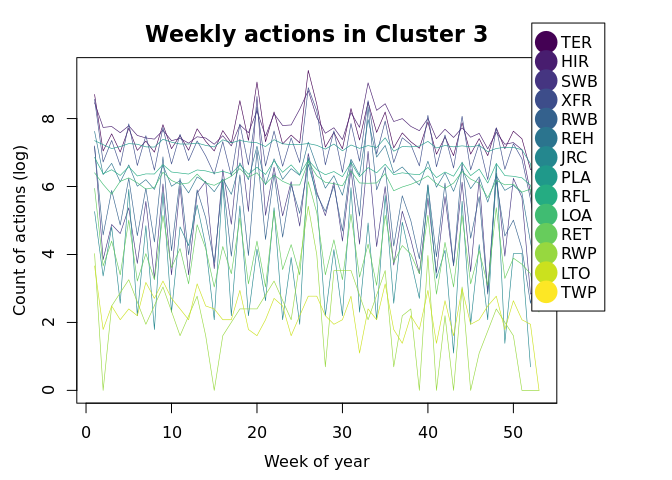<!-- -->

### Tables

<table class="table" style="color: black; width: auto !important; margin-left: auto; margin-right: auto;">
<caption>Actions and unique associated reasons</caption>
 <thead>
  <tr>
   <th style="text-align:left;">  </th>
   <th style="text-align:left;"> description </th>
   <th style="text-align:right;"> count </th>
   <th style="text-align:right;"> unique
reasons </th>
  </tr>
 </thead>
<tbody>
  <tr>
   <td style="text-align:left;"> DTA </td>
   <td style="text-align:left;"> Data Change </td>
   <td style="text-align:right;"> 713031 </td>
   <td style="text-align:right;"> 19 </td>
  </tr>
  <tr>
   <td style="text-align:left;"> HIR </td>
   <td style="text-align:left;"> Hire </td>
   <td style="text-align:right;"> 126662 </td>
   <td style="text-align:right;"> 3 </td>
  </tr>
  <tr>
   <td style="text-align:left;"> JRC </td>
   <td style="text-align:left;"> Job Reclassification </td>
   <td style="text-align:right;"> 6950 </td>
   <td style="text-align:right;"> 6 </td>
  </tr>
  <tr>
   <td style="text-align:left;"> LOA </td>
   <td style="text-align:left;"> Leave of Absence </td>
   <td style="text-align:right;"> 12425 </td>
   <td style="text-align:right;"> 17 </td>
  </tr>
  <tr>
   <td style="text-align:left;"> LTO </td>
   <td style="text-align:left;"> Long Term Disability </td>
   <td style="text-align:right;"> 607 </td>
   <td style="text-align:right;"> 2 </td>
  </tr>
  <tr>
   <td style="text-align:left;"> PAY </td>
   <td style="text-align:left;"> Pay Rate Change </td>
   <td style="text-align:right;"> 545548 </td>
   <td style="text-align:right;"> 19 </td>
  </tr>
  <tr>
   <td style="text-align:left;"> PLA </td>
   <td style="text-align:left;"> Paid Leave of Absence </td>
   <td style="text-align:right;"> 35283 </td>
   <td style="text-align:right;"> 20 </td>
  </tr>
  <tr>
   <td style="text-align:left;"> POS </td>
   <td style="text-align:left;"> Position Change </td>
   <td style="text-align:right;"> 64796 </td>
   <td style="text-align:right;"> 3 </td>
  </tr>
  <tr>
   <td style="text-align:left;"> RCL </td>
   <td style="text-align:left;"> Reclassification </td>
   <td style="text-align:right;"> 939 </td>
   <td style="text-align:right;"> 5 </td>
  </tr>
  <tr>
   <td style="text-align:left;"> REH </td>
   <td style="text-align:left;"> Rehire </td>
   <td style="text-align:right;"> 34000 </td>
   <td style="text-align:right;"> 4 </td>
  </tr>
  <tr>
   <td style="text-align:left;"> RET </td>
   <td style="text-align:left;"> Retirement </td>
   <td style="text-align:right;"> 4430 </td>
   <td style="text-align:right;"> 6 </td>
  </tr>
  <tr>
   <td style="text-align:left;"> RFD </td>
   <td style="text-align:left;"> Return from Disability </td>
   <td style="text-align:right;"> 1 </td>
   <td style="text-align:right;"> 1 </td>
  </tr>
  <tr>
   <td style="text-align:left;"> RFL </td>
   <td style="text-align:left;"> Return from Leave </td>
   <td style="text-align:right;"> 33223 </td>
   <td style="text-align:right;"> 3 </td>
  </tr>
  <tr>
   <td style="text-align:left;"> RWB </td>
   <td style="text-align:left;"> Return from Work Break </td>
   <td style="text-align:right;"> 20524 </td>
   <td style="text-align:right;"> 1 </td>
  </tr>
  <tr>
   <td style="text-align:left;"> RWP </td>
   <td style="text-align:left;"> Retirement with Pay </td>
   <td style="text-align:right;"> 732 </td>
   <td style="text-align:right;"> 3 </td>
  </tr>
  <tr>
   <td style="text-align:left;"> STD </td>
   <td style="text-align:left;"> Short Term Disability with Pay </td>
   <td style="text-align:right;"> 1 </td>
   <td style="text-align:right;"> 1 </td>
  </tr>
  <tr>
   <td style="text-align:left;"> STO </td>
   <td style="text-align:left;"> Short Term Disability </td>
   <td style="text-align:right;"> 1 </td>
   <td style="text-align:right;"> 1 </td>
  </tr>
  <tr>
   <td style="text-align:left;"> SWB </td>
   <td style="text-align:left;"> Short Work Break </td>
   <td style="text-align:right;"> 21844 </td>
   <td style="text-align:right;"> 3 </td>
  </tr>
  <tr>
   <td style="text-align:left;"> TER </td>
   <td style="text-align:left;"> Termination </td>
   <td style="text-align:right;"> 121242 </td>
   <td style="text-align:right;"> 46 </td>
  </tr>
  <tr>
   <td style="text-align:left;"> TWP </td>
   <td style="text-align:left;"> Terminated with Pay </td>
   <td style="text-align:right;"> 1 </td>
   <td style="text-align:right;"> 1 </td>
  </tr>
  <tr>
   <td style="text-align:left;"> XFR </td>
   <td style="text-align:left;"> Transfer </td>
   <td style="text-align:right;"> 88031 </td>
   <td style="text-align:right;"> 12 </td>
  </tr>
</tbody>
</table>

<table class="table" style="color: black; width: auto !important; margin-left: auto; margin-right: auto;">
<caption>Action reasons</caption>
 <thead>
  <tr>
   <th style="text-align:left;position: sticky; top:0; background-color: #FFFFFF;">  </th>
   <th style="text-align:left;position: sticky; top:0; background-color: #FFFFFF;"> description </th>
   <th style="text-align:right;position: sticky; top:0; background-color: #FFFFFF;"> count </th>
  </tr>
 </thead>
<tbody>
  <tr>
   <td style="text-align:left;"> 30D </td>
   <td style="text-align:left;"> 30 Day </td>
   <td style="text-align:right;"> 132 </td>
  </tr>
  <tr>
   <td style="text-align:left;"> 90D </td>
   <td style="text-align:left;"> 90 Day </td>
   <td style="text-align:right;"> 46 </td>
  </tr>
  <tr>
   <td style="text-align:left;"> ACT </td>
   <td style="text-align:left;"> Temporary Classification/Asn </td>
   <td style="text-align:right;"> 5 </td>
  </tr>
  <tr>
   <td style="text-align:left;"> ADJ </td>
   <td style="text-align:left;"> Adjustment </td>
   <td style="text-align:right;"> 69534 </td>
  </tr>
  <tr>
   <td style="text-align:left;"> AML </td>
   <td style="text-align:left;"> Administrative Leave </td>
   <td style="text-align:right;"> 113 </td>
  </tr>
  <tr>
   <td style="text-align:left;"> ASN </td>
   <td style="text-align:left;"> Rehire New/Continuing Assignmt </td>
   <td style="text-align:right;"> 6758 </td>
  </tr>
  <tr>
   <td style="text-align:left;"> ASN </td>
   <td style="text-align:left;"> Termination of Assignment </td>
   <td style="text-align:right;"> 6758 </td>
  </tr>
  <tr>
   <td style="text-align:left;"> BAC </td>
   <td style="text-align:left;"> BA Conversion (SYS) </td>
   <td style="text-align:right;"> 18511 </td>
  </tr>
  <tr>
   <td style="text-align:left;"> BEC </td>
   <td style="text-align:left;"> Ben Elig Change (SYS) </td>
   <td style="text-align:right;"> 16586 </td>
  </tr>
  <tr>
   <td style="text-align:left;"> BNK </td>
   <td style="text-align:left;"> Employer Bankruptcy </td>
   <td style="text-align:right;"> 1 </td>
  </tr>
  <tr>
   <td style="text-align:left;"> CDP </td>
   <td style="text-align:left;"> Correction-Department </td>
   <td style="text-align:right;"> 5286 </td>
  </tr>
  <tr>
   <td style="text-align:left;"> CJC </td>
   <td style="text-align:left;"> Correction-Job Code </td>
   <td style="text-align:right;"> 762 </td>
  </tr>
  <tr>
   <td style="text-align:left;"> CMP </td>
   <td style="text-align:left;"> Compensation Initiated </td>
   <td style="text-align:right;"> 1 </td>
  </tr>
  <tr>
   <td style="text-align:left;"> CNT </td>
   <td style="text-align:left;"> Contract (SYS) </td>
   <td style="text-align:right;"> 524 </td>
  </tr>
  <tr>
   <td style="text-align:left;"> CNV </td>
   <td style="text-align:left;"> Conversion Data Change </td>
   <td style="text-align:right;"> 10045 </td>
  </tr>
  <tr>
   <td style="text-align:left;"> CNV </td>
   <td style="text-align:left;"> Conversion </td>
   <td style="text-align:right;"> 10045 </td>
  </tr>
  <tr>
   <td style="text-align:left;"> COR </td>
   <td style="text-align:left;"> Data Correction </td>
   <td style="text-align:right;"> 381 </td>
  </tr>
  <tr>
   <td style="text-align:left;"> COV </td>
   <td style="text-align:left;"> COVID-19 </td>
   <td style="text-align:right;"> 675 </td>
  </tr>
  <tr>
   <td style="text-align:left;"> CPR </td>
   <td style="text-align:left;"> Correction-Pay Rate </td>
   <td style="text-align:right;"> 56 </td>
  </tr>
  <tr>
   <td style="text-align:left;"> CRP </td>
   <td style="text-align:left;"> Duplicate EE Record </td>
   <td style="text-align:right;"> 74 </td>
  </tr>
  <tr>
   <td style="text-align:left;"> CTC </td>
   <td style="text-align:left;"> Contract Change </td>
   <td style="text-align:right;"> 76 </td>
  </tr>
  <tr>
   <td style="text-align:left;"> DEA </td>
   <td style="text-align:left;"> Death </td>
   <td style="text-align:right;"> 924 </td>
  </tr>
  <tr>
   <td style="text-align:left;"> DEM </td>
   <td style="text-align:left;"> Demotion </td>
   <td style="text-align:right;"> 25 </td>
  </tr>
  <tr>
   <td style="text-align:left;"> DEV </td>
   <td style="text-align:left;"> Development Opportunities </td>
   <td style="text-align:right;"> 76 </td>
  </tr>
  <tr>
   <td style="text-align:left;"> DST </td>
   <td style="text-align:left;"> Distribution Change (SYS) </td>
   <td style="text-align:right;"> 390750 </td>
  </tr>
  <tr>
   <td style="text-align:left;"> EAC </td>
   <td style="text-align:left;"> End Employment Agreement </td>
   <td style="text-align:right;"> 238 </td>
  </tr>
  <tr>
   <td style="text-align:left;"> ECI </td>
   <td style="text-align:left;"> End Concurrent Job Involuntary </td>
   <td style="text-align:right;"> 1 </td>
  </tr>
  <tr>
   <td style="text-align:left;"> ECV </td>
   <td style="text-align:left;"> End Concurrent Job Voluntary </td>
   <td style="text-align:right;"> 8 </td>
  </tr>
  <tr>
   <td style="text-align:left;"> EDU </td>
   <td style="text-align:left;"> Education </td>
   <td style="text-align:right;"> 3 </td>
  </tr>
  <tr>
   <td style="text-align:left;"> EES </td>
   <td style="text-align:left;"> Fellow Employee </td>
   <td style="text-align:right;"> 4 </td>
  </tr>
  <tr>
   <td style="text-align:left;"> EFT </td>
   <td style="text-align:left;"> End of Fixed-Term Contract </td>
   <td style="text-align:right;"> 171 </td>
  </tr>
  <tr>
   <td style="text-align:left;"> EMT </td>
   <td style="text-align:left;"> Emeritus </td>
   <td style="text-align:right;"> 315 </td>
  </tr>
  <tr>
   <td style="text-align:left;"> END </td>
   <td style="text-align:left;"> End of Temporary Class/Asn </td>
   <td style="text-align:right;"> 1 </td>
  </tr>
  <tr>
   <td style="text-align:left;"> ERT </td>
   <td style="text-align:left;"> Early Retirement </td>
   <td style="text-align:right;"> 618 </td>
  </tr>
  <tr>
   <td style="text-align:left;"> EVW </td>
   <td style="text-align:left;"> E-Verify Withdrawal </td>
   <td style="text-align:right;"> 13 </td>
  </tr>
  <tr>
   <td style="text-align:left;"> EXT </td>
   <td style="text-align:left;"> Extension </td>
   <td style="text-align:right;"> 1799 </td>
  </tr>
  <tr>
   <td style="text-align:left;"> FAM </td>
   <td style="text-align:left;"> Family Reasons </td>
   <td style="text-align:right;"> 128 </td>
  </tr>
  <tr>
   <td style="text-align:left;"> FCA </td>
   <td style="text-align:left;"> FICA Status Change (SYS) </td>
   <td style="text-align:right;"> 97604 </td>
  </tr>
  <tr>
   <td style="text-align:left;"> FIX </td>
   <td style="text-align:left;"> Kronos with no Budget Row </td>
   <td style="text-align:right;"> 6 </td>
  </tr>
  <tr>
   <td style="text-align:left;"> FLS </td>
   <td style="text-align:left;"> Pay Adj - FLSA Reg(SYS) </td>
   <td style="text-align:right;"> 314 </td>
  </tr>
  <tr>
   <td style="text-align:left;"> FML </td>
   <td style="text-align:left;"> Family and Medical Leave Act </td>
   <td style="text-align:right;"> 36132 </td>
  </tr>
  <tr>
   <td style="text-align:left;"> FTE </td>
   <td style="text-align:left;"> FTE Change </td>
   <td style="text-align:right;"> 5407 </td>
  </tr>
  <tr>
   <td style="text-align:left;"> FUR </td>
   <td style="text-align:left;"> Furlough </td>
   <td style="text-align:right;"> 391 </td>
  </tr>
  <tr>
   <td style="text-align:left;"> FYA </td>
   <td style="text-align:left;"> FYSC Auto Term (SYS) </td>
   <td style="text-align:right;"> 39 </td>
  </tr>
  <tr>
   <td style="text-align:left;"> FYB </td>
   <td style="text-align:left;"> FY Budget (SYS) </td>
   <td style="text-align:right;"> 129220 </td>
  </tr>
  <tr>
   <td style="text-align:left;"> FYB </td>
   <td style="text-align:left;"> Fiscal Year Budget (SYS) </td>
   <td style="text-align:right;"> 129220 </td>
  </tr>
  <tr>
   <td style="text-align:left;"> FYB </td>
   <td style="text-align:left;"> FY BRASS (SYS) </td>
   <td style="text-align:right;"> 129220 </td>
  </tr>
  <tr>
   <td style="text-align:left;"> FYF </td>
   <td style="text-align:left;"> FY Increase </td>
   <td style="text-align:right;"> 187044 </td>
  </tr>
  <tr>
   <td style="text-align:left;"> FYF </td>
   <td style="text-align:left;"> FYSC Terms (SYS) </td>
   <td style="text-align:right;"> 187044 </td>
  </tr>
  <tr>
   <td style="text-align:left;"> FYH </td>
   <td style="text-align:left;"> FY Hourly </td>
   <td style="text-align:right;"> 1231 </td>
  </tr>
  <tr>
   <td style="text-align:left;"> FYR </td>
   <td style="text-align:left;"> FY Raise </td>
   <td style="text-align:right;"> 10833 </td>
  </tr>
  <tr>
   <td style="text-align:left;"> FYS </td>
   <td style="text-align:left;"> FY Salary Change Service Team </td>
   <td style="text-align:right;"> 47 </td>
  </tr>
  <tr>
   <td style="text-align:left;"> FYS </td>
   <td style="text-align:left;"> FYSC Summer Term (SYS) </td>
   <td style="text-align:right;"> 47 </td>
  </tr>
  <tr>
   <td style="text-align:left;"> FYW </td>
   <td style="text-align:left;"> Fiscal Year Workstudy </td>
   <td style="text-align:right;"> 6 </td>
  </tr>
  <tr>
   <td style="text-align:left;"> H2U </td>
   <td style="text-align:left;"> Hospital to University </td>
   <td style="text-align:right;"> 990 </td>
  </tr>
  <tr>
   <td style="text-align:left;"> HEA </td>
   <td style="text-align:left;"> Medical LOA Option B </td>
   <td style="text-align:right;"> 824 </td>
  </tr>
  <tr>
   <td style="text-align:left;"> HEA </td>
   <td style="text-align:left;"> Medical(Not protected by FMLA) </td>
   <td style="text-align:right;"> 824 </td>
  </tr>
  <tr>
   <td style="text-align:left;"> HRS </td>
   <td style="text-align:left;"> Hours </td>
   <td style="text-align:right;"> 17 </td>
  </tr>
  <tr>
   <td style="text-align:left;"> HTH </td>
   <td style="text-align:left;"> Health-Related Issues </td>
   <td style="text-align:right;"> 46 </td>
  </tr>
  <tr>
   <td style="text-align:left;"> I9 </td>
   <td style="text-align:left;"> Failure to Meet I9 </td>
   <td style="text-align:right;"> 203 </td>
  </tr>
  <tr>
   <td style="text-align:left;"> ICR </td>
   <td style="text-align:left;"> Detach from Incorrect ID </td>
   <td style="text-align:right;"> 18 </td>
  </tr>
  <tr>
   <td style="text-align:left;"> IDT </td>
   <td style="text-align:left;"> Involuntary Demotion Transfer </td>
   <td style="text-align:right;"> 10 </td>
  </tr>
  <tr>
   <td style="text-align:left;"> INT </td>
   <td style="text-align:left;"> Interim Pay </td>
   <td style="text-align:right;"> 1071 </td>
  </tr>
  <tr>
   <td style="text-align:left;"> INT </td>
   <td style="text-align:left;"> Internal Recruitment </td>
   <td style="text-align:right;"> 1071 </td>
  </tr>
  <tr>
   <td style="text-align:left;"> INV </td>
   <td style="text-align:left;"> Involuntary Dismissal </td>
   <td style="text-align:right;"> 1428 </td>
  </tr>
  <tr>
   <td style="text-align:left;"> JCC </td>
   <td style="text-align:left;"> Job Code Consolidation </td>
   <td style="text-align:right;"> 2291 </td>
  </tr>
  <tr>
   <td style="text-align:left;"> JIN </td>
   <td style="text-align:left;"> Job Information </td>
   <td style="text-align:right;"> 60417 </td>
  </tr>
  <tr>
   <td style="text-align:left;"> JIN </td>
   <td style="text-align:left;"> Job Info </td>
   <td style="text-align:right;"> 60417 </td>
  </tr>
  <tr>
   <td style="text-align:left;"> JOB </td>
   <td style="text-align:left;"> Separation/Job Abandonment </td>
   <td style="text-align:right;"> 404 </td>
  </tr>
  <tr>
   <td style="text-align:left;"> JRC </td>
   <td style="text-align:left;"> Job Reclassification </td>
   <td style="text-align:right;"> 6127 </td>
  </tr>
  <tr>
   <td style="text-align:left;"> LAT </td>
   <td style="text-align:left;"> Lateral </td>
   <td style="text-align:right;"> 24245 </td>
  </tr>
  <tr>
   <td style="text-align:left;"> LAT </td>
   <td style="text-align:left;"> Lateral Transfer </td>
   <td style="text-align:right;"> 24245 </td>
  </tr>
  <tr>
   <td style="text-align:left;"> LOA </td>
   <td style="text-align:left;"> LOA Without Pay </td>
   <td style="text-align:right;"> 2145 </td>
  </tr>
  <tr>
   <td style="text-align:left;"> LOC </td>
   <td style="text-align:left;"> Location </td>
   <td style="text-align:right;"> 58 </td>
  </tr>
  <tr>
   <td style="text-align:left;"> LTD </td>
   <td style="text-align:left;"> Long Term Disability </td>
   <td style="text-align:right;"> 445 </td>
  </tr>
  <tr>
   <td style="text-align:left;"> LTD </td>
   <td style="text-align:left;"> LTD w/o Ben </td>
   <td style="text-align:right;"> 445 </td>
  </tr>
  <tr>
   <td style="text-align:left;"> LTD </td>
   <td style="text-align:left;"> Long-Term Disability </td>
   <td style="text-align:right;"> 445 </td>
  </tr>
  <tr>
   <td style="text-align:left;"> LTO </td>
   <td style="text-align:left;"> Long Term Disability </td>
   <td style="text-align:right;"> 525 </td>
  </tr>
  <tr>
   <td style="text-align:left;"> LWF </td>
   <td style="text-align:left;"> Leaving the Workforce </td>
   <td style="text-align:right;"> 104 </td>
  </tr>
  <tr>
   <td style="text-align:left;"> MAT </td>
   <td style="text-align:left;"> Maternity/Paternity </td>
   <td style="text-align:right;"> 34 </td>
  </tr>
  <tr>
   <td style="text-align:left;"> MER </td>
   <td style="text-align:left;"> Merit (SYS) </td>
   <td style="text-align:right;"> 68060 </td>
  </tr>
  <tr>
   <td style="text-align:left;"> MIL </td>
   <td style="text-align:left;"> Military Service </td>
   <td style="text-align:right;"> 914 </td>
  </tr>
  <tr>
   <td style="text-align:left;"> MKT </td>
   <td style="text-align:left;"> Market Equity Adjustment (SYS) </td>
   <td style="text-align:right;"> 66176 </td>
  </tr>
  <tr>
   <td style="text-align:left;"> MLA </td>
   <td style="text-align:left;"> Medical Leave of Absence Opt A </td>
   <td style="text-align:right;"> 2822 </td>
  </tr>
  <tr>
   <td style="text-align:left;"> MLB </td>
   <td style="text-align:left;"> Medical Leave of Absence Opt B </td>
   <td style="text-align:right;"> 553 </td>
  </tr>
  <tr>
   <td style="text-align:left;"> NDR </td>
   <td style="text-align:left;"> No Distribution </td>
   <td style="text-align:right;"> 3 </td>
  </tr>
  <tr>
   <td style="text-align:left;"> NER </td>
   <td style="text-align:left;"> Not Eligible for Rehire </td>
   <td style="text-align:right;"> 396 </td>
  </tr>
  <tr>
   <td style="text-align:left;"> NEW </td>
   <td style="text-align:left;"> New Position </td>
   <td style="text-align:right;"> 18635 </td>
  </tr>
  <tr>
   <td style="text-align:left;"> NHR </td>
   <td style="text-align:left;"> New Hire </td>
   <td style="text-align:right;"> 121120 </td>
  </tr>
  <tr>
   <td style="text-align:left;"> NRA </td>
   <td style="text-align:left;"> Non-Resident Alien </td>
   <td style="text-align:right;"> 15 </td>
  </tr>
  <tr>
   <td style="text-align:left;"> NRC </td>
   <td style="text-align:left;"> Non Renewal of Contract </td>
   <td style="text-align:right;"> 844 </td>
  </tr>
  <tr>
   <td style="text-align:left;"> OCN </td>
   <td style="text-align:left;"> Other Controllable </td>
   <td style="text-align:right;"> 97 </td>
  </tr>
  <tr>
   <td style="text-align:left;"> OTH </td>
   <td style="text-align:left;"> Other Information </td>
   <td style="text-align:right;"> 84893 </td>
  </tr>
  <tr>
   <td style="text-align:left;"> OUC </td>
   <td style="text-align:left;"> Other Uncontrollable </td>
   <td style="text-align:right;"> 271 </td>
  </tr>
  <tr>
   <td style="text-align:left;"> PAR </td>
   <td style="text-align:left;"> Parental Leave </td>
   <td style="text-align:right;"> 67 </td>
  </tr>
  <tr>
   <td style="text-align:left;"> PAY </td>
   <td style="text-align:left;"> Pay Rate Change </td>
   <td style="text-align:right;"> 34 </td>
  </tr>
  <tr>
   <td style="text-align:left;"> PAY </td>
   <td style="text-align:left;"> Compensation </td>
   <td style="text-align:right;"> 34 </td>
  </tr>
  <tr>
   <td style="text-align:left;"> PDU </td>
   <td style="text-align:left;"> Position Data Update </td>
   <td style="text-align:right;"> 25384 </td>
  </tr>
  <tr>
   <td style="text-align:left;"> PHS </td>
   <td style="text-align:left;"> Phased Retirement </td>
   <td style="text-align:right;"> 56 </td>
  </tr>
  <tr>
   <td style="text-align:left;"> PLA </td>
   <td style="text-align:left;"> Paid LOA </td>
   <td style="text-align:right;"> 744 </td>
  </tr>
  <tr>
   <td style="text-align:left;"> PRM </td>
   <td style="text-align:left;"> Promotion Opportunities </td>
   <td style="text-align:right;"> 34 </td>
  </tr>
  <tr>
   <td style="text-align:left;"> PRO </td>
   <td style="text-align:left;"> Promotion </td>
   <td style="text-align:right;"> 28145 </td>
  </tr>
  <tr>
   <td style="text-align:left;"> PSB </td>
   <td style="text-align:left;"> Paid Sabbatical Leave </td>
   <td style="text-align:right;"> 15 </td>
  </tr>
  <tr>
   <td style="text-align:left;"> RCJ </td>
   <td style="text-align:left;"> Rehire Concurrent Job </td>
   <td style="text-align:right;"> 91 </td>
  </tr>
  <tr>
   <td style="text-align:left;"> REC </td>
   <td style="text-align:left;"> Job Reclassification </td>
   <td style="text-align:right;"> 6492 </td>
  </tr>
  <tr>
   <td style="text-align:left;"> REH </td>
   <td style="text-align:left;"> Rehire </td>
   <td style="text-align:right;"> 32813 </td>
  </tr>
  <tr>
   <td style="text-align:left;"> REL </td>
   <td style="text-align:left;"> Relocation </td>
   <td style="text-align:right;"> 159 </td>
  </tr>
  <tr>
   <td style="text-align:left;"> RET </td>
   <td style="text-align:left;"> Return to School </td>
   <td style="text-align:right;"> 3990 </td>
  </tr>
  <tr>
   <td style="text-align:left;"> RET </td>
   <td style="text-align:left;"> Regular Retirement </td>
   <td style="text-align:right;"> 3990 </td>
  </tr>
  <tr>
   <td style="text-align:left;"> RFD </td>
   <td style="text-align:left;"> Return From Disability </td>
   <td style="text-align:right;"> 1 </td>
  </tr>
  <tr>
   <td style="text-align:left;"> RFL </td>
   <td style="text-align:left;"> Return From Leave </td>
   <td style="text-align:right;"> 25601 </td>
  </tr>
  <tr>
   <td style="text-align:left;"> RFN </td>
   <td style="text-align:left;"> RIF/NER </td>
   <td style="text-align:right;"> 1 </td>
  </tr>
  <tr>
   <td style="text-align:left;"> RIF </td>
   <td style="text-align:left;"> Reduction in Force </td>
   <td style="text-align:right;"> 1482 </td>
  </tr>
  <tr>
   <td style="text-align:left;"> RLS </td>
   <td style="text-align:left;"> Release from Probation </td>
   <td style="text-align:right;"> 3015 </td>
  </tr>
  <tr>
   <td style="text-align:left;"> RNB </td>
   <td style="text-align:left;"> Retired - No Benefits </td>
   <td style="text-align:right;"> 177 </td>
  </tr>
  <tr>
   <td style="text-align:left;"> ROR </td>
   <td style="text-align:left;"> Reorganization </td>
   <td style="text-align:right;"> 5092 </td>
  </tr>
  <tr>
   <td style="text-align:left;"> RPL </td>
   <td style="text-align:left;"> Return from Paid Leave </td>
   <td style="text-align:right;"> 7607 </td>
  </tr>
  <tr>
   <td style="text-align:left;"> RWB </td>
   <td style="text-align:left;"> Return from Work Break </td>
   <td style="text-align:right;"> 20524 </td>
  </tr>
  <tr>
   <td style="text-align:left;"> RWP </td>
   <td style="text-align:left;"> Retirement With Pay </td>
   <td style="text-align:right;"> 3 </td>
  </tr>
  <tr>
   <td style="text-align:left;"> SAB </td>
   <td style="text-align:left;"> Sabbatical Leave </td>
   <td style="text-align:right;"> 25 </td>
  </tr>
  <tr>
   <td style="text-align:left;"> SEP </td>
   <td style="text-align:left;"> Separation Other </td>
   <td style="text-align:right;"> 117 </td>
  </tr>
  <tr>
   <td style="text-align:left;"> SMR </td>
   <td style="text-align:left;"> Summer Assignment </td>
   <td style="text-align:right;"> 2 </td>
  </tr>
  <tr>
   <td style="text-align:left;"> SRP </td>
   <td style="text-align:left;"> Special Retirement Plan </td>
   <td style="text-align:right;"> 184 </td>
  </tr>
  <tr>
   <td style="text-align:left;"> STA </td>
   <td style="text-align:left;"> Position Status Change </td>
   <td style="text-align:right;"> 20777 </td>
  </tr>
  <tr>
   <td style="text-align:left;"> STD </td>
   <td style="text-align:left;"> Short-Term Disability </td>
   <td style="text-align:right;"> 18 </td>
  </tr>
  <tr>
   <td style="text-align:left;"> STD </td>
   <td style="text-align:left;"> STD With Pay </td>
   <td style="text-align:right;"> 18 </td>
  </tr>
  <tr>
   <td style="text-align:left;"> STO </td>
   <td style="text-align:left;"> Short Term Disability </td>
   <td style="text-align:right;"> 1 </td>
  </tr>
  <tr>
   <td style="text-align:left;"> SWB </td>
   <td style="text-align:left;"> Short Work Break </td>
   <td style="text-align:right;"> 21334 </td>
  </tr>
  <tr>
   <td style="text-align:left;"> TEP </td>
   <td style="text-align:left;"> Temp to Temp Job Change </td>
   <td style="text-align:right;"> 1 </td>
  </tr>
  <tr>
   <td style="text-align:left;"> TMP </td>
   <td style="text-align:left;"> Temp Pay Rate Change </td>
   <td style="text-align:right;"> 10914 </td>
  </tr>
  <tr>
   <td style="text-align:left;"> TMP </td>
   <td style="text-align:left;"> End PT/Non-BenefitsEmployment </td>
   <td style="text-align:right;"> 10914 </td>
  </tr>
  <tr>
   <td style="text-align:left;"> TRN </td>
   <td style="text-align:left;"> Trainee </td>
   <td style="text-align:right;"> 1 </td>
  </tr>
  <tr>
   <td style="text-align:left;"> TWP </td>
   <td style="text-align:left;"> Termination With Pay </td>
   <td style="text-align:right;"> 1 </td>
  </tr>
  <tr>
   <td style="text-align:left;"> TYP </td>
   <td style="text-align:left;"> Type of Work </td>
   <td style="text-align:right;"> 34 </td>
  </tr>
  <tr>
   <td style="text-align:left;"> U2H </td>
   <td style="text-align:left;"> Voluntary Xfr to Hospital </td>
   <td style="text-align:right;"> 73 </td>
  </tr>
  <tr>
   <td style="text-align:left;"> UNS </td>
   <td style="text-align:left;"> Separation/Unavailability </td>
   <td style="text-align:right;"> 336 </td>
  </tr>
  <tr>
   <td style="text-align:left;"> UPD </td>
   <td style="text-align:left;"> Transfer to UPD paygroup </td>
   <td style="text-align:right;"> 1 </td>
  </tr>
  <tr>
   <td style="text-align:left;"> VDT </td>
   <td style="text-align:left;"> Voluntary Demotion </td>
   <td style="text-align:right;"> 502 </td>
  </tr>
  <tr>
   <td style="text-align:left;"> VDT </td>
   <td style="text-align:left;"> Voluntary Demotion Transfer </td>
   <td style="text-align:right;"> 502 </td>
  </tr>
  <tr>
   <td style="text-align:left;"> VMA </td>
   <td style="text-align:left;"> Voluntary by Mutual Agreement </td>
   <td style="text-align:right;"> 75 </td>
  </tr>
  <tr>
   <td style="text-align:left;"> VOL </td>
   <td style="text-align:left;"> Voluntary Resignation </td>
   <td style="text-align:right;"> 87328 </td>
  </tr>
  <tr>
   <td style="text-align:left;"> WC </td>
   <td style="text-align:left;"> Worker's Comp-Leave Supplement </td>
   <td style="text-align:right;"> 559 </td>
  </tr>
  <tr>
   <td style="text-align:left;"> WC </td>
   <td style="text-align:left;"> Workers Compensation Leave </td>
   <td style="text-align:right;"> 559 </td>
  </tr>
  <tr>
   <td style="text-align:left;"> WEC </td>
   <td style="text-align:left;"> Well Elig Chg (SYS) </td>
   <td style="text-align:right;"> 37578 </td>
  </tr>
  <tr>
   <td style="text-align:left;"> WOR </td>
   <td style="text-align:left;"> Work Conditions or Environment </td>
   <td style="text-align:right;"> 9 </td>
  </tr>
  <tr>
   <td style="text-align:left;"> WPA </td>
   <td style="text-align:left;"> Workplace Accomodations </td>
   <td style="text-align:right;"> 339 </td>
  </tr>
  <tr>
   <td style="text-align:left;"> XFR </td>
   <td style="text-align:left;"> Transfer </td>
   <td style="text-align:right;"> 29419 </td>
  </tr>
  <tr>
   <td style="text-align:left;"> XYD </td>
   <td style="text-align:left;"> Faculty Term Data Dump </td>
   <td style="text-align:right;"> 1 </td>
  </tr>
</tbody>
</table>

<table class="table" style="color: black; width: auto !important; margin-left: auto; margin-right: auto;">
<caption>Actions and reasons</caption>
 <thead>
  <tr>
   <th style="text-align:left;position: sticky; top:0; background-color: #FFFFFF;">  </th>
   <th style="text-align:left;position: sticky; top:0; background-color: #FFFFFF;"> action </th>
   <th style="text-align:left;position: sticky; top:0; background-color: #FFFFFF;"> reason </th>
   <th style="text-align:left;position: sticky; top:0; background-color: #FFFFFF;"> description </th>
   <th style="text-align:right;position: sticky; top:0; background-color: #FFFFFF;"> count </th>
  </tr>
 </thead>
<tbody>
  <tr>
   <td style="text-align:left;"> DTA </td>
   <td style="text-align:left;"> Data Change </td>
   <td style="text-align:left;"> BAC </td>
   <td style="text-align:left;"> BA Conversion (SYS) </td>
   <td style="text-align:right;"> 18511 </td>
  </tr>
  <tr>
   <td style="text-align:left;"> DTA </td>
   <td style="text-align:left;"> Data Change </td>
   <td style="text-align:left;"> BEC </td>
   <td style="text-align:left;"> Ben Elig Change (SYS) </td>
   <td style="text-align:right;"> 16586 </td>
  </tr>
  <tr>
   <td style="text-align:left;"> DTA </td>
   <td style="text-align:left;"> Data Change </td>
   <td style="text-align:left;"> CNT </td>
   <td style="text-align:left;"> Contract (SYS) </td>
   <td style="text-align:right;"> 524 </td>
  </tr>
  <tr>
   <td style="text-align:left;"> DTA </td>
   <td style="text-align:left;"> Data Change </td>
   <td style="text-align:left;"> CTC </td>
   <td style="text-align:left;"> Contract Change </td>
   <td style="text-align:right;"> 76 </td>
  </tr>
  <tr>
   <td style="text-align:left;"> DTA </td>
   <td style="text-align:left;"> Data Change </td>
   <td style="text-align:left;"> CNV </td>
   <td style="text-align:left;"> Conversion Data Change </td>
   <td style="text-align:right;"> 4504 </td>
  </tr>
  <tr>
   <td style="text-align:left;"> DTA </td>
   <td style="text-align:left;"> Data Change </td>
   <td style="text-align:left;"> CDP </td>
   <td style="text-align:left;"> Correction-Department </td>
   <td style="text-align:right;"> 5286 </td>
  </tr>
  <tr>
   <td style="text-align:left;"> DTA </td>
   <td style="text-align:left;"> Data Change </td>
   <td style="text-align:left;"> CJC </td>
   <td style="text-align:left;"> Correction-Job Code </td>
   <td style="text-align:right;"> 762 </td>
  </tr>
  <tr>
   <td style="text-align:left;"> DTA </td>
   <td style="text-align:left;"> Data Change </td>
   <td style="text-align:left;"> CPR </td>
   <td style="text-align:left;"> Correction-Pay Rate </td>
   <td style="text-align:right;"> 56 </td>
  </tr>
  <tr>
   <td style="text-align:left;"> DTA </td>
   <td style="text-align:left;"> Data Change </td>
   <td style="text-align:left;"> COR </td>
   <td style="text-align:left;"> Data Correction </td>
   <td style="text-align:right;"> 381 </td>
  </tr>
  <tr>
   <td style="text-align:left;"> DTA </td>
   <td style="text-align:left;"> Data Change </td>
   <td style="text-align:left;"> DST </td>
   <td style="text-align:left;"> Distribution Change (SYS) </td>
   <td style="text-align:right;"> 390750 </td>
  </tr>
  <tr>
   <td style="text-align:left;"> DTA </td>
   <td style="text-align:left;"> Data Change </td>
   <td style="text-align:left;"> FCA </td>
   <td style="text-align:left;"> FICA Status Change (SYS) </td>
   <td style="text-align:right;"> 97604 </td>
  </tr>
  <tr>
   <td style="text-align:left;"> DTA </td>
   <td style="text-align:left;"> Data Change </td>
   <td style="text-align:left;"> FTE </td>
   <td style="text-align:left;"> FTE Change </td>
   <td style="text-align:right;"> 5187 </td>
  </tr>
  <tr>
   <td style="text-align:left;"> DTA </td>
   <td style="text-align:left;"> Data Change </td>
   <td style="text-align:left;"> JCC </td>
   <td style="text-align:left;"> Job Code Consolidation </td>
   <td style="text-align:right;"> 2291 </td>
  </tr>
  <tr>
   <td style="text-align:left;"> DTA </td>
   <td style="text-align:left;"> Data Change </td>
   <td style="text-align:left;"> JIN </td>
   <td style="text-align:left;"> Job Information </td>
   <td style="text-align:right;"> 47965 </td>
  </tr>
  <tr>
   <td style="text-align:left;"> DTA </td>
   <td style="text-align:left;"> Data Change </td>
   <td style="text-align:left;"> NRA </td>
   <td style="text-align:left;"> Non-Resident Alien </td>
   <td style="text-align:right;"> 15 </td>
  </tr>
  <tr>
   <td style="text-align:left;"> DTA </td>
   <td style="text-align:left;"> Data Change </td>
   <td style="text-align:left;"> OTH </td>
   <td style="text-align:left;"> Other Information </td>
   <td style="text-align:right;"> 84893 </td>
  </tr>
  <tr>
   <td style="text-align:left;"> DTA </td>
   <td style="text-align:left;"> Data Change </td>
   <td style="text-align:left;"> PHS </td>
   <td style="text-align:left;"> Phased Retirement </td>
   <td style="text-align:right;"> 56 </td>
  </tr>
  <tr>
   <td style="text-align:left;"> DTA </td>
   <td style="text-align:left;"> Data Change </td>
   <td style="text-align:left;"> SRP </td>
   <td style="text-align:left;"> Special Retirement Plan </td>
   <td style="text-align:right;"> 6 </td>
  </tr>
  <tr>
   <td style="text-align:left;"> DTA </td>
   <td style="text-align:left;"> Data Change </td>
   <td style="text-align:left;"> WEC </td>
   <td style="text-align:left;"> Well Elig Chg (SYS) </td>
   <td style="text-align:right;"> 37578 </td>
  </tr>
  <tr>
   <td style="text-align:left;"> HIR </td>
   <td style="text-align:left;"> Hire </td>
   <td style="text-align:left;"> CNV </td>
   <td style="text-align:left;"> Conversion </td>
   <td style="text-align:right;"> 5541 </td>
  </tr>
  <tr>
   <td style="text-align:left;"> HIR </td>
   <td style="text-align:left;"> Hire </td>
   <td style="text-align:left;"> NHR </td>
   <td style="text-align:left;"> New Hire </td>
   <td style="text-align:right;"> 121120 </td>
  </tr>
  <tr>
   <td style="text-align:left;"> HIR </td>
   <td style="text-align:left;"> Hire </td>
   <td style="text-align:left;"> TRN </td>
   <td style="text-align:left;"> Trainee </td>
   <td style="text-align:right;"> 1 </td>
  </tr>
  <tr>
   <td style="text-align:left;"> JRC </td>
   <td style="text-align:left;"> Job Reclassification </td>
   <td style="text-align:left;"> DEM </td>
   <td style="text-align:left;"> Demotion </td>
   <td style="text-align:right;"> 5 </td>
  </tr>
  <tr>
   <td style="text-align:left;"> JRC </td>
   <td style="text-align:left;"> Job Reclassification </td>
   <td style="text-align:left;"> FTE </td>
   <td style="text-align:left;"> FTE Change </td>
   <td style="text-align:right;"> 217 </td>
  </tr>
  <tr>
   <td style="text-align:left;"> JRC </td>
   <td style="text-align:left;"> Job Reclassification </td>
   <td style="text-align:left;"> JRC </td>
   <td style="text-align:left;"> Job Reclassification </td>
   <td style="text-align:right;"> 6122 </td>
  </tr>
  <tr>
   <td style="text-align:left;"> JRC </td>
   <td style="text-align:left;"> Job Reclassification </td>
   <td style="text-align:left;"> LAT </td>
   <td style="text-align:left;"> Lateral </td>
   <td style="text-align:right;"> 17 </td>
  </tr>
  <tr>
   <td style="text-align:left;"> JRC </td>
   <td style="text-align:left;"> Job Reclassification </td>
   <td style="text-align:left;"> PRO </td>
   <td style="text-align:left;"> Promotion </td>
   <td style="text-align:right;"> 585 </td>
  </tr>
  <tr>
   <td style="text-align:left;"> JRC </td>
   <td style="text-align:left;"> Job Reclassification </td>
   <td style="text-align:left;"> VDT </td>
   <td style="text-align:left;"> Voluntary Demotion </td>
   <td style="text-align:right;"> 4 </td>
  </tr>
  <tr>
   <td style="text-align:left;"> LOA </td>
   <td style="text-align:left;"> Leave of Absence </td>
   <td style="text-align:left;"> 30D </td>
   <td style="text-align:left;"> 30 Day </td>
   <td style="text-align:right;"> 105 </td>
  </tr>
  <tr>
   <td style="text-align:left;"> LOA </td>
   <td style="text-align:left;"> Leave of Absence </td>
   <td style="text-align:left;"> 90D </td>
   <td style="text-align:left;"> 90 Day </td>
   <td style="text-align:right;"> 34 </td>
  </tr>
  <tr>
   <td style="text-align:left;"> LOA </td>
   <td style="text-align:left;"> Leave of Absence </td>
   <td style="text-align:left;"> AML </td>
   <td style="text-align:left;"> Administrative Leave </td>
   <td style="text-align:right;"> 31 </td>
  </tr>
  <tr>
   <td style="text-align:left;"> LOA </td>
   <td style="text-align:left;"> Leave of Absence </td>
   <td style="text-align:left;"> COV </td>
   <td style="text-align:left;"> COVID-19 </td>
   <td style="text-align:right;"> 1 </td>
  </tr>
  <tr>
   <td style="text-align:left;"> LOA </td>
   <td style="text-align:left;"> Leave of Absence </td>
   <td style="text-align:left;"> EDU </td>
   <td style="text-align:left;"> Education </td>
   <td style="text-align:right;"> 3 </td>
  </tr>
  <tr>
   <td style="text-align:left;"> LOA </td>
   <td style="text-align:left;"> Leave of Absence </td>
   <td style="text-align:left;"> EXT </td>
   <td style="text-align:left;"> Extension </td>
   <td style="text-align:right;"> 958 </td>
  </tr>
  <tr>
   <td style="text-align:left;"> LOA </td>
   <td style="text-align:left;"> Leave of Absence </td>
   <td style="text-align:left;"> FML </td>
   <td style="text-align:left;"> Family and Medical Leave Act </td>
   <td style="text-align:right;"> 6457 </td>
  </tr>
  <tr>
   <td style="text-align:left;"> LOA </td>
   <td style="text-align:left;"> Leave of Absence </td>
   <td style="text-align:left;"> FUR </td>
   <td style="text-align:left;"> Furlough </td>
   <td style="text-align:right;"> 100 </td>
  </tr>
  <tr>
   <td style="text-align:left;"> LOA </td>
   <td style="text-align:left;"> Leave of Absence </td>
   <td style="text-align:left;"> LOA </td>
   <td style="text-align:left;"> LOA Without Pay </td>
   <td style="text-align:right;"> 2145 </td>
  </tr>
  <tr>
   <td style="text-align:left;"> LOA </td>
   <td style="text-align:left;"> Leave of Absence </td>
   <td style="text-align:left;"> MAT </td>
   <td style="text-align:left;"> Maternity/Paternity </td>
   <td style="text-align:right;"> 3 </td>
  </tr>
  <tr>
   <td style="text-align:left;"> LOA </td>
   <td style="text-align:left;"> Leave of Absence </td>
   <td style="text-align:left;"> MLA </td>
   <td style="text-align:left;"> Medical Leave of Absence Opt A </td>
   <td style="text-align:right;"> 1323 </td>
  </tr>
  <tr>
   <td style="text-align:left;"> LOA </td>
   <td style="text-align:left;"> Leave of Absence </td>
   <td style="text-align:left;"> MLB </td>
   <td style="text-align:left;"> Medical Leave of Absence Opt B </td>
   <td style="text-align:right;"> 443 </td>
  </tr>
  <tr>
   <td style="text-align:left;"> LOA </td>
   <td style="text-align:left;"> Leave of Absence </td>
   <td style="text-align:left;"> HEA </td>
   <td style="text-align:left;"> Medical(Not protected by FMLA) </td>
   <td style="text-align:right;"> 315 </td>
  </tr>
  <tr>
   <td style="text-align:left;"> LOA </td>
   <td style="text-align:left;"> Leave of Absence </td>
   <td style="text-align:left;"> MIL </td>
   <td style="text-align:left;"> Military Service </td>
   <td style="text-align:right;"> 286 </td>
  </tr>
  <tr>
   <td style="text-align:left;"> LOA </td>
   <td style="text-align:left;"> Leave of Absence </td>
   <td style="text-align:left;"> SWB </td>
   <td style="text-align:left;"> Short Work Break </td>
   <td style="text-align:right;"> 5 </td>
  </tr>
  <tr>
   <td style="text-align:left;"> LOA </td>
   <td style="text-align:left;"> Leave of Absence </td>
   <td style="text-align:left;"> WC </td>
   <td style="text-align:left;"> Workers Compensation Leave </td>
   <td style="text-align:right;"> 75 </td>
  </tr>
  <tr>
   <td style="text-align:left;"> LOA </td>
   <td style="text-align:left;"> Leave of Absence </td>
   <td style="text-align:left;"> WPA </td>
   <td style="text-align:left;"> Workplace Accomodations </td>
   <td style="text-align:right;"> 141 </td>
  </tr>
  <tr>
   <td style="text-align:left;"> LTO </td>
   <td style="text-align:left;"> Long Term Disability </td>
   <td style="text-align:left;"> LTO </td>
   <td style="text-align:left;"> Long Term Disability </td>
   <td style="text-align:right;"> 525 </td>
  </tr>
  <tr>
   <td style="text-align:left;"> LTO </td>
   <td style="text-align:left;"> Long Term Disability </td>
   <td style="text-align:left;"> LTD </td>
   <td style="text-align:left;"> LTD w/o Ben </td>
   <td style="text-align:right;"> 82 </td>
  </tr>
  <tr>
   <td style="text-align:left;"> PAY </td>
   <td style="text-align:left;"> Pay Rate Change </td>
   <td style="text-align:left;"> ADJ </td>
   <td style="text-align:left;"> Adjustment </td>
   <td style="text-align:right;"> 69534 </td>
  </tr>
  <tr>
   <td style="text-align:left;"> PAY </td>
   <td style="text-align:left;"> Pay Rate Change </td>
   <td style="text-align:left;"> CMP </td>
   <td style="text-align:left;"> Compensation Initiated </td>
   <td style="text-align:right;"> 1 </td>
  </tr>
  <tr>
   <td style="text-align:left;"> PAY </td>
   <td style="text-align:left;"> Pay Rate Change </td>
   <td style="text-align:left;"> FYW </td>
   <td style="text-align:left;"> Fiscal Year Workstudy </td>
   <td style="text-align:right;"> 6 </td>
  </tr>
  <tr>
   <td style="text-align:left;"> PAY </td>
   <td style="text-align:left;"> Pay Rate Change </td>
   <td style="text-align:left;"> FTE </td>
   <td style="text-align:left;"> FTE Change </td>
   <td style="text-align:right;"> 3 </td>
  </tr>
  <tr>
   <td style="text-align:left;"> PAY </td>
   <td style="text-align:left;"> Pay Rate Change </td>
   <td style="text-align:left;"> FYB </td>
   <td style="text-align:left;"> FY Budget (SYS) </td>
   <td style="text-align:right;"> 129094 </td>
  </tr>
  <tr>
   <td style="text-align:left;"> PAY </td>
   <td style="text-align:left;"> Pay Rate Change </td>
   <td style="text-align:left;"> FYH </td>
   <td style="text-align:left;"> FY Hourly </td>
   <td style="text-align:right;"> 1231 </td>
  </tr>
  <tr>
   <td style="text-align:left;"> PAY </td>
   <td style="text-align:left;"> Pay Rate Change </td>
   <td style="text-align:left;"> FYF </td>
   <td style="text-align:left;"> FY Increase </td>
   <td style="text-align:right;"> 181155 </td>
  </tr>
  <tr>
   <td style="text-align:left;"> PAY </td>
   <td style="text-align:left;"> Pay Rate Change </td>
   <td style="text-align:left;"> FYR </td>
   <td style="text-align:left;"> FY Raise </td>
   <td style="text-align:right;"> 10833 </td>
  </tr>
  <tr>
   <td style="text-align:left;"> PAY </td>
   <td style="text-align:left;"> Pay Rate Change </td>
   <td style="text-align:left;"> FYS </td>
   <td style="text-align:left;"> FY Salary Change Service Team </td>
   <td style="text-align:right;"> 46 </td>
  </tr>
  <tr>
   <td style="text-align:left;"> PAY </td>
   <td style="text-align:left;"> Pay Rate Change </td>
   <td style="text-align:left;"> INT </td>
   <td style="text-align:left;"> Interim Pay </td>
   <td style="text-align:right;"> 2 </td>
  </tr>
  <tr>
   <td style="text-align:left;"> PAY </td>
   <td style="text-align:left;"> Pay Rate Change </td>
   <td style="text-align:left;"> JIN </td>
   <td style="text-align:left;"> Job Info </td>
   <td style="text-align:right;"> 12452 </td>
  </tr>
  <tr>
   <td style="text-align:left;"> PAY </td>
   <td style="text-align:left;"> Pay Rate Change </td>
   <td style="text-align:left;"> REC </td>
   <td style="text-align:left;"> Job Reclassification </td>
   <td style="text-align:right;"> 6492 </td>
  </tr>
  <tr>
   <td style="text-align:left;"> PAY </td>
   <td style="text-align:left;"> Pay Rate Change </td>
   <td style="text-align:left;"> FIX </td>
   <td style="text-align:left;"> Kronos with no Budget Row </td>
   <td style="text-align:right;"> 6 </td>
  </tr>
  <tr>
   <td style="text-align:left;"> PAY </td>
   <td style="text-align:left;"> Pay Rate Change </td>
   <td style="text-align:left;"> MKT </td>
   <td style="text-align:left;"> Market Equity Adjustment (SYS) </td>
   <td style="text-align:right;"> 66176 </td>
  </tr>
  <tr>
   <td style="text-align:left;"> PAY </td>
   <td style="text-align:left;"> Pay Rate Change </td>
   <td style="text-align:left;"> MER </td>
   <td style="text-align:left;"> Merit (SYS) </td>
   <td style="text-align:right;"> 68060 </td>
  </tr>
  <tr>
   <td style="text-align:left;"> PAY </td>
   <td style="text-align:left;"> Pay Rate Change </td>
   <td style="text-align:left;"> FLS </td>
   <td style="text-align:left;"> Pay Adj - FLSA Reg(SYS) </td>
   <td style="text-align:right;"> 314 </td>
  </tr>
  <tr>
   <td style="text-align:left;"> PAY </td>
   <td style="text-align:left;"> Pay Rate Change </td>
   <td style="text-align:left;"> PAY </td>
   <td style="text-align:left;"> Pay Rate Change </td>
   <td style="text-align:right;"> 9 </td>
  </tr>
  <tr>
   <td style="text-align:left;"> PAY </td>
   <td style="text-align:left;"> Pay Rate Change </td>
   <td style="text-align:left;"> PRO </td>
   <td style="text-align:left;"> Promotion </td>
   <td style="text-align:right;"> 2 </td>
  </tr>
  <tr>
   <td style="text-align:left;"> PAY </td>
   <td style="text-align:left;"> Pay Rate Change </td>
   <td style="text-align:left;"> TMP </td>
   <td style="text-align:left;"> Temp Pay Rate Change </td>
   <td style="text-align:right;"> 132 </td>
  </tr>
  <tr>
   <td style="text-align:left;"> PLA </td>
   <td style="text-align:left;"> Paid Leave of Absence </td>
   <td style="text-align:left;"> 30D </td>
   <td style="text-align:left;"> 30 Day </td>
   <td style="text-align:right;"> 27 </td>
  </tr>
  <tr>
   <td style="text-align:left;"> PLA </td>
   <td style="text-align:left;"> Paid Leave of Absence </td>
   <td style="text-align:left;"> 90D </td>
   <td style="text-align:left;"> 90 Day </td>
   <td style="text-align:right;"> 12 </td>
  </tr>
  <tr>
   <td style="text-align:left;"> PLA </td>
   <td style="text-align:left;"> Paid Leave of Absence </td>
   <td style="text-align:left;"> AML </td>
   <td style="text-align:left;"> Administrative Leave </td>
   <td style="text-align:right;"> 82 </td>
  </tr>
  <tr>
   <td style="text-align:left;"> PLA </td>
   <td style="text-align:left;"> Paid Leave of Absence </td>
   <td style="text-align:left;"> COV </td>
   <td style="text-align:left;"> COVID-19 </td>
   <td style="text-align:right;"> 162 </td>
  </tr>
  <tr>
   <td style="text-align:left;"> PLA </td>
   <td style="text-align:left;"> Paid Leave of Absence </td>
   <td style="text-align:left;"> EXT </td>
   <td style="text-align:left;"> Extension </td>
   <td style="text-align:right;"> 841 </td>
  </tr>
  <tr>
   <td style="text-align:left;"> PLA </td>
   <td style="text-align:left;"> Paid Leave of Absence </td>
   <td style="text-align:left;"> FML </td>
   <td style="text-align:left;"> Family and Medical Leave Act </td>
   <td style="text-align:right;"> 29675 </td>
  </tr>
  <tr>
   <td style="text-align:left;"> PLA </td>
   <td style="text-align:left;"> Paid Leave of Absence </td>
   <td style="text-align:left;"> FUR </td>
   <td style="text-align:left;"> Furlough </td>
   <td style="text-align:right;"> 291 </td>
  </tr>
  <tr>
   <td style="text-align:left;"> PLA </td>
   <td style="text-align:left;"> Paid Leave of Absence </td>
   <td style="text-align:left;"> LTD </td>
   <td style="text-align:left;"> Long-Term Disability </td>
   <td style="text-align:right;"> 3 </td>
  </tr>
  <tr>
   <td style="text-align:left;"> PLA </td>
   <td style="text-align:left;"> Paid Leave of Absence </td>
   <td style="text-align:left;"> MAT </td>
   <td style="text-align:left;"> Maternity/Paternity </td>
   <td style="text-align:right;"> 31 </td>
  </tr>
  <tr>
   <td style="text-align:left;"> PLA </td>
   <td style="text-align:left;"> Paid Leave of Absence </td>
   <td style="text-align:left;"> MLA </td>
   <td style="text-align:left;"> Medical Leave of Absence Opt A </td>
   <td style="text-align:right;"> 1499 </td>
  </tr>
  <tr>
   <td style="text-align:left;"> PLA </td>
   <td style="text-align:left;"> Paid Leave of Absence </td>
   <td style="text-align:left;"> MLB </td>
   <td style="text-align:left;"> Medical Leave of Absence Opt B </td>
   <td style="text-align:right;"> 110 </td>
  </tr>
  <tr>
   <td style="text-align:left;"> PLA </td>
   <td style="text-align:left;"> Paid Leave of Absence </td>
   <td style="text-align:left;"> HEA </td>
   <td style="text-align:left;"> Medical(Not protected by FMLA) </td>
   <td style="text-align:right;"> 372 </td>
  </tr>
  <tr>
   <td style="text-align:left;"> PLA </td>
   <td style="text-align:left;"> Paid Leave of Absence </td>
   <td style="text-align:left;"> MIL </td>
   <td style="text-align:left;"> Military Service </td>
   <td style="text-align:right;"> 628 </td>
  </tr>
  <tr>
   <td style="text-align:left;"> PLA </td>
   <td style="text-align:left;"> Paid Leave of Absence </td>
   <td style="text-align:left;"> PLA </td>
   <td style="text-align:left;"> Paid LOA </td>
   <td style="text-align:right;"> 744 </td>
  </tr>
  <tr>
   <td style="text-align:left;"> PLA </td>
   <td style="text-align:left;"> Paid Leave of Absence </td>
   <td style="text-align:left;"> PSB </td>
   <td style="text-align:left;"> Paid Sabbatical Leave </td>
   <td style="text-align:right;"> 15 </td>
  </tr>
  <tr>
   <td style="text-align:left;"> PLA </td>
   <td style="text-align:left;"> Paid Leave of Absence </td>
   <td style="text-align:left;"> PAR </td>
   <td style="text-align:left;"> Parental Leave </td>
   <td style="text-align:right;"> 67 </td>
  </tr>
  <tr>
   <td style="text-align:left;"> PLA </td>
   <td style="text-align:left;"> Paid Leave of Absence </td>
   <td style="text-align:left;"> SAB </td>
   <td style="text-align:left;"> Sabbatical Leave </td>
   <td style="text-align:right;"> 25 </td>
  </tr>
  <tr>
   <td style="text-align:left;"> PLA </td>
   <td style="text-align:left;"> Paid Leave of Absence </td>
   <td style="text-align:left;"> STD </td>
   <td style="text-align:left;"> Short-Term Disability </td>
   <td style="text-align:right;"> 17 </td>
  </tr>
  <tr>
   <td style="text-align:left;"> PLA </td>
   <td style="text-align:left;"> Paid Leave of Absence </td>
   <td style="text-align:left;"> WC </td>
   <td style="text-align:left;"> Worker's Comp-Leave Supplement </td>
   <td style="text-align:right;"> 484 </td>
  </tr>
  <tr>
   <td style="text-align:left;"> PLA </td>
   <td style="text-align:left;"> Paid Leave of Absence </td>
   <td style="text-align:left;"> WPA </td>
   <td style="text-align:left;"> Workplace Accomodations </td>
   <td style="text-align:right;"> 198 </td>
  </tr>
  <tr>
   <td style="text-align:left;"> POS </td>
   <td style="text-align:left;"> Position Change </td>
   <td style="text-align:left;"> NEW </td>
   <td style="text-align:left;"> New Position </td>
   <td style="text-align:right;"> 18635 </td>
  </tr>
  <tr>
   <td style="text-align:left;"> POS </td>
   <td style="text-align:left;"> Position Change </td>
   <td style="text-align:left;"> PDU </td>
   <td style="text-align:left;"> Position Data Update </td>
   <td style="text-align:right;"> 25384 </td>
  </tr>
  <tr>
   <td style="text-align:left;"> POS </td>
   <td style="text-align:left;"> Position Change </td>
   <td style="text-align:left;"> STA </td>
   <td style="text-align:left;"> Position Status Change </td>
   <td style="text-align:right;"> 20777 </td>
  </tr>
  <tr>
   <td style="text-align:left;"> RCL </td>
   <td style="text-align:left;"> Reclassification </td>
   <td style="text-align:left;"> DEM </td>
   <td style="text-align:left;"> Demotion </td>
   <td style="text-align:right;"> 20 </td>
  </tr>
  <tr>
   <td style="text-align:left;"> RCL </td>
   <td style="text-align:left;"> Reclassification </td>
   <td style="text-align:left;"> END </td>
   <td style="text-align:left;"> End of Temporary Class/Asn </td>
   <td style="text-align:right;"> 1 </td>
  </tr>
  <tr>
   <td style="text-align:left;"> RCL </td>
   <td style="text-align:left;"> Reclassification </td>
   <td style="text-align:left;"> LAT </td>
   <td style="text-align:left;"> Lateral </td>
   <td style="text-align:right;"> 60 </td>
  </tr>
  <tr>
   <td style="text-align:left;"> RCL </td>
   <td style="text-align:left;"> Reclassification </td>
   <td style="text-align:left;"> PRO </td>
   <td style="text-align:left;"> Promotion </td>
   <td style="text-align:right;"> 853 </td>
  </tr>
  <tr>
   <td style="text-align:left;"> RCL </td>
   <td style="text-align:left;"> Reclassification </td>
   <td style="text-align:left;"> ACT </td>
   <td style="text-align:left;"> Temporary Classification/Asn </td>
   <td style="text-align:right;"> 5 </td>
  </tr>
  <tr>
   <td style="text-align:left;"> REH </td>
   <td style="text-align:left;"> Rehire </td>
   <td style="text-align:left;"> FYB </td>
   <td style="text-align:left;"> FY BRASS (SYS) </td>
   <td style="text-align:right;"> 111 </td>
  </tr>
  <tr>
   <td style="text-align:left;"> REH </td>
   <td style="text-align:left;"> Rehire </td>
   <td style="text-align:left;"> REH </td>
   <td style="text-align:left;"> Rehire </td>
   <td style="text-align:right;"> 32813 </td>
  </tr>
  <tr>
   <td style="text-align:left;"> REH </td>
   <td style="text-align:left;"> Rehire </td>
   <td style="text-align:left;"> RCJ </td>
   <td style="text-align:left;"> Rehire Concurrent Job </td>
   <td style="text-align:right;"> 91 </td>
  </tr>
  <tr>
   <td style="text-align:left;"> REH </td>
   <td style="text-align:left;"> Rehire </td>
   <td style="text-align:left;"> ASN </td>
   <td style="text-align:left;"> Rehire New/Continuing Assignmt </td>
   <td style="text-align:right;"> 985 </td>
  </tr>
  <tr>
   <td style="text-align:left;"> RET </td>
   <td style="text-align:left;"> Retirement </td>
   <td style="text-align:left;"> EMT </td>
   <td style="text-align:left;"> Emeritus </td>
   <td style="text-align:right;"> 299 </td>
  </tr>
  <tr>
   <td style="text-align:left;"> RET </td>
   <td style="text-align:left;"> Retirement </td>
   <td style="text-align:left;"> LTD </td>
   <td style="text-align:left;"> Long Term Disability </td>
   <td style="text-align:right;"> 25 </td>
  </tr>
  <tr>
   <td style="text-align:left;"> RET </td>
   <td style="text-align:left;"> Retirement </td>
   <td style="text-align:left;"> NER </td>
   <td style="text-align:left;"> Not Eligible for Rehire </td>
   <td style="text-align:right;"> 4 </td>
  </tr>
  <tr>
   <td style="text-align:left;"> RET </td>
   <td style="text-align:left;"> Retirement </td>
   <td style="text-align:left;"> RET </td>
   <td style="text-align:left;"> Regular Retirement </td>
   <td style="text-align:right;"> 3858 </td>
  </tr>
  <tr>
   <td style="text-align:left;"> RET </td>
   <td style="text-align:left;"> Retirement </td>
   <td style="text-align:left;"> RNB </td>
   <td style="text-align:left;"> Retired - No Benefits </td>
   <td style="text-align:right;"> 177 </td>
  </tr>
  <tr>
   <td style="text-align:left;"> RET </td>
   <td style="text-align:left;"> Retirement </td>
   <td style="text-align:left;"> SRP </td>
   <td style="text-align:left;"> Special Retirement Plan </td>
   <td style="text-align:right;"> 67 </td>
  </tr>
  <tr>
   <td style="text-align:left;"> RFD </td>
   <td style="text-align:left;"> Return from Disability </td>
   <td style="text-align:left;"> RFD </td>
   <td style="text-align:left;"> Return From Disability </td>
   <td style="text-align:right;"> 1 </td>
  </tr>
  <tr>
   <td style="text-align:left;"> RFL </td>
   <td style="text-align:left;"> Return from Leave </td>
   <td style="text-align:left;"> FYB </td>
   <td style="text-align:left;"> Fiscal Year Budget (SYS) </td>
   <td style="text-align:right;"> 15 </td>
  </tr>
  <tr>
   <td style="text-align:left;"> RFL </td>
   <td style="text-align:left;"> Return from Leave </td>
   <td style="text-align:left;"> RFL </td>
   <td style="text-align:left;"> Return From Leave </td>
   <td style="text-align:right;"> 25601 </td>
  </tr>
  <tr>
   <td style="text-align:left;"> RFL </td>
   <td style="text-align:left;"> Return from Leave </td>
   <td style="text-align:left;"> RPL </td>
   <td style="text-align:left;"> Return from Paid Leave </td>
   <td style="text-align:right;"> 7607 </td>
  </tr>
  <tr>
   <td style="text-align:left;"> RWB </td>
   <td style="text-align:left;"> Return from Work Break </td>
   <td style="text-align:left;"> RWB </td>
   <td style="text-align:left;"> Return from Work Break </td>
   <td style="text-align:right;"> 20524 </td>
  </tr>
  <tr>
   <td style="text-align:left;"> RWP </td>
   <td style="text-align:left;"> Retirement with Pay </td>
   <td style="text-align:left;"> ERT </td>
   <td style="text-align:left;"> Early Retirement </td>
   <td style="text-align:right;"> 618 </td>
  </tr>
  <tr>
   <td style="text-align:left;"> RWP </td>
   <td style="text-align:left;"> Retirement with Pay </td>
   <td style="text-align:left;"> RWP </td>
   <td style="text-align:left;"> Retirement With Pay </td>
   <td style="text-align:right;"> 3 </td>
  </tr>
  <tr>
   <td style="text-align:left;"> RWP </td>
   <td style="text-align:left;"> Retirement with Pay </td>
   <td style="text-align:left;"> SRP </td>
   <td style="text-align:left;"> Special Retirement Plan </td>
   <td style="text-align:right;"> 111 </td>
  </tr>
  <tr>
   <td style="text-align:left;"> STD </td>
   <td style="text-align:left;"> Short Term Disability with Pay </td>
   <td style="text-align:left;"> STD </td>
   <td style="text-align:left;"> STD With Pay </td>
   <td style="text-align:right;"> 1 </td>
  </tr>
  <tr>
   <td style="text-align:left;"> STO </td>
   <td style="text-align:left;"> Short Term Disability </td>
   <td style="text-align:left;"> STO </td>
   <td style="text-align:left;"> Short Term Disability </td>
   <td style="text-align:right;"> 1 </td>
  </tr>
  <tr>
   <td style="text-align:left;"> SWB </td>
   <td style="text-align:left;"> Short Work Break </td>
   <td style="text-align:left;"> COV </td>
   <td style="text-align:left;"> COVID-19 </td>
   <td style="text-align:right;"> 512 </td>
  </tr>
  <tr>
   <td style="text-align:left;"> SWB </td>
   <td style="text-align:left;"> Short Work Break </td>
   <td style="text-align:left;"> NDR </td>
   <td style="text-align:left;"> No Distribution </td>
   <td style="text-align:right;"> 3 </td>
  </tr>
  <tr>
   <td style="text-align:left;"> SWB </td>
   <td style="text-align:left;"> Short Work Break </td>
   <td style="text-align:left;"> SWB </td>
   <td style="text-align:left;"> Short Work Break </td>
   <td style="text-align:right;"> 21329 </td>
  </tr>
  <tr>
   <td style="text-align:left;"> TER </td>
   <td style="text-align:left;"> Termination </td>
   <td style="text-align:left;"> PAY </td>
   <td style="text-align:left;"> Compensation </td>
   <td style="text-align:right;"> 25 </td>
  </tr>
  <tr>
   <td style="text-align:left;"> TER </td>
   <td style="text-align:left;"> Termination </td>
   <td style="text-align:left;"> DEA </td>
   <td style="text-align:left;"> Death </td>
   <td style="text-align:right;"> 924 </td>
  </tr>
  <tr>
   <td style="text-align:left;"> TER </td>
   <td style="text-align:left;"> Termination </td>
   <td style="text-align:left;"> ICR </td>
   <td style="text-align:left;"> Detach from Incorrect ID </td>
   <td style="text-align:right;"> 18 </td>
  </tr>
  <tr>
   <td style="text-align:left;"> TER </td>
   <td style="text-align:left;"> Termination </td>
   <td style="text-align:left;"> DEV </td>
   <td style="text-align:left;"> Development Opportunities </td>
   <td style="text-align:right;"> 76 </td>
  </tr>
  <tr>
   <td style="text-align:left;"> TER </td>
   <td style="text-align:left;"> Termination </td>
   <td style="text-align:left;"> CRP </td>
   <td style="text-align:left;"> Duplicate EE Record </td>
   <td style="text-align:right;"> 74 </td>
  </tr>
  <tr>
   <td style="text-align:left;"> TER </td>
   <td style="text-align:left;"> Termination </td>
   <td style="text-align:left;"> EVW </td>
   <td style="text-align:left;"> E-Verify Withdrawal </td>
   <td style="text-align:right;"> 13 </td>
  </tr>
  <tr>
   <td style="text-align:left;"> TER </td>
   <td style="text-align:left;"> Termination </td>
   <td style="text-align:left;"> EMT </td>
   <td style="text-align:left;"> Emeritus </td>
   <td style="text-align:right;"> 16 </td>
  </tr>
  <tr>
   <td style="text-align:left;"> TER </td>
   <td style="text-align:left;"> Termination </td>
   <td style="text-align:left;"> BNK </td>
   <td style="text-align:left;"> Employer Bankruptcy </td>
   <td style="text-align:right;"> 1 </td>
  </tr>
  <tr>
   <td style="text-align:left;"> TER </td>
   <td style="text-align:left;"> Termination </td>
   <td style="text-align:left;"> ECI </td>
   <td style="text-align:left;"> End Concurrent Job Involuntary </td>
   <td style="text-align:right;"> 1 </td>
  </tr>
  <tr>
   <td style="text-align:left;"> TER </td>
   <td style="text-align:left;"> Termination </td>
   <td style="text-align:left;"> ECV </td>
   <td style="text-align:left;"> End Concurrent Job Voluntary </td>
   <td style="text-align:right;"> 8 </td>
  </tr>
  <tr>
   <td style="text-align:left;"> TER </td>
   <td style="text-align:left;"> Termination </td>
   <td style="text-align:left;"> EAC </td>
   <td style="text-align:left;"> End Employment Agreement </td>
   <td style="text-align:right;"> 238 </td>
  </tr>
  <tr>
   <td style="text-align:left;"> TER </td>
   <td style="text-align:left;"> Termination </td>
   <td style="text-align:left;"> EFT </td>
   <td style="text-align:left;"> End of Fixed-Term Contract </td>
   <td style="text-align:right;"> 171 </td>
  </tr>
  <tr>
   <td style="text-align:left;"> TER </td>
   <td style="text-align:left;"> Termination </td>
   <td style="text-align:left;"> TMP </td>
   <td style="text-align:left;"> End PT/Non-BenefitsEmployment </td>
   <td style="text-align:right;"> 10782 </td>
  </tr>
  <tr>
   <td style="text-align:left;"> TER </td>
   <td style="text-align:left;"> Termination </td>
   <td style="text-align:left;"> XYD </td>
   <td style="text-align:left;"> Faculty Term Data Dump </td>
   <td style="text-align:right;"> 1 </td>
  </tr>
  <tr>
   <td style="text-align:left;"> TER </td>
   <td style="text-align:left;"> Termination </td>
   <td style="text-align:left;"> I9 </td>
   <td style="text-align:left;"> Failure to Meet I9 </td>
   <td style="text-align:right;"> 203 </td>
  </tr>
  <tr>
   <td style="text-align:left;"> TER </td>
   <td style="text-align:left;"> Termination </td>
   <td style="text-align:left;"> FAM </td>
   <td style="text-align:left;"> Family Reasons </td>
   <td style="text-align:right;"> 128 </td>
  </tr>
  <tr>
   <td style="text-align:left;"> TER </td>
   <td style="text-align:left;"> Termination </td>
   <td style="text-align:left;"> EES </td>
   <td style="text-align:left;"> Fellow Employee </td>
   <td style="text-align:right;"> 4 </td>
  </tr>
  <tr>
   <td style="text-align:left;"> TER </td>
   <td style="text-align:left;"> Termination </td>
   <td style="text-align:left;"> FYA </td>
   <td style="text-align:left;"> FYSC Auto Term (SYS) </td>
   <td style="text-align:right;"> 39 </td>
  </tr>
  <tr>
   <td style="text-align:left;"> TER </td>
   <td style="text-align:left;"> Termination </td>
   <td style="text-align:left;"> FYS </td>
   <td style="text-align:left;"> FYSC Summer Term (SYS) </td>
   <td style="text-align:right;"> 1 </td>
  </tr>
  <tr>
   <td style="text-align:left;"> TER </td>
   <td style="text-align:left;"> Termination </td>
   <td style="text-align:left;"> FYF </td>
   <td style="text-align:left;"> FYSC Terms (SYS) </td>
   <td style="text-align:right;"> 5889 </td>
  </tr>
  <tr>
   <td style="text-align:left;"> TER </td>
   <td style="text-align:left;"> Termination </td>
   <td style="text-align:left;"> HTH </td>
   <td style="text-align:left;"> Health-Related Issues </td>
   <td style="text-align:right;"> 46 </td>
  </tr>
  <tr>
   <td style="text-align:left;"> TER </td>
   <td style="text-align:left;"> Termination </td>
   <td style="text-align:left;"> HRS </td>
   <td style="text-align:left;"> Hours </td>
   <td style="text-align:right;"> 17 </td>
  </tr>
  <tr>
   <td style="text-align:left;"> TER </td>
   <td style="text-align:left;"> Termination </td>
   <td style="text-align:left;"> INV </td>
   <td style="text-align:left;"> Involuntary Dismissal </td>
   <td style="text-align:right;"> 1428 </td>
  </tr>
  <tr>
   <td style="text-align:left;"> TER </td>
   <td style="text-align:left;"> Termination </td>
   <td style="text-align:left;"> LWF </td>
   <td style="text-align:left;"> Leaving the Workforce </td>
   <td style="text-align:right;"> 104 </td>
  </tr>
  <tr>
   <td style="text-align:left;"> TER </td>
   <td style="text-align:left;"> Termination </td>
   <td style="text-align:left;"> LOC </td>
   <td style="text-align:left;"> Location </td>
   <td style="text-align:right;"> 58 </td>
  </tr>
  <tr>
   <td style="text-align:left;"> TER </td>
   <td style="text-align:left;"> Termination </td>
   <td style="text-align:left;"> LTD </td>
   <td style="text-align:left;"> Long Term Disability </td>
   <td style="text-align:right;"> 335 </td>
  </tr>
  <tr>
   <td style="text-align:left;"> TER </td>
   <td style="text-align:left;"> Termination </td>
   <td style="text-align:left;"> HEA </td>
   <td style="text-align:left;"> Medical LOA Option B </td>
   <td style="text-align:right;"> 137 </td>
  </tr>
  <tr>
   <td style="text-align:left;"> TER </td>
   <td style="text-align:left;"> Termination </td>
   <td style="text-align:left;"> NRC </td>
   <td style="text-align:left;"> Non Renewal of Contract </td>
   <td style="text-align:right;"> 844 </td>
  </tr>
  <tr>
   <td style="text-align:left;"> TER </td>
   <td style="text-align:left;"> Termination </td>
   <td style="text-align:left;"> NER </td>
   <td style="text-align:left;"> Not Eligible for Rehire </td>
   <td style="text-align:right;"> 392 </td>
  </tr>
  <tr>
   <td style="text-align:left;"> TER </td>
   <td style="text-align:left;"> Termination </td>
   <td style="text-align:left;"> OCN </td>
   <td style="text-align:left;"> Other Controllable </td>
   <td style="text-align:right;"> 97 </td>
  </tr>
  <tr>
   <td style="text-align:left;"> TER </td>
   <td style="text-align:left;"> Termination </td>
   <td style="text-align:left;"> OUC </td>
   <td style="text-align:left;"> Other Uncontrollable </td>
   <td style="text-align:right;"> 271 </td>
  </tr>
  <tr>
   <td style="text-align:left;"> TER </td>
   <td style="text-align:left;"> Termination </td>
   <td style="text-align:left;"> PRM </td>
   <td style="text-align:left;"> Promotion Opportunities </td>
   <td style="text-align:right;"> 34 </td>
  </tr>
  <tr>
   <td style="text-align:left;"> TER </td>
   <td style="text-align:left;"> Termination </td>
   <td style="text-align:left;"> RIF </td>
   <td style="text-align:left;"> Reduction in Force </td>
   <td style="text-align:right;"> 1482 </td>
  </tr>
  <tr>
   <td style="text-align:left;"> TER </td>
   <td style="text-align:left;"> Termination </td>
   <td style="text-align:left;"> RLS </td>
   <td style="text-align:left;"> Release from Probation </td>
   <td style="text-align:right;"> 3015 </td>
  </tr>
  <tr>
   <td style="text-align:left;"> TER </td>
   <td style="text-align:left;"> Termination </td>
   <td style="text-align:left;"> REL </td>
   <td style="text-align:left;"> Relocation </td>
   <td style="text-align:right;"> 159 </td>
  </tr>
  <tr>
   <td style="text-align:left;"> TER </td>
   <td style="text-align:left;"> Termination </td>
   <td style="text-align:left;"> RET </td>
   <td style="text-align:left;"> Return to School </td>
   <td style="text-align:right;"> 132 </td>
  </tr>
  <tr>
   <td style="text-align:left;"> TER </td>
   <td style="text-align:left;"> Termination </td>
   <td style="text-align:left;"> RFN </td>
   <td style="text-align:left;"> RIF/NER </td>
   <td style="text-align:right;"> 1 </td>
  </tr>
  <tr>
   <td style="text-align:left;"> TER </td>
   <td style="text-align:left;"> Termination </td>
   <td style="text-align:left;"> SEP </td>
   <td style="text-align:left;"> Separation Other </td>
   <td style="text-align:right;"> 117 </td>
  </tr>
  <tr>
   <td style="text-align:left;"> TER </td>
   <td style="text-align:left;"> Termination </td>
   <td style="text-align:left;"> JOB </td>
   <td style="text-align:left;"> Separation/Job Abandonment </td>
   <td style="text-align:right;"> 404 </td>
  </tr>
  <tr>
   <td style="text-align:left;"> TER </td>
   <td style="text-align:left;"> Termination </td>
   <td style="text-align:left;"> UNS </td>
   <td style="text-align:left;"> Separation/Unavailability </td>
   <td style="text-align:right;"> 336 </td>
  </tr>
  <tr>
   <td style="text-align:left;"> TER </td>
   <td style="text-align:left;"> Termination </td>
   <td style="text-align:left;"> SMR </td>
   <td style="text-align:left;"> Summer Assignment </td>
   <td style="text-align:right;"> 2 </td>
  </tr>
  <tr>
   <td style="text-align:left;"> TER </td>
   <td style="text-align:left;"> Termination </td>
   <td style="text-align:left;"> ASN </td>
   <td style="text-align:left;"> Termination of Assignment </td>
   <td style="text-align:right;"> 5773 </td>
  </tr>
  <tr>
   <td style="text-align:left;"> TER </td>
   <td style="text-align:left;"> Termination </td>
   <td style="text-align:left;"> TYP </td>
   <td style="text-align:left;"> Type of Work </td>
   <td style="text-align:right;"> 34 </td>
  </tr>
  <tr>
   <td style="text-align:left;"> TER </td>
   <td style="text-align:left;"> Termination </td>
   <td style="text-align:left;"> VMA </td>
   <td style="text-align:left;"> Voluntary by Mutual Agreement </td>
   <td style="text-align:right;"> 75 </td>
  </tr>
  <tr>
   <td style="text-align:left;"> TER </td>
   <td style="text-align:left;"> Termination </td>
   <td style="text-align:left;"> VOL </td>
   <td style="text-align:left;"> Voluntary Resignation </td>
   <td style="text-align:right;"> 87328 </td>
  </tr>
  <tr>
   <td style="text-align:left;"> TER </td>
   <td style="text-align:left;"> Termination </td>
   <td style="text-align:left;"> WOR </td>
   <td style="text-align:left;"> Work Conditions or Environment </td>
   <td style="text-align:right;"> 9 </td>
  </tr>
  <tr>
   <td style="text-align:left;"> TWP </td>
   <td style="text-align:left;"> Terminated with Pay </td>
   <td style="text-align:left;"> TWP </td>
   <td style="text-align:left;"> Termination With Pay </td>
   <td style="text-align:right;"> 1 </td>
  </tr>
  <tr>
   <td style="text-align:left;"> XFR </td>
   <td style="text-align:left;"> Transfer </td>
   <td style="text-align:left;"> H2U </td>
   <td style="text-align:left;"> Hospital to University </td>
   <td style="text-align:right;"> 990 </td>
  </tr>
  <tr>
   <td style="text-align:left;"> XFR </td>
   <td style="text-align:left;"> Transfer </td>
   <td style="text-align:left;"> INT </td>
   <td style="text-align:left;"> Internal Recruitment </td>
   <td style="text-align:right;"> 1069 </td>
  </tr>
  <tr>
   <td style="text-align:left;"> XFR </td>
   <td style="text-align:left;"> Transfer </td>
   <td style="text-align:left;"> IDT </td>
   <td style="text-align:left;"> Involuntary Demotion Transfer </td>
   <td style="text-align:right;"> 10 </td>
  </tr>
  <tr>
   <td style="text-align:left;"> XFR </td>
   <td style="text-align:left;"> Transfer </td>
   <td style="text-align:left;"> JRC </td>
   <td style="text-align:left;"> Job Reclassification </td>
   <td style="text-align:right;"> 5 </td>
  </tr>
  <tr>
   <td style="text-align:left;"> XFR </td>
   <td style="text-align:left;"> Transfer </td>
   <td style="text-align:left;"> LAT </td>
   <td style="text-align:left;"> Lateral Transfer </td>
   <td style="text-align:right;"> 24168 </td>
  </tr>
  <tr>
   <td style="text-align:left;"> XFR </td>
   <td style="text-align:left;"> Transfer </td>
   <td style="text-align:left;"> PRO </td>
   <td style="text-align:left;"> Promotion </td>
   <td style="text-align:right;"> 26705 </td>
  </tr>
  <tr>
   <td style="text-align:left;"> XFR </td>
   <td style="text-align:left;"> Transfer </td>
   <td style="text-align:left;"> ROR </td>
   <td style="text-align:left;"> Reorganization </td>
   <td style="text-align:right;"> 5092 </td>
  </tr>
  <tr>
   <td style="text-align:left;"> XFR </td>
   <td style="text-align:left;"> Transfer </td>
   <td style="text-align:left;"> TEP </td>
   <td style="text-align:left;"> Temp to Temp Job Change </td>
   <td style="text-align:right;"> 1 </td>
  </tr>
  <tr>
   <td style="text-align:left;"> XFR </td>
   <td style="text-align:left;"> Transfer </td>
   <td style="text-align:left;"> XFR </td>
   <td style="text-align:left;"> Transfer </td>
   <td style="text-align:right;"> 29419 </td>
  </tr>
  <tr>
   <td style="text-align:left;"> XFR </td>
   <td style="text-align:left;"> Transfer </td>
   <td style="text-align:left;"> UPD </td>
   <td style="text-align:left;"> Transfer to UPD paygroup </td>
   <td style="text-align:right;"> 1 </td>
  </tr>
  <tr>
   <td style="text-align:left;"> XFR </td>
   <td style="text-align:left;"> Transfer </td>
   <td style="text-align:left;"> VDT </td>
   <td style="text-align:left;"> Voluntary Demotion Transfer </td>
   <td style="text-align:right;"> 498 </td>
  </tr>
  <tr>
   <td style="text-align:left;"> XFR </td>
   <td style="text-align:left;"> Transfer </td>
   <td style="text-align:left;"> U2H </td>
   <td style="text-align:left;"> Voluntary Xfr to Hospital </td>
   <td style="text-align:right;"> 73 </td>
  </tr>
</tbody>
</table>

<table class="table" style="color: black; width: auto !important; margin-left: auto; margin-right: auto;">
<caption>Reasons applied to multiple actions</caption>
 <thead>
  <tr>
   <th style="text-align:left;position: sticky; top:0; background-color: #FFFFFF;">  </th>
   <th style="text-align:left;position: sticky; top:0; background-color: #FFFFFF;"> action </th>
   <th style="text-align:left;position: sticky; top:0; background-color: #FFFFFF;"> reason </th>
   <th style="text-align:left;position: sticky; top:0; background-color: #FFFFFF;"> description </th>
   <th style="text-align:right;position: sticky; top:0; background-color: #FFFFFF;"> count </th>
  </tr>
 </thead>
<tbody>
  <tr>
   <td style="text-align:left;"> LOA </td>
   <td style="text-align:left;"> Leave of Absence </td>
   <td style="text-align:left;"> 30D </td>
   <td style="text-align:left;"> 30 Day </td>
   <td style="text-align:right;"> 105 </td>
  </tr>
  <tr>
   <td style="text-align:left;"> PLA </td>
   <td style="text-align:left;"> Paid Leave of Absence </td>
   <td style="text-align:left;"> 30D </td>
   <td style="text-align:left;"> 30 Day </td>
   <td style="text-align:right;"> 27 </td>
  </tr>
  <tr>
   <td style="text-align:left;"> LOA </td>
   <td style="text-align:left;"> Leave of Absence </td>
   <td style="text-align:left;"> 90D </td>
   <td style="text-align:left;"> 90 Day </td>
   <td style="text-align:right;"> 34 </td>
  </tr>
  <tr>
   <td style="text-align:left;"> PLA </td>
   <td style="text-align:left;"> Paid Leave of Absence </td>
   <td style="text-align:left;"> 90D </td>
   <td style="text-align:left;"> 90 Day </td>
   <td style="text-align:right;"> 12 </td>
  </tr>
  <tr>
   <td style="text-align:left;"> LOA </td>
   <td style="text-align:left;"> Leave of Absence </td>
   <td style="text-align:left;"> AML </td>
   <td style="text-align:left;"> Administrative Leave </td>
   <td style="text-align:right;"> 31 </td>
  </tr>
  <tr>
   <td style="text-align:left;"> PLA </td>
   <td style="text-align:left;"> Paid Leave of Absence </td>
   <td style="text-align:left;"> AML </td>
   <td style="text-align:left;"> Administrative Leave </td>
   <td style="text-align:right;"> 82 </td>
  </tr>
  <tr>
   <td style="text-align:left;"> REH </td>
   <td style="text-align:left;"> Rehire </td>
   <td style="text-align:left;"> ASN </td>
   <td style="text-align:left;"> Rehire New/Continuing Assignmt </td>
   <td style="text-align:right;"> 985 </td>
  </tr>
  <tr>
   <td style="text-align:left;"> TER </td>
   <td style="text-align:left;"> Termination </td>
   <td style="text-align:left;"> ASN </td>
   <td style="text-align:left;"> Termination of Assignment </td>
   <td style="text-align:right;"> 5773 </td>
  </tr>
  <tr>
   <td style="text-align:left;"> DTA </td>
   <td style="text-align:left;"> Data Change </td>
   <td style="text-align:left;"> CNV </td>
   <td style="text-align:left;"> Conversion Data Change </td>
   <td style="text-align:right;"> 4504 </td>
  </tr>
  <tr>
   <td style="text-align:left;"> HIR </td>
   <td style="text-align:left;"> Hire </td>
   <td style="text-align:left;"> CNV </td>
   <td style="text-align:left;"> Conversion </td>
   <td style="text-align:right;"> 5541 </td>
  </tr>
  <tr>
   <td style="text-align:left;"> LOA </td>
   <td style="text-align:left;"> Leave of Absence </td>
   <td style="text-align:left;"> COV </td>
   <td style="text-align:left;"> COVID-19 </td>
   <td style="text-align:right;"> 1 </td>
  </tr>
  <tr>
   <td style="text-align:left;"> PLA </td>
   <td style="text-align:left;"> Paid Leave of Absence </td>
   <td style="text-align:left;"> COV </td>
   <td style="text-align:left;"> COVID-19 </td>
   <td style="text-align:right;"> 162 </td>
  </tr>
  <tr>
   <td style="text-align:left;"> SWB </td>
   <td style="text-align:left;"> Short Work Break </td>
   <td style="text-align:left;"> COV </td>
   <td style="text-align:left;"> COVID-19 </td>
   <td style="text-align:right;"> 512 </td>
  </tr>
  <tr>
   <td style="text-align:left;"> JRC </td>
   <td style="text-align:left;"> Job Reclassification </td>
   <td style="text-align:left;"> DEM </td>
   <td style="text-align:left;"> Demotion </td>
   <td style="text-align:right;"> 5 </td>
  </tr>
  <tr>
   <td style="text-align:left;"> RCL </td>
   <td style="text-align:left;"> Reclassification </td>
   <td style="text-align:left;"> DEM </td>
   <td style="text-align:left;"> Demotion </td>
   <td style="text-align:right;"> 20 </td>
  </tr>
  <tr>
   <td style="text-align:left;"> RET </td>
   <td style="text-align:left;"> Retirement </td>
   <td style="text-align:left;"> EMT </td>
   <td style="text-align:left;"> Emeritus </td>
   <td style="text-align:right;"> 299 </td>
  </tr>
  <tr>
   <td style="text-align:left;"> TER </td>
   <td style="text-align:left;"> Termination </td>
   <td style="text-align:left;"> EMT </td>
   <td style="text-align:left;"> Emeritus </td>
   <td style="text-align:right;"> 16 </td>
  </tr>
  <tr>
   <td style="text-align:left;"> LOA </td>
   <td style="text-align:left;"> Leave of Absence </td>
   <td style="text-align:left;"> EXT </td>
   <td style="text-align:left;"> Extension </td>
   <td style="text-align:right;"> 958 </td>
  </tr>
  <tr>
   <td style="text-align:left;"> PLA </td>
   <td style="text-align:left;"> Paid Leave of Absence </td>
   <td style="text-align:left;"> EXT </td>
   <td style="text-align:left;"> Extension </td>
   <td style="text-align:right;"> 841 </td>
  </tr>
  <tr>
   <td style="text-align:left;"> LOA </td>
   <td style="text-align:left;"> Leave of Absence </td>
   <td style="text-align:left;"> FML </td>
   <td style="text-align:left;"> Family and Medical Leave Act </td>
   <td style="text-align:right;"> 6457 </td>
  </tr>
  <tr>
   <td style="text-align:left;"> PLA </td>
   <td style="text-align:left;"> Paid Leave of Absence </td>
   <td style="text-align:left;"> FML </td>
   <td style="text-align:left;"> Family and Medical Leave Act </td>
   <td style="text-align:right;"> 29675 </td>
  </tr>
  <tr>
   <td style="text-align:left;"> DTA </td>
   <td style="text-align:left;"> Data Change </td>
   <td style="text-align:left;"> FTE </td>
   <td style="text-align:left;"> FTE Change </td>
   <td style="text-align:right;"> 5187 </td>
  </tr>
  <tr>
   <td style="text-align:left;"> JRC </td>
   <td style="text-align:left;"> Job Reclassification </td>
   <td style="text-align:left;"> FTE </td>
   <td style="text-align:left;"> FTE Change </td>
   <td style="text-align:right;"> 217 </td>
  </tr>
  <tr>
   <td style="text-align:left;"> PAY </td>
   <td style="text-align:left;"> Pay Rate Change </td>
   <td style="text-align:left;"> FTE </td>
   <td style="text-align:left;"> FTE Change </td>
   <td style="text-align:right;"> 3 </td>
  </tr>
  <tr>
   <td style="text-align:left;"> LOA </td>
   <td style="text-align:left;"> Leave of Absence </td>
   <td style="text-align:left;"> FUR </td>
   <td style="text-align:left;"> Furlough </td>
   <td style="text-align:right;"> 100 </td>
  </tr>
  <tr>
   <td style="text-align:left;"> PLA </td>
   <td style="text-align:left;"> Paid Leave of Absence </td>
   <td style="text-align:left;"> FUR </td>
   <td style="text-align:left;"> Furlough </td>
   <td style="text-align:right;"> 291 </td>
  </tr>
  <tr>
   <td style="text-align:left;"> PAY </td>
   <td style="text-align:left;"> Pay Rate Change </td>
   <td style="text-align:left;"> FYB </td>
   <td style="text-align:left;"> FY Budget (SYS) </td>
   <td style="text-align:right;"> 129094 </td>
  </tr>
  <tr>
   <td style="text-align:left;"> REH </td>
   <td style="text-align:left;"> Rehire </td>
   <td style="text-align:left;"> FYB </td>
   <td style="text-align:left;"> FY BRASS (SYS) </td>
   <td style="text-align:right;"> 111 </td>
  </tr>
  <tr>
   <td style="text-align:left;"> RFL </td>
   <td style="text-align:left;"> Return from Leave </td>
   <td style="text-align:left;"> FYB </td>
   <td style="text-align:left;"> Fiscal Year Budget (SYS) </td>
   <td style="text-align:right;"> 15 </td>
  </tr>
  <tr>
   <td style="text-align:left;"> PAY </td>
   <td style="text-align:left;"> Pay Rate Change </td>
   <td style="text-align:left;"> FYF </td>
   <td style="text-align:left;"> FY Increase </td>
   <td style="text-align:right;"> 181155 </td>
  </tr>
  <tr>
   <td style="text-align:left;"> TER </td>
   <td style="text-align:left;"> Termination </td>
   <td style="text-align:left;"> FYF </td>
   <td style="text-align:left;"> FYSC Terms (SYS) </td>
   <td style="text-align:right;"> 5889 </td>
  </tr>
  <tr>
   <td style="text-align:left;"> PAY </td>
   <td style="text-align:left;"> Pay Rate Change </td>
   <td style="text-align:left;"> FYS </td>
   <td style="text-align:left;"> FY Salary Change Service Team </td>
   <td style="text-align:right;"> 46 </td>
  </tr>
  <tr>
   <td style="text-align:left;"> TER </td>
   <td style="text-align:left;"> Termination </td>
   <td style="text-align:left;"> FYS </td>
   <td style="text-align:left;"> FYSC Summer Term (SYS) </td>
   <td style="text-align:right;"> 1 </td>
  </tr>
  <tr>
   <td style="text-align:left;"> LOA </td>
   <td style="text-align:left;"> Leave of Absence </td>
   <td style="text-align:left;"> HEA </td>
   <td style="text-align:left;"> Medical(Not protected by FMLA) </td>
   <td style="text-align:right;"> 315 </td>
  </tr>
  <tr>
   <td style="text-align:left;"> PLA </td>
   <td style="text-align:left;"> Paid Leave of Absence </td>
   <td style="text-align:left;"> HEA </td>
   <td style="text-align:left;"> Medical(Not protected by FMLA) </td>
   <td style="text-align:right;"> 372 </td>
  </tr>
  <tr>
   <td style="text-align:left;"> TER </td>
   <td style="text-align:left;"> Termination </td>
   <td style="text-align:left;"> HEA </td>
   <td style="text-align:left;"> Medical LOA Option B </td>
   <td style="text-align:right;"> 137 </td>
  </tr>
  <tr>
   <td style="text-align:left;"> PAY </td>
   <td style="text-align:left;"> Pay Rate Change </td>
   <td style="text-align:left;"> INT </td>
   <td style="text-align:left;"> Interim Pay </td>
   <td style="text-align:right;"> 2 </td>
  </tr>
  <tr>
   <td style="text-align:left;"> XFR </td>
   <td style="text-align:left;"> Transfer </td>
   <td style="text-align:left;"> INT </td>
   <td style="text-align:left;"> Internal Recruitment </td>
   <td style="text-align:right;"> 1069 </td>
  </tr>
  <tr>
   <td style="text-align:left;"> DTA </td>
   <td style="text-align:left;"> Data Change </td>
   <td style="text-align:left;"> JIN </td>
   <td style="text-align:left;"> Job Information </td>
   <td style="text-align:right;"> 47965 </td>
  </tr>
  <tr>
   <td style="text-align:left;"> PAY </td>
   <td style="text-align:left;"> Pay Rate Change </td>
   <td style="text-align:left;"> JIN </td>
   <td style="text-align:left;"> Job Info </td>
   <td style="text-align:right;"> 12452 </td>
  </tr>
  <tr>
   <td style="text-align:left;"> JRC </td>
   <td style="text-align:left;"> Job Reclassification </td>
   <td style="text-align:left;"> JRC </td>
   <td style="text-align:left;"> Job Reclassification </td>
   <td style="text-align:right;"> 6122 </td>
  </tr>
  <tr>
   <td style="text-align:left;"> XFR </td>
   <td style="text-align:left;"> Transfer </td>
   <td style="text-align:left;"> JRC </td>
   <td style="text-align:left;"> Job Reclassification </td>
   <td style="text-align:right;"> 5 </td>
  </tr>
  <tr>
   <td style="text-align:left;"> JRC </td>
   <td style="text-align:left;"> Job Reclassification </td>
   <td style="text-align:left;"> LAT </td>
   <td style="text-align:left;"> Lateral </td>
   <td style="text-align:right;"> 17 </td>
  </tr>
  <tr>
   <td style="text-align:left;"> RCL </td>
   <td style="text-align:left;"> Reclassification </td>
   <td style="text-align:left;"> LAT </td>
   <td style="text-align:left;"> Lateral </td>
   <td style="text-align:right;"> 60 </td>
  </tr>
  <tr>
   <td style="text-align:left;"> XFR </td>
   <td style="text-align:left;"> Transfer </td>
   <td style="text-align:left;"> LAT </td>
   <td style="text-align:left;"> Lateral Transfer </td>
   <td style="text-align:right;"> 24168 </td>
  </tr>
  <tr>
   <td style="text-align:left;"> LTO </td>
   <td style="text-align:left;"> Long Term Disability </td>
   <td style="text-align:left;"> LTD </td>
   <td style="text-align:left;"> LTD w/o Ben </td>
   <td style="text-align:right;"> 82 </td>
  </tr>
  <tr>
   <td style="text-align:left;"> PLA </td>
   <td style="text-align:left;"> Paid Leave of Absence </td>
   <td style="text-align:left;"> LTD </td>
   <td style="text-align:left;"> Long-Term Disability </td>
   <td style="text-align:right;"> 3 </td>
  </tr>
  <tr>
   <td style="text-align:left;"> RET </td>
   <td style="text-align:left;"> Retirement </td>
   <td style="text-align:left;"> LTD </td>
   <td style="text-align:left;"> Long Term Disability </td>
   <td style="text-align:right;"> 25 </td>
  </tr>
  <tr>
   <td style="text-align:left;"> TER </td>
   <td style="text-align:left;"> Termination </td>
   <td style="text-align:left;"> LTD </td>
   <td style="text-align:left;"> Long Term Disability </td>
   <td style="text-align:right;"> 335 </td>
  </tr>
  <tr>
   <td style="text-align:left;"> LOA </td>
   <td style="text-align:left;"> Leave of Absence </td>
   <td style="text-align:left;"> MAT </td>
   <td style="text-align:left;"> Maternity/Paternity </td>
   <td style="text-align:right;"> 3 </td>
  </tr>
  <tr>
   <td style="text-align:left;"> PLA </td>
   <td style="text-align:left;"> Paid Leave of Absence </td>
   <td style="text-align:left;"> MAT </td>
   <td style="text-align:left;"> Maternity/Paternity </td>
   <td style="text-align:right;"> 31 </td>
  </tr>
  <tr>
   <td style="text-align:left;"> LOA </td>
   <td style="text-align:left;"> Leave of Absence </td>
   <td style="text-align:left;"> MIL </td>
   <td style="text-align:left;"> Military Service </td>
   <td style="text-align:right;"> 286 </td>
  </tr>
  <tr>
   <td style="text-align:left;"> PLA </td>
   <td style="text-align:left;"> Paid Leave of Absence </td>
   <td style="text-align:left;"> MIL </td>
   <td style="text-align:left;"> Military Service </td>
   <td style="text-align:right;"> 628 </td>
  </tr>
  <tr>
   <td style="text-align:left;"> LOA </td>
   <td style="text-align:left;"> Leave of Absence </td>
   <td style="text-align:left;"> MLA </td>
   <td style="text-align:left;"> Medical Leave of Absence Opt A </td>
   <td style="text-align:right;"> 1323 </td>
  </tr>
  <tr>
   <td style="text-align:left;"> PLA </td>
   <td style="text-align:left;"> Paid Leave of Absence </td>
   <td style="text-align:left;"> MLA </td>
   <td style="text-align:left;"> Medical Leave of Absence Opt A </td>
   <td style="text-align:right;"> 1499 </td>
  </tr>
  <tr>
   <td style="text-align:left;"> LOA </td>
   <td style="text-align:left;"> Leave of Absence </td>
   <td style="text-align:left;"> MLB </td>
   <td style="text-align:left;"> Medical Leave of Absence Opt B </td>
   <td style="text-align:right;"> 443 </td>
  </tr>
  <tr>
   <td style="text-align:left;"> PLA </td>
   <td style="text-align:left;"> Paid Leave of Absence </td>
   <td style="text-align:left;"> MLB </td>
   <td style="text-align:left;"> Medical Leave of Absence Opt B </td>
   <td style="text-align:right;"> 110 </td>
  </tr>
  <tr>
   <td style="text-align:left;"> RET </td>
   <td style="text-align:left;"> Retirement </td>
   <td style="text-align:left;"> NER </td>
   <td style="text-align:left;"> Not Eligible for Rehire </td>
   <td style="text-align:right;"> 4 </td>
  </tr>
  <tr>
   <td style="text-align:left;"> TER </td>
   <td style="text-align:left;"> Termination </td>
   <td style="text-align:left;"> NER </td>
   <td style="text-align:left;"> Not Eligible for Rehire </td>
   <td style="text-align:right;"> 392 </td>
  </tr>
  <tr>
   <td style="text-align:left;"> PAY </td>
   <td style="text-align:left;"> Pay Rate Change </td>
   <td style="text-align:left;"> PAY </td>
   <td style="text-align:left;"> Pay Rate Change </td>
   <td style="text-align:right;"> 9 </td>
  </tr>
  <tr>
   <td style="text-align:left;"> TER </td>
   <td style="text-align:left;"> Termination </td>
   <td style="text-align:left;"> PAY </td>
   <td style="text-align:left;"> Compensation </td>
   <td style="text-align:right;"> 25 </td>
  </tr>
  <tr>
   <td style="text-align:left;"> JRC </td>
   <td style="text-align:left;"> Job Reclassification </td>
   <td style="text-align:left;"> PRO </td>
   <td style="text-align:left;"> Promotion </td>
   <td style="text-align:right;"> 585 </td>
  </tr>
  <tr>
   <td style="text-align:left;"> PAY </td>
   <td style="text-align:left;"> Pay Rate Change </td>
   <td style="text-align:left;"> PRO </td>
   <td style="text-align:left;"> Promotion </td>
   <td style="text-align:right;"> 2 </td>
  </tr>
  <tr>
   <td style="text-align:left;"> RCL </td>
   <td style="text-align:left;"> Reclassification </td>
   <td style="text-align:left;"> PRO </td>
   <td style="text-align:left;"> Promotion </td>
   <td style="text-align:right;"> 853 </td>
  </tr>
  <tr>
   <td style="text-align:left;"> XFR </td>
   <td style="text-align:left;"> Transfer </td>
   <td style="text-align:left;"> PRO </td>
   <td style="text-align:left;"> Promotion </td>
   <td style="text-align:right;"> 26705 </td>
  </tr>
  <tr>
   <td style="text-align:left;"> RET </td>
   <td style="text-align:left;"> Retirement </td>
   <td style="text-align:left;"> RET </td>
   <td style="text-align:left;"> Regular Retirement </td>
   <td style="text-align:right;"> 3858 </td>
  </tr>
  <tr>
   <td style="text-align:left;"> TER </td>
   <td style="text-align:left;"> Termination </td>
   <td style="text-align:left;"> RET </td>
   <td style="text-align:left;"> Return to School </td>
   <td style="text-align:right;"> 132 </td>
  </tr>
  <tr>
   <td style="text-align:left;"> DTA </td>
   <td style="text-align:left;"> Data Change </td>
   <td style="text-align:left;"> SRP </td>
   <td style="text-align:left;"> Special Retirement Plan </td>
   <td style="text-align:right;"> 6 </td>
  </tr>
  <tr>
   <td style="text-align:left;"> RET </td>
   <td style="text-align:left;"> Retirement </td>
   <td style="text-align:left;"> SRP </td>
   <td style="text-align:left;"> Special Retirement Plan </td>
   <td style="text-align:right;"> 67 </td>
  </tr>
  <tr>
   <td style="text-align:left;"> RWP </td>
   <td style="text-align:left;"> Retirement with Pay </td>
   <td style="text-align:left;"> SRP </td>
   <td style="text-align:left;"> Special Retirement Plan </td>
   <td style="text-align:right;"> 111 </td>
  </tr>
  <tr>
   <td style="text-align:left;"> PLA </td>
   <td style="text-align:left;"> Paid Leave of Absence </td>
   <td style="text-align:left;"> STD </td>
   <td style="text-align:left;"> Short-Term Disability </td>
   <td style="text-align:right;"> 17 </td>
  </tr>
  <tr>
   <td style="text-align:left;"> STD </td>
   <td style="text-align:left;"> Short Term Disability with Pay </td>
   <td style="text-align:left;"> STD </td>
   <td style="text-align:left;"> STD With Pay </td>
   <td style="text-align:right;"> 1 </td>
  </tr>
  <tr>
   <td style="text-align:left;"> LOA </td>
   <td style="text-align:left;"> Leave of Absence </td>
   <td style="text-align:left;"> SWB </td>
   <td style="text-align:left;"> Short Work Break </td>
   <td style="text-align:right;"> 5 </td>
  </tr>
  <tr>
   <td style="text-align:left;"> SWB </td>
   <td style="text-align:left;"> Short Work Break </td>
   <td style="text-align:left;"> SWB </td>
   <td style="text-align:left;"> Short Work Break </td>
   <td style="text-align:right;"> 21329 </td>
  </tr>
  <tr>
   <td style="text-align:left;"> PAY </td>
   <td style="text-align:left;"> Pay Rate Change </td>
   <td style="text-align:left;"> TMP </td>
   <td style="text-align:left;"> Temp Pay Rate Change </td>
   <td style="text-align:right;"> 132 </td>
  </tr>
  <tr>
   <td style="text-align:left;"> TER </td>
   <td style="text-align:left;"> Termination </td>
   <td style="text-align:left;"> TMP </td>
   <td style="text-align:left;"> End PT/Non-BenefitsEmployment </td>
   <td style="text-align:right;"> 10782 </td>
  </tr>
  <tr>
   <td style="text-align:left;"> JRC </td>
   <td style="text-align:left;"> Job Reclassification </td>
   <td style="text-align:left;"> VDT </td>
   <td style="text-align:left;"> Voluntary Demotion </td>
   <td style="text-align:right;"> 4 </td>
  </tr>
  <tr>
   <td style="text-align:left;"> XFR </td>
   <td style="text-align:left;"> Transfer </td>
   <td style="text-align:left;"> VDT </td>
   <td style="text-align:left;"> Voluntary Demotion Transfer </td>
   <td style="text-align:right;"> 498 </td>
  </tr>
  <tr>
   <td style="text-align:left;"> LOA </td>
   <td style="text-align:left;"> Leave of Absence </td>
   <td style="text-align:left;"> WC </td>
   <td style="text-align:left;"> Workers Compensation Leave </td>
   <td style="text-align:right;"> 75 </td>
  </tr>
  <tr>
   <td style="text-align:left;"> PLA </td>
   <td style="text-align:left;"> Paid Leave of Absence </td>
   <td style="text-align:left;"> WC </td>
   <td style="text-align:left;"> Worker's Comp-Leave Supplement </td>
   <td style="text-align:right;"> 484 </td>
  </tr>
  <tr>
   <td style="text-align:left;"> LOA </td>
   <td style="text-align:left;"> Leave of Absence </td>
   <td style="text-align:left;"> WPA </td>
   <td style="text-align:left;"> Workplace Accomodations </td>
   <td style="text-align:right;"> 141 </td>
  </tr>
  <tr>
   <td style="text-align:left;"> PLA </td>
   <td style="text-align:left;"> Paid Leave of Absence </td>
   <td style="text-align:left;"> WPA </td>
   <td style="text-align:left;"> Workplace Accomodations </td>
   <td style="text-align:right;"> 198 </td>
  </tr>
</tbody>
</table>

<table class="table" style="color: black; width: auto !important; margin-left: auto; margin-right: auto;">
<caption>Reasons applied to a single action</caption>
 <thead>
  <tr>
   <th style="text-align:left;position: sticky; top:0; background-color: #FFFFFF;">  </th>
   <th style="text-align:left;position: sticky; top:0; background-color: #FFFFFF;"> action </th>
   <th style="text-align:left;position: sticky; top:0; background-color: #FFFFFF;"> reason </th>
   <th style="text-align:left;position: sticky; top:0; background-color: #FFFFFF;"> description </th>
   <th style="text-align:right;position: sticky; top:0; background-color: #FFFFFF;"> count </th>
  </tr>
 </thead>
<tbody>
  <tr>
   <td style="text-align:left;"> DTA </td>
   <td style="text-align:left;"> Data Change </td>
   <td style="text-align:left;"> BAC </td>
   <td style="text-align:left;"> BA Conversion (SYS) </td>
   <td style="text-align:right;"> 18511 </td>
  </tr>
  <tr>
   <td style="text-align:left;"> DTA </td>
   <td style="text-align:left;"> Data Change </td>
   <td style="text-align:left;"> BEC </td>
   <td style="text-align:left;"> Ben Elig Change (SYS) </td>
   <td style="text-align:right;"> 16586 </td>
  </tr>
  <tr>
   <td style="text-align:left;"> DTA </td>
   <td style="text-align:left;"> Data Change </td>
   <td style="text-align:left;"> CNT </td>
   <td style="text-align:left;"> Contract (SYS) </td>
   <td style="text-align:right;"> 524 </td>
  </tr>
  <tr>
   <td style="text-align:left;"> DTA </td>
   <td style="text-align:left;"> Data Change </td>
   <td style="text-align:left;"> CTC </td>
   <td style="text-align:left;"> Contract Change </td>
   <td style="text-align:right;"> 76 </td>
  </tr>
  <tr>
   <td style="text-align:left;"> DTA </td>
   <td style="text-align:left;"> Data Change </td>
   <td style="text-align:left;"> CDP </td>
   <td style="text-align:left;"> Correction-Department </td>
   <td style="text-align:right;"> 5286 </td>
  </tr>
  <tr>
   <td style="text-align:left;"> DTA </td>
   <td style="text-align:left;"> Data Change </td>
   <td style="text-align:left;"> CJC </td>
   <td style="text-align:left;"> Correction-Job Code </td>
   <td style="text-align:right;"> 762 </td>
  </tr>
  <tr>
   <td style="text-align:left;"> DTA </td>
   <td style="text-align:left;"> Data Change </td>
   <td style="text-align:left;"> CPR </td>
   <td style="text-align:left;"> Correction-Pay Rate </td>
   <td style="text-align:right;"> 56 </td>
  </tr>
  <tr>
   <td style="text-align:left;"> DTA </td>
   <td style="text-align:left;"> Data Change </td>
   <td style="text-align:left;"> COR </td>
   <td style="text-align:left;"> Data Correction </td>
   <td style="text-align:right;"> 381 </td>
  </tr>
  <tr>
   <td style="text-align:left;"> DTA </td>
   <td style="text-align:left;"> Data Change </td>
   <td style="text-align:left;"> DST </td>
   <td style="text-align:left;"> Distribution Change (SYS) </td>
   <td style="text-align:right;"> 390750 </td>
  </tr>
  <tr>
   <td style="text-align:left;"> DTA </td>
   <td style="text-align:left;"> Data Change </td>
   <td style="text-align:left;"> FCA </td>
   <td style="text-align:left;"> FICA Status Change (SYS) </td>
   <td style="text-align:right;"> 97604 </td>
  </tr>
  <tr>
   <td style="text-align:left;"> DTA </td>
   <td style="text-align:left;"> Data Change </td>
   <td style="text-align:left;"> JCC </td>
   <td style="text-align:left;"> Job Code Consolidation </td>
   <td style="text-align:right;"> 2291 </td>
  </tr>
  <tr>
   <td style="text-align:left;"> DTA </td>
   <td style="text-align:left;"> Data Change </td>
   <td style="text-align:left;"> NRA </td>
   <td style="text-align:left;"> Non-Resident Alien </td>
   <td style="text-align:right;"> 15 </td>
  </tr>
  <tr>
   <td style="text-align:left;"> DTA </td>
   <td style="text-align:left;"> Data Change </td>
   <td style="text-align:left;"> OTH </td>
   <td style="text-align:left;"> Other Information </td>
   <td style="text-align:right;"> 84893 </td>
  </tr>
  <tr>
   <td style="text-align:left;"> DTA </td>
   <td style="text-align:left;"> Data Change </td>
   <td style="text-align:left;"> PHS </td>
   <td style="text-align:left;"> Phased Retirement </td>
   <td style="text-align:right;"> 56 </td>
  </tr>
  <tr>
   <td style="text-align:left;"> DTA </td>
   <td style="text-align:left;"> Data Change </td>
   <td style="text-align:left;"> WEC </td>
   <td style="text-align:left;"> Well Elig Chg (SYS) </td>
   <td style="text-align:right;"> 37578 </td>
  </tr>
  <tr>
   <td style="text-align:left;"> HIR </td>
   <td style="text-align:left;"> Hire </td>
   <td style="text-align:left;"> NHR </td>
   <td style="text-align:left;"> New Hire </td>
   <td style="text-align:right;"> 121120 </td>
  </tr>
  <tr>
   <td style="text-align:left;"> HIR </td>
   <td style="text-align:left;"> Hire </td>
   <td style="text-align:left;"> TRN </td>
   <td style="text-align:left;"> Trainee </td>
   <td style="text-align:right;"> 1 </td>
  </tr>
  <tr>
   <td style="text-align:left;"> LOA </td>
   <td style="text-align:left;"> Leave of Absence </td>
   <td style="text-align:left;"> EDU </td>
   <td style="text-align:left;"> Education </td>
   <td style="text-align:right;"> 3 </td>
  </tr>
  <tr>
   <td style="text-align:left;"> LOA </td>
   <td style="text-align:left;"> Leave of Absence </td>
   <td style="text-align:left;"> LOA </td>
   <td style="text-align:left;"> LOA Without Pay </td>
   <td style="text-align:right;"> 2145 </td>
  </tr>
  <tr>
   <td style="text-align:left;"> LTO </td>
   <td style="text-align:left;"> Long Term Disability </td>
   <td style="text-align:left;"> LTO </td>
   <td style="text-align:left;"> Long Term Disability </td>
   <td style="text-align:right;"> 525 </td>
  </tr>
  <tr>
   <td style="text-align:left;"> PAY </td>
   <td style="text-align:left;"> Pay Rate Change </td>
   <td style="text-align:left;"> ADJ </td>
   <td style="text-align:left;"> Adjustment </td>
   <td style="text-align:right;"> 69534 </td>
  </tr>
  <tr>
   <td style="text-align:left;"> PAY </td>
   <td style="text-align:left;"> Pay Rate Change </td>
   <td style="text-align:left;"> CMP </td>
   <td style="text-align:left;"> Compensation Initiated </td>
   <td style="text-align:right;"> 1 </td>
  </tr>
  <tr>
   <td style="text-align:left;"> PAY </td>
   <td style="text-align:left;"> Pay Rate Change </td>
   <td style="text-align:left;"> FYW </td>
   <td style="text-align:left;"> Fiscal Year Workstudy </td>
   <td style="text-align:right;"> 6 </td>
  </tr>
  <tr>
   <td style="text-align:left;"> PAY </td>
   <td style="text-align:left;"> Pay Rate Change </td>
   <td style="text-align:left;"> FYH </td>
   <td style="text-align:left;"> FY Hourly </td>
   <td style="text-align:right;"> 1231 </td>
  </tr>
  <tr>
   <td style="text-align:left;"> PAY </td>
   <td style="text-align:left;"> Pay Rate Change </td>
   <td style="text-align:left;"> FYR </td>
   <td style="text-align:left;"> FY Raise </td>
   <td style="text-align:right;"> 10833 </td>
  </tr>
  <tr>
   <td style="text-align:left;"> PAY </td>
   <td style="text-align:left;"> Pay Rate Change </td>
   <td style="text-align:left;"> REC </td>
   <td style="text-align:left;"> Job Reclassification </td>
   <td style="text-align:right;"> 6492 </td>
  </tr>
  <tr>
   <td style="text-align:left;"> PAY </td>
   <td style="text-align:left;"> Pay Rate Change </td>
   <td style="text-align:left;"> FIX </td>
   <td style="text-align:left;"> Kronos with no Budget Row </td>
   <td style="text-align:right;"> 6 </td>
  </tr>
  <tr>
   <td style="text-align:left;"> PAY </td>
   <td style="text-align:left;"> Pay Rate Change </td>
   <td style="text-align:left;"> MKT </td>
   <td style="text-align:left;"> Market Equity Adjustment (SYS) </td>
   <td style="text-align:right;"> 66176 </td>
  </tr>
  <tr>
   <td style="text-align:left;"> PAY </td>
   <td style="text-align:left;"> Pay Rate Change </td>
   <td style="text-align:left;"> MER </td>
   <td style="text-align:left;"> Merit (SYS) </td>
   <td style="text-align:right;"> 68060 </td>
  </tr>
  <tr>
   <td style="text-align:left;"> PAY </td>
   <td style="text-align:left;"> Pay Rate Change </td>
   <td style="text-align:left;"> FLS </td>
   <td style="text-align:left;"> Pay Adj - FLSA Reg(SYS) </td>
   <td style="text-align:right;"> 314 </td>
  </tr>
  <tr>
   <td style="text-align:left;"> PLA </td>
   <td style="text-align:left;"> Paid Leave of Absence </td>
   <td style="text-align:left;"> PLA </td>
   <td style="text-align:left;"> Paid LOA </td>
   <td style="text-align:right;"> 744 </td>
  </tr>
  <tr>
   <td style="text-align:left;"> PLA </td>
   <td style="text-align:left;"> Paid Leave of Absence </td>
   <td style="text-align:left;"> PSB </td>
   <td style="text-align:left;"> Paid Sabbatical Leave </td>
   <td style="text-align:right;"> 15 </td>
  </tr>
  <tr>
   <td style="text-align:left;"> PLA </td>
   <td style="text-align:left;"> Paid Leave of Absence </td>
   <td style="text-align:left;"> PAR </td>
   <td style="text-align:left;"> Parental Leave </td>
   <td style="text-align:right;"> 67 </td>
  </tr>
  <tr>
   <td style="text-align:left;"> PLA </td>
   <td style="text-align:left;"> Paid Leave of Absence </td>
   <td style="text-align:left;"> SAB </td>
   <td style="text-align:left;"> Sabbatical Leave </td>
   <td style="text-align:right;"> 25 </td>
  </tr>
  <tr>
   <td style="text-align:left;"> POS </td>
   <td style="text-align:left;"> Position Change </td>
   <td style="text-align:left;"> NEW </td>
   <td style="text-align:left;"> New Position </td>
   <td style="text-align:right;"> 18635 </td>
  </tr>
  <tr>
   <td style="text-align:left;"> POS </td>
   <td style="text-align:left;"> Position Change </td>
   <td style="text-align:left;"> PDU </td>
   <td style="text-align:left;"> Position Data Update </td>
   <td style="text-align:right;"> 25384 </td>
  </tr>
  <tr>
   <td style="text-align:left;"> POS </td>
   <td style="text-align:left;"> Position Change </td>
   <td style="text-align:left;"> STA </td>
   <td style="text-align:left;"> Position Status Change </td>
   <td style="text-align:right;"> 20777 </td>
  </tr>
  <tr>
   <td style="text-align:left;"> RCL </td>
   <td style="text-align:left;"> Reclassification </td>
   <td style="text-align:left;"> END </td>
   <td style="text-align:left;"> End of Temporary Class/Asn </td>
   <td style="text-align:right;"> 1 </td>
  </tr>
  <tr>
   <td style="text-align:left;"> RCL </td>
   <td style="text-align:left;"> Reclassification </td>
   <td style="text-align:left;"> ACT </td>
   <td style="text-align:left;"> Temporary Classification/Asn </td>
   <td style="text-align:right;"> 5 </td>
  </tr>
  <tr>
   <td style="text-align:left;"> REH </td>
   <td style="text-align:left;"> Rehire </td>
   <td style="text-align:left;"> REH </td>
   <td style="text-align:left;"> Rehire </td>
   <td style="text-align:right;"> 32813 </td>
  </tr>
  <tr>
   <td style="text-align:left;"> REH </td>
   <td style="text-align:left;"> Rehire </td>
   <td style="text-align:left;"> RCJ </td>
   <td style="text-align:left;"> Rehire Concurrent Job </td>
   <td style="text-align:right;"> 91 </td>
  </tr>
  <tr>
   <td style="text-align:left;"> RET </td>
   <td style="text-align:left;"> Retirement </td>
   <td style="text-align:left;"> RNB </td>
   <td style="text-align:left;"> Retired - No Benefits </td>
   <td style="text-align:right;"> 177 </td>
  </tr>
  <tr>
   <td style="text-align:left;"> RFD </td>
   <td style="text-align:left;"> Return from Disability </td>
   <td style="text-align:left;"> RFD </td>
   <td style="text-align:left;"> Return From Disability </td>
   <td style="text-align:right;"> 1 </td>
  </tr>
  <tr>
   <td style="text-align:left;"> RFL </td>
   <td style="text-align:left;"> Return from Leave </td>
   <td style="text-align:left;"> RFL </td>
   <td style="text-align:left;"> Return From Leave </td>
   <td style="text-align:right;"> 25601 </td>
  </tr>
  <tr>
   <td style="text-align:left;"> RFL </td>
   <td style="text-align:left;"> Return from Leave </td>
   <td style="text-align:left;"> RPL </td>
   <td style="text-align:left;"> Return from Paid Leave </td>
   <td style="text-align:right;"> 7607 </td>
  </tr>
  <tr>
   <td style="text-align:left;"> RWB </td>
   <td style="text-align:left;"> Return from Work Break </td>
   <td style="text-align:left;"> RWB </td>
   <td style="text-align:left;"> Return from Work Break </td>
   <td style="text-align:right;"> 20524 </td>
  </tr>
  <tr>
   <td style="text-align:left;"> RWP </td>
   <td style="text-align:left;"> Retirement with Pay </td>
   <td style="text-align:left;"> ERT </td>
   <td style="text-align:left;"> Early Retirement </td>
   <td style="text-align:right;"> 618 </td>
  </tr>
  <tr>
   <td style="text-align:left;"> RWP </td>
   <td style="text-align:left;"> Retirement with Pay </td>
   <td style="text-align:left;"> RWP </td>
   <td style="text-align:left;"> Retirement With Pay </td>
   <td style="text-align:right;"> 3 </td>
  </tr>
  <tr>
   <td style="text-align:left;"> STO </td>
   <td style="text-align:left;"> Short Term Disability </td>
   <td style="text-align:left;"> STO </td>
   <td style="text-align:left;"> Short Term Disability </td>
   <td style="text-align:right;"> 1 </td>
  </tr>
  <tr>
   <td style="text-align:left;"> SWB </td>
   <td style="text-align:left;"> Short Work Break </td>
   <td style="text-align:left;"> NDR </td>
   <td style="text-align:left;"> No Distribution </td>
   <td style="text-align:right;"> 3 </td>
  </tr>
  <tr>
   <td style="text-align:left;"> TER </td>
   <td style="text-align:left;"> Termination </td>
   <td style="text-align:left;"> DEA </td>
   <td style="text-align:left;"> Death </td>
   <td style="text-align:right;"> 924 </td>
  </tr>
  <tr>
   <td style="text-align:left;"> TER </td>
   <td style="text-align:left;"> Termination </td>
   <td style="text-align:left;"> ICR </td>
   <td style="text-align:left;"> Detach from Incorrect ID </td>
   <td style="text-align:right;"> 18 </td>
  </tr>
  <tr>
   <td style="text-align:left;"> TER </td>
   <td style="text-align:left;"> Termination </td>
   <td style="text-align:left;"> DEV </td>
   <td style="text-align:left;"> Development Opportunities </td>
   <td style="text-align:right;"> 76 </td>
  </tr>
  <tr>
   <td style="text-align:left;"> TER </td>
   <td style="text-align:left;"> Termination </td>
   <td style="text-align:left;"> CRP </td>
   <td style="text-align:left;"> Duplicate EE Record </td>
   <td style="text-align:right;"> 74 </td>
  </tr>
  <tr>
   <td style="text-align:left;"> TER </td>
   <td style="text-align:left;"> Termination </td>
   <td style="text-align:left;"> EVW </td>
   <td style="text-align:left;"> E-Verify Withdrawal </td>
   <td style="text-align:right;"> 13 </td>
  </tr>
  <tr>
   <td style="text-align:left;"> TER </td>
   <td style="text-align:left;"> Termination </td>
   <td style="text-align:left;"> BNK </td>
   <td style="text-align:left;"> Employer Bankruptcy </td>
   <td style="text-align:right;"> 1 </td>
  </tr>
  <tr>
   <td style="text-align:left;"> TER </td>
   <td style="text-align:left;"> Termination </td>
   <td style="text-align:left;"> ECI </td>
   <td style="text-align:left;"> End Concurrent Job Involuntary </td>
   <td style="text-align:right;"> 1 </td>
  </tr>
  <tr>
   <td style="text-align:left;"> TER </td>
   <td style="text-align:left;"> Termination </td>
   <td style="text-align:left;"> ECV </td>
   <td style="text-align:left;"> End Concurrent Job Voluntary </td>
   <td style="text-align:right;"> 8 </td>
  </tr>
  <tr>
   <td style="text-align:left;"> TER </td>
   <td style="text-align:left;"> Termination </td>
   <td style="text-align:left;"> EAC </td>
   <td style="text-align:left;"> End Employment Agreement </td>
   <td style="text-align:right;"> 238 </td>
  </tr>
  <tr>
   <td style="text-align:left;"> TER </td>
   <td style="text-align:left;"> Termination </td>
   <td style="text-align:left;"> EFT </td>
   <td style="text-align:left;"> End of Fixed-Term Contract </td>
   <td style="text-align:right;"> 171 </td>
  </tr>
  <tr>
   <td style="text-align:left;"> TER </td>
   <td style="text-align:left;"> Termination </td>
   <td style="text-align:left;"> XYD </td>
   <td style="text-align:left;"> Faculty Term Data Dump </td>
   <td style="text-align:right;"> 1 </td>
  </tr>
  <tr>
   <td style="text-align:left;"> TER </td>
   <td style="text-align:left;"> Termination </td>
   <td style="text-align:left;"> I9 </td>
   <td style="text-align:left;"> Failure to Meet I9 </td>
   <td style="text-align:right;"> 203 </td>
  </tr>
  <tr>
   <td style="text-align:left;"> TER </td>
   <td style="text-align:left;"> Termination </td>
   <td style="text-align:left;"> FAM </td>
   <td style="text-align:left;"> Family Reasons </td>
   <td style="text-align:right;"> 128 </td>
  </tr>
  <tr>
   <td style="text-align:left;"> TER </td>
   <td style="text-align:left;"> Termination </td>
   <td style="text-align:left;"> EES </td>
   <td style="text-align:left;"> Fellow Employee </td>
   <td style="text-align:right;"> 4 </td>
  </tr>
  <tr>
   <td style="text-align:left;"> TER </td>
   <td style="text-align:left;"> Termination </td>
   <td style="text-align:left;"> FYA </td>
   <td style="text-align:left;"> FYSC Auto Term (SYS) </td>
   <td style="text-align:right;"> 39 </td>
  </tr>
  <tr>
   <td style="text-align:left;"> TER </td>
   <td style="text-align:left;"> Termination </td>
   <td style="text-align:left;"> HTH </td>
   <td style="text-align:left;"> Health-Related Issues </td>
   <td style="text-align:right;"> 46 </td>
  </tr>
  <tr>
   <td style="text-align:left;"> TER </td>
   <td style="text-align:left;"> Termination </td>
   <td style="text-align:left;"> HRS </td>
   <td style="text-align:left;"> Hours </td>
   <td style="text-align:right;"> 17 </td>
  </tr>
  <tr>
   <td style="text-align:left;"> TER </td>
   <td style="text-align:left;"> Termination </td>
   <td style="text-align:left;"> INV </td>
   <td style="text-align:left;"> Involuntary Dismissal </td>
   <td style="text-align:right;"> 1428 </td>
  </tr>
  <tr>
   <td style="text-align:left;"> TER </td>
   <td style="text-align:left;"> Termination </td>
   <td style="text-align:left;"> LWF </td>
   <td style="text-align:left;"> Leaving the Workforce </td>
   <td style="text-align:right;"> 104 </td>
  </tr>
  <tr>
   <td style="text-align:left;"> TER </td>
   <td style="text-align:left;"> Termination </td>
   <td style="text-align:left;"> LOC </td>
   <td style="text-align:left;"> Location </td>
   <td style="text-align:right;"> 58 </td>
  </tr>
  <tr>
   <td style="text-align:left;"> TER </td>
   <td style="text-align:left;"> Termination </td>
   <td style="text-align:left;"> NRC </td>
   <td style="text-align:left;"> Non Renewal of Contract </td>
   <td style="text-align:right;"> 844 </td>
  </tr>
  <tr>
   <td style="text-align:left;"> TER </td>
   <td style="text-align:left;"> Termination </td>
   <td style="text-align:left;"> OCN </td>
   <td style="text-align:left;"> Other Controllable </td>
   <td style="text-align:right;"> 97 </td>
  </tr>
  <tr>
   <td style="text-align:left;"> TER </td>
   <td style="text-align:left;"> Termination </td>
   <td style="text-align:left;"> OUC </td>
   <td style="text-align:left;"> Other Uncontrollable </td>
   <td style="text-align:right;"> 271 </td>
  </tr>
  <tr>
   <td style="text-align:left;"> TER </td>
   <td style="text-align:left;"> Termination </td>
   <td style="text-align:left;"> PRM </td>
   <td style="text-align:left;"> Promotion Opportunities </td>
   <td style="text-align:right;"> 34 </td>
  </tr>
  <tr>
   <td style="text-align:left;"> TER </td>
   <td style="text-align:left;"> Termination </td>
   <td style="text-align:left;"> RIF </td>
   <td style="text-align:left;"> Reduction in Force </td>
   <td style="text-align:right;"> 1482 </td>
  </tr>
  <tr>
   <td style="text-align:left;"> TER </td>
   <td style="text-align:left;"> Termination </td>
   <td style="text-align:left;"> RLS </td>
   <td style="text-align:left;"> Release from Probation </td>
   <td style="text-align:right;"> 3015 </td>
  </tr>
  <tr>
   <td style="text-align:left;"> TER </td>
   <td style="text-align:left;"> Termination </td>
   <td style="text-align:left;"> REL </td>
   <td style="text-align:left;"> Relocation </td>
   <td style="text-align:right;"> 159 </td>
  </tr>
  <tr>
   <td style="text-align:left;"> TER </td>
   <td style="text-align:left;"> Termination </td>
   <td style="text-align:left;"> RFN </td>
   <td style="text-align:left;"> RIF/NER </td>
   <td style="text-align:right;"> 1 </td>
  </tr>
  <tr>
   <td style="text-align:left;"> TER </td>
   <td style="text-align:left;"> Termination </td>
   <td style="text-align:left;"> SEP </td>
   <td style="text-align:left;"> Separation Other </td>
   <td style="text-align:right;"> 117 </td>
  </tr>
  <tr>
   <td style="text-align:left;"> TER </td>
   <td style="text-align:left;"> Termination </td>
   <td style="text-align:left;"> JOB </td>
   <td style="text-align:left;"> Separation/Job Abandonment </td>
   <td style="text-align:right;"> 404 </td>
  </tr>
  <tr>
   <td style="text-align:left;"> TER </td>
   <td style="text-align:left;"> Termination </td>
   <td style="text-align:left;"> UNS </td>
   <td style="text-align:left;"> Separation/Unavailability </td>
   <td style="text-align:right;"> 336 </td>
  </tr>
  <tr>
   <td style="text-align:left;"> TER </td>
   <td style="text-align:left;"> Termination </td>
   <td style="text-align:left;"> SMR </td>
   <td style="text-align:left;"> Summer Assignment </td>
   <td style="text-align:right;"> 2 </td>
  </tr>
  <tr>
   <td style="text-align:left;"> TER </td>
   <td style="text-align:left;"> Termination </td>
   <td style="text-align:left;"> TYP </td>
   <td style="text-align:left;"> Type of Work </td>
   <td style="text-align:right;"> 34 </td>
  </tr>
  <tr>
   <td style="text-align:left;"> TER </td>
   <td style="text-align:left;"> Termination </td>
   <td style="text-align:left;"> VMA </td>
   <td style="text-align:left;"> Voluntary by Mutual Agreement </td>
   <td style="text-align:right;"> 75 </td>
  </tr>
  <tr>
   <td style="text-align:left;"> TER </td>
   <td style="text-align:left;"> Termination </td>
   <td style="text-align:left;"> VOL </td>
   <td style="text-align:left;"> Voluntary Resignation </td>
   <td style="text-align:right;"> 87328 </td>
  </tr>
  <tr>
   <td style="text-align:left;"> TER </td>
   <td style="text-align:left;"> Termination </td>
   <td style="text-align:left;"> WOR </td>
   <td style="text-align:left;"> Work Conditions or Environment </td>
   <td style="text-align:right;"> 9 </td>
  </tr>
  <tr>
   <td style="text-align:left;"> TWP </td>
   <td style="text-align:left;"> Terminated with Pay </td>
   <td style="text-align:left;"> TWP </td>
   <td style="text-align:left;"> Termination With Pay </td>
   <td style="text-align:right;"> 1 </td>
  </tr>
  <tr>
   <td style="text-align:left;"> XFR </td>
   <td style="text-align:left;"> Transfer </td>
   <td style="text-align:left;"> H2U </td>
   <td style="text-align:left;"> Hospital to University </td>
   <td style="text-align:right;"> 990 </td>
  </tr>
  <tr>
   <td style="text-align:left;"> XFR </td>
   <td style="text-align:left;"> Transfer </td>
   <td style="text-align:left;"> IDT </td>
   <td style="text-align:left;"> Involuntary Demotion Transfer </td>
   <td style="text-align:right;"> 10 </td>
  </tr>
  <tr>
   <td style="text-align:left;"> XFR </td>
   <td style="text-align:left;"> Transfer </td>
   <td style="text-align:left;"> ROR </td>
   <td style="text-align:left;"> Reorganization </td>
   <td style="text-align:right;"> 5092 </td>
  </tr>
  <tr>
   <td style="text-align:left;"> XFR </td>
   <td style="text-align:left;"> Transfer </td>
   <td style="text-align:left;"> TEP </td>
   <td style="text-align:left;"> Temp to Temp Job Change </td>
   <td style="text-align:right;"> 1 </td>
  </tr>
  <tr>
   <td style="text-align:left;"> XFR </td>
   <td style="text-align:left;"> Transfer </td>
   <td style="text-align:left;"> XFR </td>
   <td style="text-align:left;"> Transfer </td>
   <td style="text-align:right;"> 29419 </td>
  </tr>
  <tr>
   <td style="text-align:left;"> XFR </td>
   <td style="text-align:left;"> Transfer </td>
   <td style="text-align:left;"> UPD </td>
   <td style="text-align:left;"> Transfer to UPD paygroup </td>
   <td style="text-align:right;"> 1 </td>
  </tr>
  <tr>
   <td style="text-align:left;"> XFR </td>
   <td style="text-align:left;"> Transfer </td>
   <td style="text-align:left;"> U2H </td>
   <td style="text-align:left;"> Voluntary Xfr to Hospital </td>
   <td style="text-align:right;"> 73 </td>
  </tr>
</tbody>
</table>

## (2) DEFINE "BOUNDARY" ACTIONS AND CHECK FOR INTERNAL CONSISTENCY

The actions and action reasons are reviewed, and grouped according to three main boundary types: primary, leave, and break.

These are then tallied per EMPLID to check for inconsistencies.  

First, the number of exits should not exceed the number of entries for a type.  Many examples of these inconsistencies were found.   However, this query has a lower number of these errors than previous queries, especially for "primary" type.  All of these errors invite further examination and explanation.    

Second, the number of entries should not exceed more than one more than the number of exits.  Only one error of this type was found, indicating consistent data.

<!-- -->

<table class=" lightable-paper lightable-hover" style='color: black; font-family: "Arial Narrow", arial, helvetica, sans-serif; width: auto !important; margin-left: auto; margin-right: auto;'>
<caption>Too many exits</caption>
 <thead>
  <tr>
   <th style="text-align:left;">   </th>
   <th style="text-align:right;"> count of EMPLID's </th>
  </tr>
 </thead>
<tbody>
  <tr>
   <td style="text-align:left;"> break </td>
   <td style="text-align:right;"> 1322 </td>
  </tr>
  <tr>
   <td style="text-align:left;"> leave </td>
   <td style="text-align:right;"> 8434 </td>
  </tr>
  <tr>
   <td style="text-align:left;"> primary </td>
   <td style="text-align:right;"> 1123 </td>
  </tr>
</tbody>
</table>

<table class=" lightable-paper lightable-hover" style='color: black; font-family: "Arial Narrow", arial, helvetica, sans-serif; width: auto !important; margin-left: auto; margin-right: auto;'>
<caption>Too many entries</caption>
 <thead>
  <tr>
   <th style="text-align:left;">   </th>
   <th style="text-align:right;"> count of EMPLID's </th>
  </tr>
 </thead>
<tbody>
  <tr>
   <td style="text-align:left;"> break </td>
   <td style="text-align:right;"> 0 </td>
  </tr>
  <tr>
   <td style="text-align:left;"> leave </td>
   <td style="text-align:right;"> 0 </td>
  </tr>
  <tr>
   <td style="text-align:left;"> primary </td>
   <td style="text-align:right;"> 1 </td>
  </tr>
</tbody>
</table>

### Query

The query below is converted to a view, ds_hr.EMPL_AGE_RANGE_ACTION_MV_V.

This query is designed to create a list of all EMPLID's that have activity after the cut-off date of Jan 1, 2010, and then pull the entire history of these employees.  

CREATE OR REPLACE FORCE EDITIONABLE VIEW "UUETL_HR"."EMPL_AGE_RANGE_ACTION_V" ("EMPLID", "EMPL_RCD", "EFFDT", "EFFSEQ", "ACTION", "ACTION_DESCR", "ACTION_REASON", "ACTION_REASON_DESCR", "JOBCODE", "JOB_TITLE", "DEPTID", "DEPT_NAME", "VOLUNTARY_FLAG", "AGE_BAND", "UCAREER_JOBCODE_FLAG") AS 
  with empl_from_2010 as (
  select distinct 
   emplid
  from ps_uu_unsec_job_vw  
  where effdt > TO_DATE('2010-01-01','YYYY-MM-DD') 
 )
  SELECT 
 A.EMPLID, A.EMPL_RCD, A.EFFDT, A.EFFSEQ
    , A.ACTION, B.ACTION_DESCR
    , A.ACTION_REASON, C.DESCR ACTION_REASON_DESCR, A.JOBCODE, E.DESCR JOB_TITLE
    , A.DEPTID, F.DESCR DEPT_NAME
    , Case when A.ACTION ! = 'TER' then ''
        when A.ACTION  = ('TER') 
        AND A.ACTION_REASON not in ('BNK', 'EVW', 'I9', 'INV', 'NER', 'RFN', 'RIF', 'RLS') 
        then 'Voluntary' else 'Involuntary' end VOLUNTARY_FLAG
    , Case    when (A.EFFDT-D.BIRTHDATE)/365.25 < 20
        then 'Under 20' 
    when (A.EFFDT-D.BIRTHDATE)/365.25 >= 20  and (A.EFFDT-D.BIRTHDATE)/365.25 < 30
        then '20s'
    when (A.EFFDT-D.BIRTHDATE)/365.25 >= 30  and (A.EFFDT-D.BIRTHDATE)/365.25  < 40
        then '30s'
    when (A.EFFDT-D.BIRTHDATE)/365.25 >= 40  and (A.EFFDT-D.BIRTHDATE)/365.25  < 50
        then '40s'
    when (A.EFFDT-D.BIRTHDATE)/365.25 >= 50  and (A.EFFDT-D.BIRTHDATE)/365.25 < 60
        then '50s'
    when (A.EFFDT-D.BIRTHDATE)/365.25 >= 60  and (A.EFFDT-D.BIRTHDATE)/365.25  < 70
        then '60s'
    when (A.EFFDT-D.BIRTHDATE)/365.25 >= 70  and (A.EFFDT-D.BIRTHDATE)/365.25 < 80
        then '70s'
    when (A.EFFDT-D.BIRTHDATE)/365.25 >= 80  and (A.EFFDT-D.BIRTHDATE)/365.25 < 90
        then '80s'
    else '90 and Above'
        end Age_Band
    , Case when LENGTH(A.JOBCODE) = 6
        AND A.JOBCODE NOT LIKE '7%'
        then 'UCareer Job Code'
        else ''
        end UCAREER_JOBCODE_FLAG
FROM PS_UU_UNSEC_JOB_VW A
    JOIN PS_ACTION_TBL B
        ON (B.ACTION = A.ACTION)
    JOIN PS_ACTN_REASON_TBL C
        ON (C.ACTION = A.ACTION
            AND C.ACTION_REASON = A.ACTION_REASON)
    JOIN ps_personal_dt_fst D
        ON (D.EMPLID = A.EMPLID)
    JOIN PS_JOBCODE_TBL E
        ON (E.JOBCODE = A.JOBCODE)
    JOIN PS_DEPT_TBL F
        ON (F.DEPTID = A.DEPTID)
-- WHERE  A.EFFDT > TO_DATE('2010-01-01','YYYY-MM-DD')
where a.emplid in (select emplid from empl_from_2010)
    and B.EFFDT = (SELECT MAX(B_ED.EFFDT) 
        FROM PS_ACTION_TBL B_ED
        WHERE B.ACTION = B_ED.ACTION
        AND B_ED.EFFDT <= SYSDATE)
    AND C.EFFDT = (SELECT MAX(C_ED.EFFDT) 
        FROM PS_ACTN_REASON_TBL C_ED
        WHERE C.ACTION = C_ED.ACTION
        AND C.ACTION_REASON = C_ED.ACTION_REASON
        AND C_ED.EFFDT <= SYSDATE)
    AND E.EFFDT = (SELECT MAX(E_ED.EFFDT) 
        FROM PS_JOBCODE_TBL E_ED
        WHERE E.JOBCODE = E_ED.JOBCODE
        AND E_ED.EFFDT <= SYSDATE)         
    AND F.EFFDT = (SELECT MAX(F_ED.EFFDT) 
        FROM PS_DEPT_TBL F_ED
        WHERE F.DEPTID = F_ED.DEPTID
        AND F_ED.EFFDT <= SYSDATE);

