**PURPOSE:**  The purpose of this report is to describe the "workforce journey" data for employees that only have had one employee record value of zero, meaning no concurrent jobs or possible mis-use of the "EMPL_RCD" field.

**OBJECTIVES:**   

  1.  Describe the "Workforce Journey" data for employees who never had a concurrent job in the defined period.    
  2.  Define "boundary" actions and check for internal consistency.   

**EXECUTIVE SUMMARY:**

The "workforce journey" data is examined. The records are queried after 2010-01-02 and before 2025-08-01, then filtered according to the condition of no concurrent jobs.  (More specifically, that the employee only ever had a EMPL_RCD value of zero and never had an action reason of "HCJ" ("Hire Concurrent Job") during the query period.)  Some 1,591,427 rows use 17 distinct actions to describe the employment experience of 129,356 employees.

Of particular interest are the so-called "boundary actions" that define entry and exit into the workforce.  These include "primary" actions like hiring and retiring; "break" actions that describe a "short work break"; and "leave" actions for long term disability or a paid leave of absence.   

**SUMMARY:**   

1,591,428 rows covering dates between 2010-01-02 and 2025-07-31 are queried.

All employees that had employee record values other than zero, or action reasons of "HCJ" ("Hire Concurrent Job"), are filtered out.  This removes employees who had concurrent positions or erroneous data entry. These employees will be treated separately due to their more complex work journeys.        

The remaining data describes 129,356 employees in 3,167 job codes in 2,091 departments, and every employment "action" that defines their experience (such as transfers, pay raises, leave of absence, and eventual termination or retirement.)  17 distinct actions are further explained with 104 unique "action reasons." Employees have a median count of 8 of these "actions" in their employment history. (At an extreme, one employee (00031235)  has 246 actions.)    

Overwhelmingly, an action of "Data Change" ("DTA") is the most common, followed by "Pay Rate Change" ("PAY") and distantly "Termination" ("TER"), "Hire" ("HIR"), and "Transfer" ("XFR").  The "Termination" ("TER") action has the most "action reasons" (43).

An age band of the employee is provided of the decade of their age at the time of the action. The most frequent band is the decade of the twenties.   

Termination is almost exclusively flagged as "voluntary", with only 5.3% of the flagged rows described as "involuntary."    

A strong seasonal spike in actions is seen around July 1st.  A consistent bi-weekly pattern in actions is also noted.    

Boundary actions are defined as actions that signify entering or leaving the workforce.  This includes "primary" entry actions of hire or rehire, and exit actions of terminate or retire; "break" actions of a "short work break" or "return from work break"; and "leave" actions of paid leave of absence, leave of absence, or long-term disability, and "return from leave."  Leave of absence actions that are explained with the action reason of "extension" are excluded as they do not signify a new boundary event.     

 
## (1) DESCRIBE THE WORKFORCE JOURNEY DATA

### Data summary

Table: Data summary

|                         |            |
|:------------------------|:-----------|
|Name                     |journeyData |
|Number of rows           |1591427     |
|Number of columns        |17          |
|_______________________  |            |
|Column type frequency:   |            |
|character                |13          |
|factor                   |1           |
|numeric                  |2           |
|POSIXct                  |1           |
|________________________ |            |
|Group variables          |None        |

**Variable type: character**

|skim_variable        | n_missing| complete_rate| min| max| empty| n_unique| whitespace|
|:--------------------|---------:|-------------:|---:|---:|-----:|--------:|----------:|
|ACTION               |         0|          1.00|   3|   3|     0|       17|          0|
|EMPLID               |         0|          1.00|   8|   8|     0|   129356|          0|
|ACTION_DESCR         |         0|          1.00|   4|  22|     0|       17|          0|
|ACTION_REASON        |         0|          1.00|   2|   3|     0|      104|          0|
|ACTION_REASON_DESCR  |         0|          1.00|   5|  30|     0|      109|          0|
|JOBCODE              |         0|          1.00|   4|   6|     0|     3167|          0|
|JOB_TITLE            |         0|          1.00|   3|  30|     0|     2994|          0|
|DEPTID               |         0|          1.00|   5|   5|     0|     2091|          0|
|DEPT_NAME            |         0|          1.00|   2|  30|     0|     2083|          0|
|VOLUNTARY_FLAG       |   1479419|          0.07|   9|  11|     0|        2|          0|
|UCAREER_JOBCODE_FLAG |   1590615|          0.00|  16|  16|     0|        1|          0|
|boundary             |   1232416|          0.23|   4|   5|     0|        2|          0|
|boundary_type        |   1232416|          0.23|   5|   7|     0|        3|          0|

**Variable type: factor**

|skim_variable | n_missing| complete_rate|ordered | n_unique|top_counts                                         |
|:-------------|---------:|-------------:|:-------|--------:|:--------------------------------------------------|
|AGE_BAND      |         0|             1|FALSE   |        9|20s: 556350, 30s: 423541, 40s: 257281, 50s: 184310 |

**Variable type: numeric**

|skim_variable | n_missing| complete_rate| mean|   sd| p0| p25| p50| p75| p100|hist  |
|:-------------|---------:|-------------:|----:|----:|--:|---:|---:|---:|----:|:-----|
|EMPL_RCD      |         0|             1| 0.00| 0.00|  0|   0|   0|   0|    0|▁▁▇▁▁ |
|EFFSEQ        |         0|             1| 0.13| 0.39|  0|   0|   0|   0|   30|▇▁▁▁▁ |

**Variable type: POSIXct**

|skim_variable | n_missing| complete_rate|min        |max        |median     | n_unique|
|:-------------|---------:|-------------:|:----------|:----------|:----------|--------:|
|EFFDT         |         0|             1|2010-01-02 |2025-07-31 |2019-02-08 |     5688|

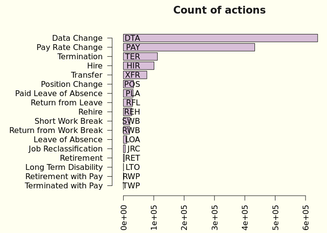<!-- -->

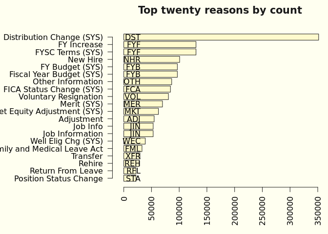<!-- -->

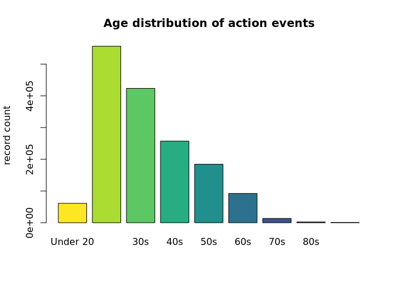<!-- -->

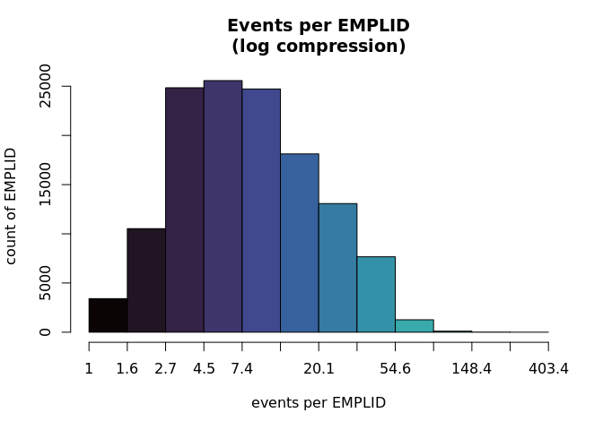<!-- -->

<!-- -->

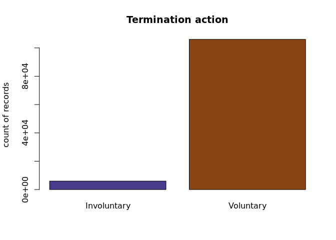<!-- -->

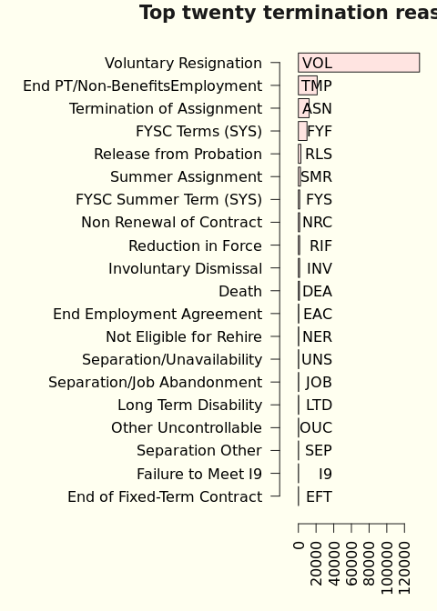<!-- -->

### Count of actions per date

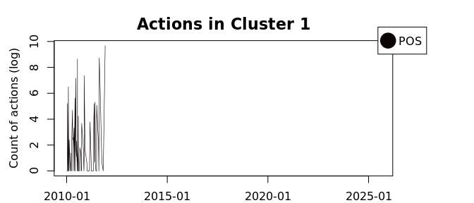<!-- -->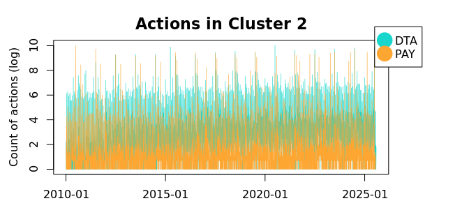<!-- -->

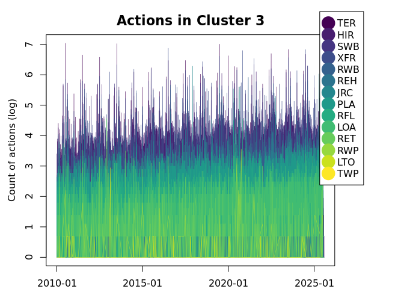<!-- -->

### Seasonality

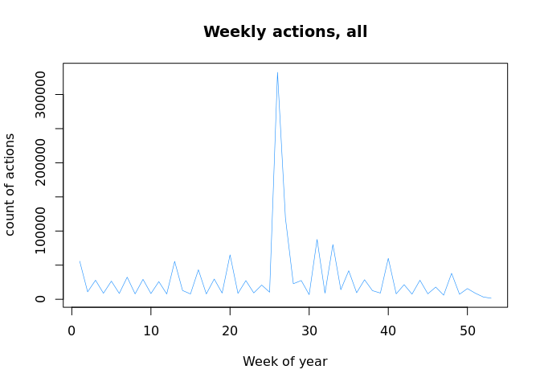<!-- -->

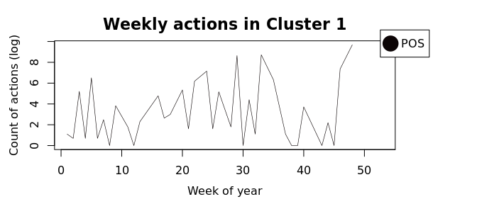<!-- -->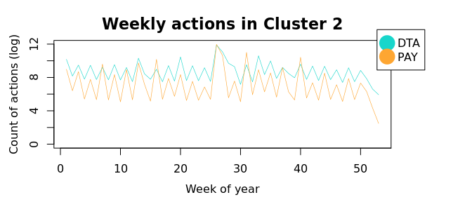<!-- -->

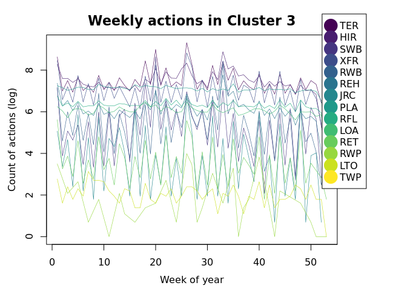<!-- -->

### Tables

<table class="table" style="color: black; width: auto !important; margin-left: auto; margin-right: auto;">
<caption>Actions and unique associated reasons</caption>
 <thead>
  <tr>
   <th style="text-align:left;">  </th>
   <th style="text-align:left;"> description </th>
   <th style="text-align:right;"> count </th>
   <th style="text-align:right;"> unique
reasons </th>
  </tr>
 </thead>
<tbody>
  <tr>
   <td style="text-align:left;"> DTA </td>
   <td style="text-align:left;"> Data Change </td>
   <td style="text-align:right;"> 639869 </td>
   <td style="text-align:right;"> 15 </td>
  </tr>
  <tr>
   <td style="text-align:left;"> HIR </td>
   <td style="text-align:left;"> Hire </td>
   <td style="text-align:right;"> 100783 </td>
   <td style="text-align:right;"> 1 </td>
  </tr>
  <tr>
   <td style="text-align:left;"> JRC </td>
   <td style="text-align:left;"> Job Reclassification </td>
   <td style="text-align:right;"> 6118 </td>
   <td style="text-align:right;"> 2 </td>
  </tr>
  <tr>
   <td style="text-align:left;"> LOA </td>
   <td style="text-align:left;"> Leave of Absence </td>
   <td style="text-align:right;"> 11397 </td>
   <td style="text-align:right;"> 15 </td>
  </tr>
  <tr>
   <td style="text-align:left;"> LTO </td>
   <td style="text-align:left;"> Long Term Disability </td>
   <td style="text-align:right;"> 445 </td>
   <td style="text-align:right;"> 1 </td>
  </tr>
  <tr>
   <td style="text-align:left;"> PAY </td>
   <td style="text-align:left;"> Pay Rate Change </td>
   <td style="text-align:right;"> 432550 </td>
   <td style="text-align:right;"> 11 </td>
  </tr>
  <tr>
   <td style="text-align:left;"> PLA </td>
   <td style="text-align:left;"> Paid Leave of Absence </td>
   <td style="text-align:right;"> 31868 </td>
   <td style="text-align:right;"> 17 </td>
  </tr>
  <tr>
   <td style="text-align:left;"> POS </td>
   <td style="text-align:left;"> Position Change </td>
   <td style="text-align:right;"> 33301 </td>
   <td style="text-align:right;"> 3 </td>
  </tr>
  <tr>
   <td style="text-align:left;"> REH </td>
   <td style="text-align:left;"> Rehire </td>
   <td style="text-align:right;"> 27667 </td>
   <td style="text-align:right;"> 1 </td>
  </tr>
  <tr>
   <td style="text-align:left;"> RET </td>
   <td style="text-align:left;"> Retirement </td>
   <td style="text-align:right;"> 2875 </td>
   <td style="text-align:right;"> 5 </td>
  </tr>
  <tr>
   <td style="text-align:left;"> RFL </td>
   <td style="text-align:left;"> Return from Leave </td>
   <td style="text-align:right;"> 29870 </td>
   <td style="text-align:right;"> 3 </td>
  </tr>
  <tr>
   <td style="text-align:left;"> RWB </td>
   <td style="text-align:left;"> Return from Work Break </td>
   <td style="text-align:right;"> 20496 </td>
   <td style="text-align:right;"> 1 </td>
  </tr>
  <tr>
   <td style="text-align:left;"> RWP </td>
   <td style="text-align:left;"> Retirement with Pay </td>
   <td style="text-align:right;"> 328 </td>
   <td style="text-align:right;"> 3 </td>
  </tr>
  <tr>
   <td style="text-align:left;"> SWB </td>
   <td style="text-align:left;"> Short Work Break </td>
   <td style="text-align:right;"> 21274 </td>
   <td style="text-align:right;"> 2 </td>
  </tr>
  <tr>
   <td style="text-align:left;"> TER </td>
   <td style="text-align:left;"> Termination </td>
   <td style="text-align:right;"> 112008 </td>
   <td style="text-align:right;"> 43 </td>
  </tr>
  <tr>
   <td style="text-align:left;"> TWP </td>
   <td style="text-align:left;"> Terminated with Pay </td>
   <td style="text-align:right;"> 1 </td>
   <td style="text-align:right;"> 1 </td>
  </tr>
  <tr>
   <td style="text-align:left;"> XFR </td>
   <td style="text-align:left;"> Transfer </td>
   <td style="text-align:right;"> 77312 </td>
   <td style="text-align:right;"> 8 </td>
  </tr>
</tbody>
</table>

<table class="table" style="color: black; width: auto !important; margin-left: auto; margin-right: auto;">
<caption>Action reasons</caption>
 <thead>
  <tr>
   <th style="text-align:left;position: sticky; top:0; background-color: #FFFFFF;">  </th>
   <th style="text-align:left;position: sticky; top:0; background-color: #FFFFFF;"> description </th>
   <th style="text-align:right;position: sticky; top:0; background-color: #FFFFFF;"> count </th>
  </tr>
 </thead>
<tbody>
  <tr>
   <td style="text-align:left;"> 30D </td>
   <td style="text-align:left;"> 30 Day </td>
   <td style="text-align:right;"> 132 </td>
  </tr>
  <tr>
   <td style="text-align:left;"> 90D </td>
   <td style="text-align:left;"> 90 Day </td>
   <td style="text-align:right;"> 47 </td>
  </tr>
  <tr>
   <td style="text-align:left;"> ADJ </td>
   <td style="text-align:left;"> Adjustment </td>
   <td style="text-align:right;"> 54852 </td>
  </tr>
  <tr>
   <td style="text-align:left;"> AML </td>
   <td style="text-align:left;"> Administrative Leave </td>
   <td style="text-align:right;"> 106 </td>
  </tr>
  <tr>
   <td style="text-align:left;"> ASN </td>
   <td style="text-align:left;"> Termination of Assignment </td>
   <td style="text-align:right;"> 4199 </td>
  </tr>
  <tr>
   <td style="text-align:left;"> BAC </td>
   <td style="text-align:left;"> BA Conversion (SYS) </td>
   <td style="text-align:right;"> 19476 </td>
  </tr>
  <tr>
   <td style="text-align:left;"> BEC </td>
   <td style="text-align:left;"> Ben Elig Change (SYS) </td>
   <td style="text-align:right;"> 16907 </td>
  </tr>
  <tr>
   <td style="text-align:left;"> BNK </td>
   <td style="text-align:left;"> Employer Bankruptcy </td>
   <td style="text-align:right;"> 1 </td>
  </tr>
  <tr>
   <td style="text-align:left;"> CDP </td>
   <td style="text-align:left;"> Correction-Department </td>
   <td style="text-align:right;"> 539 </td>
  </tr>
  <tr>
   <td style="text-align:left;"> CJC </td>
   <td style="text-align:left;"> Correction-Job Code </td>
   <td style="text-align:right;"> 747 </td>
  </tr>
  <tr>
   <td style="text-align:left;"> CNT </td>
   <td style="text-align:left;"> Contract (SYS) </td>
   <td style="text-align:right;"> 661 </td>
  </tr>
  <tr>
   <td style="text-align:left;"> COV </td>
   <td style="text-align:left;"> COVID-19 </td>
   <td style="text-align:right;"> 676 </td>
  </tr>
  <tr>
   <td style="text-align:left;"> CPR </td>
   <td style="text-align:left;"> Correction-Pay Rate </td>
   <td style="text-align:right;"> 22 </td>
  </tr>
  <tr>
   <td style="text-align:left;"> CRP </td>
   <td style="text-align:left;"> Duplicate EE Record </td>
   <td style="text-align:right;"> 74 </td>
  </tr>
  <tr>
   <td style="text-align:left;"> DEA </td>
   <td style="text-align:left;"> Death </td>
   <td style="text-align:right;"> 989 </td>
  </tr>
  <tr>
   <td style="text-align:left;"> DEV </td>
   <td style="text-align:left;"> Development Opportunities </td>
   <td style="text-align:right;"> 76 </td>
  </tr>
  <tr>
   <td style="text-align:left;"> DST </td>
   <td style="text-align:left;"> Distribution Change (SYS) </td>
   <td style="text-align:right;"> 351601 </td>
  </tr>
  <tr>
   <td style="text-align:left;"> EAC </td>
   <td style="text-align:left;"> End Employment Agreement </td>
   <td style="text-align:right;"> 238 </td>
  </tr>
  <tr>
   <td style="text-align:left;"> EES </td>
   <td style="text-align:left;"> Fellow Employee </td>
   <td style="text-align:right;"> 4 </td>
  </tr>
  <tr>
   <td style="text-align:left;"> EFT </td>
   <td style="text-align:left;"> End of Fixed-Term Contract </td>
   <td style="text-align:right;"> 171 </td>
  </tr>
  <tr>
   <td style="text-align:left;"> EMT </td>
   <td style="text-align:left;"> Emeritus </td>
   <td style="text-align:right;"> 139 </td>
  </tr>
  <tr>
   <td style="text-align:left;"> ERT </td>
   <td style="text-align:left;"> Early Retirement </td>
   <td style="text-align:right;"> 221 </td>
  </tr>
  <tr>
   <td style="text-align:left;"> EVW </td>
   <td style="text-align:left;"> E-Verify Withdrawal </td>
   <td style="text-align:right;"> 14 </td>
  </tr>
  <tr>
   <td style="text-align:left;"> EXT </td>
   <td style="text-align:left;"> Extension </td>
   <td style="text-align:right;"> 1813 </td>
  </tr>
  <tr>
   <td style="text-align:left;"> FAM </td>
   <td style="text-align:left;"> Family Reasons </td>
   <td style="text-align:right;"> 128 </td>
  </tr>
  <tr>
   <td style="text-align:left;"> FCA </td>
   <td style="text-align:left;"> FICA Status Change (SYS) </td>
   <td style="text-align:right;"> 84229 </td>
  </tr>
  <tr>
   <td style="text-align:left;"> FLS </td>
   <td style="text-align:left;"> Pay Adj - FLSA Reg(SYS) </td>
   <td style="text-align:right;"> 263 </td>
  </tr>
  <tr>
   <td style="text-align:left;"> FML </td>
   <td style="text-align:left;"> Family and Medical Leave Act </td>
   <td style="text-align:right;"> 32865 </td>
  </tr>
  <tr>
   <td style="text-align:left;"> FTE </td>
   <td style="text-align:left;"> FTE Change </td>
   <td style="text-align:right;"> 573 </td>
  </tr>
  <tr>
   <td style="text-align:left;"> FUR </td>
   <td style="text-align:left;"> Furlough </td>
   <td style="text-align:right;"> 399 </td>
  </tr>
  <tr>
   <td style="text-align:left;"> FYA </td>
   <td style="text-align:left;"> FYSC Auto Term (SYS) </td>
   <td style="text-align:right;"> 2 </td>
  </tr>
  <tr>
   <td style="text-align:left;"> FYB </td>
   <td style="text-align:left;"> FY Budget (SYS) </td>
   <td style="text-align:right;"> 96669 </td>
  </tr>
  <tr>
   <td style="text-align:left;"> FYB </td>
   <td style="text-align:left;"> Fiscal Year Budget (SYS) </td>
   <td style="text-align:right;"> 96669 </td>
  </tr>
  <tr>
   <td style="text-align:left;"> FYF </td>
   <td style="text-align:left;"> FY Increase </td>
   <td style="text-align:right;"> 130326 </td>
  </tr>
  <tr>
   <td style="text-align:left;"> FYF </td>
   <td style="text-align:left;"> FYSC Terms (SYS) </td>
   <td style="text-align:right;"> 130326 </td>
  </tr>
  <tr>
   <td style="text-align:left;"> FYR </td>
   <td style="text-align:left;"> FY Raise </td>
   <td style="text-align:right;"> 4369 </td>
  </tr>
  <tr>
   <td style="text-align:left;"> FYS </td>
   <td style="text-align:left;"> FYSC Summer Term (SYS) </td>
   <td style="text-align:right;"> 2 </td>
  </tr>
  <tr>
   <td style="text-align:left;"> H2U </td>
   <td style="text-align:left;"> Hospital to University </td>
   <td style="text-align:right;"> 1008 </td>
  </tr>
  <tr>
   <td style="text-align:left;"> HEA </td>
   <td style="text-align:left;"> Medical LOA Option B </td>
   <td style="text-align:right;"> 649 </td>
  </tr>
  <tr>
   <td style="text-align:left;"> HEA </td>
   <td style="text-align:left;"> Medical(Not protected by FMLA) </td>
   <td style="text-align:right;"> 649 </td>
  </tr>
  <tr>
   <td style="text-align:left;"> HRS </td>
   <td style="text-align:left;"> Hours </td>
   <td style="text-align:right;"> 17 </td>
  </tr>
  <tr>
   <td style="text-align:left;"> HTH </td>
   <td style="text-align:left;"> Health-Related Issues </td>
   <td style="text-align:right;"> 46 </td>
  </tr>
  <tr>
   <td style="text-align:left;"> I9 </td>
   <td style="text-align:left;"> Failure to Meet I9 </td>
   <td style="text-align:right;"> 182 </td>
  </tr>
  <tr>
   <td style="text-align:left;"> ICR </td>
   <td style="text-align:left;"> Detach from Incorrect ID </td>
   <td style="text-align:right;"> 16 </td>
  </tr>
  <tr>
   <td style="text-align:left;"> IDT </td>
   <td style="text-align:left;"> Involuntary Demotion Transfer </td>
   <td style="text-align:right;"> 1 </td>
  </tr>
  <tr>
   <td style="text-align:left;"> INT </td>
   <td style="text-align:left;"> Interim Pay </td>
   <td style="text-align:right;"> 2 </td>
  </tr>
  <tr>
   <td style="text-align:left;"> INV </td>
   <td style="text-align:left;"> Involuntary Dismissal </td>
   <td style="text-align:right;"> 1301 </td>
  </tr>
  <tr>
   <td style="text-align:left;"> JCC </td>
   <td style="text-align:left;"> Job Code Consolidation </td>
   <td style="text-align:right;"> 3 </td>
  </tr>
  <tr>
   <td style="text-align:left;"> JIN </td>
   <td style="text-align:left;"> Job Info </td>
   <td style="text-align:right;"> 53041 </td>
  </tr>
  <tr>
   <td style="text-align:left;"> JIN </td>
   <td style="text-align:left;"> Job Information </td>
   <td style="text-align:right;"> 53041 </td>
  </tr>
  <tr>
   <td style="text-align:left;"> JOB </td>
   <td style="text-align:left;"> Separation/Job Abandonment </td>
   <td style="text-align:right;"> 370 </td>
  </tr>
  <tr>
   <td style="text-align:left;"> JRC </td>
   <td style="text-align:left;"> Job Reclassification </td>
   <td style="text-align:right;"> 5895 </td>
  </tr>
  <tr>
   <td style="text-align:left;"> LAT </td>
   <td style="text-align:left;"> Lateral Transfer </td>
   <td style="text-align:right;"> 20182 </td>
  </tr>
  <tr>
   <td style="text-align:left;"> LOA </td>
   <td style="text-align:left;"> LOA Without Pay </td>
   <td style="text-align:right;"> 1465 </td>
  </tr>
  <tr>
   <td style="text-align:left;"> LOC </td>
   <td style="text-align:left;"> Location </td>
   <td style="text-align:right;"> 56 </td>
  </tr>
  <tr>
   <td style="text-align:left;"> LTD </td>
   <td style="text-align:left;"> Long Term Disability </td>
   <td style="text-align:right;"> 347 </td>
  </tr>
  <tr>
   <td style="text-align:left;"> LTD </td>
   <td style="text-align:left;"> Long-Term Disability </td>
   <td style="text-align:right;"> 347 </td>
  </tr>
  <tr>
   <td style="text-align:left;"> LTO </td>
   <td style="text-align:left;"> Long Term Disability </td>
   <td style="text-align:right;"> 445 </td>
  </tr>
  <tr>
   <td style="text-align:left;"> LWF </td>
   <td style="text-align:left;"> Leaving the Workforce </td>
   <td style="text-align:right;"> 104 </td>
  </tr>
  <tr>
   <td style="text-align:left;"> MER </td>
   <td style="text-align:left;"> Merit (SYS) </td>
   <td style="text-align:right;"> 69802 </td>
  </tr>
  <tr>
   <td style="text-align:left;"> MIL </td>
   <td style="text-align:left;"> Military Service </td>
   <td style="text-align:right;"> 861 </td>
  </tr>
  <tr>
   <td style="text-align:left;"> MKT </td>
   <td style="text-align:left;"> Market Equity Adjustment (SYS) </td>
   <td style="text-align:right;"> 62512 </td>
  </tr>
  <tr>
   <td style="text-align:left;"> MLA </td>
   <td style="text-align:left;"> Medical Leave of Absence Opt A </td>
   <td style="text-align:right;"> 2842 </td>
  </tr>
  <tr>
   <td style="text-align:left;"> MLB </td>
   <td style="text-align:left;"> Medical Leave of Absence Opt B </td>
   <td style="text-align:right;"> 560 </td>
  </tr>
  <tr>
   <td style="text-align:left;"> NER </td>
   <td style="text-align:left;"> Not Eligible for Rehire </td>
   <td style="text-align:right;"> 402 </td>
  </tr>
  <tr>
   <td style="text-align:left;"> NEW </td>
   <td style="text-align:left;"> New Position </td>
   <td style="text-align:right;"> 43 </td>
  </tr>
  <tr>
   <td style="text-align:left;"> NHR </td>
   <td style="text-align:left;"> New Hire </td>
   <td style="text-align:right;"> 100783 </td>
  </tr>
  <tr>
   <td style="text-align:left;"> NRC </td>
   <td style="text-align:left;"> Non Renewal of Contract </td>
   <td style="text-align:right;"> 865 </td>
  </tr>
  <tr>
   <td style="text-align:left;"> OCN </td>
   <td style="text-align:left;"> Other Controllable </td>
   <td style="text-align:right;"> 97 </td>
  </tr>
  <tr>
   <td style="text-align:left;"> OTH </td>
   <td style="text-align:left;"> Other Information </td>
   <td style="text-align:right;"> 86464 </td>
  </tr>
  <tr>
   <td style="text-align:left;"> OUC </td>
   <td style="text-align:left;"> Other Uncontrollable </td>
   <td style="text-align:right;"> 266 </td>
  </tr>
  <tr>
   <td style="text-align:left;"> PAR </td>
   <td style="text-align:left;"> Parental Leave </td>
   <td style="text-align:right;"> 67 </td>
  </tr>
  <tr>
   <td style="text-align:left;"> PAY </td>
   <td style="text-align:left;"> Compensation </td>
   <td style="text-align:right;"> 26 </td>
  </tr>
  <tr>
   <td style="text-align:left;"> PDU </td>
   <td style="text-align:left;"> Position Data Update </td>
   <td style="text-align:right;"> 11174 </td>
  </tr>
  <tr>
   <td style="text-align:left;"> PHS </td>
   <td style="text-align:left;"> Phased Retirement </td>
   <td style="text-align:right;"> 17 </td>
  </tr>
  <tr>
   <td style="text-align:left;"> PLA </td>
   <td style="text-align:left;"> Paid LOA </td>
   <td style="text-align:right;"> 738 </td>
  </tr>
  <tr>
   <td style="text-align:left;"> PRM </td>
   <td style="text-align:left;"> Promotion Opportunities </td>
   <td style="text-align:right;"> 34 </td>
  </tr>
  <tr>
   <td style="text-align:left;"> PRO </td>
   <td style="text-align:left;"> Promotion </td>
   <td style="text-align:right;"> 21597 </td>
  </tr>
  <tr>
   <td style="text-align:left;"> PSB </td>
   <td style="text-align:left;"> Paid Sabbatical Leave </td>
   <td style="text-align:right;"> 15 </td>
  </tr>
  <tr>
   <td style="text-align:left;"> REC </td>
   <td style="text-align:left;"> Job Reclassification </td>
   <td style="text-align:right;"> 6423 </td>
  </tr>
  <tr>
   <td style="text-align:left;"> REH </td>
   <td style="text-align:left;"> Rehire </td>
   <td style="text-align:right;"> 27667 </td>
  </tr>
  <tr>
   <td style="text-align:left;"> REL </td>
   <td style="text-align:left;"> Relocation </td>
   <td style="text-align:right;"> 155 </td>
  </tr>
  <tr>
   <td style="text-align:left;"> RET </td>
   <td style="text-align:left;"> Regular Retirement </td>
   <td style="text-align:right;"> 2819 </td>
  </tr>
  <tr>
   <td style="text-align:left;"> RET </td>
   <td style="text-align:left;"> Return to School </td>
   <td style="text-align:right;"> 2819 </td>
  </tr>
  <tr>
   <td style="text-align:left;"> RFL </td>
   <td style="text-align:left;"> Return From Leave </td>
   <td style="text-align:right;"> 22086 </td>
  </tr>
  <tr>
   <td style="text-align:left;"> RFN </td>
   <td style="text-align:left;"> RIF/NER </td>
   <td style="text-align:right;"> 1 </td>
  </tr>
  <tr>
   <td style="text-align:left;"> RIF </td>
   <td style="text-align:left;"> Reduction in Force </td>
   <td style="text-align:right;"> 1322 </td>
  </tr>
  <tr>
   <td style="text-align:left;"> RLS </td>
   <td style="text-align:left;"> Release from Probation </td>
   <td style="text-align:right;"> 2753 </td>
  </tr>
  <tr>
   <td style="text-align:left;"> ROR </td>
   <td style="text-align:left;"> Reorganization </td>
   <td style="text-align:right;"> 5173 </td>
  </tr>
  <tr>
   <td style="text-align:left;"> RPL </td>
   <td style="text-align:left;"> Return from Paid Leave </td>
   <td style="text-align:right;"> 7782 </td>
  </tr>
  <tr>
   <td style="text-align:left;"> RWB </td>
   <td style="text-align:left;"> Return from Work Break </td>
   <td style="text-align:right;"> 20496 </td>
  </tr>
  <tr>
   <td style="text-align:left;"> RWP </td>
   <td style="text-align:left;"> Retirement With Pay </td>
   <td style="text-align:right;"> 1 </td>
  </tr>
  <tr>
   <td style="text-align:left;"> SEP </td>
   <td style="text-align:left;"> Separation Other </td>
   <td style="text-align:right;"> 118 </td>
  </tr>
  <tr>
   <td style="text-align:left;"> SMR </td>
   <td style="text-align:left;"> Summer Assignment </td>
   <td style="text-align:right;"> 2 </td>
  </tr>
  <tr>
   <td style="text-align:left;"> SRP </td>
   <td style="text-align:left;"> Special Retirement Plan </td>
   <td style="text-align:right;"> 152 </td>
  </tr>
  <tr>
   <td style="text-align:left;"> STA </td>
   <td style="text-align:left;"> Position Status Change </td>
   <td style="text-align:right;"> 22084 </td>
  </tr>
  <tr>
   <td style="text-align:left;"> SWB </td>
   <td style="text-align:left;"> Short Work Break </td>
   <td style="text-align:right;"> 20762 </td>
  </tr>
  <tr>
   <td style="text-align:left;"> TMP </td>
   <td style="text-align:left;"> End PT/Non-BenefitsEmployment </td>
   <td style="text-align:right;"> 10681 </td>
  </tr>
  <tr>
   <td style="text-align:left;"> TWP </td>
   <td style="text-align:left;"> Termination With Pay </td>
   <td style="text-align:right;"> 1 </td>
  </tr>
  <tr>
   <td style="text-align:left;"> TYP </td>
   <td style="text-align:left;"> Type of Work </td>
   <td style="text-align:right;"> 34 </td>
  </tr>
  <tr>
   <td style="text-align:left;"> U2H </td>
   <td style="text-align:left;"> Voluntary Xfr to Hospital </td>
   <td style="text-align:right;"> 74 </td>
  </tr>
  <tr>
   <td style="text-align:left;"> UNS </td>
   <td style="text-align:left;"> Separation/Unavailability </td>
   <td style="text-align:right;"> 338 </td>
  </tr>
  <tr>
   <td style="text-align:left;"> VDT </td>
   <td style="text-align:left;"> Voluntary Demotion Transfer </td>
   <td style="text-align:right;"> 5 </td>
  </tr>
  <tr>
   <td style="text-align:left;"> VMA </td>
   <td style="text-align:left;"> Voluntary by Mutual Agreement </td>
   <td style="text-align:right;"> 76 </td>
  </tr>
  <tr>
   <td style="text-align:left;"> VOL </td>
   <td style="text-align:left;"> Voluntary Resignation </td>
   <td style="text-align:right;"> 80610 </td>
  </tr>
  <tr>
   <td style="text-align:left;"> WC </td>
   <td style="text-align:left;"> Workers Compensation Leave </td>
   <td style="text-align:right;"> 335 </td>
  </tr>
  <tr>
   <td style="text-align:left;"> WC </td>
   <td style="text-align:left;"> Worker's Comp-Leave Supplement </td>
   <td style="text-align:right;"> 335 </td>
  </tr>
  <tr>
   <td style="text-align:left;"> WEC </td>
   <td style="text-align:left;"> Well Elig Chg (SYS) </td>
   <td style="text-align:right;"> 38766 </td>
  </tr>
  <tr>
   <td style="text-align:left;"> WOR </td>
   <td style="text-align:left;"> Work Conditions or Environment </td>
   <td style="text-align:right;"> 9 </td>
  </tr>
  <tr>
   <td style="text-align:left;"> WPA </td>
   <td style="text-align:left;"> Workplace Accomodations </td>
   <td style="text-align:right;"> 340 </td>
  </tr>
  <tr>
   <td style="text-align:left;"> XFR </td>
   <td style="text-align:left;"> Transfer </td>
   <td style="text-align:right;"> 29272 </td>
  </tr>
</tbody>
</table>

<table class="table" style="color: black; width: auto !important; margin-left: auto; margin-right: auto;">
<caption>Actions and reasons</caption>
 <thead>
  <tr>
   <th style="text-align:left;position: sticky; top:0; background-color: #FFFFFF;">  </th>
   <th style="text-align:left;position: sticky; top:0; background-color: #FFFFFF;"> action </th>
   <th style="text-align:left;position: sticky; top:0; background-color: #FFFFFF;"> reason </th>
   <th style="text-align:left;position: sticky; top:0; background-color: #FFFFFF;"> description </th>
   <th style="text-align:right;position: sticky; top:0; background-color: #FFFFFF;"> count </th>
  </tr>
 </thead>
<tbody>
  <tr>
   <td style="text-align:left;"> DTA </td>
   <td style="text-align:left;"> Data Change </td>
   <td style="text-align:left;"> BAC </td>
   <td style="text-align:left;"> BA Conversion (SYS) </td>
   <td style="text-align:right;"> 19476 </td>
  </tr>
  <tr>
   <td style="text-align:left;"> DTA </td>
   <td style="text-align:left;"> Data Change </td>
   <td style="text-align:left;"> BEC </td>
   <td style="text-align:left;"> Ben Elig Change (SYS) </td>
   <td style="text-align:right;"> 16907 </td>
  </tr>
  <tr>
   <td style="text-align:left;"> DTA </td>
   <td style="text-align:left;"> Data Change </td>
   <td style="text-align:left;"> CNT </td>
   <td style="text-align:left;"> Contract (SYS) </td>
   <td style="text-align:right;"> 661 </td>
  </tr>
  <tr>
   <td style="text-align:left;"> DTA </td>
   <td style="text-align:left;"> Data Change </td>
   <td style="text-align:left;"> CDP </td>
   <td style="text-align:left;"> Correction-Department </td>
   <td style="text-align:right;"> 539 </td>
  </tr>
  <tr>
   <td style="text-align:left;"> DTA </td>
   <td style="text-align:left;"> Data Change </td>
   <td style="text-align:left;"> CJC </td>
   <td style="text-align:left;"> Correction-Job Code </td>
   <td style="text-align:right;"> 747 </td>
  </tr>
  <tr>
   <td style="text-align:left;"> DTA </td>
   <td style="text-align:left;"> Data Change </td>
   <td style="text-align:left;"> CPR </td>
   <td style="text-align:left;"> Correction-Pay Rate </td>
   <td style="text-align:right;"> 22 </td>
  </tr>
  <tr>
   <td style="text-align:left;"> DTA </td>
   <td style="text-align:left;"> Data Change </td>
   <td style="text-align:left;"> DST </td>
   <td style="text-align:left;"> Distribution Change (SYS) </td>
   <td style="text-align:right;"> 351601 </td>
  </tr>
  <tr>
   <td style="text-align:left;"> DTA </td>
   <td style="text-align:left;"> Data Change </td>
   <td style="text-align:left;"> FCA </td>
   <td style="text-align:left;"> FICA Status Change (SYS) </td>
   <td style="text-align:right;"> 84229 </td>
  </tr>
  <tr>
   <td style="text-align:left;"> DTA </td>
   <td style="text-align:left;"> Data Change </td>
   <td style="text-align:left;"> FTE </td>
   <td style="text-align:left;"> FTE Change </td>
   <td style="text-align:right;"> 347 </td>
  </tr>
  <tr>
   <td style="text-align:left;"> DTA </td>
   <td style="text-align:left;"> Data Change </td>
   <td style="text-align:left;"> JCC </td>
   <td style="text-align:left;"> Job Code Consolidation </td>
   <td style="text-align:right;"> 3 </td>
  </tr>
  <tr>
   <td style="text-align:left;"> DTA </td>
   <td style="text-align:left;"> Data Change </td>
   <td style="text-align:left;"> JIN </td>
   <td style="text-align:left;"> Job Information </td>
   <td style="text-align:right;"> 40088 </td>
  </tr>
  <tr>
   <td style="text-align:left;"> DTA </td>
   <td style="text-align:left;"> Data Change </td>
   <td style="text-align:left;"> OTH </td>
   <td style="text-align:left;"> Other Information </td>
   <td style="text-align:right;"> 86464 </td>
  </tr>
  <tr>
   <td style="text-align:left;"> DTA </td>
   <td style="text-align:left;"> Data Change </td>
   <td style="text-align:left;"> PHS </td>
   <td style="text-align:left;"> Phased Retirement </td>
   <td style="text-align:right;"> 17 </td>
  </tr>
  <tr>
   <td style="text-align:left;"> DTA </td>
   <td style="text-align:left;"> Data Change </td>
   <td style="text-align:left;"> SRP </td>
   <td style="text-align:left;"> Special Retirement Plan </td>
   <td style="text-align:right;"> 2 </td>
  </tr>
  <tr>
   <td style="text-align:left;"> DTA </td>
   <td style="text-align:left;"> Data Change </td>
   <td style="text-align:left;"> WEC </td>
   <td style="text-align:left;"> Well Elig Chg (SYS) </td>
   <td style="text-align:right;"> 38766 </td>
  </tr>
  <tr>
   <td style="text-align:left;"> HIR </td>
   <td style="text-align:left;"> Hire </td>
   <td style="text-align:left;"> NHR </td>
   <td style="text-align:left;"> New Hire </td>
   <td style="text-align:right;"> 100783 </td>
  </tr>
  <tr>
   <td style="text-align:left;"> JRC </td>
   <td style="text-align:left;"> Job Reclassification </td>
   <td style="text-align:left;"> FTE </td>
   <td style="text-align:left;"> FTE Change </td>
   <td style="text-align:right;"> 223 </td>
  </tr>
  <tr>
   <td style="text-align:left;"> JRC </td>
   <td style="text-align:left;"> Job Reclassification </td>
   <td style="text-align:left;"> JRC </td>
   <td style="text-align:left;"> Job Reclassification </td>
   <td style="text-align:right;"> 5895 </td>
  </tr>
  <tr>
   <td style="text-align:left;"> LOA </td>
   <td style="text-align:left;"> Leave of Absence </td>
   <td style="text-align:left;"> 30D </td>
   <td style="text-align:left;"> 30 Day </td>
   <td style="text-align:right;"> 105 </td>
  </tr>
  <tr>
   <td style="text-align:left;"> LOA </td>
   <td style="text-align:left;"> Leave of Absence </td>
   <td style="text-align:left;"> 90D </td>
   <td style="text-align:left;"> 90 Day </td>
   <td style="text-align:right;"> 34 </td>
  </tr>
  <tr>
   <td style="text-align:left;"> LOA </td>
   <td style="text-align:left;"> Leave of Absence </td>
   <td style="text-align:left;"> AML </td>
   <td style="text-align:left;"> Administrative Leave </td>
   <td style="text-align:right;"> 31 </td>
  </tr>
  <tr>
   <td style="text-align:left;"> LOA </td>
   <td style="text-align:left;"> Leave of Absence </td>
   <td style="text-align:left;"> COV </td>
   <td style="text-align:left;"> COVID-19 </td>
   <td style="text-align:right;"> 1 </td>
  </tr>
  <tr>
   <td style="text-align:left;"> LOA </td>
   <td style="text-align:left;"> Leave of Absence </td>
   <td style="text-align:left;"> EXT </td>
   <td style="text-align:left;"> Extension </td>
   <td style="text-align:right;"> 968 </td>
  </tr>
  <tr>
   <td style="text-align:left;"> LOA </td>
   <td style="text-align:left;"> Leave of Absence </td>
   <td style="text-align:left;"> FML </td>
   <td style="text-align:left;"> Family and Medical Leave Act </td>
   <td style="text-align:right;"> 6246 </td>
  </tr>
  <tr>
   <td style="text-align:left;"> LOA </td>
   <td style="text-align:left;"> Leave of Absence </td>
   <td style="text-align:left;"> FUR </td>
   <td style="text-align:left;"> Furlough </td>
   <td style="text-align:right;"> 103 </td>
  </tr>
  <tr>
   <td style="text-align:left;"> LOA </td>
   <td style="text-align:left;"> Leave of Absence </td>
   <td style="text-align:left;"> LOA </td>
   <td style="text-align:left;"> LOA Without Pay </td>
   <td style="text-align:right;"> 1465 </td>
  </tr>
  <tr>
   <td style="text-align:left;"> LOA </td>
   <td style="text-align:left;"> Leave of Absence </td>
   <td style="text-align:left;"> MLA </td>
   <td style="text-align:left;"> Medical Leave of Absence Opt A </td>
   <td style="text-align:right;"> 1331 </td>
  </tr>
  <tr>
   <td style="text-align:left;"> LOA </td>
   <td style="text-align:left;"> Leave of Absence </td>
   <td style="text-align:left;"> MLB </td>
   <td style="text-align:left;"> Medical Leave of Absence Opt B </td>
   <td style="text-align:right;"> 448 </td>
  </tr>
  <tr>
   <td style="text-align:left;"> LOA </td>
   <td style="text-align:left;"> Leave of Absence </td>
   <td style="text-align:left;"> HEA </td>
   <td style="text-align:left;"> Medical(Not protected by FMLA) </td>
   <td style="text-align:right;"> 217 </td>
  </tr>
  <tr>
   <td style="text-align:left;"> LOA </td>
   <td style="text-align:left;"> Leave of Absence </td>
   <td style="text-align:left;"> MIL </td>
   <td style="text-align:left;"> Military Service </td>
   <td style="text-align:right;"> 253 </td>
  </tr>
  <tr>
   <td style="text-align:left;"> LOA </td>
   <td style="text-align:left;"> Leave of Absence </td>
   <td style="text-align:left;"> SWB </td>
   <td style="text-align:left;"> Short Work Break </td>
   <td style="text-align:right;"> 1 </td>
  </tr>
  <tr>
   <td style="text-align:left;"> LOA </td>
   <td style="text-align:left;"> Leave of Absence </td>
   <td style="text-align:left;"> WC </td>
   <td style="text-align:left;"> Workers Compensation Leave </td>
   <td style="text-align:right;"> 53 </td>
  </tr>
  <tr>
   <td style="text-align:left;"> LOA </td>
   <td style="text-align:left;"> Leave of Absence </td>
   <td style="text-align:left;"> WPA </td>
   <td style="text-align:left;"> Workplace Accomodations </td>
   <td style="text-align:right;"> 141 </td>
  </tr>
  <tr>
   <td style="text-align:left;"> LTO </td>
   <td style="text-align:left;"> Long Term Disability </td>
   <td style="text-align:left;"> LTO </td>
   <td style="text-align:left;"> Long Term Disability </td>
   <td style="text-align:right;"> 445 </td>
  </tr>
  <tr>
   <td style="text-align:left;"> PAY </td>
   <td style="text-align:left;"> Pay Rate Change </td>
   <td style="text-align:left;"> ADJ </td>
   <td style="text-align:left;"> Adjustment </td>
   <td style="text-align:right;"> 54852 </td>
  </tr>
  <tr>
   <td style="text-align:left;"> PAY </td>
   <td style="text-align:left;"> Pay Rate Change </td>
   <td style="text-align:left;"> FTE </td>
   <td style="text-align:left;"> FTE Change </td>
   <td style="text-align:right;"> 3 </td>
  </tr>
  <tr>
   <td style="text-align:left;"> PAY </td>
   <td style="text-align:left;"> Pay Rate Change </td>
   <td style="text-align:left;"> FYB </td>
   <td style="text-align:left;"> FY Budget (SYS) </td>
   <td style="text-align:right;"> 96667 </td>
  </tr>
  <tr>
   <td style="text-align:left;"> PAY </td>
   <td style="text-align:left;"> Pay Rate Change </td>
   <td style="text-align:left;"> FYF </td>
   <td style="text-align:left;"> FY Increase </td>
   <td style="text-align:right;"> 124704 </td>
  </tr>
  <tr>
   <td style="text-align:left;"> PAY </td>
   <td style="text-align:left;"> Pay Rate Change </td>
   <td style="text-align:left;"> FYR </td>
   <td style="text-align:left;"> FY Raise </td>
   <td style="text-align:right;"> 4369 </td>
  </tr>
  <tr>
   <td style="text-align:left;"> PAY </td>
   <td style="text-align:left;"> Pay Rate Change </td>
   <td style="text-align:left;"> INT </td>
   <td style="text-align:left;"> Interim Pay </td>
   <td style="text-align:right;"> 2 </td>
  </tr>
  <tr>
   <td style="text-align:left;"> PAY </td>
   <td style="text-align:left;"> Pay Rate Change </td>
   <td style="text-align:left;"> JIN </td>
   <td style="text-align:left;"> Job Info </td>
   <td style="text-align:right;"> 12953 </td>
  </tr>
  <tr>
   <td style="text-align:left;"> PAY </td>
   <td style="text-align:left;"> Pay Rate Change </td>
   <td style="text-align:left;"> REC </td>
   <td style="text-align:left;"> Job Reclassification </td>
   <td style="text-align:right;"> 6423 </td>
  </tr>
  <tr>
   <td style="text-align:left;"> PAY </td>
   <td style="text-align:left;"> Pay Rate Change </td>
   <td style="text-align:left;"> MKT </td>
   <td style="text-align:left;"> Market Equity Adjustment (SYS) </td>
   <td style="text-align:right;"> 62512 </td>
  </tr>
  <tr>
   <td style="text-align:left;"> PAY </td>
   <td style="text-align:left;"> Pay Rate Change </td>
   <td style="text-align:left;"> MER </td>
   <td style="text-align:left;"> Merit (SYS) </td>
   <td style="text-align:right;"> 69802 </td>
  </tr>
  <tr>
   <td style="text-align:left;"> PAY </td>
   <td style="text-align:left;"> Pay Rate Change </td>
   <td style="text-align:left;"> FLS </td>
   <td style="text-align:left;"> Pay Adj - FLSA Reg(SYS) </td>
   <td style="text-align:right;"> 263 </td>
  </tr>
  <tr>
   <td style="text-align:left;"> PLA </td>
   <td style="text-align:left;"> Paid Leave of Absence </td>
   <td style="text-align:left;"> 30D </td>
   <td style="text-align:left;"> 30 Day </td>
   <td style="text-align:right;"> 27 </td>
  </tr>
  <tr>
   <td style="text-align:left;"> PLA </td>
   <td style="text-align:left;"> Paid Leave of Absence </td>
   <td style="text-align:left;"> 90D </td>
   <td style="text-align:left;"> 90 Day </td>
   <td style="text-align:right;"> 13 </td>
  </tr>
  <tr>
   <td style="text-align:left;"> PLA </td>
   <td style="text-align:left;"> Paid Leave of Absence </td>
   <td style="text-align:left;"> AML </td>
   <td style="text-align:left;"> Administrative Leave </td>
   <td style="text-align:right;"> 75 </td>
  </tr>
  <tr>
   <td style="text-align:left;"> PLA </td>
   <td style="text-align:left;"> Paid Leave of Absence </td>
   <td style="text-align:left;"> COV </td>
   <td style="text-align:left;"> COVID-19 </td>
   <td style="text-align:right;"> 162 </td>
  </tr>
  <tr>
   <td style="text-align:left;"> PLA </td>
   <td style="text-align:left;"> Paid Leave of Absence </td>
   <td style="text-align:left;"> EXT </td>
   <td style="text-align:left;"> Extension </td>
   <td style="text-align:right;"> 845 </td>
  </tr>
  <tr>
   <td style="text-align:left;"> PLA </td>
   <td style="text-align:left;"> Paid Leave of Absence </td>
   <td style="text-align:left;"> FML </td>
   <td style="text-align:left;"> Family and Medical Leave Act </td>
   <td style="text-align:right;"> 26619 </td>
  </tr>
  <tr>
   <td style="text-align:left;"> PLA </td>
   <td style="text-align:left;"> Paid Leave of Absence </td>
   <td style="text-align:left;"> FUR </td>
   <td style="text-align:left;"> Furlough </td>
   <td style="text-align:right;"> 296 </td>
  </tr>
  <tr>
   <td style="text-align:left;"> PLA </td>
   <td style="text-align:left;"> Paid Leave of Absence </td>
   <td style="text-align:left;"> LTD </td>
   <td style="text-align:left;"> Long-Term Disability </td>
   <td style="text-align:right;"> 1 </td>
  </tr>
  <tr>
   <td style="text-align:left;"> PLA </td>
   <td style="text-align:left;"> Paid Leave of Absence </td>
   <td style="text-align:left;"> MLA </td>
   <td style="text-align:left;"> Medical Leave of Absence Opt A </td>
   <td style="text-align:right;"> 1511 </td>
  </tr>
  <tr>
   <td style="text-align:left;"> PLA </td>
   <td style="text-align:left;"> Paid Leave of Absence </td>
   <td style="text-align:left;"> MLB </td>
   <td style="text-align:left;"> Medical Leave of Absence Opt B </td>
   <td style="text-align:right;"> 112 </td>
  </tr>
  <tr>
   <td style="text-align:left;"> PLA </td>
   <td style="text-align:left;"> Paid Leave of Absence </td>
   <td style="text-align:left;"> HEA </td>
   <td style="text-align:left;"> Medical(Not protected by FMLA) </td>
   <td style="text-align:right;"> 298 </td>
  </tr>
  <tr>
   <td style="text-align:left;"> PLA </td>
   <td style="text-align:left;"> Paid Leave of Absence </td>
   <td style="text-align:left;"> MIL </td>
   <td style="text-align:left;"> Military Service </td>
   <td style="text-align:right;"> 608 </td>
  </tr>
  <tr>
   <td style="text-align:left;"> PLA </td>
   <td style="text-align:left;"> Paid Leave of Absence </td>
   <td style="text-align:left;"> PLA </td>
   <td style="text-align:left;"> Paid LOA </td>
   <td style="text-align:right;"> 738 </td>
  </tr>
  <tr>
   <td style="text-align:left;"> PLA </td>
   <td style="text-align:left;"> Paid Leave of Absence </td>
   <td style="text-align:left;"> PSB </td>
   <td style="text-align:left;"> Paid Sabbatical Leave </td>
   <td style="text-align:right;"> 15 </td>
  </tr>
  <tr>
   <td style="text-align:left;"> PLA </td>
   <td style="text-align:left;"> Paid Leave of Absence </td>
   <td style="text-align:left;"> PAR </td>
   <td style="text-align:left;"> Parental Leave </td>
   <td style="text-align:right;"> 67 </td>
  </tr>
  <tr>
   <td style="text-align:left;"> PLA </td>
   <td style="text-align:left;"> Paid Leave of Absence </td>
   <td style="text-align:left;"> WC </td>
   <td style="text-align:left;"> Worker's Comp-Leave Supplement </td>
   <td style="text-align:right;"> 282 </td>
  </tr>
  <tr>
   <td style="text-align:left;"> PLA </td>
   <td style="text-align:left;"> Paid Leave of Absence </td>
   <td style="text-align:left;"> WPA </td>
   <td style="text-align:left;"> Workplace Accomodations </td>
   <td style="text-align:right;"> 199 </td>
  </tr>
  <tr>
   <td style="text-align:left;"> POS </td>
   <td style="text-align:left;"> Position Change </td>
   <td style="text-align:left;"> NEW </td>
   <td style="text-align:left;"> New Position </td>
   <td style="text-align:right;"> 43 </td>
  </tr>
  <tr>
   <td style="text-align:left;"> POS </td>
   <td style="text-align:left;"> Position Change </td>
   <td style="text-align:left;"> PDU </td>
   <td style="text-align:left;"> Position Data Update </td>
   <td style="text-align:right;"> 11174 </td>
  </tr>
  <tr>
   <td style="text-align:left;"> POS </td>
   <td style="text-align:left;"> Position Change </td>
   <td style="text-align:left;"> STA </td>
   <td style="text-align:left;"> Position Status Change </td>
   <td style="text-align:right;"> 22084 </td>
  </tr>
  <tr>
   <td style="text-align:left;"> REH </td>
   <td style="text-align:left;"> Rehire </td>
   <td style="text-align:left;"> REH </td>
   <td style="text-align:left;"> Rehire </td>
   <td style="text-align:right;"> 27667 </td>
  </tr>
  <tr>
   <td style="text-align:left;"> RET </td>
   <td style="text-align:left;"> Retirement </td>
   <td style="text-align:left;"> EMT </td>
   <td style="text-align:left;"> Emeritus </td>
   <td style="text-align:right;"> 121 </td>
  </tr>
  <tr>
   <td style="text-align:left;"> RET </td>
   <td style="text-align:left;"> Retirement </td>
   <td style="text-align:left;"> LTD </td>
   <td style="text-align:left;"> Long Term Disability </td>
   <td style="text-align:right;"> 8 </td>
  </tr>
  <tr>
   <td style="text-align:left;"> RET </td>
   <td style="text-align:left;"> Retirement </td>
   <td style="text-align:left;"> NER </td>
   <td style="text-align:left;"> Not Eligible for Rehire </td>
   <td style="text-align:right;"> 3 </td>
  </tr>
  <tr>
   <td style="text-align:left;"> RET </td>
   <td style="text-align:left;"> Retirement </td>
   <td style="text-align:left;"> RET </td>
   <td style="text-align:left;"> Regular Retirement </td>
   <td style="text-align:right;"> 2699 </td>
  </tr>
  <tr>
   <td style="text-align:left;"> RET </td>
   <td style="text-align:left;"> Retirement </td>
   <td style="text-align:left;"> SRP </td>
   <td style="text-align:left;"> Special Retirement Plan </td>
   <td style="text-align:right;"> 44 </td>
  </tr>
  <tr>
   <td style="text-align:left;"> RFL </td>
   <td style="text-align:left;"> Return from Leave </td>
   <td style="text-align:left;"> FYB </td>
   <td style="text-align:left;"> Fiscal Year Budget (SYS) </td>
   <td style="text-align:right;"> 2 </td>
  </tr>
  <tr>
   <td style="text-align:left;"> RFL </td>
   <td style="text-align:left;"> Return from Leave </td>
   <td style="text-align:left;"> RFL </td>
   <td style="text-align:left;"> Return From Leave </td>
   <td style="text-align:right;"> 22086 </td>
  </tr>
  <tr>
   <td style="text-align:left;"> RFL </td>
   <td style="text-align:left;"> Return from Leave </td>
   <td style="text-align:left;"> RPL </td>
   <td style="text-align:left;"> Return from Paid Leave </td>
   <td style="text-align:right;"> 7782 </td>
  </tr>
  <tr>
   <td style="text-align:left;"> RWB </td>
   <td style="text-align:left;"> Return from Work Break </td>
   <td style="text-align:left;"> RWB </td>
   <td style="text-align:left;"> Return from Work Break </td>
   <td style="text-align:right;"> 20496 </td>
  </tr>
  <tr>
   <td style="text-align:left;"> RWP </td>
   <td style="text-align:left;"> Retirement with Pay </td>
   <td style="text-align:left;"> ERT </td>
   <td style="text-align:left;"> Early Retirement </td>
   <td style="text-align:right;"> 221 </td>
  </tr>
  <tr>
   <td style="text-align:left;"> RWP </td>
   <td style="text-align:left;"> Retirement with Pay </td>
   <td style="text-align:left;"> RWP </td>
   <td style="text-align:left;"> Retirement With Pay </td>
   <td style="text-align:right;"> 1 </td>
  </tr>
  <tr>
   <td style="text-align:left;"> RWP </td>
   <td style="text-align:left;"> Retirement with Pay </td>
   <td style="text-align:left;"> SRP </td>
   <td style="text-align:left;"> Special Retirement Plan </td>
   <td style="text-align:right;"> 106 </td>
  </tr>
  <tr>
   <td style="text-align:left;"> SWB </td>
   <td style="text-align:left;"> Short Work Break </td>
   <td style="text-align:left;"> COV </td>
   <td style="text-align:left;"> COVID-19 </td>
   <td style="text-align:right;"> 513 </td>
  </tr>
  <tr>
   <td style="text-align:left;"> SWB </td>
   <td style="text-align:left;"> Short Work Break </td>
   <td style="text-align:left;"> SWB </td>
   <td style="text-align:left;"> Short Work Break </td>
   <td style="text-align:right;"> 20761 </td>
  </tr>
  <tr>
   <td style="text-align:left;"> TER </td>
   <td style="text-align:left;"> Termination </td>
   <td style="text-align:left;"> PAY </td>
   <td style="text-align:left;"> Compensation </td>
   <td style="text-align:right;"> 26 </td>
  </tr>
  <tr>
   <td style="text-align:left;"> TER </td>
   <td style="text-align:left;"> Termination </td>
   <td style="text-align:left;"> DEA </td>
   <td style="text-align:left;"> Death </td>
   <td style="text-align:right;"> 989 </td>
  </tr>
  <tr>
   <td style="text-align:left;"> TER </td>
   <td style="text-align:left;"> Termination </td>
   <td style="text-align:left;"> ICR </td>
   <td style="text-align:left;"> Detach from Incorrect ID </td>
   <td style="text-align:right;"> 16 </td>
  </tr>
  <tr>
   <td style="text-align:left;"> TER </td>
   <td style="text-align:left;"> Termination </td>
   <td style="text-align:left;"> DEV </td>
   <td style="text-align:left;"> Development Opportunities </td>
   <td style="text-align:right;"> 76 </td>
  </tr>
  <tr>
   <td style="text-align:left;"> TER </td>
   <td style="text-align:left;"> Termination </td>
   <td style="text-align:left;"> CRP </td>
   <td style="text-align:left;"> Duplicate EE Record </td>
   <td style="text-align:right;"> 74 </td>
  </tr>
  <tr>
   <td style="text-align:left;"> TER </td>
   <td style="text-align:left;"> Termination </td>
   <td style="text-align:left;"> EVW </td>
   <td style="text-align:left;"> E-Verify Withdrawal </td>
   <td style="text-align:right;"> 14 </td>
  </tr>
  <tr>
   <td style="text-align:left;"> TER </td>
   <td style="text-align:left;"> Termination </td>
   <td style="text-align:left;"> EMT </td>
   <td style="text-align:left;"> Emeritus </td>
   <td style="text-align:right;"> 18 </td>
  </tr>
  <tr>
   <td style="text-align:left;"> TER </td>
   <td style="text-align:left;"> Termination </td>
   <td style="text-align:left;"> BNK </td>
   <td style="text-align:left;"> Employer Bankruptcy </td>
   <td style="text-align:right;"> 1 </td>
  </tr>
  <tr>
   <td style="text-align:left;"> TER </td>
   <td style="text-align:left;"> Termination </td>
   <td style="text-align:left;"> EAC </td>
   <td style="text-align:left;"> End Employment Agreement </td>
   <td style="text-align:right;"> 238 </td>
  </tr>
  <tr>
   <td style="text-align:left;"> TER </td>
   <td style="text-align:left;"> Termination </td>
   <td style="text-align:left;"> EFT </td>
   <td style="text-align:left;"> End of Fixed-Term Contract </td>
   <td style="text-align:right;"> 171 </td>
  </tr>
  <tr>
   <td style="text-align:left;"> TER </td>
   <td style="text-align:left;"> Termination </td>
   <td style="text-align:left;"> TMP </td>
   <td style="text-align:left;"> End PT/Non-BenefitsEmployment </td>
   <td style="text-align:right;"> 10681 </td>
  </tr>
  <tr>
   <td style="text-align:left;"> TER </td>
   <td style="text-align:left;"> Termination </td>
   <td style="text-align:left;"> I9 </td>
   <td style="text-align:left;"> Failure to Meet I9 </td>
   <td style="text-align:right;"> 182 </td>
  </tr>
  <tr>
   <td style="text-align:left;"> TER </td>
   <td style="text-align:left;"> Termination </td>
   <td style="text-align:left;"> FAM </td>
   <td style="text-align:left;"> Family Reasons </td>
   <td style="text-align:right;"> 128 </td>
  </tr>
  <tr>
   <td style="text-align:left;"> TER </td>
   <td style="text-align:left;"> Termination </td>
   <td style="text-align:left;"> EES </td>
   <td style="text-align:left;"> Fellow Employee </td>
   <td style="text-align:right;"> 4 </td>
  </tr>
  <tr>
   <td style="text-align:left;"> TER </td>
   <td style="text-align:left;"> Termination </td>
   <td style="text-align:left;"> FYA </td>
   <td style="text-align:left;"> FYSC Auto Term (SYS) </td>
   <td style="text-align:right;"> 2 </td>
  </tr>
  <tr>
   <td style="text-align:left;"> TER </td>
   <td style="text-align:left;"> Termination </td>
   <td style="text-align:left;"> FYS </td>
   <td style="text-align:left;"> FYSC Summer Term (SYS) </td>
   <td style="text-align:right;"> 2 </td>
  </tr>
  <tr>
   <td style="text-align:left;"> TER </td>
   <td style="text-align:left;"> Termination </td>
   <td style="text-align:left;"> FYF </td>
   <td style="text-align:left;"> FYSC Terms (SYS) </td>
   <td style="text-align:right;"> 5622 </td>
  </tr>
  <tr>
   <td style="text-align:left;"> TER </td>
   <td style="text-align:left;"> Termination </td>
   <td style="text-align:left;"> HTH </td>
   <td style="text-align:left;"> Health-Related Issues </td>
   <td style="text-align:right;"> 46 </td>
  </tr>
  <tr>
   <td style="text-align:left;"> TER </td>
   <td style="text-align:left;"> Termination </td>
   <td style="text-align:left;"> HRS </td>
   <td style="text-align:left;"> Hours </td>
   <td style="text-align:right;"> 17 </td>
  </tr>
  <tr>
   <td style="text-align:left;"> TER </td>
   <td style="text-align:left;"> Termination </td>
   <td style="text-align:left;"> INV </td>
   <td style="text-align:left;"> Involuntary Dismissal </td>
   <td style="text-align:right;"> 1301 </td>
  </tr>
  <tr>
   <td style="text-align:left;"> TER </td>
   <td style="text-align:left;"> Termination </td>
   <td style="text-align:left;"> LWF </td>
   <td style="text-align:left;"> Leaving the Workforce </td>
   <td style="text-align:right;"> 104 </td>
  </tr>
  <tr>
   <td style="text-align:left;"> TER </td>
   <td style="text-align:left;"> Termination </td>
   <td style="text-align:left;"> LOC </td>
   <td style="text-align:left;"> Location </td>
   <td style="text-align:right;"> 56 </td>
  </tr>
  <tr>
   <td style="text-align:left;"> TER </td>
   <td style="text-align:left;"> Termination </td>
   <td style="text-align:left;"> LTD </td>
   <td style="text-align:left;"> Long Term Disability </td>
   <td style="text-align:right;"> 338 </td>
  </tr>
  <tr>
   <td style="text-align:left;"> TER </td>
   <td style="text-align:left;"> Termination </td>
   <td style="text-align:left;"> HEA </td>
   <td style="text-align:left;"> Medical LOA Option B </td>
   <td style="text-align:right;"> 134 </td>
  </tr>
  <tr>
   <td style="text-align:left;"> TER </td>
   <td style="text-align:left;"> Termination </td>
   <td style="text-align:left;"> NRC </td>
   <td style="text-align:left;"> Non Renewal of Contract </td>
   <td style="text-align:right;"> 865 </td>
  </tr>
  <tr>
   <td style="text-align:left;"> TER </td>
   <td style="text-align:left;"> Termination </td>
   <td style="text-align:left;"> NER </td>
   <td style="text-align:left;"> Not Eligible for Rehire </td>
   <td style="text-align:right;"> 399 </td>
  </tr>
  <tr>
   <td style="text-align:left;"> TER </td>
   <td style="text-align:left;"> Termination </td>
   <td style="text-align:left;"> OCN </td>
   <td style="text-align:left;"> Other Controllable </td>
   <td style="text-align:right;"> 97 </td>
  </tr>
  <tr>
   <td style="text-align:left;"> TER </td>
   <td style="text-align:left;"> Termination </td>
   <td style="text-align:left;"> OUC </td>
   <td style="text-align:left;"> Other Uncontrollable </td>
   <td style="text-align:right;"> 266 </td>
  </tr>
  <tr>
   <td style="text-align:left;"> TER </td>
   <td style="text-align:left;"> Termination </td>
   <td style="text-align:left;"> PRM </td>
   <td style="text-align:left;"> Promotion Opportunities </td>
   <td style="text-align:right;"> 34 </td>
  </tr>
  <tr>
   <td style="text-align:left;"> TER </td>
   <td style="text-align:left;"> Termination </td>
   <td style="text-align:left;"> RIF </td>
   <td style="text-align:left;"> Reduction in Force </td>
   <td style="text-align:right;"> 1322 </td>
  </tr>
  <tr>
   <td style="text-align:left;"> TER </td>
   <td style="text-align:left;"> Termination </td>
   <td style="text-align:left;"> RLS </td>
   <td style="text-align:left;"> Release from Probation </td>
   <td style="text-align:right;"> 2753 </td>
  </tr>
  <tr>
   <td style="text-align:left;"> TER </td>
   <td style="text-align:left;"> Termination </td>
   <td style="text-align:left;"> REL </td>
   <td style="text-align:left;"> Relocation </td>
   <td style="text-align:right;"> 155 </td>
  </tr>
  <tr>
   <td style="text-align:left;"> TER </td>
   <td style="text-align:left;"> Termination </td>
   <td style="text-align:left;"> RET </td>
   <td style="text-align:left;"> Return to School </td>
   <td style="text-align:right;"> 120 </td>
  </tr>
  <tr>
   <td style="text-align:left;"> TER </td>
   <td style="text-align:left;"> Termination </td>
   <td style="text-align:left;"> RFN </td>
   <td style="text-align:left;"> RIF/NER </td>
   <td style="text-align:right;"> 1 </td>
  </tr>
  <tr>
   <td style="text-align:left;"> TER </td>
   <td style="text-align:left;"> Termination </td>
   <td style="text-align:left;"> SEP </td>
   <td style="text-align:left;"> Separation Other </td>
   <td style="text-align:right;"> 118 </td>
  </tr>
  <tr>
   <td style="text-align:left;"> TER </td>
   <td style="text-align:left;"> Termination </td>
   <td style="text-align:left;"> JOB </td>
   <td style="text-align:left;"> Separation/Job Abandonment </td>
   <td style="text-align:right;"> 370 </td>
  </tr>
  <tr>
   <td style="text-align:left;"> TER </td>
   <td style="text-align:left;"> Termination </td>
   <td style="text-align:left;"> UNS </td>
   <td style="text-align:left;"> Separation/Unavailability </td>
   <td style="text-align:right;"> 338 </td>
  </tr>
  <tr>
   <td style="text-align:left;"> TER </td>
   <td style="text-align:left;"> Termination </td>
   <td style="text-align:left;"> SMR </td>
   <td style="text-align:left;"> Summer Assignment </td>
   <td style="text-align:right;"> 2 </td>
  </tr>
  <tr>
   <td style="text-align:left;"> TER </td>
   <td style="text-align:left;"> Termination </td>
   <td style="text-align:left;"> ASN </td>
   <td style="text-align:left;"> Termination of Assignment </td>
   <td style="text-align:right;"> 4199 </td>
  </tr>
  <tr>
   <td style="text-align:left;"> TER </td>
   <td style="text-align:left;"> Termination </td>
   <td style="text-align:left;"> TYP </td>
   <td style="text-align:left;"> Type of Work </td>
   <td style="text-align:right;"> 34 </td>
  </tr>
  <tr>
   <td style="text-align:left;"> TER </td>
   <td style="text-align:left;"> Termination </td>
   <td style="text-align:left;"> VMA </td>
   <td style="text-align:left;"> Voluntary by Mutual Agreement </td>
   <td style="text-align:right;"> 76 </td>
  </tr>
  <tr>
   <td style="text-align:left;"> TER </td>
   <td style="text-align:left;"> Termination </td>
   <td style="text-align:left;"> VOL </td>
   <td style="text-align:left;"> Voluntary Resignation </td>
   <td style="text-align:right;"> 80610 </td>
  </tr>
  <tr>
   <td style="text-align:left;"> TER </td>
   <td style="text-align:left;"> Termination </td>
   <td style="text-align:left;"> WOR </td>
   <td style="text-align:left;"> Work Conditions or Environment </td>
   <td style="text-align:right;"> 9 </td>
  </tr>
  <tr>
   <td style="text-align:left;"> TWP </td>
   <td style="text-align:left;"> Terminated with Pay </td>
   <td style="text-align:left;"> TWP </td>
   <td style="text-align:left;"> Termination With Pay </td>
   <td style="text-align:right;"> 1 </td>
  </tr>
  <tr>
   <td style="text-align:left;"> XFR </td>
   <td style="text-align:left;"> Transfer </td>
   <td style="text-align:left;"> H2U </td>
   <td style="text-align:left;"> Hospital to University </td>
   <td style="text-align:right;"> 1008 </td>
  </tr>
  <tr>
   <td style="text-align:left;"> XFR </td>
   <td style="text-align:left;"> Transfer </td>
   <td style="text-align:left;"> IDT </td>
   <td style="text-align:left;"> Involuntary Demotion Transfer </td>
   <td style="text-align:right;"> 1 </td>
  </tr>
  <tr>
   <td style="text-align:left;"> XFR </td>
   <td style="text-align:left;"> Transfer </td>
   <td style="text-align:left;"> LAT </td>
   <td style="text-align:left;"> Lateral Transfer </td>
   <td style="text-align:right;"> 20182 </td>
  </tr>
  <tr>
   <td style="text-align:left;"> XFR </td>
   <td style="text-align:left;"> Transfer </td>
   <td style="text-align:left;"> PRO </td>
   <td style="text-align:left;"> Promotion </td>
   <td style="text-align:right;"> 21597 </td>
  </tr>
  <tr>
   <td style="text-align:left;"> XFR </td>
   <td style="text-align:left;"> Transfer </td>
   <td style="text-align:left;"> ROR </td>
   <td style="text-align:left;"> Reorganization </td>
   <td style="text-align:right;"> 5173 </td>
  </tr>
  <tr>
   <td style="text-align:left;"> XFR </td>
   <td style="text-align:left;"> Transfer </td>
   <td style="text-align:left;"> XFR </td>
   <td style="text-align:left;"> Transfer </td>
   <td style="text-align:right;"> 29272 </td>
  </tr>
  <tr>
   <td style="text-align:left;"> XFR </td>
   <td style="text-align:left;"> Transfer </td>
   <td style="text-align:left;"> VDT </td>
   <td style="text-align:left;"> Voluntary Demotion Transfer </td>
   <td style="text-align:right;"> 5 </td>
  </tr>
  <tr>
   <td style="text-align:left;"> XFR </td>
   <td style="text-align:left;"> Transfer </td>
   <td style="text-align:left;"> U2H </td>
   <td style="text-align:left;"> Voluntary Xfr to Hospital </td>
   <td style="text-align:right;"> 74 </td>
  </tr>
</tbody>
</table>

<table class="table" style="color: black; width: auto !important; margin-left: auto; margin-right: auto;">
<caption>Reasons applied to multiple actions</caption>
 <thead>
  <tr>
   <th style="text-align:left;position: sticky; top:0; background-color: #FFFFFF;">  </th>
   <th style="text-align:left;position: sticky; top:0; background-color: #FFFFFF;"> action </th>
   <th style="text-align:left;position: sticky; top:0; background-color: #FFFFFF;"> reason </th>
   <th style="text-align:left;position: sticky; top:0; background-color: #FFFFFF;"> description </th>
   <th style="text-align:right;position: sticky; top:0; background-color: #FFFFFF;"> count </th>
  </tr>
 </thead>
<tbody>
  <tr>
   <td style="text-align:left;"> LOA </td>
   <td style="text-align:left;"> Leave of Absence </td>
   <td style="text-align:left;"> 30D </td>
   <td style="text-align:left;"> 30 Day </td>
   <td style="text-align:right;"> 105 </td>
  </tr>
  <tr>
   <td style="text-align:left;"> PLA </td>
   <td style="text-align:left;"> Paid Leave of Absence </td>
   <td style="text-align:left;"> 30D </td>
   <td style="text-align:left;"> 30 Day </td>
   <td style="text-align:right;"> 27 </td>
  </tr>
  <tr>
   <td style="text-align:left;"> LOA </td>
   <td style="text-align:left;"> Leave of Absence </td>
   <td style="text-align:left;"> 90D </td>
   <td style="text-align:left;"> 90 Day </td>
   <td style="text-align:right;"> 34 </td>
  </tr>
  <tr>
   <td style="text-align:left;"> PLA </td>
   <td style="text-align:left;"> Paid Leave of Absence </td>
   <td style="text-align:left;"> 90D </td>
   <td style="text-align:left;"> 90 Day </td>
   <td style="text-align:right;"> 13 </td>
  </tr>
  <tr>
   <td style="text-align:left;"> LOA </td>
   <td style="text-align:left;"> Leave of Absence </td>
   <td style="text-align:left;"> AML </td>
   <td style="text-align:left;"> Administrative Leave </td>
   <td style="text-align:right;"> 31 </td>
  </tr>
  <tr>
   <td style="text-align:left;"> PLA </td>
   <td style="text-align:left;"> Paid Leave of Absence </td>
   <td style="text-align:left;"> AML </td>
   <td style="text-align:left;"> Administrative Leave </td>
   <td style="text-align:right;"> 75 </td>
  </tr>
  <tr>
   <td style="text-align:left;"> LOA </td>
   <td style="text-align:left;"> Leave of Absence </td>
   <td style="text-align:left;"> COV </td>
   <td style="text-align:left;"> COVID-19 </td>
   <td style="text-align:right;"> 1 </td>
  </tr>
  <tr>
   <td style="text-align:left;"> PLA </td>
   <td style="text-align:left;"> Paid Leave of Absence </td>
   <td style="text-align:left;"> COV </td>
   <td style="text-align:left;"> COVID-19 </td>
   <td style="text-align:right;"> 162 </td>
  </tr>
  <tr>
   <td style="text-align:left;"> SWB </td>
   <td style="text-align:left;"> Short Work Break </td>
   <td style="text-align:left;"> COV </td>
   <td style="text-align:left;"> COVID-19 </td>
   <td style="text-align:right;"> 513 </td>
  </tr>
  <tr>
   <td style="text-align:left;"> RET </td>
   <td style="text-align:left;"> Retirement </td>
   <td style="text-align:left;"> EMT </td>
   <td style="text-align:left;"> Emeritus </td>
   <td style="text-align:right;"> 121 </td>
  </tr>
  <tr>
   <td style="text-align:left;"> TER </td>
   <td style="text-align:left;"> Termination </td>
   <td style="text-align:left;"> EMT </td>
   <td style="text-align:left;"> Emeritus </td>
   <td style="text-align:right;"> 18 </td>
  </tr>
  <tr>
   <td style="text-align:left;"> LOA </td>
   <td style="text-align:left;"> Leave of Absence </td>
   <td style="text-align:left;"> EXT </td>
   <td style="text-align:left;"> Extension </td>
   <td style="text-align:right;"> 968 </td>
  </tr>
  <tr>
   <td style="text-align:left;"> PLA </td>
   <td style="text-align:left;"> Paid Leave of Absence </td>
   <td style="text-align:left;"> EXT </td>
   <td style="text-align:left;"> Extension </td>
   <td style="text-align:right;"> 845 </td>
  </tr>
  <tr>
   <td style="text-align:left;"> LOA </td>
   <td style="text-align:left;"> Leave of Absence </td>
   <td style="text-align:left;"> FML </td>
   <td style="text-align:left;"> Family and Medical Leave Act </td>
   <td style="text-align:right;"> 6246 </td>
  </tr>
  <tr>
   <td style="text-align:left;"> PLA </td>
   <td style="text-align:left;"> Paid Leave of Absence </td>
   <td style="text-align:left;"> FML </td>
   <td style="text-align:left;"> Family and Medical Leave Act </td>
   <td style="text-align:right;"> 26619 </td>
  </tr>
  <tr>
   <td style="text-align:left;"> DTA </td>
   <td style="text-align:left;"> Data Change </td>
   <td style="text-align:left;"> FTE </td>
   <td style="text-align:left;"> FTE Change </td>
   <td style="text-align:right;"> 347 </td>
  </tr>
  <tr>
   <td style="text-align:left;"> JRC </td>
   <td style="text-align:left;"> Job Reclassification </td>
   <td style="text-align:left;"> FTE </td>
   <td style="text-align:left;"> FTE Change </td>
   <td style="text-align:right;"> 223 </td>
  </tr>
  <tr>
   <td style="text-align:left;"> PAY </td>
   <td style="text-align:left;"> Pay Rate Change </td>
   <td style="text-align:left;"> FTE </td>
   <td style="text-align:left;"> FTE Change </td>
   <td style="text-align:right;"> 3 </td>
  </tr>
  <tr>
   <td style="text-align:left;"> LOA </td>
   <td style="text-align:left;"> Leave of Absence </td>
   <td style="text-align:left;"> FUR </td>
   <td style="text-align:left;"> Furlough </td>
   <td style="text-align:right;"> 103 </td>
  </tr>
  <tr>
   <td style="text-align:left;"> PLA </td>
   <td style="text-align:left;"> Paid Leave of Absence </td>
   <td style="text-align:left;"> FUR </td>
   <td style="text-align:left;"> Furlough </td>
   <td style="text-align:right;"> 296 </td>
  </tr>
  <tr>
   <td style="text-align:left;"> PAY </td>
   <td style="text-align:left;"> Pay Rate Change </td>
   <td style="text-align:left;"> FYB </td>
   <td style="text-align:left;"> FY Budget (SYS) </td>
   <td style="text-align:right;"> 96667 </td>
  </tr>
  <tr>
   <td style="text-align:left;"> RFL </td>
   <td style="text-align:left;"> Return from Leave </td>
   <td style="text-align:left;"> FYB </td>
   <td style="text-align:left;"> Fiscal Year Budget (SYS) </td>
   <td style="text-align:right;"> 2 </td>
  </tr>
  <tr>
   <td style="text-align:left;"> PAY </td>
   <td style="text-align:left;"> Pay Rate Change </td>
   <td style="text-align:left;"> FYF </td>
   <td style="text-align:left;"> FY Increase </td>
   <td style="text-align:right;"> 124704 </td>
  </tr>
  <tr>
   <td style="text-align:left;"> TER </td>
   <td style="text-align:left;"> Termination </td>
   <td style="text-align:left;"> FYF </td>
   <td style="text-align:left;"> FYSC Terms (SYS) </td>
   <td style="text-align:right;"> 5622 </td>
  </tr>
  <tr>
   <td style="text-align:left;"> LOA </td>
   <td style="text-align:left;"> Leave of Absence </td>
   <td style="text-align:left;"> HEA </td>
   <td style="text-align:left;"> Medical(Not protected by FMLA) </td>
   <td style="text-align:right;"> 217 </td>
  </tr>
  <tr>
   <td style="text-align:left;"> PLA </td>
   <td style="text-align:left;"> Paid Leave of Absence </td>
   <td style="text-align:left;"> HEA </td>
   <td style="text-align:left;"> Medical(Not protected by FMLA) </td>
   <td style="text-align:right;"> 298 </td>
  </tr>
  <tr>
   <td style="text-align:left;"> TER </td>
   <td style="text-align:left;"> Termination </td>
   <td style="text-align:left;"> HEA </td>
   <td style="text-align:left;"> Medical LOA Option B </td>
   <td style="text-align:right;"> 134 </td>
  </tr>
  <tr>
   <td style="text-align:left;"> DTA </td>
   <td style="text-align:left;"> Data Change </td>
   <td style="text-align:left;"> JIN </td>
   <td style="text-align:left;"> Job Information </td>
   <td style="text-align:right;"> 40088 </td>
  </tr>
  <tr>
   <td style="text-align:left;"> PAY </td>
   <td style="text-align:left;"> Pay Rate Change </td>
   <td style="text-align:left;"> JIN </td>
   <td style="text-align:left;"> Job Info </td>
   <td style="text-align:right;"> 12953 </td>
  </tr>
  <tr>
   <td style="text-align:left;"> PLA </td>
   <td style="text-align:left;"> Paid Leave of Absence </td>
   <td style="text-align:left;"> LTD </td>
   <td style="text-align:left;"> Long-Term Disability </td>
   <td style="text-align:right;"> 1 </td>
  </tr>
  <tr>
   <td style="text-align:left;"> RET </td>
   <td style="text-align:left;"> Retirement </td>
   <td style="text-align:left;"> LTD </td>
   <td style="text-align:left;"> Long Term Disability </td>
   <td style="text-align:right;"> 8 </td>
  </tr>
  <tr>
   <td style="text-align:left;"> TER </td>
   <td style="text-align:left;"> Termination </td>
   <td style="text-align:left;"> LTD </td>
   <td style="text-align:left;"> Long Term Disability </td>
   <td style="text-align:right;"> 338 </td>
  </tr>
  <tr>
   <td style="text-align:left;"> LOA </td>
   <td style="text-align:left;"> Leave of Absence </td>
   <td style="text-align:left;"> MIL </td>
   <td style="text-align:left;"> Military Service </td>
   <td style="text-align:right;"> 253 </td>
  </tr>
  <tr>
   <td style="text-align:left;"> PLA </td>
   <td style="text-align:left;"> Paid Leave of Absence </td>
   <td style="text-align:left;"> MIL </td>
   <td style="text-align:left;"> Military Service </td>
   <td style="text-align:right;"> 608 </td>
  </tr>
  <tr>
   <td style="text-align:left;"> LOA </td>
   <td style="text-align:left;"> Leave of Absence </td>
   <td style="text-align:left;"> MLA </td>
   <td style="text-align:left;"> Medical Leave of Absence Opt A </td>
   <td style="text-align:right;"> 1331 </td>
  </tr>
  <tr>
   <td style="text-align:left;"> PLA </td>
   <td style="text-align:left;"> Paid Leave of Absence </td>
   <td style="text-align:left;"> MLA </td>
   <td style="text-align:left;"> Medical Leave of Absence Opt A </td>
   <td style="text-align:right;"> 1511 </td>
  </tr>
  <tr>
   <td style="text-align:left;"> LOA </td>
   <td style="text-align:left;"> Leave of Absence </td>
   <td style="text-align:left;"> MLB </td>
   <td style="text-align:left;"> Medical Leave of Absence Opt B </td>
   <td style="text-align:right;"> 448 </td>
  </tr>
  <tr>
   <td style="text-align:left;"> PLA </td>
   <td style="text-align:left;"> Paid Leave of Absence </td>
   <td style="text-align:left;"> MLB </td>
   <td style="text-align:left;"> Medical Leave of Absence Opt B </td>
   <td style="text-align:right;"> 112 </td>
  </tr>
  <tr>
   <td style="text-align:left;"> RET </td>
   <td style="text-align:left;"> Retirement </td>
   <td style="text-align:left;"> NER </td>
   <td style="text-align:left;"> Not Eligible for Rehire </td>
   <td style="text-align:right;"> 3 </td>
  </tr>
  <tr>
   <td style="text-align:left;"> TER </td>
   <td style="text-align:left;"> Termination </td>
   <td style="text-align:left;"> NER </td>
   <td style="text-align:left;"> Not Eligible for Rehire </td>
   <td style="text-align:right;"> 399 </td>
  </tr>
  <tr>
   <td style="text-align:left;"> RET </td>
   <td style="text-align:left;"> Retirement </td>
   <td style="text-align:left;"> RET </td>
   <td style="text-align:left;"> Regular Retirement </td>
   <td style="text-align:right;"> 2699 </td>
  </tr>
  <tr>
   <td style="text-align:left;"> TER </td>
   <td style="text-align:left;"> Termination </td>
   <td style="text-align:left;"> RET </td>
   <td style="text-align:left;"> Return to School </td>
   <td style="text-align:right;"> 120 </td>
  </tr>
  <tr>
   <td style="text-align:left;"> DTA </td>
   <td style="text-align:left;"> Data Change </td>
   <td style="text-align:left;"> SRP </td>
   <td style="text-align:left;"> Special Retirement Plan </td>
   <td style="text-align:right;"> 2 </td>
  </tr>
  <tr>
   <td style="text-align:left;"> RET </td>
   <td style="text-align:left;"> Retirement </td>
   <td style="text-align:left;"> SRP </td>
   <td style="text-align:left;"> Special Retirement Plan </td>
   <td style="text-align:right;"> 44 </td>
  </tr>
  <tr>
   <td style="text-align:left;"> RWP </td>
   <td style="text-align:left;"> Retirement with Pay </td>
   <td style="text-align:left;"> SRP </td>
   <td style="text-align:left;"> Special Retirement Plan </td>
   <td style="text-align:right;"> 106 </td>
  </tr>
  <tr>
   <td style="text-align:left;"> LOA </td>
   <td style="text-align:left;"> Leave of Absence </td>
   <td style="text-align:left;"> SWB </td>
   <td style="text-align:left;"> Short Work Break </td>
   <td style="text-align:right;"> 1 </td>
  </tr>
  <tr>
   <td style="text-align:left;"> SWB </td>
   <td style="text-align:left;"> Short Work Break </td>
   <td style="text-align:left;"> SWB </td>
   <td style="text-align:left;"> Short Work Break </td>
   <td style="text-align:right;"> 20761 </td>
  </tr>
  <tr>
   <td style="text-align:left;"> LOA </td>
   <td style="text-align:left;"> Leave of Absence </td>
   <td style="text-align:left;"> WC </td>
   <td style="text-align:left;"> Workers Compensation Leave </td>
   <td style="text-align:right;"> 53 </td>
  </tr>
  <tr>
   <td style="text-align:left;"> PLA </td>
   <td style="text-align:left;"> Paid Leave of Absence </td>
   <td style="text-align:left;"> WC </td>
   <td style="text-align:left;"> Worker's Comp-Leave Supplement </td>
   <td style="text-align:right;"> 282 </td>
  </tr>
  <tr>
   <td style="text-align:left;"> LOA </td>
   <td style="text-align:left;"> Leave of Absence </td>
   <td style="text-align:left;"> WPA </td>
   <td style="text-align:left;"> Workplace Accomodations </td>
   <td style="text-align:right;"> 141 </td>
  </tr>
  <tr>
   <td style="text-align:left;"> PLA </td>
   <td style="text-align:left;"> Paid Leave of Absence </td>
   <td style="text-align:left;"> WPA </td>
   <td style="text-align:left;"> Workplace Accomodations </td>
   <td style="text-align:right;"> 199 </td>
  </tr>
</tbody>
</table>

<table class="table" style="color: black; width: auto !important; margin-left: auto; margin-right: auto;">
<caption>Reasons applied to a single action</caption>
 <thead>
  <tr>
   <th style="text-align:left;position: sticky; top:0; background-color: #FFFFFF;">  </th>
   <th style="text-align:left;position: sticky; top:0; background-color: #FFFFFF;"> action </th>
   <th style="text-align:left;position: sticky; top:0; background-color: #FFFFFF;"> reason </th>
   <th style="text-align:left;position: sticky; top:0; background-color: #FFFFFF;"> description </th>
   <th style="text-align:right;position: sticky; top:0; background-color: #FFFFFF;"> count </th>
  </tr>
 </thead>
<tbody>
  <tr>
   <td style="text-align:left;"> DTA </td>
   <td style="text-align:left;"> Data Change </td>
   <td style="text-align:left;"> BAC </td>
   <td style="text-align:left;"> BA Conversion (SYS) </td>
   <td style="text-align:right;"> 19476 </td>
  </tr>
  <tr>
   <td style="text-align:left;"> DTA </td>
   <td style="text-align:left;"> Data Change </td>
   <td style="text-align:left;"> BEC </td>
   <td style="text-align:left;"> Ben Elig Change (SYS) </td>
   <td style="text-align:right;"> 16907 </td>
  </tr>
  <tr>
   <td style="text-align:left;"> DTA </td>
   <td style="text-align:left;"> Data Change </td>
   <td style="text-align:left;"> CNT </td>
   <td style="text-align:left;"> Contract (SYS) </td>
   <td style="text-align:right;"> 661 </td>
  </tr>
  <tr>
   <td style="text-align:left;"> DTA </td>
   <td style="text-align:left;"> Data Change </td>
   <td style="text-align:left;"> CDP </td>
   <td style="text-align:left;"> Correction-Department </td>
   <td style="text-align:right;"> 539 </td>
  </tr>
  <tr>
   <td style="text-align:left;"> DTA </td>
   <td style="text-align:left;"> Data Change </td>
   <td style="text-align:left;"> CJC </td>
   <td style="text-align:left;"> Correction-Job Code </td>
   <td style="text-align:right;"> 747 </td>
  </tr>
  <tr>
   <td style="text-align:left;"> DTA </td>
   <td style="text-align:left;"> Data Change </td>
   <td style="text-align:left;"> CPR </td>
   <td style="text-align:left;"> Correction-Pay Rate </td>
   <td style="text-align:right;"> 22 </td>
  </tr>
  <tr>
   <td style="text-align:left;"> DTA </td>
   <td style="text-align:left;"> Data Change </td>
   <td style="text-align:left;"> DST </td>
   <td style="text-align:left;"> Distribution Change (SYS) </td>
   <td style="text-align:right;"> 351601 </td>
  </tr>
  <tr>
   <td style="text-align:left;"> DTA </td>
   <td style="text-align:left;"> Data Change </td>
   <td style="text-align:left;"> FCA </td>
   <td style="text-align:left;"> FICA Status Change (SYS) </td>
   <td style="text-align:right;"> 84229 </td>
  </tr>
  <tr>
   <td style="text-align:left;"> DTA </td>
   <td style="text-align:left;"> Data Change </td>
   <td style="text-align:left;"> JCC </td>
   <td style="text-align:left;"> Job Code Consolidation </td>
   <td style="text-align:right;"> 3 </td>
  </tr>
  <tr>
   <td style="text-align:left;"> DTA </td>
   <td style="text-align:left;"> Data Change </td>
   <td style="text-align:left;"> OTH </td>
   <td style="text-align:left;"> Other Information </td>
   <td style="text-align:right;"> 86464 </td>
  </tr>
  <tr>
   <td style="text-align:left;"> DTA </td>
   <td style="text-align:left;"> Data Change </td>
   <td style="text-align:left;"> PHS </td>
   <td style="text-align:left;"> Phased Retirement </td>
   <td style="text-align:right;"> 17 </td>
  </tr>
  <tr>
   <td style="text-align:left;"> DTA </td>
   <td style="text-align:left;"> Data Change </td>
   <td style="text-align:left;"> WEC </td>
   <td style="text-align:left;"> Well Elig Chg (SYS) </td>
   <td style="text-align:right;"> 38766 </td>
  </tr>
  <tr>
   <td style="text-align:left;"> HIR </td>
   <td style="text-align:left;"> Hire </td>
   <td style="text-align:left;"> NHR </td>
   <td style="text-align:left;"> New Hire </td>
   <td style="text-align:right;"> 100783 </td>
  </tr>
  <tr>
   <td style="text-align:left;"> JRC </td>
   <td style="text-align:left;"> Job Reclassification </td>
   <td style="text-align:left;"> JRC </td>
   <td style="text-align:left;"> Job Reclassification </td>
   <td style="text-align:right;"> 5895 </td>
  </tr>
  <tr>
   <td style="text-align:left;"> LOA </td>
   <td style="text-align:left;"> Leave of Absence </td>
   <td style="text-align:left;"> LOA </td>
   <td style="text-align:left;"> LOA Without Pay </td>
   <td style="text-align:right;"> 1465 </td>
  </tr>
  <tr>
   <td style="text-align:left;"> LTO </td>
   <td style="text-align:left;"> Long Term Disability </td>
   <td style="text-align:left;"> LTO </td>
   <td style="text-align:left;"> Long Term Disability </td>
   <td style="text-align:right;"> 445 </td>
  </tr>
  <tr>
   <td style="text-align:left;"> PAY </td>
   <td style="text-align:left;"> Pay Rate Change </td>
   <td style="text-align:left;"> ADJ </td>
   <td style="text-align:left;"> Adjustment </td>
   <td style="text-align:right;"> 54852 </td>
  </tr>
  <tr>
   <td style="text-align:left;"> PAY </td>
   <td style="text-align:left;"> Pay Rate Change </td>
   <td style="text-align:left;"> FYR </td>
   <td style="text-align:left;"> FY Raise </td>
   <td style="text-align:right;"> 4369 </td>
  </tr>
  <tr>
   <td style="text-align:left;"> PAY </td>
   <td style="text-align:left;"> Pay Rate Change </td>
   <td style="text-align:left;"> INT </td>
   <td style="text-align:left;"> Interim Pay </td>
   <td style="text-align:right;"> 2 </td>
  </tr>
  <tr>
   <td style="text-align:left;"> PAY </td>
   <td style="text-align:left;"> Pay Rate Change </td>
   <td style="text-align:left;"> REC </td>
   <td style="text-align:left;"> Job Reclassification </td>
   <td style="text-align:right;"> 6423 </td>
  </tr>
  <tr>
   <td style="text-align:left;"> PAY </td>
   <td style="text-align:left;"> Pay Rate Change </td>
   <td style="text-align:left;"> MKT </td>
   <td style="text-align:left;"> Market Equity Adjustment (SYS) </td>
   <td style="text-align:right;"> 62512 </td>
  </tr>
  <tr>
   <td style="text-align:left;"> PAY </td>
   <td style="text-align:left;"> Pay Rate Change </td>
   <td style="text-align:left;"> MER </td>
   <td style="text-align:left;"> Merit (SYS) </td>
   <td style="text-align:right;"> 69802 </td>
  </tr>
  <tr>
   <td style="text-align:left;"> PAY </td>
   <td style="text-align:left;"> Pay Rate Change </td>
   <td style="text-align:left;"> FLS </td>
   <td style="text-align:left;"> Pay Adj - FLSA Reg(SYS) </td>
   <td style="text-align:right;"> 263 </td>
  </tr>
  <tr>
   <td style="text-align:left;"> PLA </td>
   <td style="text-align:left;"> Paid Leave of Absence </td>
   <td style="text-align:left;"> PLA </td>
   <td style="text-align:left;"> Paid LOA </td>
   <td style="text-align:right;"> 738 </td>
  </tr>
  <tr>
   <td style="text-align:left;"> PLA </td>
   <td style="text-align:left;"> Paid Leave of Absence </td>
   <td style="text-align:left;"> PSB </td>
   <td style="text-align:left;"> Paid Sabbatical Leave </td>
   <td style="text-align:right;"> 15 </td>
  </tr>
  <tr>
   <td style="text-align:left;"> PLA </td>
   <td style="text-align:left;"> Paid Leave of Absence </td>
   <td style="text-align:left;"> PAR </td>
   <td style="text-align:left;"> Parental Leave </td>
   <td style="text-align:right;"> 67 </td>
  </tr>
  <tr>
   <td style="text-align:left;"> POS </td>
   <td style="text-align:left;"> Position Change </td>
   <td style="text-align:left;"> NEW </td>
   <td style="text-align:left;"> New Position </td>
   <td style="text-align:right;"> 43 </td>
  </tr>
  <tr>
   <td style="text-align:left;"> POS </td>
   <td style="text-align:left;"> Position Change </td>
   <td style="text-align:left;"> PDU </td>
   <td style="text-align:left;"> Position Data Update </td>
   <td style="text-align:right;"> 11174 </td>
  </tr>
  <tr>
   <td style="text-align:left;"> POS </td>
   <td style="text-align:left;"> Position Change </td>
   <td style="text-align:left;"> STA </td>
   <td style="text-align:left;"> Position Status Change </td>
   <td style="text-align:right;"> 22084 </td>
  </tr>
  <tr>
   <td style="text-align:left;"> REH </td>
   <td style="text-align:left;"> Rehire </td>
   <td style="text-align:left;"> REH </td>
   <td style="text-align:left;"> Rehire </td>
   <td style="text-align:right;"> 27667 </td>
  </tr>
  <tr>
   <td style="text-align:left;"> RFL </td>
   <td style="text-align:left;"> Return from Leave </td>
   <td style="text-align:left;"> RFL </td>
   <td style="text-align:left;"> Return From Leave </td>
   <td style="text-align:right;"> 22086 </td>
  </tr>
  <tr>
   <td style="text-align:left;"> RFL </td>
   <td style="text-align:left;"> Return from Leave </td>
   <td style="text-align:left;"> RPL </td>
   <td style="text-align:left;"> Return from Paid Leave </td>
   <td style="text-align:right;"> 7782 </td>
  </tr>
  <tr>
   <td style="text-align:left;"> RWB </td>
   <td style="text-align:left;"> Return from Work Break </td>
   <td style="text-align:left;"> RWB </td>
   <td style="text-align:left;"> Return from Work Break </td>
   <td style="text-align:right;"> 20496 </td>
  </tr>
  <tr>
   <td style="text-align:left;"> RWP </td>
   <td style="text-align:left;"> Retirement with Pay </td>
   <td style="text-align:left;"> ERT </td>
   <td style="text-align:left;"> Early Retirement </td>
   <td style="text-align:right;"> 221 </td>
  </tr>
  <tr>
   <td style="text-align:left;"> RWP </td>
   <td style="text-align:left;"> Retirement with Pay </td>
   <td style="text-align:left;"> RWP </td>
   <td style="text-align:left;"> Retirement With Pay </td>
   <td style="text-align:right;"> 1 </td>
  </tr>
  <tr>
   <td style="text-align:left;"> TER </td>
   <td style="text-align:left;"> Termination </td>
   <td style="text-align:left;"> PAY </td>
   <td style="text-align:left;"> Compensation </td>
   <td style="text-align:right;"> 26 </td>
  </tr>
  <tr>
   <td style="text-align:left;"> TER </td>
   <td style="text-align:left;"> Termination </td>
   <td style="text-align:left;"> DEA </td>
   <td style="text-align:left;"> Death </td>
   <td style="text-align:right;"> 989 </td>
  </tr>
  <tr>
   <td style="text-align:left;"> TER </td>
   <td style="text-align:left;"> Termination </td>
   <td style="text-align:left;"> ICR </td>
   <td style="text-align:left;"> Detach from Incorrect ID </td>
   <td style="text-align:right;"> 16 </td>
  </tr>
  <tr>
   <td style="text-align:left;"> TER </td>
   <td style="text-align:left;"> Termination </td>
   <td style="text-align:left;"> DEV </td>
   <td style="text-align:left;"> Development Opportunities </td>
   <td style="text-align:right;"> 76 </td>
  </tr>
  <tr>
   <td style="text-align:left;"> TER </td>
   <td style="text-align:left;"> Termination </td>
   <td style="text-align:left;"> CRP </td>
   <td style="text-align:left;"> Duplicate EE Record </td>
   <td style="text-align:right;"> 74 </td>
  </tr>
  <tr>
   <td style="text-align:left;"> TER </td>
   <td style="text-align:left;"> Termination </td>
   <td style="text-align:left;"> EVW </td>
   <td style="text-align:left;"> E-Verify Withdrawal </td>
   <td style="text-align:right;"> 14 </td>
  </tr>
  <tr>
   <td style="text-align:left;"> TER </td>
   <td style="text-align:left;"> Termination </td>
   <td style="text-align:left;"> BNK </td>
   <td style="text-align:left;"> Employer Bankruptcy </td>
   <td style="text-align:right;"> 1 </td>
  </tr>
  <tr>
   <td style="text-align:left;"> TER </td>
   <td style="text-align:left;"> Termination </td>
   <td style="text-align:left;"> EAC </td>
   <td style="text-align:left;"> End Employment Agreement </td>
   <td style="text-align:right;"> 238 </td>
  </tr>
  <tr>
   <td style="text-align:left;"> TER </td>
   <td style="text-align:left;"> Termination </td>
   <td style="text-align:left;"> EFT </td>
   <td style="text-align:left;"> End of Fixed-Term Contract </td>
   <td style="text-align:right;"> 171 </td>
  </tr>
  <tr>
   <td style="text-align:left;"> TER </td>
   <td style="text-align:left;"> Termination </td>
   <td style="text-align:left;"> TMP </td>
   <td style="text-align:left;"> End PT/Non-BenefitsEmployment </td>
   <td style="text-align:right;"> 10681 </td>
  </tr>
  <tr>
   <td style="text-align:left;"> TER </td>
   <td style="text-align:left;"> Termination </td>
   <td style="text-align:left;"> I9 </td>
   <td style="text-align:left;"> Failure to Meet I9 </td>
   <td style="text-align:right;"> 182 </td>
  </tr>
  <tr>
   <td style="text-align:left;"> TER </td>
   <td style="text-align:left;"> Termination </td>
   <td style="text-align:left;"> FAM </td>
   <td style="text-align:left;"> Family Reasons </td>
   <td style="text-align:right;"> 128 </td>
  </tr>
  <tr>
   <td style="text-align:left;"> TER </td>
   <td style="text-align:left;"> Termination </td>
   <td style="text-align:left;"> EES </td>
   <td style="text-align:left;"> Fellow Employee </td>
   <td style="text-align:right;"> 4 </td>
  </tr>
  <tr>
   <td style="text-align:left;"> TER </td>
   <td style="text-align:left;"> Termination </td>
   <td style="text-align:left;"> FYA </td>
   <td style="text-align:left;"> FYSC Auto Term (SYS) </td>
   <td style="text-align:right;"> 2 </td>
  </tr>
  <tr>
   <td style="text-align:left;"> TER </td>
   <td style="text-align:left;"> Termination </td>
   <td style="text-align:left;"> FYS </td>
   <td style="text-align:left;"> FYSC Summer Term (SYS) </td>
   <td style="text-align:right;"> 2 </td>
  </tr>
  <tr>
   <td style="text-align:left;"> TER </td>
   <td style="text-align:left;"> Termination </td>
   <td style="text-align:left;"> HTH </td>
   <td style="text-align:left;"> Health-Related Issues </td>
   <td style="text-align:right;"> 46 </td>
  </tr>
  <tr>
   <td style="text-align:left;"> TER </td>
   <td style="text-align:left;"> Termination </td>
   <td style="text-align:left;"> HRS </td>
   <td style="text-align:left;"> Hours </td>
   <td style="text-align:right;"> 17 </td>
  </tr>
  <tr>
   <td style="text-align:left;"> TER </td>
   <td style="text-align:left;"> Termination </td>
   <td style="text-align:left;"> INV </td>
   <td style="text-align:left;"> Involuntary Dismissal </td>
   <td style="text-align:right;"> 1301 </td>
  </tr>
  <tr>
   <td style="text-align:left;"> TER </td>
   <td style="text-align:left;"> Termination </td>
   <td style="text-align:left;"> LWF </td>
   <td style="text-align:left;"> Leaving the Workforce </td>
   <td style="text-align:right;"> 104 </td>
  </tr>
  <tr>
   <td style="text-align:left;"> TER </td>
   <td style="text-align:left;"> Termination </td>
   <td style="text-align:left;"> LOC </td>
   <td style="text-align:left;"> Location </td>
   <td style="text-align:right;"> 56 </td>
  </tr>
  <tr>
   <td style="text-align:left;"> TER </td>
   <td style="text-align:left;"> Termination </td>
   <td style="text-align:left;"> NRC </td>
   <td style="text-align:left;"> Non Renewal of Contract </td>
   <td style="text-align:right;"> 865 </td>
  </tr>
  <tr>
   <td style="text-align:left;"> TER </td>
   <td style="text-align:left;"> Termination </td>
   <td style="text-align:left;"> OCN </td>
   <td style="text-align:left;"> Other Controllable </td>
   <td style="text-align:right;"> 97 </td>
  </tr>
  <tr>
   <td style="text-align:left;"> TER </td>
   <td style="text-align:left;"> Termination </td>
   <td style="text-align:left;"> OUC </td>
   <td style="text-align:left;"> Other Uncontrollable </td>
   <td style="text-align:right;"> 266 </td>
  </tr>
  <tr>
   <td style="text-align:left;"> TER </td>
   <td style="text-align:left;"> Termination </td>
   <td style="text-align:left;"> PRM </td>
   <td style="text-align:left;"> Promotion Opportunities </td>
   <td style="text-align:right;"> 34 </td>
  </tr>
  <tr>
   <td style="text-align:left;"> TER </td>
   <td style="text-align:left;"> Termination </td>
   <td style="text-align:left;"> RIF </td>
   <td style="text-align:left;"> Reduction in Force </td>
   <td style="text-align:right;"> 1322 </td>
  </tr>
  <tr>
   <td style="text-align:left;"> TER </td>
   <td style="text-align:left;"> Termination </td>
   <td style="text-align:left;"> RLS </td>
   <td style="text-align:left;"> Release from Probation </td>
   <td style="text-align:right;"> 2753 </td>
  </tr>
  <tr>
   <td style="text-align:left;"> TER </td>
   <td style="text-align:left;"> Termination </td>
   <td style="text-align:left;"> REL </td>
   <td style="text-align:left;"> Relocation </td>
   <td style="text-align:right;"> 155 </td>
  </tr>
  <tr>
   <td style="text-align:left;"> TER </td>
   <td style="text-align:left;"> Termination </td>
   <td style="text-align:left;"> RFN </td>
   <td style="text-align:left;"> RIF/NER </td>
   <td style="text-align:right;"> 1 </td>
  </tr>
  <tr>
   <td style="text-align:left;"> TER </td>
   <td style="text-align:left;"> Termination </td>
   <td style="text-align:left;"> SEP </td>
   <td style="text-align:left;"> Separation Other </td>
   <td style="text-align:right;"> 118 </td>
  </tr>
  <tr>
   <td style="text-align:left;"> TER </td>
   <td style="text-align:left;"> Termination </td>
   <td style="text-align:left;"> JOB </td>
   <td style="text-align:left;"> Separation/Job Abandonment </td>
   <td style="text-align:right;"> 370 </td>
  </tr>
  <tr>
   <td style="text-align:left;"> TER </td>
   <td style="text-align:left;"> Termination </td>
   <td style="text-align:left;"> UNS </td>
   <td style="text-align:left;"> Separation/Unavailability </td>
   <td style="text-align:right;"> 338 </td>
  </tr>
  <tr>
   <td style="text-align:left;"> TER </td>
   <td style="text-align:left;"> Termination </td>
   <td style="text-align:left;"> SMR </td>
   <td style="text-align:left;"> Summer Assignment </td>
   <td style="text-align:right;"> 2 </td>
  </tr>
  <tr>
   <td style="text-align:left;"> TER </td>
   <td style="text-align:left;"> Termination </td>
   <td style="text-align:left;"> ASN </td>
   <td style="text-align:left;"> Termination of Assignment </td>
   <td style="text-align:right;"> 4199 </td>
  </tr>
  <tr>
   <td style="text-align:left;"> TER </td>
   <td style="text-align:left;"> Termination </td>
   <td style="text-align:left;"> TYP </td>
   <td style="text-align:left;"> Type of Work </td>
   <td style="text-align:right;"> 34 </td>
  </tr>
  <tr>
   <td style="text-align:left;"> TER </td>
   <td style="text-align:left;"> Termination </td>
   <td style="text-align:left;"> VMA </td>
   <td style="text-align:left;"> Voluntary by Mutual Agreement </td>
   <td style="text-align:right;"> 76 </td>
  </tr>
  <tr>
   <td style="text-align:left;"> TER </td>
   <td style="text-align:left;"> Termination </td>
   <td style="text-align:left;"> VOL </td>
   <td style="text-align:left;"> Voluntary Resignation </td>
   <td style="text-align:right;"> 80610 </td>
  </tr>
  <tr>
   <td style="text-align:left;"> TER </td>
   <td style="text-align:left;"> Termination </td>
   <td style="text-align:left;"> WOR </td>
   <td style="text-align:left;"> Work Conditions or Environment </td>
   <td style="text-align:right;"> 9 </td>
  </tr>
  <tr>
   <td style="text-align:left;"> TWP </td>
   <td style="text-align:left;"> Terminated with Pay </td>
   <td style="text-align:left;"> TWP </td>
   <td style="text-align:left;"> Termination With Pay </td>
   <td style="text-align:right;"> 1 </td>
  </tr>
  <tr>
   <td style="text-align:left;"> XFR </td>
   <td style="text-align:left;"> Transfer </td>
   <td style="text-align:left;"> H2U </td>
   <td style="text-align:left;"> Hospital to University </td>
   <td style="text-align:right;"> 1008 </td>
  </tr>
  <tr>
   <td style="text-align:left;"> XFR </td>
   <td style="text-align:left;"> Transfer </td>
   <td style="text-align:left;"> IDT </td>
   <td style="text-align:left;"> Involuntary Demotion Transfer </td>
   <td style="text-align:right;"> 1 </td>
  </tr>
  <tr>
   <td style="text-align:left;"> XFR </td>
   <td style="text-align:left;"> Transfer </td>
   <td style="text-align:left;"> LAT </td>
   <td style="text-align:left;"> Lateral Transfer </td>
   <td style="text-align:right;"> 20182 </td>
  </tr>
  <tr>
   <td style="text-align:left;"> XFR </td>
   <td style="text-align:left;"> Transfer </td>
   <td style="text-align:left;"> PRO </td>
   <td style="text-align:left;"> Promotion </td>
   <td style="text-align:right;"> 21597 </td>
  </tr>
  <tr>
   <td style="text-align:left;"> XFR </td>
   <td style="text-align:left;"> Transfer </td>
   <td style="text-align:left;"> ROR </td>
   <td style="text-align:left;"> Reorganization </td>
   <td style="text-align:right;"> 5173 </td>
  </tr>
  <tr>
   <td style="text-align:left;"> XFR </td>
   <td style="text-align:left;"> Transfer </td>
   <td style="text-align:left;"> XFR </td>
   <td style="text-align:left;"> Transfer </td>
   <td style="text-align:right;"> 29272 </td>
  </tr>
  <tr>
   <td style="text-align:left;"> XFR </td>
   <td style="text-align:left;"> Transfer </td>
   <td style="text-align:left;"> VDT </td>
   <td style="text-align:left;"> Voluntary Demotion Transfer </td>
   <td style="text-align:right;"> 5 </td>
  </tr>
  <tr>
   <td style="text-align:left;"> XFR </td>
   <td style="text-align:left;"> Transfer </td>
   <td style="text-align:left;"> U2H </td>
   <td style="text-align:left;"> Voluntary Xfr to Hospital </td>
   <td style="text-align:right;"> 74 </td>
  </tr>
</tbody>
</table>

## (2) DEFINE "BOUNDARY" ACTIONS AND CHECK FOR INTERNAL CONSISTENCY

The actions and action reasons are reviewed, and grouped according to three main boundary types: primary, leave, and break.

These are then tallied per EMPLID to check for inconsistencies.  

First, the number of exits should not exceed the number of entries for a type.  Many examples of these inconsistencies were found.  These may be explained as having an entry date that preceded the query start date.  

This can be resolved in one of two ways.  One way is entering a dummy "entry" action to mirror the unpaired "exit" action, and set this action to one day preceding the query.  However, this enters an assumption into the data set that might obscure an error and loses information like job duration.

Another way is to modify the query to pull the entire history of any employees that have activity after the query start date of Jan 1, 2010.  That would make the first effective date in the data set much older than Jan 1, 2010, but a complete record of all activities for all employees wouldn't be expected until after Jan 1, 2010.  Although older data is less accurate, this would avoid introducing assumptions, obscuring errors, and losing information.

Second, the number of entries should not exceed more than one more than the number of exits.  No errors of this type were found, indicating consistent data.

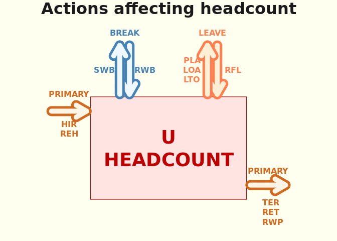<!-- -->

<table class=" lightable-paper lightable-hover" style='color: black; font-family: "Arial Narrow", arial, helvetica, sans-serif; width: auto !important; margin-left: auto; margin-right: auto;'>
<caption>Too many exits</caption>
 <thead>
  <tr>
   <th style="text-align:left;">   </th>
   <th style="text-align:right;"> count of EMPLID's </th>
  </tr>
 </thead>
<tbody>
  <tr>
   <td style="text-align:left;"> break </td>
   <td style="text-align:right;"> 1291 </td>
  </tr>
  <tr>
   <td style="text-align:left;"> leave </td>
   <td style="text-align:right;"> 7990 </td>
  </tr>
  <tr>
   <td style="text-align:left;"> primary </td>
   <td style="text-align:right;"> 18019 </td>
  </tr>
</tbody>
</table>

<table class=" lightable-paper lightable-hover" style='color: black; font-family: "Arial Narrow", arial, helvetica, sans-serif; width: auto !important; margin-left: auto; margin-right: auto;'>
<caption>Too many entries</caption>
 <thead>
  <tr>
   <th style="text-align:left;">   </th>
   <th style="text-align:right;"> count of EMPLID's </th>
  </tr>
 </thead>
<tbody>
  <tr>
   <td style="text-align:left;"> break </td>
   <td style="text-align:right;"> 0 </td>
  </tr>
  <tr>
   <td style="text-align:left;"> leave </td>
   <td style="text-align:right;"> 0 </td>
  </tr>
  <tr>
   <td style="text-align:left;"> primary </td>
   <td style="text-align:right;"> 0 </td>
  </tr>
</tbody>
</table>

### Query

The query below is converted to a view, ds_hr.EMPL_AGE_RANGE_ACTION_MV_V.

SELECT    

  A.EMPLID, A.EMPL_RCD, A.EFFDT, A.EFFSEQ   
    , A.ACTION, B.ACTION_DESCR    
    , A.ACTION_REASON, C.DESCR ACTION_REASON_DESCR, A.JOBCODE, E.DESCR JOB_TITLE    
    , A.DEPTID, F.DESCR DEPT_NAME   
    , Case when A.ACTION ! = 'TER' then ''    
        when A.ACTION  = ('TER') 
        AND A.ACTION_REASON not in ('BNK', 'EVW', 'I9', 'INV', 'NER', 'RFN', 'RIF', 'RLS') 
        then 'Voluntary' else 'Involuntary' end VOLUNTARY_FLAG
    , Case    when (A.EFFDT-D.BIRTHDATE)/365.25 < 20
        then 'Under 20' 
    when (A.EFFDT-D.BIRTHDATE)/365.25 >= 20  and (A.EFFDT-D.BIRTHDATE)/365.25 < 30
        then '20s'
    when (A.EFFDT-D.BIRTHDATE)/365.25 >= 30  and (A.EFFDT-D.BIRTHDATE)/365.25  < 40
        then '30s'
    when (A.EFFDT-D.BIRTHDATE)/365.25 >= 40  and (A.EFFDT-D.BIRTHDATE)/365.25  < 50
        then '40s'
    when (A.EFFDT-D.BIRTHDATE)/365.25 >= 50  and (A.EFFDT-D.BIRTHDATE)/365.25 < 60
        then '50s'
    when (A.EFFDT-D.BIRTHDATE)/365.25 >= 60  and (A.EFFDT-D.BIRTHDATE)/365.25  < 70
        then '60s'
    when (A.EFFDT-D.BIRTHDATE)/365.25 >= 70  and (A.EFFDT-D.BIRTHDATE)/365.25 < 80
        then '70s'
    when (A.EFFDT-D.BIRTHDATE)/365.25 >= 80  and (A.EFFDT-D.BIRTHDATE)/365.25 < 90
        then '80s'
    else '90 and Above'
        end Age_Band
    , Case when LENGTH(A.JOBCODE) = 6
        AND A.JOBCODE NOT LIKE '7%'
        then 'UCareer Job Code'
        else ''
        end UCAREER_JOBCODE_FLAG    
        
FROM    

  PS_UU_UNSEC_JOB_VW A    
    JOIN PS_ACTION_TBL B
        ON (B.ACTION = A.ACTION)
    JOIN PS_ACTN_REASON_TBL C
        ON (C.ACTION = A.ACTION
            AND C.ACTION_REASON = A.ACTION_REASON)
    JOIN ps_personal_dt_fst D
        ON (D.EMPLID = A.EMPLID)
    JOIN PS_JOBCODE_TBL E
        ON (E.JOBCODE = A.JOBCODE)
    JOIN PS_DEPT_TBL F
        ON (F.DEPTID = A.DEPTID)
        
WHERE  A.EFFDT > TO_DATE('2010-01-01','YYYY-MM-DD')   
    
  AND B.EFFDT = (SELECT MAX(B_ED.EFFDT) 
      FROM PS_ACTION_TBL B_ED
      WHERE B.ACTION = B_ED.ACTION
      AND B_ED.EFFDT <= SYSDATE)
  AND C.EFFDT = (SELECT MAX(C_ED.EFFDT) 
      FROM PS_ACTN_REASON_TBL C_ED
      WHERE C.ACTION = C_ED.ACTION
      AND C.ACTION_REASON = C_ED.ACTION_REASON
      AND C_ED.EFFDT <= SYSDATE)
      AND E.EFFDT = (SELECT MAX(E_ED.EFFDT) 
        FROM PS_JOBCODE_TBL E_ED
        WHERE E.JOBCODE = E_ED.JOBCODE
        AND E_ED.EFFDT <= SYSDATE)         
  AND F.EFFDT = (SELECT MAX(F_ED.EFFDT) 
        FROM PS_DEPT_TBL F_ED
        WHERE F.DEPTID = F_ED.DEPTID
        AND F_ED.EFFDT <= SYSDATE)            

ORDER BY A.EMPLID, A.EMPL_RCD, A.EFFDT, A.EFFSEQ

