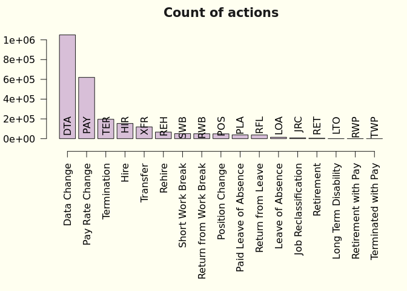
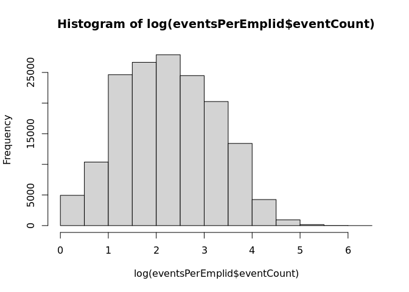
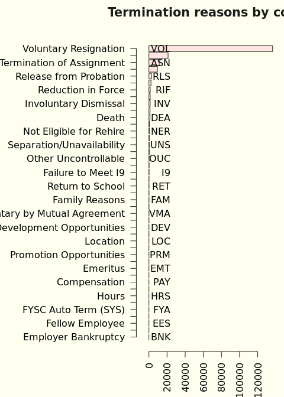
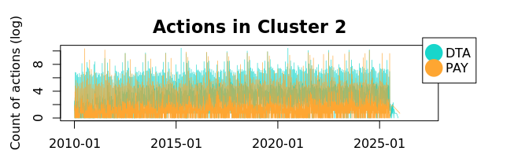
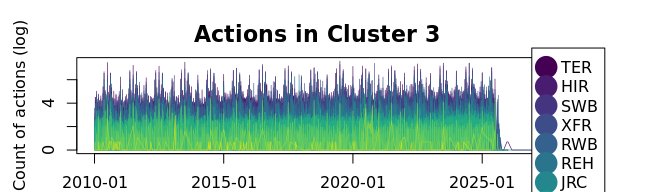

**PURPOSE:**  The purpose of this report is 

**OBJECTIVES:**   

  1.  Describe the "Workforce Journey" data.   
  2.  Summarize data for the target population.    
  3.  Calculate headcount.

**EXECUTIVE SUMMARY:**

The

**SUMMARY:**   

The

## (1) DESCRIBE THE WORKFORCE JOURNEY DATA

### Data summary

Table: Data summary

|                         |            |
|:------------------------|:-----------|
|Name                     |journeyData |
|Number of rows           |2453789     |
|Number of columns        |10          |
|_______________________  |            |
|Column type frequency:   |            |
|character                |6           |
|factor                   |1           |
|numeric                  |2           |
|POSIXct                  |1           |
|________________________ |            |
|Group variables          |None        |

**Variable type: character**

|skim_variable       | n_missing| complete_rate| min| max| empty| n_unique| whitespace|
|:-------------------|---------:|-------------:|---:|---:|-----:|--------:|----------:|
|EMPLID              |         0|          1.00|   8|   8|     0|   158056|          0|
|ACTION              |         0|          1.00|   3|   3|     0|       17|          0|
|ACTION_DESCR        |         0|          1.00|   4|  22|     0|       17|          0|
|ACTION_REASON       |         0|          1.00|   2|   3|     0|      105|          0|
|ACTION_REASON_DESCR |         0|          1.00|   5|  30|     0|      110|          0|
|VOLUNTARY_FLAG      |   2257800|          0.08|   9|  11|     0|        2|          0|

**Variable type: factor**

|skim_variable | n_missing| complete_rate|ordered | n_unique|top_counts                                         |
|:-------------|---------:|-------------:|:-------|--------:|:--------------------------------------------------|
|AGE_BAND      |         0|             1|FALSE   |        9|30s: 736225, 40s: 559854, 20s: 431855, 50s: 326571 |

**Variable type: numeric**

|skim_variable | n_missing| complete_rate| mean|   sd| p0| p25| p50| p75| p100|hist  |
|:-------------|---------:|-------------:|----:|----:|--:|---:|---:|---:|----:|:-----|
|EMPL_RCD      |         0|             1|  0.2| 0.55|  0|   0|   0|   0|   12|▇▁▁▁▁ |
|EFFSEQ        |         0|             1|  0.2| 0.49|  0|   0|   0|   0|   30|▇▁▁▁▁ |

**Variable type: POSIXct**

|skim_variable | n_missing| complete_rate|min        |max        |median     | n_unique|
|:-------------|---------:|-------------:|:----------|:----------|:----------|--------:|
|EFFDT         |         0|             1|2010-01-02 |2027-03-15 |2018-08-23 |     5722|

<table>
<caption>Action and descriptions</caption>
 <thead>
  <tr>
   <th style="text-align:left;"> ACTION </th>
   <th style="text-align:left;"> ACTION_DESCR </th>
   <th style="text-align:right;"> count </th>
  </tr>
 </thead>
<tbody>
  <tr>
   <td style="text-align:left;"> DTA </td>
   <td style="text-align:left;"> Data Change </td>
   <td style="text-align:right;"> 1049427 </td>
  </tr>
  <tr>
   <td style="text-align:left;"> HIR </td>
   <td style="text-align:left;"> Hire </td>
   <td style="text-align:right;"> 153344 </td>
  </tr>
  <tr>
   <td style="text-align:left;"> JRC </td>
   <td style="text-align:left;"> Job Reclassification </td>
   <td style="text-align:right;"> 7498 </td>
  </tr>
  <tr>
   <td style="text-align:left;"> LOA </td>
   <td style="text-align:left;"> Leave of Absence </td>
   <td style="text-align:right;"> 14332 </td>
  </tr>
  <tr>
   <td style="text-align:left;"> LTO </td>
   <td style="text-align:left;"> Long Term Disability </td>
   <td style="text-align:right;"> 481 </td>
  </tr>
  <tr>
   <td style="text-align:left;"> PAY </td>
   <td style="text-align:left;"> Pay Rate Change </td>
   <td style="text-align:right;"> 619978 </td>
  </tr>
  <tr>
   <td style="text-align:left;"> PLA </td>
   <td style="text-align:left;"> Paid Leave of Absence </td>
   <td style="text-align:right;"> 37949 </td>
  </tr>
  <tr>
   <td style="text-align:left;"> POS </td>
   <td style="text-align:left;"> Position Change </td>
   <td style="text-align:right;"> 48522 </td>
  </tr>
  <tr>
   <td style="text-align:left;"> REH </td>
   <td style="text-align:left;"> Rehire </td>
   <td style="text-align:right;"> 66201 </td>
  </tr>
  <tr>
   <td style="text-align:left;"> RET </td>
   <td style="text-align:left;"> Retirement </td>
   <td style="text-align:right;"> 4298 </td>
  </tr>
  <tr>
   <td style="text-align:left;"> RFL </td>
   <td style="text-align:left;"> Return from Leave </td>
   <td style="text-align:right;"> 36977 </td>
  </tr>
  <tr>
   <td style="text-align:left;"> RWB </td>
   <td style="text-align:left;"> Return from Work Break </td>
   <td style="text-align:right;"> 49275 </td>
  </tr>
  <tr>
   <td style="text-align:left;"> RWP </td>
   <td style="text-align:left;"> Retirement with Pay </td>
   <td style="text-align:right;"> 433 </td>
  </tr>
  <tr>
   <td style="text-align:left;"> SWB </td>
   <td style="text-align:left;"> Short Work Break </td>
   <td style="text-align:right;"> 50431 </td>
  </tr>
  <tr>
   <td style="text-align:left;"> TER </td>
   <td style="text-align:left;"> Termination </td>
   <td style="text-align:right;"> 195989 </td>
  </tr>
  <tr>
   <td style="text-align:left;"> TWP </td>
   <td style="text-align:left;"> Terminated with Pay </td>
   <td style="text-align:right;"> 1 </td>
  </tr>
  <tr>
   <td style="text-align:left;"> XFR </td>
   <td style="text-align:left;"> Transfer </td>
   <td style="text-align:right;"> 118653 </td>
  </tr>
</tbody>
</table>

<table>
<caption>Action reasons</caption>
 <thead>
  <tr>
   <th style="text-align:left;"> ACTION_REASON </th>
   <th style="text-align:left;"> ACTION_REASON_DESCR </th>
   <th style="text-align:right;"> count </th>
  </tr>
 </thead>
<tbody>
  <tr>
   <td style="text-align:left;"> 30D </td>
   <td style="text-align:left;"> 30 Day </td>
   <td style="text-align:right;"> 146 </td>
  </tr>
  <tr>
   <td style="text-align:left;"> 90D </td>
   <td style="text-align:left;"> 90 Day </td>
   <td style="text-align:right;"> 56 </td>
  </tr>
  <tr>
   <td style="text-align:left;"> ADJ </td>
   <td style="text-align:left;"> Adjustment </td>
   <td style="text-align:right;"> 104451 </td>
  </tr>
  <tr>
   <td style="text-align:left;"> AML </td>
   <td style="text-align:left;"> Administrative Leave </td>
   <td style="text-align:right;"> 178 </td>
  </tr>
  <tr>
   <td style="text-align:left;"> ASN </td>
   <td style="text-align:left;"> Termination of Assignment </td>
   <td style="text-align:right;"> 12074 </td>
  </tr>
  <tr>
   <td style="text-align:left;"> BAC </td>
   <td style="text-align:left;"> BA Conversion (SYS) </td>
   <td style="text-align:right;"> 32107 </td>
  </tr>
  <tr>
   <td style="text-align:left;"> BEC </td>
   <td style="text-align:left;"> Ben Elig Change (SYS) </td>
   <td style="text-align:right;"> 52816 </td>
  </tr>
  <tr>
   <td style="text-align:left;"> BNK </td>
   <td style="text-align:left;"> Employer Bankruptcy </td>
   <td style="text-align:right;"> 1 </td>
  </tr>
  <tr>
   <td style="text-align:left;"> CDP </td>
   <td style="text-align:left;"> Correction-Department </td>
   <td style="text-align:right;"> 824 </td>
  </tr>
  <tr>
   <td style="text-align:left;"> CJC </td>
   <td style="text-align:left;"> Correction-Job Code </td>
   <td style="text-align:right;"> 869 </td>
  </tr>
  <tr>
   <td style="text-align:left;"> CNT </td>
   <td style="text-align:left;"> Contract (SYS) </td>
   <td style="text-align:right;"> 6740 </td>
  </tr>
  <tr>
   <td style="text-align:left;"> COV </td>
   <td style="text-align:left;"> COVID-19 </td>
   <td style="text-align:right;"> 1453 </td>
  </tr>
  <tr>
   <td style="text-align:left;"> CPR </td>
   <td style="text-align:left;"> Correction-Pay Rate </td>
   <td style="text-align:right;"> 47 </td>
  </tr>
  <tr>
   <td style="text-align:left;"> CRP </td>
   <td style="text-align:left;"> Duplicate EE Record </td>
   <td style="text-align:right;"> 82 </td>
  </tr>
  <tr>
   <td style="text-align:left;"> DEA </td>
   <td style="text-align:left;"> Death </td>
   <td style="text-align:right;"> 1245 </td>
  </tr>
  <tr>
   <td style="text-align:left;"> DEV </td>
   <td style="text-align:left;"> Development Opportunities </td>
   <td style="text-align:right;"> 98 </td>
  </tr>
  <tr>
   <td style="text-align:left;"> DST </td>
   <td style="text-align:left;"> Distribution Change (SYS) </td>
   <td style="text-align:right;"> 522532 </td>
  </tr>
  <tr>
   <td style="text-align:left;"> EAC </td>
   <td style="text-align:left;"> End Employment Agreement </td>
   <td style="text-align:right;"> 485 </td>
  </tr>
  <tr>
   <td style="text-align:left;"> EES </td>
   <td style="text-align:left;"> Fellow Employee </td>
   <td style="text-align:right;"> 4 </td>
  </tr>
  <tr>
   <td style="text-align:left;"> EMT </td>
   <td style="text-align:left;"> Emeritus </td>
   <td style="text-align:right;"> 699 </td>
  </tr>
  <tr>
   <td style="text-align:left;"> ERT </td>
   <td style="text-align:left;"> Early Retirement </td>
   <td style="text-align:right;"> 287 </td>
  </tr>
  <tr>
   <td style="text-align:left;"> EVW </td>
   <td style="text-align:left;"> E-Verify Withdrawal </td>
   <td style="text-align:right;"> 29 </td>
  </tr>
  <tr>
   <td style="text-align:left;"> EXT </td>
   <td style="text-align:left;"> Extension </td>
   <td style="text-align:right;"> 2017 </td>
  </tr>
  <tr>
   <td style="text-align:left;"> FAM </td>
   <td style="text-align:left;"> Family Reasons </td>
   <td style="text-align:right;"> 149 </td>
  </tr>
  <tr>
   <td style="text-align:left;"> FCA </td>
   <td style="text-align:left;"> FICA Status Change (SYS) </td>
   <td style="text-align:right;"> 188376 </td>
  </tr>
  <tr>
   <td style="text-align:left;"> FLS </td>
   <td style="text-align:left;"> Pay Adj - FLSA Reg(SYS) </td>
   <td style="text-align:right;"> 578 </td>
  </tr>
  <tr>
   <td style="text-align:left;"> FML </td>
   <td style="text-align:left;"> Family and Medical Leave Act </td>
   <td style="text-align:right;"> 38711 </td>
  </tr>
  <tr>
   <td style="text-align:left;"> FTE </td>
   <td style="text-align:left;"> FTE Change </td>
   <td style="text-align:right;"> 1081 </td>
  </tr>
  <tr>
   <td style="text-align:left;"> FUR </td>
   <td style="text-align:left;"> Furlough </td>
   <td style="text-align:right;"> 450 </td>
  </tr>
  <tr>
   <td style="text-align:left;"> FYA </td>
   <td style="text-align:left;"> FYSC Auto Term (SYS) </td>
   <td style="text-align:right;"> 8 </td>
  </tr>
  <tr>
   <td style="text-align:left;"> FYB </td>
   <td style="text-align:left;"> FY Budget (SYS) </td>
   <td style="text-align:right;"> 136527 </td>
  </tr>
  <tr>
   <td style="text-align:left;"> FYB </td>
   <td style="text-align:left;"> Fiscal Year Budget (SYS) </td>
   <td style="text-align:right;"> 136527 </td>
  </tr>
  <tr>
   <td style="text-align:left;"> FYF </td>
   <td style="text-align:left;"> FY Increase </td>
   <td style="text-align:right;"> 179797 </td>
  </tr>
  <tr>
   <td style="text-align:left;"> FYF </td>
   <td style="text-align:left;"> FYSC Terms (SYS) </td>
   <td style="text-align:right;"> 179797 </td>
  </tr>
  <tr>
   <td style="text-align:left;"> FYR </td>
   <td style="text-align:left;"> FY Raise </td>
   <td style="text-align:right;"> 4987 </td>
  </tr>
  <tr>
   <td style="text-align:left;"> FYS </td>
   <td style="text-align:left;"> FYSC Summer Term (SYS) </td>
   <td style="text-align:right;"> 1439 </td>
  </tr>
  <tr>
   <td style="text-align:left;"> H2U </td>
   <td style="text-align:left;"> Hospital to University </td>
   <td style="text-align:right;"> 1281 </td>
  </tr>
  <tr>
   <td style="text-align:left;"> HCJ </td>
   <td style="text-align:left;"> Hire Concurrent Job </td>
   <td style="text-align:right;"> 32277 </td>
  </tr>
  <tr>
   <td style="text-align:left;"> HEA </td>
   <td style="text-align:left;"> Medical LOA Option B </td>
   <td style="text-align:right;"> 734 </td>
  </tr>
  <tr>
   <td style="text-align:left;"> HEA </td>
   <td style="text-align:left;"> Medical(Not protected by FMLA) </td>
   <td style="text-align:right;"> 734 </td>
  </tr>
  <tr>
   <td style="text-align:left;"> HRS </td>
   <td style="text-align:left;"> Hours </td>
   <td style="text-align:right;"> 22 </td>
  </tr>
  <tr>
   <td style="text-align:left;"> HTH </td>
   <td style="text-align:left;"> Health-Related Issues </td>
   <td style="text-align:right;"> 43 </td>
  </tr>
  <tr>
   <td style="text-align:left;"> I9 </td>
   <td style="text-align:left;"> Failure to Meet I9 </td>
   <td style="text-align:right;"> 219 </td>
  </tr>
  <tr>
   <td style="text-align:left;"> ICR </td>
   <td style="text-align:left;"> Detach from Incorrect ID </td>
   <td style="text-align:right;"> 22 </td>
  </tr>
  <tr>
   <td style="text-align:left;"> IDT </td>
   <td style="text-align:left;"> Involuntary Demotion Transfer </td>
   <td style="text-align:right;"> 1 </td>
  </tr>
  <tr>
   <td style="text-align:left;"> INT </td>
   <td style="text-align:left;"> Interim Pay </td>
   <td style="text-align:right;"> 5 </td>
  </tr>
  <tr>
   <td style="text-align:left;"> INV </td>
   <td style="text-align:left;"> Involuntary Dismissal </td>
   <td style="text-align:right;"> 1421 </td>
  </tr>
  <tr>
   <td style="text-align:left;"> JCC </td>
   <td style="text-align:left;"> Job Code Consolidation </td>
   <td style="text-align:right;"> 5 </td>
  </tr>
  <tr>
   <td style="text-align:left;"> JIN </td>
   <td style="text-align:left;"> Job Information </td>
   <td style="text-align:right;"> 97856 </td>
  </tr>
  <tr>
   <td style="text-align:left;"> JIN </td>
   <td style="text-align:left;"> Job Info </td>
   <td style="text-align:right;"> 97856 </td>
  </tr>
  <tr>
   <td style="text-align:left;"> JOB </td>
   <td style="text-align:left;"> Separation/Job Abandonment </td>
   <td style="text-align:right;"> 401 </td>
  </tr>
  <tr>
   <td style="text-align:left;"> JRC </td>
   <td style="text-align:left;"> Job Reclassification </td>
   <td style="text-align:right;"> 7179 </td>
  </tr>
  <tr>
   <td style="text-align:left;"> LAT </td>
   <td style="text-align:left;"> Lateral Transfer </td>
   <td style="text-align:right;"> 30578 </td>
  </tr>
  <tr>
   <td style="text-align:left;"> LOA </td>
   <td style="text-align:left;"> LOA Without Pay </td>
   <td style="text-align:right;"> 2991 </td>
  </tr>
  <tr>
   <td style="text-align:left;"> LOC </td>
   <td style="text-align:left;"> Location </td>
   <td style="text-align:right;"> 54 </td>
  </tr>
  <tr>
   <td style="text-align:left;"> LTD </td>
   <td style="text-align:left;"> Long Term Disability </td>
   <td style="text-align:right;"> 394 </td>
  </tr>
  <tr>
   <td style="text-align:left;"> LTD </td>
   <td style="text-align:left;"> Long-Term Disability </td>
   <td style="text-align:right;"> 394 </td>
  </tr>
  <tr>
   <td style="text-align:left;"> LTO </td>
   <td style="text-align:left;"> Long Term Disability </td>
   <td style="text-align:right;"> 481 </td>
  </tr>
  <tr>
   <td style="text-align:left;"> LWF </td>
   <td style="text-align:left;"> Leaving the Workforce </td>
   <td style="text-align:right;"> 111 </td>
  </tr>
  <tr>
   <td style="text-align:left;"> MER </td>
   <td style="text-align:left;"> Merit (SYS) </td>
   <td style="text-align:right;"> 85490 </td>
  </tr>
  <tr>
   <td style="text-align:left;"> MIL </td>
   <td style="text-align:left;"> Military Service </td>
   <td style="text-align:right;"> 996 </td>
  </tr>
  <tr>
   <td style="text-align:left;"> MKT </td>
   <td style="text-align:left;"> Market Equity Adjustment (SYS) </td>
   <td style="text-align:right;"> 78013 </td>
  </tr>
  <tr>
   <td style="text-align:left;"> MLA </td>
   <td style="text-align:left;"> Medical Leave of Absence Opt A </td>
   <td style="text-align:right;"> 3146 </td>
  </tr>
  <tr>
   <td style="text-align:left;"> MLB </td>
   <td style="text-align:left;"> Medical Leave of Absence Opt B </td>
   <td style="text-align:right;"> 633 </td>
  </tr>
  <tr>
   <td style="text-align:left;"> NER </td>
   <td style="text-align:left;"> Not Eligible for Rehire </td>
   <td style="text-align:right;"> 435 </td>
  </tr>
  <tr>
   <td style="text-align:left;"> NEW </td>
   <td style="text-align:left;"> New Position </td>
   <td style="text-align:right;"> 60 </td>
  </tr>
  <tr>
   <td style="text-align:left;"> NHR </td>
   <td style="text-align:left;"> New Hire </td>
   <td style="text-align:right;"> 121067 </td>
  </tr>
  <tr>
   <td style="text-align:left;"> NRC </td>
   <td style="text-align:left;"> Non Renewal of Contract </td>
   <td style="text-align:right;"> 1488 </td>
  </tr>
  <tr>
   <td style="text-align:left;"> OCN </td>
   <td style="text-align:left;"> Other Controllable </td>
   <td style="text-align:right;"> 142 </td>
  </tr>
  <tr>
   <td style="text-align:left;"> OTH </td>
   <td style="text-align:left;"> Other Information </td>
   <td style="text-align:right;"> 120289 </td>
  </tr>
  <tr>
   <td style="text-align:left;"> OUC </td>
   <td style="text-align:left;"> Other Uncontrollable </td>
   <td style="text-align:right;"> 277 </td>
  </tr>
  <tr>
   <td style="text-align:left;"> PAR </td>
   <td style="text-align:left;"> Parental Leave </td>
   <td style="text-align:right;"> 167 </td>
  </tr>
  <tr>
   <td style="text-align:left;"> PAY </td>
   <td style="text-align:left;"> Compensation </td>
   <td style="text-align:right;"> 28 </td>
  </tr>
  <tr>
   <td style="text-align:left;"> PDU </td>
   <td style="text-align:left;"> Position Data Update </td>
   <td style="text-align:right;"> 14898 </td>
  </tr>
  <tr>
   <td style="text-align:left;"> PHS </td>
   <td style="text-align:left;"> Phased Retirement </td>
   <td style="text-align:right;"> 34 </td>
  </tr>
  <tr>
   <td style="text-align:left;"> PLA </td>
   <td style="text-align:left;"> Paid LOA </td>
   <td style="text-align:right;"> 901 </td>
  </tr>
  <tr>
   <td style="text-align:left;"> PRM </td>
   <td style="text-align:left;"> Promotion Opportunities </td>
   <td style="text-align:right;"> 49 </td>
  </tr>
  <tr>
   <td style="text-align:left;"> PRO </td>
   <td style="text-align:left;"> Promotion </td>
   <td style="text-align:right;"> 30972 </td>
  </tr>
  <tr>
   <td style="text-align:left;"> PSB </td>
   <td style="text-align:left;"> Paid Sabbatical Leave </td>
   <td style="text-align:right;"> 384 </td>
  </tr>
  <tr>
   <td style="text-align:left;"> RCJ </td>
   <td style="text-align:left;"> Rehire Concurrent Job </td>
   <td style="text-align:right;"> 2 </td>
  </tr>
  <tr>
   <td style="text-align:left;"> REC </td>
   <td style="text-align:left;"> Job Reclassification </td>
   <td style="text-align:right;"> 7708 </td>
  </tr>
  <tr>
   <td style="text-align:left;"> REH </td>
   <td style="text-align:left;"> Rehire </td>
   <td style="text-align:right;"> 66199 </td>
  </tr>
  <tr>
   <td style="text-align:left;"> REL </td>
   <td style="text-align:left;"> Relocation </td>
   <td style="text-align:right;"> 156 </td>
  </tr>
  <tr>
   <td style="text-align:left;"> RET </td>
   <td style="text-align:left;"> Regular Retirement </td>
   <td style="text-align:right;"> 3693 </td>
  </tr>
  <tr>
   <td style="text-align:left;"> RET </td>
   <td style="text-align:left;"> Return to School </td>
   <td style="text-align:right;"> 3693 </td>
  </tr>
  <tr>
   <td style="text-align:left;"> RFL </td>
   <td style="text-align:left;"> Return From Leave </td>
   <td style="text-align:right;"> 27340 </td>
  </tr>
  <tr>
   <td style="text-align:left;"> RFN </td>
   <td style="text-align:left;"> RIF/NER </td>
   <td style="text-align:right;"> 1 </td>
  </tr>
  <tr>
   <td style="text-align:left;"> RIF </td>
   <td style="text-align:left;"> Reduction in Force </td>
   <td style="text-align:right;"> 1456 </td>
  </tr>
  <tr>
   <td style="text-align:left;"> RLS </td>
   <td style="text-align:left;"> Release from Probation </td>
   <td style="text-align:right;"> 2845 </td>
  </tr>
  <tr>
   <td style="text-align:left;"> ROR </td>
   <td style="text-align:left;"> Reorganization </td>
   <td style="text-align:right;"> 7181 </td>
  </tr>
  <tr>
   <td style="text-align:left;"> RPL </td>
   <td style="text-align:left;"> Return from Paid Leave </td>
   <td style="text-align:right;"> 9551 </td>
  </tr>
  <tr>
   <td style="text-align:left;"> RWB </td>
   <td style="text-align:left;"> Return from Work Break </td>
   <td style="text-align:right;"> 49275 </td>
  </tr>
  <tr>
   <td style="text-align:left;"> RWP </td>
   <td style="text-align:left;"> Retirement With Pay </td>
   <td style="text-align:right;"> 1 </td>
  </tr>
  <tr>
   <td style="text-align:left;"> SEP </td>
   <td style="text-align:left;"> Separation Other </td>
   <td style="text-align:right;"> 240 </td>
  </tr>
  <tr>
   <td style="text-align:left;"> SMR </td>
   <td style="text-align:left;"> Summer Assignment </td>
   <td style="text-align:right;"> 2299 </td>
  </tr>
  <tr>
   <td style="text-align:left;"> SRP </td>
   <td style="text-align:left;"> Special Retirement Plan </td>
   <td style="text-align:right;"> 233 </td>
  </tr>
  <tr>
   <td style="text-align:left;"> STA </td>
   <td style="text-align:left;"> Position Status Change </td>
   <td style="text-align:right;"> 33564 </td>
  </tr>
  <tr>
   <td style="text-align:left;"> SWB </td>
   <td style="text-align:left;"> Short Work Break </td>
   <td style="text-align:right;"> 49154 </td>
  </tr>
  <tr>
   <td style="text-align:left;"> TMP </td>
   <td style="text-align:left;"> End PT/Non-BenefitsEmployment </td>
   <td style="text-align:right;"> 21172 </td>
  </tr>
  <tr>
   <td style="text-align:left;"> TWP </td>
   <td style="text-align:left;"> Termination With Pay </td>
   <td style="text-align:right;"> 1 </td>
  </tr>
  <tr>
   <td style="text-align:left;"> TYP </td>
   <td style="text-align:left;"> Type of Work </td>
   <td style="text-align:right;"> 47 </td>
  </tr>
  <tr>
   <td style="text-align:left;"> U2H </td>
   <td style="text-align:left;"> Voluntary Xfr to Hospital </td>
   <td style="text-align:right;"> 88 </td>
  </tr>
  <tr>
   <td style="text-align:left;"> UNS </td>
   <td style="text-align:left;"> Separation/Unavailability </td>
   <td style="text-align:right;"> 397 </td>
  </tr>
  <tr>
   <td style="text-align:left;"> VDT </td>
   <td style="text-align:left;"> Voluntary Demotion Transfer </td>
   <td style="text-align:right;"> 6 </td>
  </tr>
  <tr>
   <td style="text-align:left;"> VMA </td>
   <td style="text-align:left;"> Voluntary by Mutual Agreement </td>
   <td style="text-align:right;"> 102 </td>
  </tr>
  <tr>
   <td style="text-align:left;"> VOL </td>
   <td style="text-align:left;"> Voluntary Resignation </td>
   <td style="text-align:right;"> 136828 </td>
  </tr>
  <tr>
   <td style="text-align:left;"> WC </td>
   <td style="text-align:left;"> Workers Compensation Leave </td>
   <td style="text-align:right;"> 379 </td>
  </tr>
  <tr>
   <td style="text-align:left;"> WC </td>
   <td style="text-align:left;"> Worker's Comp-Leave Supplement </td>
   <td style="text-align:right;"> 379 </td>
  </tr>
  <tr>
   <td style="text-align:left;"> WEC </td>
   <td style="text-align:left;"> Well Elig Chg (SYS) </td>
   <td style="text-align:right;"> 58058 </td>
  </tr>
  <tr>
   <td style="text-align:left;"> WOR </td>
   <td style="text-align:left;"> Work Conditions or Environment </td>
   <td style="text-align:right;"> 10 </td>
  </tr>
  <tr>
   <td style="text-align:left;"> WPA </td>
   <td style="text-align:left;"> Workplace Accomodations </td>
   <td style="text-align:right;"> 370 </td>
  </tr>
  <tr>
   <td style="text-align:left;"> XFR </td>
   <td style="text-align:left;"> Transfer </td>
   <td style="text-align:right;"> 48546 </td>
  </tr>
</tbody>
</table>

<!-- -->

<!-- -->

<!-- -->

# Count of actions per date

<!-- --><!-- --><!-- -->

### Query

The query below is converted to a view, ds_hr.EMPL_AGE_RANGE_ACTION_MV_V.

"SELECT A.EMPLID, A.EMPL_RCD, A.EFFDT, A.EFFSEQ
    , A.ACTION, B.ACTION_DESCR
    , A.ACTION_REASON, C.DESCR ACTION_REASON_DESCR
    , Case when A.ACTION ! = 'TER' then ''
        when A.ACTION  = ('TER') 
        AND A.ACTION_REASON not in ('BNK', 'EVW', 'I9', 'INV', 'NER', 'RFN', 'RIF', 'RLS') 
        then 'Voluntary' else 'Involuntary' end VOLUNTARY_FLAG
    , Case    when (SYSDATE-D.BIRTHDATE)/365.25 < 20
        then 'Under 20' 
    when (SYSDATE-D.BIRTHDATE)/365.25 >= 20  and (SYSDATE-D.BIRTHDATE)/365.25 < 30
        then '20s'
    when (SYSDATE-D.BIRTHDATE)/365.25 >= 30  and (SYSDATE-D.BIRTHDATE)/365.25  < 40
        then '30s'
    when (SYSDATE-D.BIRTHDATE)/365.25 >= 40  and (SYSDATE-D.BIRTHDATE)/365.25  < 50
        then '40s'
    when (SYSDATE-D.BIRTHDATE)/365.25 >= 50  and (SYSDATE-D.BIRTHDATE)/365.25 < 60
        then '50s'
    when (SYSDATE-D.BIRTHDATE)/365.25 >= 60  and (SYSDATE-D.BIRTHDATE)/365.25  < 70
        then '60s'
    when (SYSDATE-D.BIRTHDATE)/365.25 >= 70  and (SYSDATE-D.BIRTHDATE)/365.25 < 80
        then '70s'
    when (SYSDATE-D.BIRTHDATE)/365.25 >= 80  and (SYSDATE-D.BIRTHDATE)/365.25 < 90
        then '80s'
    else '90 and Above'
        end Age_Band
        
FROM PS_UU_UNSEC_JOB_VW A
  JOIN PS_ACTION_TBL B
    ON (B.ACTION = A.ACTION
    AND B.EFFDT =
        (SELECT MAX(B_ED.EFFDT) FROM PS_ACTION_TBL B_ED
        WHERE B.ACTION = B_ED.ACTION
          AND B_ED.EFFDT <= SYSDATE))
  JOIN PS_ACTN_REASON_TBL C
    ON (C.ACTION = A.ACTION
     AND C.ACTION_REASON = A.ACTION_REASON
     AND C.EFFDT =
        (SELECT MAX(C_ED.EFFDT) FROM PS_ACTN_REASON_TBL C_ED
        WHERE C.ACTION = C_ED.ACTION
          AND C.ACTION_REASON = C_ED.ACTION_REASON
          AND C_ED.EFFDT <= SYSDATE))
    JOIN ps_personal_dt_fst D
        ON (D.EMPLID = A.EMPLID)
        
WHERE  A.EFFDT > TO_DATE('2010-01-01','YYYY-MM-DD')
    ORDER BY A.EMPLID, A.EMPL_RCD, A.EFFDT"
