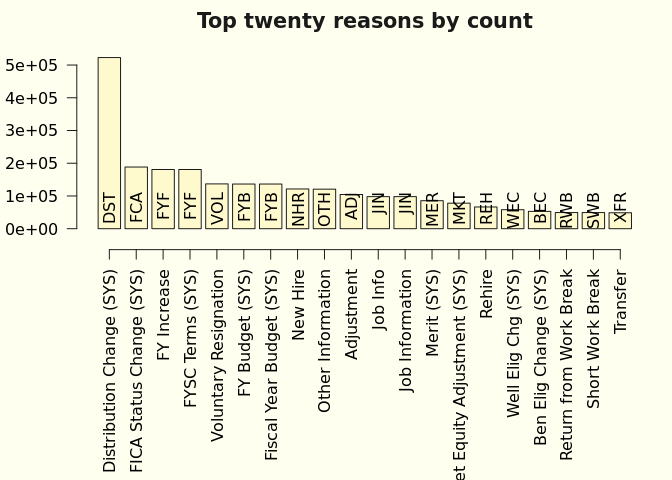

**PURPOSE:**  The purpose of this report is 

**OBJECTIVES:**   

  1.  Describe the "Workforce Journey" data.   
  2.  Check internal consistency.

Here or elsewhere:

Summarize data for the target population.
Calculate headcount.

**EXECUTIVE SUMMARY:**

The

**SUMMARY:**   

One row with a bad date ("2202-11-21") is filtered out.

Several of these actions look like they overlap as far as I'm concerned--
"RET" or "TERM"

I want a query that just pulls the actions, reasons, and descriptions.

Do I look at the correlation between actions and reasons?

I need to develop queries that produce the tables below (like a table for every action, and every action/reason pair.)

Then I'd like to create a table that 

## (1) DESCRIBE THE WORKFORCE JOURNEY DATA

### Data summary

Table: Data summary

|                         |            |
|:------------------------|:-----------|
|Name                     |journeyData |
|Number of rows           |2454825     |
|Number of columns        |12          |
|_______________________  |            |
|Column type frequency:   |            |
|character                |8           |
|factor                   |1           |
|numeric                  |2           |
|POSIXct                  |1           |
|________________________ |            |
|Group variables          |None        |

**Variable type: character**

|skim_variable       | n_missing| complete_rate| min| max| empty| n_unique| whitespace|
|:-------------------|---------:|-------------:|---:|---:|-----:|--------:|----------:|
|ACTION              |         0|          1.00|   3|   3|     0|       17|          0|
|EMPLID              |         0|          1.00|   8|   8|     0|   158233|          0|
|ACTION_DESCR        |         0|          1.00|   4|  22|     0|       17|          0|
|ACTION_REASON       |         0|          1.00|   2|   3|     0|      105|          0|
|ACTION_REASON_DESCR |         0|          1.00|   5|  30|     0|      110|          0|
|VOLUNTARY_FLAG      |   2258709|          0.08|   9|  11|     0|        2|          0|
|boundary            |   1844608|          0.25|   4|   5|     0|        2|          0|
|boundary_type       |   1844608|          0.25|   5|   7|     0|        3|          0|

**Variable type: factor**

|skim_variable | n_missing| complete_rate|ordered | n_unique|top_counts                                         |
|:-------------|---------:|-------------:|:-------|--------:|:--------------------------------------------------|
|AGE_BAND      |         0|             1|FALSE   |        9|30s: 736390, 40s: 560403, 20s: 431784, 50s: 326605 |

**Variable type: numeric**

|skim_variable | n_missing| complete_rate| mean|   sd| p0| p25| p50| p75| p100|hist  |
|:-------------|---------:|-------------:|----:|----:|--:|---:|---:|---:|----:|:-----|
|EMPL_RCD      |         0|             1|  0.2| 0.55|  0|   0|   0|   0|   12|▇▁▁▁▁ |
|EFFSEQ        |         0|             1|  0.2| 0.49|  0|   0|   0|   0|   30|▇▁▁▁▁ |

**Variable type: POSIXct**

|skim_variable | n_missing| complete_rate|min        |max        |median     | n_unique|
|:-------------|---------:|-------------:|:----------|:----------|:----------|--------:|
|EFFDT         |         0|             1|2010-01-02 |2027-03-15 |2018-08-27 |     5723|

<table class="table" style="color: black; width: auto !important; margin-left: auto; margin-right: auto;">
<caption>Actions and unique associated reasons</caption>
 <thead>
  <tr>
   <th style="text-align:left;">  </th>
   <th style="text-align:left;"> description </th>
   <th style="text-align:right;"> count </th>
   <th style="text-align:right;"> unique
reasons </th>
  </tr>
 </thead>
<tbody>
  <tr>
   <td style="text-align:left;"> DTA </td>
   <td style="text-align:left;"> Data Change </td>
   <td style="text-align:right;"> 1049741 </td>
   <td style="text-align:right;"> 16 </td>
  </tr>
  <tr>
   <td style="text-align:left;"> HIR </td>
   <td style="text-align:left;"> Hire </td>
   <td style="text-align:right;"> 153531 </td>
   <td style="text-align:right;"> 2 </td>
  </tr>
  <tr>
   <td style="text-align:left;"> JRC </td>
   <td style="text-align:left;"> Job Reclassification </td>
   <td style="text-align:right;"> 7498 </td>
   <td style="text-align:right;"> 2 </td>
  </tr>
  <tr>
   <td style="text-align:left;"> LOA </td>
   <td style="text-align:left;"> Leave of Absence </td>
   <td style="text-align:right;"> 14355 </td>
   <td style="text-align:right;"> 15 </td>
  </tr>
  <tr>
   <td style="text-align:left;"> LTO </td>
   <td style="text-align:left;"> Long Term Disability </td>
   <td style="text-align:right;"> 481 </td>
   <td style="text-align:right;"> 1 </td>
  </tr>
  <tr>
   <td style="text-align:left;"> PAY </td>
   <td style="text-align:left;"> Pay Rate Change </td>
   <td style="text-align:right;"> 620096 </td>
   <td style="text-align:right;"> 11 </td>
  </tr>
  <tr>
   <td style="text-align:left;"> PLA </td>
   <td style="text-align:left;"> Paid Leave of Absence </td>
   <td style="text-align:right;"> 37987 </td>
   <td style="text-align:right;"> 17 </td>
  </tr>
  <tr>
   <td style="text-align:left;"> POS </td>
   <td style="text-align:left;"> Position Change </td>
   <td style="text-align:right;"> 48522 </td>
   <td style="text-align:right;"> 3 </td>
  </tr>
  <tr>
   <td style="text-align:left;"> REH </td>
   <td style="text-align:left;"> Rehire </td>
   <td style="text-align:right;"> 66274 </td>
   <td style="text-align:right;"> 2 </td>
  </tr>
  <tr>
   <td style="text-align:left;"> RET </td>
   <td style="text-align:left;"> Retirement </td>
   <td style="text-align:right;"> 4304 </td>
   <td style="text-align:right;"> 5 </td>
  </tr>
  <tr>
   <td style="text-align:left;"> RFL </td>
   <td style="text-align:left;"> Return from Leave </td>
   <td style="text-align:right;"> 37005 </td>
   <td style="text-align:right;"> 3 </td>
  </tr>
  <tr>
   <td style="text-align:left;"> RWB </td>
   <td style="text-align:left;"> Return from Work Break </td>
   <td style="text-align:right;"> 49295 </td>
   <td style="text-align:right;"> 1 </td>
  </tr>
  <tr>
   <td style="text-align:left;"> RWP </td>
   <td style="text-align:left;"> Retirement with Pay </td>
   <td style="text-align:right;"> 433 </td>
   <td style="text-align:right;"> 3 </td>
  </tr>
  <tr>
   <td style="text-align:left;"> SWB </td>
   <td style="text-align:left;"> Short Work Break </td>
   <td style="text-align:right;"> 50436 </td>
   <td style="text-align:right;"> 2 </td>
  </tr>
  <tr>
   <td style="text-align:left;"> TER </td>
   <td style="text-align:left;"> Termination </td>
   <td style="text-align:right;"> 196116 </td>
   <td style="text-align:right;"> 43 </td>
  </tr>
  <tr>
   <td style="text-align:left;"> TWP </td>
   <td style="text-align:left;"> Terminated with Pay </td>
   <td style="text-align:right;"> 1 </td>
   <td style="text-align:right;"> 1 </td>
  </tr>
  <tr>
   <td style="text-align:left;"> XFR </td>
   <td style="text-align:left;"> Transfer </td>
   <td style="text-align:right;"> 118750 </td>
   <td style="text-align:right;"> 8 </td>
  </tr>
</tbody>
</table>

<!-- -->

<table class="table" style="color: black; width: auto !important; margin-left: auto; margin-right: auto;">
<caption>Action reasons</caption>
 <thead>
  <tr>
   <th style="text-align:left;position: sticky; top:0; background-color: #FFFFFF;">  </th>
   <th style="text-align:left;position: sticky; top:0; background-color: #FFFFFF;"> description </th>
   <th style="text-align:right;position: sticky; top:0; background-color: #FFFFFF;"> count </th>
  </tr>
 </thead>
<tbody>
  <tr>
   <td style="text-align:left;"> 30D </td>
   <td style="text-align:left;"> 30 Day </td>
   <td style="text-align:right;"> 147 </td>
  </tr>
  <tr>
   <td style="text-align:left;"> 90D </td>
   <td style="text-align:left;"> 90 Day </td>
   <td style="text-align:right;"> 56 </td>
  </tr>
  <tr>
   <td style="text-align:left;"> ADJ </td>
   <td style="text-align:left;"> Adjustment </td>
   <td style="text-align:right;"> 104464 </td>
  </tr>
  <tr>
   <td style="text-align:left;"> AML </td>
   <td style="text-align:left;"> Administrative Leave </td>
   <td style="text-align:right;"> 178 </td>
  </tr>
  <tr>
   <td style="text-align:left;"> ASN </td>
   <td style="text-align:left;"> Termination of Assignment </td>
   <td style="text-align:right;"> 12115 </td>
  </tr>
  <tr>
   <td style="text-align:left;"> BAC </td>
   <td style="text-align:left;"> BA Conversion (SYS) </td>
   <td style="text-align:right;"> 32107 </td>
  </tr>
  <tr>
   <td style="text-align:left;"> BEC </td>
   <td style="text-align:left;"> Ben Elig Change (SYS) </td>
   <td style="text-align:right;"> 52897 </td>
  </tr>
  <tr>
   <td style="text-align:left;"> BNK </td>
   <td style="text-align:left;"> Employer Bankruptcy </td>
   <td style="text-align:right;"> 1 </td>
  </tr>
  <tr>
   <td style="text-align:left;"> CDP </td>
   <td style="text-align:left;"> Correction-Department </td>
   <td style="text-align:right;"> 824 </td>
  </tr>
  <tr>
   <td style="text-align:left;"> CJC </td>
   <td style="text-align:left;"> Correction-Job Code </td>
   <td style="text-align:right;"> 869 </td>
  </tr>
  <tr>
   <td style="text-align:left;"> CNT </td>
   <td style="text-align:left;"> Contract (SYS) </td>
   <td style="text-align:right;"> 6691 </td>
  </tr>
  <tr>
   <td style="text-align:left;"> COV </td>
   <td style="text-align:left;"> COVID-19 </td>
   <td style="text-align:right;"> 1453 </td>
  </tr>
  <tr>
   <td style="text-align:left;"> CPR </td>
   <td style="text-align:left;"> Correction-Pay Rate </td>
   <td style="text-align:right;"> 47 </td>
  </tr>
  <tr>
   <td style="text-align:left;"> CRP </td>
   <td style="text-align:left;"> Duplicate EE Record </td>
   <td style="text-align:right;"> 83 </td>
  </tr>
  <tr>
   <td style="text-align:left;"> DEA </td>
   <td style="text-align:left;"> Death </td>
   <td style="text-align:right;"> 1245 </td>
  </tr>
  <tr>
   <td style="text-align:left;"> DEV </td>
   <td style="text-align:left;"> Development Opportunities </td>
   <td style="text-align:right;"> 101 </td>
  </tr>
  <tr>
   <td style="text-align:left;"> DST </td>
   <td style="text-align:left;"> Distribution Change (SYS) </td>
   <td style="text-align:right;"> 522598 </td>
  </tr>
  <tr>
   <td style="text-align:left;"> EAC </td>
   <td style="text-align:left;"> End Employment Agreement </td>
   <td style="text-align:right;"> 485 </td>
  </tr>
  <tr>
   <td style="text-align:left;"> EES </td>
   <td style="text-align:left;"> Fellow Employee </td>
   <td style="text-align:right;"> 4 </td>
  </tr>
  <tr>
   <td style="text-align:left;"> EMT </td>
   <td style="text-align:left;"> Emeritus </td>
   <td style="text-align:right;"> 700 </td>
  </tr>
  <tr>
   <td style="text-align:left;"> ERT </td>
   <td style="text-align:left;"> Early Retirement </td>
   <td style="text-align:right;"> 287 </td>
  </tr>
  <tr>
   <td style="text-align:left;"> EVW </td>
   <td style="text-align:left;"> E-Verify Withdrawal </td>
   <td style="text-align:right;"> 29 </td>
  </tr>
  <tr>
   <td style="text-align:left;"> EXT </td>
   <td style="text-align:left;"> Extension </td>
   <td style="text-align:right;"> 2021 </td>
  </tr>
  <tr>
   <td style="text-align:left;"> FAM </td>
   <td style="text-align:left;"> Family Reasons </td>
   <td style="text-align:right;"> 149 </td>
  </tr>
  <tr>
   <td style="text-align:left;"> FCA </td>
   <td style="text-align:left;"> FICA Status Change (SYS) </td>
   <td style="text-align:right;"> 188376 </td>
  </tr>
  <tr>
   <td style="text-align:left;"> FLS </td>
   <td style="text-align:left;"> Pay Adj - FLSA Reg(SYS) </td>
   <td style="text-align:right;"> 578 </td>
  </tr>
  <tr>
   <td style="text-align:left;"> FML </td>
   <td style="text-align:left;"> Family and Medical Leave Act </td>
   <td style="text-align:right;"> 38747 </td>
  </tr>
  <tr>
   <td style="text-align:left;"> FTE </td>
   <td style="text-align:left;"> FTE Change </td>
   <td style="text-align:right;"> 1081 </td>
  </tr>
  <tr>
   <td style="text-align:left;"> FUR </td>
   <td style="text-align:left;"> Furlough </td>
   <td style="text-align:right;"> 450 </td>
  </tr>
  <tr>
   <td style="text-align:left;"> FYA </td>
   <td style="text-align:left;"> FYSC Auto Term (SYS) </td>
   <td style="text-align:right;"> 8 </td>
  </tr>
  <tr>
   <td style="text-align:left;"> FYB </td>
   <td style="text-align:left;"> FY Budget (SYS) </td>
   <td style="text-align:right;"> 136465 </td>
  </tr>
  <tr>
   <td style="text-align:left;"> FYB </td>
   <td style="text-align:left;"> Fiscal Year Budget (SYS) </td>
   <td style="text-align:right;"> 136465 </td>
  </tr>
  <tr>
   <td style="text-align:left;"> FYF </td>
   <td style="text-align:left;"> FYSC Terms (SYS) </td>
   <td style="text-align:right;"> 179963 </td>
  </tr>
  <tr>
   <td style="text-align:left;"> FYF </td>
   <td style="text-align:left;"> FY Increase </td>
   <td style="text-align:right;"> 179963 </td>
  </tr>
  <tr>
   <td style="text-align:left;"> FYR </td>
   <td style="text-align:left;"> FY Raise </td>
   <td style="text-align:right;"> 4987 </td>
  </tr>
  <tr>
   <td style="text-align:left;"> FYS </td>
   <td style="text-align:left;"> FYSC Summer Term (SYS) </td>
   <td style="text-align:right;"> 1440 </td>
  </tr>
  <tr>
   <td style="text-align:left;"> H2U </td>
   <td style="text-align:left;"> Hospital to University </td>
   <td style="text-align:right;"> 1284 </td>
  </tr>
  <tr>
   <td style="text-align:left;"> HCJ </td>
   <td style="text-align:left;"> Hire Concurrent Job </td>
   <td style="text-align:right;"> 32291 </td>
  </tr>
  <tr>
   <td style="text-align:left;"> HEA </td>
   <td style="text-align:left;"> Medical(Not protected by FMLA) </td>
   <td style="text-align:right;"> 734 </td>
  </tr>
  <tr>
   <td style="text-align:left;"> HEA </td>
   <td style="text-align:left;"> Medical LOA Option B </td>
   <td style="text-align:right;"> 734 </td>
  </tr>
  <tr>
   <td style="text-align:left;"> HRS </td>
   <td style="text-align:left;"> Hours </td>
   <td style="text-align:right;"> 23 </td>
  </tr>
  <tr>
   <td style="text-align:left;"> HTH </td>
   <td style="text-align:left;"> Health-Related Issues </td>
   <td style="text-align:right;"> 43 </td>
  </tr>
  <tr>
   <td style="text-align:left;"> I9 </td>
   <td style="text-align:left;"> Failure to Meet I9 </td>
   <td style="text-align:right;"> 222 </td>
  </tr>
  <tr>
   <td style="text-align:left;"> ICR </td>
   <td style="text-align:left;"> Detach from Incorrect ID </td>
   <td style="text-align:right;"> 22 </td>
  </tr>
  <tr>
   <td style="text-align:left;"> IDT </td>
   <td style="text-align:left;"> Involuntary Demotion Transfer </td>
   <td style="text-align:right;"> 1 </td>
  </tr>
  <tr>
   <td style="text-align:left;"> INT </td>
   <td style="text-align:left;"> Interim Pay </td>
   <td style="text-align:right;"> 5 </td>
  </tr>
  <tr>
   <td style="text-align:left;"> INV </td>
   <td style="text-align:left;"> Involuntary Dismissal </td>
   <td style="text-align:right;"> 1423 </td>
  </tr>
  <tr>
   <td style="text-align:left;"> JCC </td>
   <td style="text-align:left;"> Job Code Consolidation </td>
   <td style="text-align:right;"> 5 </td>
  </tr>
  <tr>
   <td style="text-align:left;"> JIN </td>
   <td style="text-align:left;"> Job Info </td>
   <td style="text-align:right;"> 97871 </td>
  </tr>
  <tr>
   <td style="text-align:left;"> JIN </td>
   <td style="text-align:left;"> Job Information </td>
   <td style="text-align:right;"> 97871 </td>
  </tr>
  <tr>
   <td style="text-align:left;"> JOB </td>
   <td style="text-align:left;"> Separation/Job Abandonment </td>
   <td style="text-align:right;"> 401 </td>
  </tr>
  <tr>
   <td style="text-align:left;"> JRC </td>
   <td style="text-align:left;"> Job Reclassification </td>
   <td style="text-align:right;"> 7179 </td>
  </tr>
  <tr>
   <td style="text-align:left;"> LAT </td>
   <td style="text-align:left;"> Lateral Transfer </td>
   <td style="text-align:right;"> 30591 </td>
  </tr>
  <tr>
   <td style="text-align:left;"> LOA </td>
   <td style="text-align:left;"> LOA Without Pay </td>
   <td style="text-align:right;"> 2998 </td>
  </tr>
  <tr>
   <td style="text-align:left;"> LOC </td>
   <td style="text-align:left;"> Location </td>
   <td style="text-align:right;"> 55 </td>
  </tr>
  <tr>
   <td style="text-align:left;"> LTD </td>
   <td style="text-align:left;"> Long Term Disability </td>
   <td style="text-align:right;"> 394 </td>
  </tr>
  <tr>
   <td style="text-align:left;"> LTD </td>
   <td style="text-align:left;"> Long-Term Disability </td>
   <td style="text-align:right;"> 394 </td>
  </tr>
  <tr>
   <td style="text-align:left;"> LTO </td>
   <td style="text-align:left;"> Long Term Disability </td>
   <td style="text-align:right;"> 481 </td>
  </tr>
  <tr>
   <td style="text-align:left;"> LWF </td>
   <td style="text-align:left;"> Leaving the Workforce </td>
   <td style="text-align:right;"> 112 </td>
  </tr>
  <tr>
   <td style="text-align:left;"> MER </td>
   <td style="text-align:left;"> Merit (SYS) </td>
   <td style="text-align:right;"> 85490 </td>
  </tr>
  <tr>
   <td style="text-align:left;"> MIL </td>
   <td style="text-align:left;"> Military Service </td>
   <td style="text-align:right;"> 996 </td>
  </tr>
  <tr>
   <td style="text-align:left;"> MKT </td>
   <td style="text-align:left;"> Market Equity Adjustment (SYS) </td>
   <td style="text-align:right;"> 78013 </td>
  </tr>
  <tr>
   <td style="text-align:left;"> MLA </td>
   <td style="text-align:left;"> Medical Leave of Absence Opt A </td>
   <td style="text-align:right;"> 3151 </td>
  </tr>
  <tr>
   <td style="text-align:left;"> MLB </td>
   <td style="text-align:left;"> Medical Leave of Absence Opt B </td>
   <td style="text-align:right;"> 633 </td>
  </tr>
  <tr>
   <td style="text-align:left;"> NER </td>
   <td style="text-align:left;"> Not Eligible for Rehire </td>
   <td style="text-align:right;"> 435 </td>
  </tr>
  <tr>
   <td style="text-align:left;"> NEW </td>
   <td style="text-align:left;"> New Position </td>
   <td style="text-align:right;"> 60 </td>
  </tr>
  <tr>
   <td style="text-align:left;"> NHR </td>
   <td style="text-align:left;"> New Hire </td>
   <td style="text-align:right;"> 121240 </td>
  </tr>
  <tr>
   <td style="text-align:left;"> NRC </td>
   <td style="text-align:left;"> Non Renewal of Contract </td>
   <td style="text-align:right;"> 1489 </td>
  </tr>
  <tr>
   <td style="text-align:left;"> OCN </td>
   <td style="text-align:left;"> Other Controllable </td>
   <td style="text-align:right;"> 145 </td>
  </tr>
  <tr>
   <td style="text-align:left;"> OTH </td>
   <td style="text-align:left;"> Other Information </td>
   <td style="text-align:right;"> 120496 </td>
  </tr>
  <tr>
   <td style="text-align:left;"> OUC </td>
   <td style="text-align:left;"> Other Uncontrollable </td>
   <td style="text-align:right;"> 286 </td>
  </tr>
  <tr>
   <td style="text-align:left;"> PAR </td>
   <td style="text-align:left;"> Parental Leave </td>
   <td style="text-align:right;"> 167 </td>
  </tr>
  <tr>
   <td style="text-align:left;"> PAY </td>
   <td style="text-align:left;"> Compensation </td>
   <td style="text-align:right;"> 30 </td>
  </tr>
  <tr>
   <td style="text-align:left;"> PDU </td>
   <td style="text-align:left;"> Position Data Update </td>
   <td style="text-align:right;"> 14898 </td>
  </tr>
  <tr>
   <td style="text-align:left;"> PHS </td>
   <td style="text-align:left;"> Phased Retirement </td>
   <td style="text-align:right;"> 34 </td>
  </tr>
  <tr>
   <td style="text-align:left;"> PLA </td>
   <td style="text-align:left;"> Paid LOA </td>
   <td style="text-align:right;"> 910 </td>
  </tr>
  <tr>
   <td style="text-align:left;"> PRM </td>
   <td style="text-align:left;"> Promotion Opportunities </td>
   <td style="text-align:right;"> 50 </td>
  </tr>
  <tr>
   <td style="text-align:left;"> PRO </td>
   <td style="text-align:left;"> Promotion </td>
   <td style="text-align:right;"> 30990 </td>
  </tr>
  <tr>
   <td style="text-align:left;"> PSB </td>
   <td style="text-align:left;"> Paid Sabbatical Leave </td>
   <td style="text-align:right;"> 384 </td>
  </tr>
  <tr>
   <td style="text-align:left;"> RCJ </td>
   <td style="text-align:left;"> Rehire Concurrent Job </td>
   <td style="text-align:right;"> 2 </td>
  </tr>
  <tr>
   <td style="text-align:left;"> REC </td>
   <td style="text-align:left;"> Job Reclassification </td>
   <td style="text-align:right;"> 7710 </td>
  </tr>
  <tr>
   <td style="text-align:left;"> REH </td>
   <td style="text-align:left;"> Rehire </td>
   <td style="text-align:right;"> 66272 </td>
  </tr>
  <tr>
   <td style="text-align:left;"> REL </td>
   <td style="text-align:left;"> Relocation </td>
   <td style="text-align:right;"> 159 </td>
  </tr>
  <tr>
   <td style="text-align:left;"> RET </td>
   <td style="text-align:left;"> Regular Retirement </td>
   <td style="text-align:right;"> 3699 </td>
  </tr>
  <tr>
   <td style="text-align:left;"> RET </td>
   <td style="text-align:left;"> Return to School </td>
   <td style="text-align:right;"> 3699 </td>
  </tr>
  <tr>
   <td style="text-align:left;"> RFL </td>
   <td style="text-align:left;"> Return From Leave </td>
   <td style="text-align:right;"> 27359 </td>
  </tr>
  <tr>
   <td style="text-align:left;"> RFN </td>
   <td style="text-align:left;"> RIF/NER </td>
   <td style="text-align:right;"> 1 </td>
  </tr>
  <tr>
   <td style="text-align:left;"> RIF </td>
   <td style="text-align:left;"> Reduction in Force </td>
   <td style="text-align:right;"> 1456 </td>
  </tr>
  <tr>
   <td style="text-align:left;"> RLS </td>
   <td style="text-align:left;"> Release from Probation </td>
   <td style="text-align:right;"> 2846 </td>
  </tr>
  <tr>
   <td style="text-align:left;"> ROR </td>
   <td style="text-align:left;"> Reorganization </td>
   <td style="text-align:right;"> 7181 </td>
  </tr>
  <tr>
   <td style="text-align:left;"> RPL </td>
   <td style="text-align:left;"> Return from Paid Leave </td>
   <td style="text-align:right;"> 9560 </td>
  </tr>
  <tr>
   <td style="text-align:left;"> RWB </td>
   <td style="text-align:left;"> Return from Work Break </td>
   <td style="text-align:right;"> 49295 </td>
  </tr>
  <tr>
   <td style="text-align:left;"> RWP </td>
   <td style="text-align:left;"> Retirement With Pay </td>
   <td style="text-align:right;"> 1 </td>
  </tr>
  <tr>
   <td style="text-align:left;"> SEP </td>
   <td style="text-align:left;"> Separation Other </td>
   <td style="text-align:right;"> 240 </td>
  </tr>
  <tr>
   <td style="text-align:left;"> SMR </td>
   <td style="text-align:left;"> Summer Assignment </td>
   <td style="text-align:right;"> 2301 </td>
  </tr>
  <tr>
   <td style="text-align:left;"> SRP </td>
   <td style="text-align:left;"> Special Retirement Plan </td>
   <td style="text-align:right;"> 233 </td>
  </tr>
  <tr>
   <td style="text-align:left;"> STA </td>
   <td style="text-align:left;"> Position Status Change </td>
   <td style="text-align:right;"> 33564 </td>
  </tr>
  <tr>
   <td style="text-align:left;"> SWB </td>
   <td style="text-align:left;"> Short Work Break </td>
   <td style="text-align:right;"> 49159 </td>
  </tr>
  <tr>
   <td style="text-align:left;"> TMP </td>
   <td style="text-align:left;"> End PT/Non-BenefitsEmployment </td>
   <td style="text-align:right;"> 21178 </td>
  </tr>
  <tr>
   <td style="text-align:left;"> TWP </td>
   <td style="text-align:left;"> Termination With Pay </td>
   <td style="text-align:right;"> 1 </td>
  </tr>
  <tr>
   <td style="text-align:left;"> TYP </td>
   <td style="text-align:left;"> Type of Work </td>
   <td style="text-align:right;"> 47 </td>
  </tr>
  <tr>
   <td style="text-align:left;"> U2H </td>
   <td style="text-align:left;"> Voluntary Xfr to Hospital </td>
   <td style="text-align:right;"> 89 </td>
  </tr>
  <tr>
   <td style="text-align:left;"> UNS </td>
   <td style="text-align:left;"> Separation/Unavailability </td>
   <td style="text-align:right;"> 397 </td>
  </tr>
  <tr>
   <td style="text-align:left;"> VDT </td>
   <td style="text-align:left;"> Voluntary Demotion Transfer </td>
   <td style="text-align:right;"> 6 </td>
  </tr>
  <tr>
   <td style="text-align:left;"> VMA </td>
   <td style="text-align:left;"> Voluntary by Mutual Agreement </td>
   <td style="text-align:right;"> 102 </td>
  </tr>
  <tr>
   <td style="text-align:left;"> VOL </td>
   <td style="text-align:left;"> Voluntary Resignation </td>
   <td style="text-align:right;"> 136865 </td>
  </tr>
  <tr>
   <td style="text-align:left;"> WC </td>
   <td style="text-align:left;"> Workers Compensation Leave </td>
   <td style="text-align:right;"> 379 </td>
  </tr>
  <tr>
   <td style="text-align:left;"> WC </td>
   <td style="text-align:left;"> Worker's Comp-Leave Supplement </td>
   <td style="text-align:right;"> 379 </td>
  </tr>
  <tr>
   <td style="text-align:left;"> WEC </td>
   <td style="text-align:left;"> Well Elig Chg (SYS) </td>
   <td style="text-align:right;"> 58058 </td>
  </tr>
  <tr>
   <td style="text-align:left;"> WOR </td>
   <td style="text-align:left;"> Work Conditions or Environment </td>
   <td style="text-align:right;"> 10 </td>
  </tr>
  <tr>
   <td style="text-align:left;"> WPA </td>
   <td style="text-align:left;"> Workplace Accomodations </td>
   <td style="text-align:right;"> 369 </td>
  </tr>
  <tr>
   <td style="text-align:left;"> XFR </td>
   <td style="text-align:left;"> Transfer </td>
   <td style="text-align:right;"> 48608 </td>
  </tr>
</tbody>
</table>

<!-- -->

<!-- -->

<table class="table" style="color: black; width: auto !important; margin-left: auto; margin-right: auto;">
<caption>Actions and reasons</caption>
 <thead>
  <tr>
   <th style="text-align:left;position: sticky; top:0; background-color: #FFFFFF;">  </th>
   <th style="text-align:left;position: sticky; top:0; background-color: #FFFFFF;"> action </th>
   <th style="text-align:left;position: sticky; top:0; background-color: #FFFFFF;"> reason </th>
   <th style="text-align:left;position: sticky; top:0; background-color: #FFFFFF;"> description </th>
   <th style="text-align:right;position: sticky; top:0; background-color: #FFFFFF;"> count </th>
  </tr>
 </thead>
<tbody>
  <tr>
   <td style="text-align:left;"> DTA </td>
   <td style="text-align:left;"> Data Change </td>
   <td style="text-align:left;"> BAC </td>
   <td style="text-align:left;"> BA Conversion (SYS) </td>
   <td style="text-align:right;"> 32107 </td>
  </tr>
  <tr>
   <td style="text-align:left;"> DTA </td>
   <td style="text-align:left;"> Data Change </td>
   <td style="text-align:left;"> BEC </td>
   <td style="text-align:left;"> Ben Elig Change (SYS) </td>
   <td style="text-align:right;"> 52897 </td>
  </tr>
  <tr>
   <td style="text-align:left;"> DTA </td>
   <td style="text-align:left;"> Data Change </td>
   <td style="text-align:left;"> CNT </td>
   <td style="text-align:left;"> Contract (SYS) </td>
   <td style="text-align:right;"> 6691 </td>
  </tr>
  <tr>
   <td style="text-align:left;"> DTA </td>
   <td style="text-align:left;"> Data Change </td>
   <td style="text-align:left;"> CDP </td>
   <td style="text-align:left;"> Correction-Department </td>
   <td style="text-align:right;"> 824 </td>
  </tr>
  <tr>
   <td style="text-align:left;"> DTA </td>
   <td style="text-align:left;"> Data Change </td>
   <td style="text-align:left;"> CJC </td>
   <td style="text-align:left;"> Correction-Job Code </td>
   <td style="text-align:right;"> 869 </td>
  </tr>
  <tr>
   <td style="text-align:left;"> DTA </td>
   <td style="text-align:left;"> Data Change </td>
   <td style="text-align:left;"> CPR </td>
   <td style="text-align:left;"> Correction-Pay Rate </td>
   <td style="text-align:right;"> 47 </td>
  </tr>
  <tr>
   <td style="text-align:left;"> DTA </td>
   <td style="text-align:left;"> Data Change </td>
   <td style="text-align:left;"> DST </td>
   <td style="text-align:left;"> Distribution Change (SYS) </td>
   <td style="text-align:right;"> 522598 </td>
  </tr>
  <tr>
   <td style="text-align:left;"> DTA </td>
   <td style="text-align:left;"> Data Change </td>
   <td style="text-align:left;"> EMT </td>
   <td style="text-align:left;"> Emeritus </td>
   <td style="text-align:right;"> 5 </td>
  </tr>
  <tr>
   <td style="text-align:left;"> DTA </td>
   <td style="text-align:left;"> Data Change </td>
   <td style="text-align:left;"> FCA </td>
   <td style="text-align:left;"> FICA Status Change (SYS) </td>
   <td style="text-align:right;"> 188376 </td>
  </tr>
  <tr>
   <td style="text-align:left;"> DTA </td>
   <td style="text-align:left;"> Data Change </td>
   <td style="text-align:left;"> FTE </td>
   <td style="text-align:left;"> FTE Change </td>
   <td style="text-align:right;"> 748 </td>
  </tr>
  <tr>
   <td style="text-align:left;"> DTA </td>
   <td style="text-align:left;"> Data Change </td>
   <td style="text-align:left;"> JCC </td>
   <td style="text-align:left;"> Job Code Consolidation </td>
   <td style="text-align:right;"> 5 </td>
  </tr>
  <tr>
   <td style="text-align:left;"> DTA </td>
   <td style="text-align:left;"> Data Change </td>
   <td style="text-align:left;"> JIN </td>
   <td style="text-align:left;"> Job Information </td>
   <td style="text-align:right;"> 65984 </td>
  </tr>
  <tr>
   <td style="text-align:left;"> DTA </td>
   <td style="text-align:left;"> Data Change </td>
   <td style="text-align:left;"> OTH </td>
   <td style="text-align:left;"> Other Information </td>
   <td style="text-align:right;"> 120496 </td>
  </tr>
  <tr>
   <td style="text-align:left;"> DTA </td>
   <td style="text-align:left;"> Data Change </td>
   <td style="text-align:left;"> PHS </td>
   <td style="text-align:left;"> Phased Retirement </td>
   <td style="text-align:right;"> 34 </td>
  </tr>
  <tr>
   <td style="text-align:left;"> DTA </td>
   <td style="text-align:left;"> Data Change </td>
   <td style="text-align:left;"> SRP </td>
   <td style="text-align:left;"> Special Retirement Plan </td>
   <td style="text-align:right;"> 2 </td>
  </tr>
  <tr>
   <td style="text-align:left;"> DTA </td>
   <td style="text-align:left;"> Data Change </td>
   <td style="text-align:left;"> WEC </td>
   <td style="text-align:left;"> Well Elig Chg (SYS) </td>
   <td style="text-align:right;"> 58058 </td>
  </tr>
  <tr>
   <td style="text-align:left;"> HIR </td>
   <td style="text-align:left;"> Hire </td>
   <td style="text-align:left;"> HCJ </td>
   <td style="text-align:left;"> Hire Concurrent Job </td>
   <td style="text-align:right;"> 32291 </td>
  </tr>
  <tr>
   <td style="text-align:left;"> HIR </td>
   <td style="text-align:left;"> Hire </td>
   <td style="text-align:left;"> NHR </td>
   <td style="text-align:left;"> New Hire </td>
   <td style="text-align:right;"> 121240 </td>
  </tr>
  <tr>
   <td style="text-align:left;"> JRC </td>
   <td style="text-align:left;"> Job Reclassification </td>
   <td style="text-align:left;"> FTE </td>
   <td style="text-align:left;"> FTE Change </td>
   <td style="text-align:right;"> 319 </td>
  </tr>
  <tr>
   <td style="text-align:left;"> JRC </td>
   <td style="text-align:left;"> Job Reclassification </td>
   <td style="text-align:left;"> JRC </td>
   <td style="text-align:left;"> Job Reclassification </td>
   <td style="text-align:right;"> 7179 </td>
  </tr>
  <tr>
   <td style="text-align:left;"> LOA </td>
   <td style="text-align:left;"> Leave of Absence </td>
   <td style="text-align:left;"> 30D </td>
   <td style="text-align:left;"> 30 Day </td>
   <td style="text-align:right;"> 117 </td>
  </tr>
  <tr>
   <td style="text-align:left;"> LOA </td>
   <td style="text-align:left;"> Leave of Absence </td>
   <td style="text-align:left;"> 90D </td>
   <td style="text-align:left;"> 90 Day </td>
   <td style="text-align:right;"> 38 </td>
  </tr>
  <tr>
   <td style="text-align:left;"> LOA </td>
   <td style="text-align:left;"> Leave of Absence </td>
   <td style="text-align:left;"> AML </td>
   <td style="text-align:left;"> Administrative Leave </td>
   <td style="text-align:right;"> 37 </td>
  </tr>
  <tr>
   <td style="text-align:left;"> LOA </td>
   <td style="text-align:left;"> Leave of Absence </td>
   <td style="text-align:left;"> COV </td>
   <td style="text-align:left;"> COVID-19 </td>
   <td style="text-align:right;"> 3 </td>
  </tr>
  <tr>
   <td style="text-align:left;"> LOA </td>
   <td style="text-align:left;"> Leave of Absence </td>
   <td style="text-align:left;"> EXT </td>
   <td style="text-align:left;"> Extension </td>
   <td style="text-align:right;"> 1075 </td>
  </tr>
  <tr>
   <td style="text-align:left;"> LOA </td>
   <td style="text-align:left;"> Leave of Absence </td>
   <td style="text-align:left;"> FML </td>
   <td style="text-align:left;"> Family and Medical Leave Act </td>
   <td style="text-align:right;"> 7245 </td>
  </tr>
  <tr>
   <td style="text-align:left;"> LOA </td>
   <td style="text-align:left;"> Leave of Absence </td>
   <td style="text-align:left;"> FUR </td>
   <td style="text-align:left;"> Furlough </td>
   <td style="text-align:right;"> 125 </td>
  </tr>
  <tr>
   <td style="text-align:left;"> LOA </td>
   <td style="text-align:left;"> Leave of Absence </td>
   <td style="text-align:left;"> LOA </td>
   <td style="text-align:left;"> LOA Without Pay </td>
   <td style="text-align:right;"> 2998 </td>
  </tr>
  <tr>
   <td style="text-align:left;"> LOA </td>
   <td style="text-align:left;"> Leave of Absence </td>
   <td style="text-align:left;"> MLA </td>
   <td style="text-align:left;"> Medical Leave of Absence Opt A </td>
   <td style="text-align:right;"> 1473 </td>
  </tr>
  <tr>
   <td style="text-align:left;"> LOA </td>
   <td style="text-align:left;"> Leave of Absence </td>
   <td style="text-align:left;"> MLB </td>
   <td style="text-align:left;"> Medical Leave of Absence Opt B </td>
   <td style="text-align:right;"> 496 </td>
  </tr>
  <tr>
   <td style="text-align:left;"> LOA </td>
   <td style="text-align:left;"> Leave of Absence </td>
   <td style="text-align:left;"> HEA </td>
   <td style="text-align:left;"> Medical(Not protected by FMLA) </td>
   <td style="text-align:right;"> 242 </td>
  </tr>
  <tr>
   <td style="text-align:left;"> LOA </td>
   <td style="text-align:left;"> Leave of Absence </td>
   <td style="text-align:left;"> MIL </td>
   <td style="text-align:left;"> Military Service </td>
   <td style="text-align:right;"> 295 </td>
  </tr>
  <tr>
   <td style="text-align:left;"> LOA </td>
   <td style="text-align:left;"> Leave of Absence </td>
   <td style="text-align:left;"> SWB </td>
   <td style="text-align:left;"> Short Work Break </td>
   <td style="text-align:right;"> 1 </td>
  </tr>
  <tr>
   <td style="text-align:left;"> LOA </td>
   <td style="text-align:left;"> Leave of Absence </td>
   <td style="text-align:left;"> WC </td>
   <td style="text-align:left;"> Workers Compensation Leave </td>
   <td style="text-align:right;"> 59 </td>
  </tr>
  <tr>
   <td style="text-align:left;"> LOA </td>
   <td style="text-align:left;"> Leave of Absence </td>
   <td style="text-align:left;"> WPA </td>
   <td style="text-align:left;"> Workplace Accomodations </td>
   <td style="text-align:right;"> 151 </td>
  </tr>
  <tr>
   <td style="text-align:left;"> LTO </td>
   <td style="text-align:left;"> Long Term Disability </td>
   <td style="text-align:left;"> LTO </td>
   <td style="text-align:left;"> Long Term Disability </td>
   <td style="text-align:right;"> 481 </td>
  </tr>
  <tr>
   <td style="text-align:left;"> PAY </td>
   <td style="text-align:left;"> Pay Rate Change </td>
   <td style="text-align:left;"> ADJ </td>
   <td style="text-align:left;"> Adjustment </td>
   <td style="text-align:right;"> 104464 </td>
  </tr>
  <tr>
   <td style="text-align:left;"> PAY </td>
   <td style="text-align:left;"> Pay Rate Change </td>
   <td style="text-align:left;"> FTE </td>
   <td style="text-align:left;"> FTE Change </td>
   <td style="text-align:right;"> 14 </td>
  </tr>
  <tr>
   <td style="text-align:left;"> PAY </td>
   <td style="text-align:left;"> Pay Rate Change </td>
   <td style="text-align:left;"> FYB </td>
   <td style="text-align:left;"> FY Budget (SYS) </td>
   <td style="text-align:right;"> 136379 </td>
  </tr>
  <tr>
   <td style="text-align:left;"> PAY </td>
   <td style="text-align:left;"> Pay Rate Change </td>
   <td style="text-align:left;"> FYF </td>
   <td style="text-align:left;"> FY Increase </td>
   <td style="text-align:right;"> 170569 </td>
  </tr>
  <tr>
   <td style="text-align:left;"> PAY </td>
   <td style="text-align:left;"> Pay Rate Change </td>
   <td style="text-align:left;"> FYR </td>
   <td style="text-align:left;"> FY Raise </td>
   <td style="text-align:right;"> 4987 </td>
  </tr>
  <tr>
   <td style="text-align:left;"> PAY </td>
   <td style="text-align:left;"> Pay Rate Change </td>
   <td style="text-align:left;"> INT </td>
   <td style="text-align:left;"> Interim Pay </td>
   <td style="text-align:right;"> 5 </td>
  </tr>
  <tr>
   <td style="text-align:left;"> PAY </td>
   <td style="text-align:left;"> Pay Rate Change </td>
   <td style="text-align:left;"> JIN </td>
   <td style="text-align:left;"> Job Info </td>
   <td style="text-align:right;"> 31887 </td>
  </tr>
  <tr>
   <td style="text-align:left;"> PAY </td>
   <td style="text-align:left;"> Pay Rate Change </td>
   <td style="text-align:left;"> REC </td>
   <td style="text-align:left;"> Job Reclassification </td>
   <td style="text-align:right;"> 7710 </td>
  </tr>
  <tr>
   <td style="text-align:left;"> PAY </td>
   <td style="text-align:left;"> Pay Rate Change </td>
   <td style="text-align:left;"> MKT </td>
   <td style="text-align:left;"> Market Equity Adjustment (SYS) </td>
   <td style="text-align:right;"> 78013 </td>
  </tr>
  <tr>
   <td style="text-align:left;"> PAY </td>
   <td style="text-align:left;"> Pay Rate Change </td>
   <td style="text-align:left;"> MER </td>
   <td style="text-align:left;"> Merit (SYS) </td>
   <td style="text-align:right;"> 85490 </td>
  </tr>
  <tr>
   <td style="text-align:left;"> PAY </td>
   <td style="text-align:left;"> Pay Rate Change </td>
   <td style="text-align:left;"> FLS </td>
   <td style="text-align:left;"> Pay Adj - FLSA Reg(SYS) </td>
   <td style="text-align:right;"> 578 </td>
  </tr>
  <tr>
   <td style="text-align:left;"> PLA </td>
   <td style="text-align:left;"> Paid Leave of Absence </td>
   <td style="text-align:left;"> 30D </td>
   <td style="text-align:left;"> 30 Day </td>
   <td style="text-align:right;"> 30 </td>
  </tr>
  <tr>
   <td style="text-align:left;"> PLA </td>
   <td style="text-align:left;"> Paid Leave of Absence </td>
   <td style="text-align:left;"> 90D </td>
   <td style="text-align:left;"> 90 Day </td>
   <td style="text-align:right;"> 18 </td>
  </tr>
  <tr>
   <td style="text-align:left;"> PLA </td>
   <td style="text-align:left;"> Paid Leave of Absence </td>
   <td style="text-align:left;"> AML </td>
   <td style="text-align:left;"> Administrative Leave </td>
   <td style="text-align:right;"> 141 </td>
  </tr>
  <tr>
   <td style="text-align:left;"> PLA </td>
   <td style="text-align:left;"> Paid Leave of Absence </td>
   <td style="text-align:left;"> COV </td>
   <td style="text-align:left;"> COVID-19 </td>
   <td style="text-align:right;"> 168 </td>
  </tr>
  <tr>
   <td style="text-align:left;"> PLA </td>
   <td style="text-align:left;"> Paid Leave of Absence </td>
   <td style="text-align:left;"> EXT </td>
   <td style="text-align:left;"> Extension </td>
   <td style="text-align:right;"> 946 </td>
  </tr>
  <tr>
   <td style="text-align:left;"> PLA </td>
   <td style="text-align:left;"> Paid Leave of Absence </td>
   <td style="text-align:left;"> FML </td>
   <td style="text-align:left;"> Family and Medical Leave Act </td>
   <td style="text-align:right;"> 31502 </td>
  </tr>
  <tr>
   <td style="text-align:left;"> PLA </td>
   <td style="text-align:left;"> Paid Leave of Absence </td>
   <td style="text-align:left;"> FUR </td>
   <td style="text-align:left;"> Furlough </td>
   <td style="text-align:right;"> 325 </td>
  </tr>
  <tr>
   <td style="text-align:left;"> PLA </td>
   <td style="text-align:left;"> Paid Leave of Absence </td>
   <td style="text-align:left;"> LTD </td>
   <td style="text-align:left;"> Long-Term Disability </td>
   <td style="text-align:right;"> 1 </td>
  </tr>
  <tr>
   <td style="text-align:left;"> PLA </td>
   <td style="text-align:left;"> Paid Leave of Absence </td>
   <td style="text-align:left;"> MLA </td>
   <td style="text-align:left;"> Medical Leave of Absence Opt A </td>
   <td style="text-align:right;"> 1678 </td>
  </tr>
  <tr>
   <td style="text-align:left;"> PLA </td>
   <td style="text-align:left;"> Paid Leave of Absence </td>
   <td style="text-align:left;"> MLB </td>
   <td style="text-align:left;"> Medical Leave of Absence Opt B </td>
   <td style="text-align:right;"> 137 </td>
  </tr>
  <tr>
   <td style="text-align:left;"> PLA </td>
   <td style="text-align:left;"> Paid Leave of Absence </td>
   <td style="text-align:left;"> HEA </td>
   <td style="text-align:left;"> Medical(Not protected by FMLA) </td>
   <td style="text-align:right;"> 341 </td>
  </tr>
  <tr>
   <td style="text-align:left;"> PLA </td>
   <td style="text-align:left;"> Paid Leave of Absence </td>
   <td style="text-align:left;"> MIL </td>
   <td style="text-align:left;"> Military Service </td>
   <td style="text-align:right;"> 701 </td>
  </tr>
  <tr>
   <td style="text-align:left;"> PLA </td>
   <td style="text-align:left;"> Paid Leave of Absence </td>
   <td style="text-align:left;"> PLA </td>
   <td style="text-align:left;"> Paid LOA </td>
   <td style="text-align:right;"> 910 </td>
  </tr>
  <tr>
   <td style="text-align:left;"> PLA </td>
   <td style="text-align:left;"> Paid Leave of Absence </td>
   <td style="text-align:left;"> PSB </td>
   <td style="text-align:left;"> Paid Sabbatical Leave </td>
   <td style="text-align:right;"> 384 </td>
  </tr>
  <tr>
   <td style="text-align:left;"> PLA </td>
   <td style="text-align:left;"> Paid Leave of Absence </td>
   <td style="text-align:left;"> PAR </td>
   <td style="text-align:left;"> Parental Leave </td>
   <td style="text-align:right;"> 167 </td>
  </tr>
  <tr>
   <td style="text-align:left;"> PLA </td>
   <td style="text-align:left;"> Paid Leave of Absence </td>
   <td style="text-align:left;"> WC </td>
   <td style="text-align:left;"> Worker's Comp-Leave Supplement </td>
   <td style="text-align:right;"> 320 </td>
  </tr>
  <tr>
   <td style="text-align:left;"> PLA </td>
   <td style="text-align:left;"> Paid Leave of Absence </td>
   <td style="text-align:left;"> WPA </td>
   <td style="text-align:left;"> Workplace Accomodations </td>
   <td style="text-align:right;"> 218 </td>
  </tr>
  <tr>
   <td style="text-align:left;"> POS </td>
   <td style="text-align:left;"> Position Change </td>
   <td style="text-align:left;"> NEW </td>
   <td style="text-align:left;"> New Position </td>
   <td style="text-align:right;"> 60 </td>
  </tr>
  <tr>
   <td style="text-align:left;"> POS </td>
   <td style="text-align:left;"> Position Change </td>
   <td style="text-align:left;"> PDU </td>
   <td style="text-align:left;"> Position Data Update </td>
   <td style="text-align:right;"> 14898 </td>
  </tr>
  <tr>
   <td style="text-align:left;"> POS </td>
   <td style="text-align:left;"> Position Change </td>
   <td style="text-align:left;"> STA </td>
   <td style="text-align:left;"> Position Status Change </td>
   <td style="text-align:right;"> 33564 </td>
  </tr>
  <tr>
   <td style="text-align:left;"> REH </td>
   <td style="text-align:left;"> Rehire </td>
   <td style="text-align:left;"> REH </td>
   <td style="text-align:left;"> Rehire </td>
   <td style="text-align:right;"> 66272 </td>
  </tr>
  <tr>
   <td style="text-align:left;"> REH </td>
   <td style="text-align:left;"> Rehire </td>
   <td style="text-align:left;"> RCJ </td>
   <td style="text-align:left;"> Rehire Concurrent Job </td>
   <td style="text-align:right;"> 2 </td>
  </tr>
  <tr>
   <td style="text-align:left;"> RET </td>
   <td style="text-align:left;"> Retirement </td>
   <td style="text-align:left;"> EMT </td>
   <td style="text-align:left;"> Emeritus </td>
   <td style="text-align:right;"> 660 </td>
  </tr>
  <tr>
   <td style="text-align:left;"> RET </td>
   <td style="text-align:left;"> Retirement </td>
   <td style="text-align:left;"> LTD </td>
   <td style="text-align:left;"> Long Term Disability </td>
   <td style="text-align:right;"> 9 </td>
  </tr>
  <tr>
   <td style="text-align:left;"> RET </td>
   <td style="text-align:left;"> Retirement </td>
   <td style="text-align:left;"> NER </td>
   <td style="text-align:left;"> Not Eligible for Rehire </td>
   <td style="text-align:right;"> 4 </td>
  </tr>
  <tr>
   <td style="text-align:left;"> RET </td>
   <td style="text-align:left;"> Retirement </td>
   <td style="text-align:left;"> RET </td>
   <td style="text-align:left;"> Regular Retirement </td>
   <td style="text-align:right;"> 3545 </td>
  </tr>
  <tr>
   <td style="text-align:left;"> RET </td>
   <td style="text-align:left;"> Retirement </td>
   <td style="text-align:left;"> SRP </td>
   <td style="text-align:left;"> Special Retirement Plan </td>
   <td style="text-align:right;"> 86 </td>
  </tr>
  <tr>
   <td style="text-align:left;"> RFL </td>
   <td style="text-align:left;"> Return from Leave </td>
   <td style="text-align:left;"> FYB </td>
   <td style="text-align:left;"> Fiscal Year Budget (SYS) </td>
   <td style="text-align:right;"> 86 </td>
  </tr>
  <tr>
   <td style="text-align:left;"> RFL </td>
   <td style="text-align:left;"> Return from Leave </td>
   <td style="text-align:left;"> RFL </td>
   <td style="text-align:left;"> Return From Leave </td>
   <td style="text-align:right;"> 27359 </td>
  </tr>
  <tr>
   <td style="text-align:left;"> RFL </td>
   <td style="text-align:left;"> Return from Leave </td>
   <td style="text-align:left;"> RPL </td>
   <td style="text-align:left;"> Return from Paid Leave </td>
   <td style="text-align:right;"> 9560 </td>
  </tr>
  <tr>
   <td style="text-align:left;"> RWB </td>
   <td style="text-align:left;"> Return from Work Break </td>
   <td style="text-align:left;"> RWB </td>
   <td style="text-align:left;"> Return from Work Break </td>
   <td style="text-align:right;"> 49295 </td>
  </tr>
  <tr>
   <td style="text-align:left;"> RWP </td>
   <td style="text-align:left;"> Retirement with Pay </td>
   <td style="text-align:left;"> ERT </td>
   <td style="text-align:left;"> Early Retirement </td>
   <td style="text-align:right;"> 287 </td>
  </tr>
  <tr>
   <td style="text-align:left;"> RWP </td>
   <td style="text-align:left;"> Retirement with Pay </td>
   <td style="text-align:left;"> RWP </td>
   <td style="text-align:left;"> Retirement With Pay </td>
   <td style="text-align:right;"> 1 </td>
  </tr>
  <tr>
   <td style="text-align:left;"> RWP </td>
   <td style="text-align:left;"> Retirement with Pay </td>
   <td style="text-align:left;"> SRP </td>
   <td style="text-align:left;"> Special Retirement Plan </td>
   <td style="text-align:right;"> 145 </td>
  </tr>
  <tr>
   <td style="text-align:left;"> SWB </td>
   <td style="text-align:left;"> Short Work Break </td>
   <td style="text-align:left;"> COV </td>
   <td style="text-align:left;"> COVID-19 </td>
   <td style="text-align:right;"> 1278 </td>
  </tr>
  <tr>
   <td style="text-align:left;"> SWB </td>
   <td style="text-align:left;"> Short Work Break </td>
   <td style="text-align:left;"> SWB </td>
   <td style="text-align:left;"> Short Work Break </td>
   <td style="text-align:right;"> 49158 </td>
  </tr>
  <tr>
   <td style="text-align:left;"> TER </td>
   <td style="text-align:left;"> Termination </td>
   <td style="text-align:left;"> PAY </td>
   <td style="text-align:left;"> Compensation </td>
   <td style="text-align:right;"> 30 </td>
  </tr>
  <tr>
   <td style="text-align:left;"> TER </td>
   <td style="text-align:left;"> Termination </td>
   <td style="text-align:left;"> COV </td>
   <td style="text-align:left;"> COVID-19 </td>
   <td style="text-align:right;"> 4 </td>
  </tr>
  <tr>
   <td style="text-align:left;"> TER </td>
   <td style="text-align:left;"> Termination </td>
   <td style="text-align:left;"> DEA </td>
   <td style="text-align:left;"> Death </td>
   <td style="text-align:right;"> 1245 </td>
  </tr>
  <tr>
   <td style="text-align:left;"> TER </td>
   <td style="text-align:left;"> Termination </td>
   <td style="text-align:left;"> ICR </td>
   <td style="text-align:left;"> Detach from Incorrect ID </td>
   <td style="text-align:right;"> 22 </td>
  </tr>
  <tr>
   <td style="text-align:left;"> TER </td>
   <td style="text-align:left;"> Termination </td>
   <td style="text-align:left;"> DEV </td>
   <td style="text-align:left;"> Development Opportunities </td>
   <td style="text-align:right;"> 101 </td>
  </tr>
  <tr>
   <td style="text-align:left;"> TER </td>
   <td style="text-align:left;"> Termination </td>
   <td style="text-align:left;"> CRP </td>
   <td style="text-align:left;"> Duplicate EE Record </td>
   <td style="text-align:right;"> 83 </td>
  </tr>
  <tr>
   <td style="text-align:left;"> TER </td>
   <td style="text-align:left;"> Termination </td>
   <td style="text-align:left;"> EVW </td>
   <td style="text-align:left;"> E-Verify Withdrawal </td>
   <td style="text-align:right;"> 29 </td>
  </tr>
  <tr>
   <td style="text-align:left;"> TER </td>
   <td style="text-align:left;"> Termination </td>
   <td style="text-align:left;"> EMT </td>
   <td style="text-align:left;"> Emeritus </td>
   <td style="text-align:right;"> 35 </td>
  </tr>
  <tr>
   <td style="text-align:left;"> TER </td>
   <td style="text-align:left;"> Termination </td>
   <td style="text-align:left;"> BNK </td>
   <td style="text-align:left;"> Employer Bankruptcy </td>
   <td style="text-align:right;"> 1 </td>
  </tr>
  <tr>
   <td style="text-align:left;"> TER </td>
   <td style="text-align:left;"> Termination </td>
   <td style="text-align:left;"> EAC </td>
   <td style="text-align:left;"> End Employment Agreement </td>
   <td style="text-align:right;"> 485 </td>
  </tr>
  <tr>
   <td style="text-align:left;"> TER </td>
   <td style="text-align:left;"> Termination </td>
   <td style="text-align:left;"> TMP </td>
   <td style="text-align:left;"> End PT/Non-BenefitsEmployment </td>
   <td style="text-align:right;"> 21178 </td>
  </tr>
  <tr>
   <td style="text-align:left;"> TER </td>
   <td style="text-align:left;"> Termination </td>
   <td style="text-align:left;"> I9 </td>
   <td style="text-align:left;"> Failure to Meet I9 </td>
   <td style="text-align:right;"> 222 </td>
  </tr>
  <tr>
   <td style="text-align:left;"> TER </td>
   <td style="text-align:left;"> Termination </td>
   <td style="text-align:left;"> FAM </td>
   <td style="text-align:left;"> Family Reasons </td>
   <td style="text-align:right;"> 149 </td>
  </tr>
  <tr>
   <td style="text-align:left;"> TER </td>
   <td style="text-align:left;"> Termination </td>
   <td style="text-align:left;"> EES </td>
   <td style="text-align:left;"> Fellow Employee </td>
   <td style="text-align:right;"> 4 </td>
  </tr>
  <tr>
   <td style="text-align:left;"> TER </td>
   <td style="text-align:left;"> Termination </td>
   <td style="text-align:left;"> FYA </td>
   <td style="text-align:left;"> FYSC Auto Term (SYS) </td>
   <td style="text-align:right;"> 8 </td>
  </tr>
  <tr>
   <td style="text-align:left;"> TER </td>
   <td style="text-align:left;"> Termination </td>
   <td style="text-align:left;"> FYS </td>
   <td style="text-align:left;"> FYSC Summer Term (SYS) </td>
   <td style="text-align:right;"> 1440 </td>
  </tr>
  <tr>
   <td style="text-align:left;"> TER </td>
   <td style="text-align:left;"> Termination </td>
   <td style="text-align:left;"> FYF </td>
   <td style="text-align:left;"> FYSC Terms (SYS) </td>
   <td style="text-align:right;"> 9394 </td>
  </tr>
  <tr>
   <td style="text-align:left;"> TER </td>
   <td style="text-align:left;"> Termination </td>
   <td style="text-align:left;"> HTH </td>
   <td style="text-align:left;"> Health-Related Issues </td>
   <td style="text-align:right;"> 43 </td>
  </tr>
  <tr>
   <td style="text-align:left;"> TER </td>
   <td style="text-align:left;"> Termination </td>
   <td style="text-align:left;"> HRS </td>
   <td style="text-align:left;"> Hours </td>
   <td style="text-align:right;"> 23 </td>
  </tr>
  <tr>
   <td style="text-align:left;"> TER </td>
   <td style="text-align:left;"> Termination </td>
   <td style="text-align:left;"> INV </td>
   <td style="text-align:left;"> Involuntary Dismissal </td>
   <td style="text-align:right;"> 1423 </td>
  </tr>
  <tr>
   <td style="text-align:left;"> TER </td>
   <td style="text-align:left;"> Termination </td>
   <td style="text-align:left;"> LWF </td>
   <td style="text-align:left;"> Leaving the Workforce </td>
   <td style="text-align:right;"> 112 </td>
  </tr>
  <tr>
   <td style="text-align:left;"> TER </td>
   <td style="text-align:left;"> Termination </td>
   <td style="text-align:left;"> LOC </td>
   <td style="text-align:left;"> Location </td>
   <td style="text-align:right;"> 55 </td>
  </tr>
  <tr>
   <td style="text-align:left;"> TER </td>
   <td style="text-align:left;"> Termination </td>
   <td style="text-align:left;"> LTD </td>
   <td style="text-align:left;"> Long Term Disability </td>
   <td style="text-align:right;"> 384 </td>
  </tr>
  <tr>
   <td style="text-align:left;"> TER </td>
   <td style="text-align:left;"> Termination </td>
   <td style="text-align:left;"> HEA </td>
   <td style="text-align:left;"> Medical LOA Option B </td>
   <td style="text-align:right;"> 151 </td>
  </tr>
  <tr>
   <td style="text-align:left;"> TER </td>
   <td style="text-align:left;"> Termination </td>
   <td style="text-align:left;"> NRC </td>
   <td style="text-align:left;"> Non Renewal of Contract </td>
   <td style="text-align:right;"> 1489 </td>
  </tr>
  <tr>
   <td style="text-align:left;"> TER </td>
   <td style="text-align:left;"> Termination </td>
   <td style="text-align:left;"> NER </td>
   <td style="text-align:left;"> Not Eligible for Rehire </td>
   <td style="text-align:right;"> 431 </td>
  </tr>
  <tr>
   <td style="text-align:left;"> TER </td>
   <td style="text-align:left;"> Termination </td>
   <td style="text-align:left;"> OCN </td>
   <td style="text-align:left;"> Other Controllable </td>
   <td style="text-align:right;"> 145 </td>
  </tr>
  <tr>
   <td style="text-align:left;"> TER </td>
   <td style="text-align:left;"> Termination </td>
   <td style="text-align:left;"> OUC </td>
   <td style="text-align:left;"> Other Uncontrollable </td>
   <td style="text-align:right;"> 286 </td>
  </tr>
  <tr>
   <td style="text-align:left;"> TER </td>
   <td style="text-align:left;"> Termination </td>
   <td style="text-align:left;"> PRM </td>
   <td style="text-align:left;"> Promotion Opportunities </td>
   <td style="text-align:right;"> 50 </td>
  </tr>
  <tr>
   <td style="text-align:left;"> TER </td>
   <td style="text-align:left;"> Termination </td>
   <td style="text-align:left;"> RIF </td>
   <td style="text-align:left;"> Reduction in Force </td>
   <td style="text-align:right;"> 1456 </td>
  </tr>
  <tr>
   <td style="text-align:left;"> TER </td>
   <td style="text-align:left;"> Termination </td>
   <td style="text-align:left;"> RLS </td>
   <td style="text-align:left;"> Release from Probation </td>
   <td style="text-align:right;"> 2846 </td>
  </tr>
  <tr>
   <td style="text-align:left;"> TER </td>
   <td style="text-align:left;"> Termination </td>
   <td style="text-align:left;"> REL </td>
   <td style="text-align:left;"> Relocation </td>
   <td style="text-align:right;"> 159 </td>
  </tr>
  <tr>
   <td style="text-align:left;"> TER </td>
   <td style="text-align:left;"> Termination </td>
   <td style="text-align:left;"> RET </td>
   <td style="text-align:left;"> Return to School </td>
   <td style="text-align:right;"> 154 </td>
  </tr>
  <tr>
   <td style="text-align:left;"> TER </td>
   <td style="text-align:left;"> Termination </td>
   <td style="text-align:left;"> RFN </td>
   <td style="text-align:left;"> RIF/NER </td>
   <td style="text-align:right;"> 1 </td>
  </tr>
  <tr>
   <td style="text-align:left;"> TER </td>
   <td style="text-align:left;"> Termination </td>
   <td style="text-align:left;"> SEP </td>
   <td style="text-align:left;"> Separation Other </td>
   <td style="text-align:right;"> 240 </td>
  </tr>
  <tr>
   <td style="text-align:left;"> TER </td>
   <td style="text-align:left;"> Termination </td>
   <td style="text-align:left;"> JOB </td>
   <td style="text-align:left;"> Separation/Job Abandonment </td>
   <td style="text-align:right;"> 401 </td>
  </tr>
  <tr>
   <td style="text-align:left;"> TER </td>
   <td style="text-align:left;"> Termination </td>
   <td style="text-align:left;"> UNS </td>
   <td style="text-align:left;"> Separation/Unavailability </td>
   <td style="text-align:right;"> 397 </td>
  </tr>
  <tr>
   <td style="text-align:left;"> TER </td>
   <td style="text-align:left;"> Termination </td>
   <td style="text-align:left;"> SMR </td>
   <td style="text-align:left;"> Summer Assignment </td>
   <td style="text-align:right;"> 2301 </td>
  </tr>
  <tr>
   <td style="text-align:left;"> TER </td>
   <td style="text-align:left;"> Termination </td>
   <td style="text-align:left;"> ASN </td>
   <td style="text-align:left;"> Termination of Assignment </td>
   <td style="text-align:right;"> 12115 </td>
  </tr>
  <tr>
   <td style="text-align:left;"> TER </td>
   <td style="text-align:left;"> Termination </td>
   <td style="text-align:left;"> TYP </td>
   <td style="text-align:left;"> Type of Work </td>
   <td style="text-align:right;"> 47 </td>
  </tr>
  <tr>
   <td style="text-align:left;"> TER </td>
   <td style="text-align:left;"> Termination </td>
   <td style="text-align:left;"> VMA </td>
   <td style="text-align:left;"> Voluntary by Mutual Agreement </td>
   <td style="text-align:right;"> 102 </td>
  </tr>
  <tr>
   <td style="text-align:left;"> TER </td>
   <td style="text-align:left;"> Termination </td>
   <td style="text-align:left;"> VOL </td>
   <td style="text-align:left;"> Voluntary Resignation </td>
   <td style="text-align:right;"> 136865 </td>
  </tr>
  <tr>
   <td style="text-align:left;"> TER </td>
   <td style="text-align:left;"> Termination </td>
   <td style="text-align:left;"> WOR </td>
   <td style="text-align:left;"> Work Conditions or Environment </td>
   <td style="text-align:right;"> 10 </td>
  </tr>
  <tr>
   <td style="text-align:left;"> TWP </td>
   <td style="text-align:left;"> Terminated with Pay </td>
   <td style="text-align:left;"> TWP </td>
   <td style="text-align:left;"> Termination With Pay </td>
   <td style="text-align:right;"> 1 </td>
  </tr>
  <tr>
   <td style="text-align:left;"> XFR </td>
   <td style="text-align:left;"> Transfer </td>
   <td style="text-align:left;"> H2U </td>
   <td style="text-align:left;"> Hospital to University </td>
   <td style="text-align:right;"> 1284 </td>
  </tr>
  <tr>
   <td style="text-align:left;"> XFR </td>
   <td style="text-align:left;"> Transfer </td>
   <td style="text-align:left;"> IDT </td>
   <td style="text-align:left;"> Involuntary Demotion Transfer </td>
   <td style="text-align:right;"> 1 </td>
  </tr>
  <tr>
   <td style="text-align:left;"> XFR </td>
   <td style="text-align:left;"> Transfer </td>
   <td style="text-align:left;"> LAT </td>
   <td style="text-align:left;"> Lateral Transfer </td>
   <td style="text-align:right;"> 30591 </td>
  </tr>
  <tr>
   <td style="text-align:left;"> XFR </td>
   <td style="text-align:left;"> Transfer </td>
   <td style="text-align:left;"> PRO </td>
   <td style="text-align:left;"> Promotion </td>
   <td style="text-align:right;"> 30990 </td>
  </tr>
  <tr>
   <td style="text-align:left;"> XFR </td>
   <td style="text-align:left;"> Transfer </td>
   <td style="text-align:left;"> ROR </td>
   <td style="text-align:left;"> Reorganization </td>
   <td style="text-align:right;"> 7181 </td>
  </tr>
  <tr>
   <td style="text-align:left;"> XFR </td>
   <td style="text-align:left;"> Transfer </td>
   <td style="text-align:left;"> XFR </td>
   <td style="text-align:left;"> Transfer </td>
   <td style="text-align:right;"> 48608 </td>
  </tr>
  <tr>
   <td style="text-align:left;"> XFR </td>
   <td style="text-align:left;"> Transfer </td>
   <td style="text-align:left;"> VDT </td>
   <td style="text-align:left;"> Voluntary Demotion Transfer </td>
   <td style="text-align:right;"> 6 </td>
  </tr>
  <tr>
   <td style="text-align:left;"> XFR </td>
   <td style="text-align:left;"> Transfer </td>
   <td style="text-align:left;"> U2H </td>
   <td style="text-align:left;"> Voluntary Xfr to Hospital </td>
   <td style="text-align:right;"> 89 </td>
  </tr>
</tbody>
</table>

<table class="table" style="color: black; width: auto !important; margin-left: auto; margin-right: auto;">
<caption>Reasons applied to multiple actions</caption>
 <thead>
  <tr>
   <th style="text-align:left;position: sticky; top:0; background-color: #FFFFFF;">  </th>
   <th style="text-align:left;position: sticky; top:0; background-color: #FFFFFF;"> action </th>
   <th style="text-align:left;position: sticky; top:0; background-color: #FFFFFF;"> reason </th>
   <th style="text-align:left;position: sticky; top:0; background-color: #FFFFFF;"> description </th>
   <th style="text-align:right;position: sticky; top:0; background-color: #FFFFFF;"> count </th>
  </tr>
 </thead>
<tbody>
  <tr>
   <td style="text-align:left;"> LOA </td>
   <td style="text-align:left;"> Leave of Absence </td>
   <td style="text-align:left;"> 30D </td>
   <td style="text-align:left;"> 30 Day </td>
   <td style="text-align:right;"> 117 </td>
  </tr>
  <tr>
   <td style="text-align:left;"> PLA </td>
   <td style="text-align:left;"> Paid Leave of Absence </td>
   <td style="text-align:left;"> 30D </td>
   <td style="text-align:left;"> 30 Day </td>
   <td style="text-align:right;"> 30 </td>
  </tr>
  <tr>
   <td style="text-align:left;"> LOA </td>
   <td style="text-align:left;"> Leave of Absence </td>
   <td style="text-align:left;"> 90D </td>
   <td style="text-align:left;"> 90 Day </td>
   <td style="text-align:right;"> 38 </td>
  </tr>
  <tr>
   <td style="text-align:left;"> PLA </td>
   <td style="text-align:left;"> Paid Leave of Absence </td>
   <td style="text-align:left;"> 90D </td>
   <td style="text-align:left;"> 90 Day </td>
   <td style="text-align:right;"> 18 </td>
  </tr>
  <tr>
   <td style="text-align:left;"> LOA </td>
   <td style="text-align:left;"> Leave of Absence </td>
   <td style="text-align:left;"> AML </td>
   <td style="text-align:left;"> Administrative Leave </td>
   <td style="text-align:right;"> 37 </td>
  </tr>
  <tr>
   <td style="text-align:left;"> PLA </td>
   <td style="text-align:left;"> Paid Leave of Absence </td>
   <td style="text-align:left;"> AML </td>
   <td style="text-align:left;"> Administrative Leave </td>
   <td style="text-align:right;"> 141 </td>
  </tr>
  <tr>
   <td style="text-align:left;"> LOA </td>
   <td style="text-align:left;"> Leave of Absence </td>
   <td style="text-align:left;"> COV </td>
   <td style="text-align:left;"> COVID-19 </td>
   <td style="text-align:right;"> 3 </td>
  </tr>
  <tr>
   <td style="text-align:left;"> PLA </td>
   <td style="text-align:left;"> Paid Leave of Absence </td>
   <td style="text-align:left;"> COV </td>
   <td style="text-align:left;"> COVID-19 </td>
   <td style="text-align:right;"> 168 </td>
  </tr>
  <tr>
   <td style="text-align:left;"> SWB </td>
   <td style="text-align:left;"> Short Work Break </td>
   <td style="text-align:left;"> COV </td>
   <td style="text-align:left;"> COVID-19 </td>
   <td style="text-align:right;"> 1278 </td>
  </tr>
  <tr>
   <td style="text-align:left;"> TER </td>
   <td style="text-align:left;"> Termination </td>
   <td style="text-align:left;"> COV </td>
   <td style="text-align:left;"> COVID-19 </td>
   <td style="text-align:right;"> 4 </td>
  </tr>
  <tr>
   <td style="text-align:left;"> DTA </td>
   <td style="text-align:left;"> Data Change </td>
   <td style="text-align:left;"> EMT </td>
   <td style="text-align:left;"> Emeritus </td>
   <td style="text-align:right;"> 5 </td>
  </tr>
  <tr>
   <td style="text-align:left;"> RET </td>
   <td style="text-align:left;"> Retirement </td>
   <td style="text-align:left;"> EMT </td>
   <td style="text-align:left;"> Emeritus </td>
   <td style="text-align:right;"> 660 </td>
  </tr>
  <tr>
   <td style="text-align:left;"> TER </td>
   <td style="text-align:left;"> Termination </td>
   <td style="text-align:left;"> EMT </td>
   <td style="text-align:left;"> Emeritus </td>
   <td style="text-align:right;"> 35 </td>
  </tr>
  <tr>
   <td style="text-align:left;"> LOA </td>
   <td style="text-align:left;"> Leave of Absence </td>
   <td style="text-align:left;"> EXT </td>
   <td style="text-align:left;"> Extension </td>
   <td style="text-align:right;"> 1075 </td>
  </tr>
  <tr>
   <td style="text-align:left;"> PLA </td>
   <td style="text-align:left;"> Paid Leave of Absence </td>
   <td style="text-align:left;"> EXT </td>
   <td style="text-align:left;"> Extension </td>
   <td style="text-align:right;"> 946 </td>
  </tr>
  <tr>
   <td style="text-align:left;"> LOA </td>
   <td style="text-align:left;"> Leave of Absence </td>
   <td style="text-align:left;"> FML </td>
   <td style="text-align:left;"> Family and Medical Leave Act </td>
   <td style="text-align:right;"> 7245 </td>
  </tr>
  <tr>
   <td style="text-align:left;"> PLA </td>
   <td style="text-align:left;"> Paid Leave of Absence </td>
   <td style="text-align:left;"> FML </td>
   <td style="text-align:left;"> Family and Medical Leave Act </td>
   <td style="text-align:right;"> 31502 </td>
  </tr>
  <tr>
   <td style="text-align:left;"> DTA </td>
   <td style="text-align:left;"> Data Change </td>
   <td style="text-align:left;"> FTE </td>
   <td style="text-align:left;"> FTE Change </td>
   <td style="text-align:right;"> 748 </td>
  </tr>
  <tr>
   <td style="text-align:left;"> JRC </td>
   <td style="text-align:left;"> Job Reclassification </td>
   <td style="text-align:left;"> FTE </td>
   <td style="text-align:left;"> FTE Change </td>
   <td style="text-align:right;"> 319 </td>
  </tr>
  <tr>
   <td style="text-align:left;"> PAY </td>
   <td style="text-align:left;"> Pay Rate Change </td>
   <td style="text-align:left;"> FTE </td>
   <td style="text-align:left;"> FTE Change </td>
   <td style="text-align:right;"> 14 </td>
  </tr>
  <tr>
   <td style="text-align:left;"> LOA </td>
   <td style="text-align:left;"> Leave of Absence </td>
   <td style="text-align:left;"> FUR </td>
   <td style="text-align:left;"> Furlough </td>
   <td style="text-align:right;"> 125 </td>
  </tr>
  <tr>
   <td style="text-align:left;"> PLA </td>
   <td style="text-align:left;"> Paid Leave of Absence </td>
   <td style="text-align:left;"> FUR </td>
   <td style="text-align:left;"> Furlough </td>
   <td style="text-align:right;"> 325 </td>
  </tr>
  <tr>
   <td style="text-align:left;"> PAY </td>
   <td style="text-align:left;"> Pay Rate Change </td>
   <td style="text-align:left;"> FYB </td>
   <td style="text-align:left;"> FY Budget (SYS) </td>
   <td style="text-align:right;"> 136379 </td>
  </tr>
  <tr>
   <td style="text-align:left;"> RFL </td>
   <td style="text-align:left;"> Return from Leave </td>
   <td style="text-align:left;"> FYB </td>
   <td style="text-align:left;"> Fiscal Year Budget (SYS) </td>
   <td style="text-align:right;"> 86 </td>
  </tr>
  <tr>
   <td style="text-align:left;"> PAY </td>
   <td style="text-align:left;"> Pay Rate Change </td>
   <td style="text-align:left;"> FYF </td>
   <td style="text-align:left;"> FY Increase </td>
   <td style="text-align:right;"> 170569 </td>
  </tr>
  <tr>
   <td style="text-align:left;"> TER </td>
   <td style="text-align:left;"> Termination </td>
   <td style="text-align:left;"> FYF </td>
   <td style="text-align:left;"> FYSC Terms (SYS) </td>
   <td style="text-align:right;"> 9394 </td>
  </tr>
  <tr>
   <td style="text-align:left;"> LOA </td>
   <td style="text-align:left;"> Leave of Absence </td>
   <td style="text-align:left;"> HEA </td>
   <td style="text-align:left;"> Medical(Not protected by FMLA) </td>
   <td style="text-align:right;"> 242 </td>
  </tr>
  <tr>
   <td style="text-align:left;"> PLA </td>
   <td style="text-align:left;"> Paid Leave of Absence </td>
   <td style="text-align:left;"> HEA </td>
   <td style="text-align:left;"> Medical(Not protected by FMLA) </td>
   <td style="text-align:right;"> 341 </td>
  </tr>
  <tr>
   <td style="text-align:left;"> TER </td>
   <td style="text-align:left;"> Termination </td>
   <td style="text-align:left;"> HEA </td>
   <td style="text-align:left;"> Medical LOA Option B </td>
   <td style="text-align:right;"> 151 </td>
  </tr>
  <tr>
   <td style="text-align:left;"> DTA </td>
   <td style="text-align:left;"> Data Change </td>
   <td style="text-align:left;"> JIN </td>
   <td style="text-align:left;"> Job Information </td>
   <td style="text-align:right;"> 65984 </td>
  </tr>
  <tr>
   <td style="text-align:left;"> PAY </td>
   <td style="text-align:left;"> Pay Rate Change </td>
   <td style="text-align:left;"> JIN </td>
   <td style="text-align:left;"> Job Info </td>
   <td style="text-align:right;"> 31887 </td>
  </tr>
  <tr>
   <td style="text-align:left;"> PLA </td>
   <td style="text-align:left;"> Paid Leave of Absence </td>
   <td style="text-align:left;"> LTD </td>
   <td style="text-align:left;"> Long-Term Disability </td>
   <td style="text-align:right;"> 1 </td>
  </tr>
  <tr>
   <td style="text-align:left;"> RET </td>
   <td style="text-align:left;"> Retirement </td>
   <td style="text-align:left;"> LTD </td>
   <td style="text-align:left;"> Long Term Disability </td>
   <td style="text-align:right;"> 9 </td>
  </tr>
  <tr>
   <td style="text-align:left;"> TER </td>
   <td style="text-align:left;"> Termination </td>
   <td style="text-align:left;"> LTD </td>
   <td style="text-align:left;"> Long Term Disability </td>
   <td style="text-align:right;"> 384 </td>
  </tr>
  <tr>
   <td style="text-align:left;"> LOA </td>
   <td style="text-align:left;"> Leave of Absence </td>
   <td style="text-align:left;"> MIL </td>
   <td style="text-align:left;"> Military Service </td>
   <td style="text-align:right;"> 295 </td>
  </tr>
  <tr>
   <td style="text-align:left;"> PLA </td>
   <td style="text-align:left;"> Paid Leave of Absence </td>
   <td style="text-align:left;"> MIL </td>
   <td style="text-align:left;"> Military Service </td>
   <td style="text-align:right;"> 701 </td>
  </tr>
  <tr>
   <td style="text-align:left;"> LOA </td>
   <td style="text-align:left;"> Leave of Absence </td>
   <td style="text-align:left;"> MLA </td>
   <td style="text-align:left;"> Medical Leave of Absence Opt A </td>
   <td style="text-align:right;"> 1473 </td>
  </tr>
  <tr>
   <td style="text-align:left;"> PLA </td>
   <td style="text-align:left;"> Paid Leave of Absence </td>
   <td style="text-align:left;"> MLA </td>
   <td style="text-align:left;"> Medical Leave of Absence Opt A </td>
   <td style="text-align:right;"> 1678 </td>
  </tr>
  <tr>
   <td style="text-align:left;"> LOA </td>
   <td style="text-align:left;"> Leave of Absence </td>
   <td style="text-align:left;"> MLB </td>
   <td style="text-align:left;"> Medical Leave of Absence Opt B </td>
   <td style="text-align:right;"> 496 </td>
  </tr>
  <tr>
   <td style="text-align:left;"> PLA </td>
   <td style="text-align:left;"> Paid Leave of Absence </td>
   <td style="text-align:left;"> MLB </td>
   <td style="text-align:left;"> Medical Leave of Absence Opt B </td>
   <td style="text-align:right;"> 137 </td>
  </tr>
  <tr>
   <td style="text-align:left;"> RET </td>
   <td style="text-align:left;"> Retirement </td>
   <td style="text-align:left;"> NER </td>
   <td style="text-align:left;"> Not Eligible for Rehire </td>
   <td style="text-align:right;"> 4 </td>
  </tr>
  <tr>
   <td style="text-align:left;"> TER </td>
   <td style="text-align:left;"> Termination </td>
   <td style="text-align:left;"> NER </td>
   <td style="text-align:left;"> Not Eligible for Rehire </td>
   <td style="text-align:right;"> 431 </td>
  </tr>
  <tr>
   <td style="text-align:left;"> RET </td>
   <td style="text-align:left;"> Retirement </td>
   <td style="text-align:left;"> RET </td>
   <td style="text-align:left;"> Regular Retirement </td>
   <td style="text-align:right;"> 3545 </td>
  </tr>
  <tr>
   <td style="text-align:left;"> TER </td>
   <td style="text-align:left;"> Termination </td>
   <td style="text-align:left;"> RET </td>
   <td style="text-align:left;"> Return to School </td>
   <td style="text-align:right;"> 154 </td>
  </tr>
  <tr>
   <td style="text-align:left;"> DTA </td>
   <td style="text-align:left;"> Data Change </td>
   <td style="text-align:left;"> SRP </td>
   <td style="text-align:left;"> Special Retirement Plan </td>
   <td style="text-align:right;"> 2 </td>
  </tr>
  <tr>
   <td style="text-align:left;"> RET </td>
   <td style="text-align:left;"> Retirement </td>
   <td style="text-align:left;"> SRP </td>
   <td style="text-align:left;"> Special Retirement Plan </td>
   <td style="text-align:right;"> 86 </td>
  </tr>
  <tr>
   <td style="text-align:left;"> RWP </td>
   <td style="text-align:left;"> Retirement with Pay </td>
   <td style="text-align:left;"> SRP </td>
   <td style="text-align:left;"> Special Retirement Plan </td>
   <td style="text-align:right;"> 145 </td>
  </tr>
  <tr>
   <td style="text-align:left;"> LOA </td>
   <td style="text-align:left;"> Leave of Absence </td>
   <td style="text-align:left;"> SWB </td>
   <td style="text-align:left;"> Short Work Break </td>
   <td style="text-align:right;"> 1 </td>
  </tr>
  <tr>
   <td style="text-align:left;"> SWB </td>
   <td style="text-align:left;"> Short Work Break </td>
   <td style="text-align:left;"> SWB </td>
   <td style="text-align:left;"> Short Work Break </td>
   <td style="text-align:right;"> 49158 </td>
  </tr>
  <tr>
   <td style="text-align:left;"> LOA </td>
   <td style="text-align:left;"> Leave of Absence </td>
   <td style="text-align:left;"> WC </td>
   <td style="text-align:left;"> Workers Compensation Leave </td>
   <td style="text-align:right;"> 59 </td>
  </tr>
  <tr>
   <td style="text-align:left;"> PLA </td>
   <td style="text-align:left;"> Paid Leave of Absence </td>
   <td style="text-align:left;"> WC </td>
   <td style="text-align:left;"> Worker's Comp-Leave Supplement </td>
   <td style="text-align:right;"> 320 </td>
  </tr>
  <tr>
   <td style="text-align:left;"> LOA </td>
   <td style="text-align:left;"> Leave of Absence </td>
   <td style="text-align:left;"> WPA </td>
   <td style="text-align:left;"> Workplace Accomodations </td>
   <td style="text-align:right;"> 151 </td>
  </tr>
  <tr>
   <td style="text-align:left;"> PLA </td>
   <td style="text-align:left;"> Paid Leave of Absence </td>
   <td style="text-align:left;"> WPA </td>
   <td style="text-align:left;"> Workplace Accomodations </td>
   <td style="text-align:right;"> 218 </td>
  </tr>
</tbody>
</table>

<table class="table" style="color: black; width: auto !important; margin-left: auto; margin-right: auto;">
<caption>Reasons applied to a single action</caption>
 <thead>
  <tr>
   <th style="text-align:left;position: sticky; top:0; background-color: #FFFFFF;">  </th>
   <th style="text-align:left;position: sticky; top:0; background-color: #FFFFFF;"> action </th>
   <th style="text-align:left;position: sticky; top:0; background-color: #FFFFFF;"> reason </th>
   <th style="text-align:left;position: sticky; top:0; background-color: #FFFFFF;"> description </th>
   <th style="text-align:right;position: sticky; top:0; background-color: #FFFFFF;"> count </th>
  </tr>
 </thead>
<tbody>
  <tr>
   <td style="text-align:left;"> DTA </td>
   <td style="text-align:left;"> Data Change </td>
   <td style="text-align:left;"> BAC </td>
   <td style="text-align:left;"> BA Conversion (SYS) </td>
   <td style="text-align:right;"> 32107 </td>
  </tr>
  <tr>
   <td style="text-align:left;"> DTA </td>
   <td style="text-align:left;"> Data Change </td>
   <td style="text-align:left;"> BEC </td>
   <td style="text-align:left;"> Ben Elig Change (SYS) </td>
   <td style="text-align:right;"> 52897 </td>
  </tr>
  <tr>
   <td style="text-align:left;"> DTA </td>
   <td style="text-align:left;"> Data Change </td>
   <td style="text-align:left;"> CNT </td>
   <td style="text-align:left;"> Contract (SYS) </td>
   <td style="text-align:right;"> 6691 </td>
  </tr>
  <tr>
   <td style="text-align:left;"> DTA </td>
   <td style="text-align:left;"> Data Change </td>
   <td style="text-align:left;"> CDP </td>
   <td style="text-align:left;"> Correction-Department </td>
   <td style="text-align:right;"> 824 </td>
  </tr>
  <tr>
   <td style="text-align:left;"> DTA </td>
   <td style="text-align:left;"> Data Change </td>
   <td style="text-align:left;"> CJC </td>
   <td style="text-align:left;"> Correction-Job Code </td>
   <td style="text-align:right;"> 869 </td>
  </tr>
  <tr>
   <td style="text-align:left;"> DTA </td>
   <td style="text-align:left;"> Data Change </td>
   <td style="text-align:left;"> CPR </td>
   <td style="text-align:left;"> Correction-Pay Rate </td>
   <td style="text-align:right;"> 47 </td>
  </tr>
  <tr>
   <td style="text-align:left;"> DTA </td>
   <td style="text-align:left;"> Data Change </td>
   <td style="text-align:left;"> DST </td>
   <td style="text-align:left;"> Distribution Change (SYS) </td>
   <td style="text-align:right;"> 522598 </td>
  </tr>
  <tr>
   <td style="text-align:left;"> DTA </td>
   <td style="text-align:left;"> Data Change </td>
   <td style="text-align:left;"> FCA </td>
   <td style="text-align:left;"> FICA Status Change (SYS) </td>
   <td style="text-align:right;"> 188376 </td>
  </tr>
  <tr>
   <td style="text-align:left;"> DTA </td>
   <td style="text-align:left;"> Data Change </td>
   <td style="text-align:left;"> JCC </td>
   <td style="text-align:left;"> Job Code Consolidation </td>
   <td style="text-align:right;"> 5 </td>
  </tr>
  <tr>
   <td style="text-align:left;"> DTA </td>
   <td style="text-align:left;"> Data Change </td>
   <td style="text-align:left;"> OTH </td>
   <td style="text-align:left;"> Other Information </td>
   <td style="text-align:right;"> 120496 </td>
  </tr>
  <tr>
   <td style="text-align:left;"> DTA </td>
   <td style="text-align:left;"> Data Change </td>
   <td style="text-align:left;"> PHS </td>
   <td style="text-align:left;"> Phased Retirement </td>
   <td style="text-align:right;"> 34 </td>
  </tr>
  <tr>
   <td style="text-align:left;"> DTA </td>
   <td style="text-align:left;"> Data Change </td>
   <td style="text-align:left;"> WEC </td>
   <td style="text-align:left;"> Well Elig Chg (SYS) </td>
   <td style="text-align:right;"> 58058 </td>
  </tr>
  <tr>
   <td style="text-align:left;"> HIR </td>
   <td style="text-align:left;"> Hire </td>
   <td style="text-align:left;"> HCJ </td>
   <td style="text-align:left;"> Hire Concurrent Job </td>
   <td style="text-align:right;"> 32291 </td>
  </tr>
  <tr>
   <td style="text-align:left;"> HIR </td>
   <td style="text-align:left;"> Hire </td>
   <td style="text-align:left;"> NHR </td>
   <td style="text-align:left;"> New Hire </td>
   <td style="text-align:right;"> 121240 </td>
  </tr>
  <tr>
   <td style="text-align:left;"> JRC </td>
   <td style="text-align:left;"> Job Reclassification </td>
   <td style="text-align:left;"> JRC </td>
   <td style="text-align:left;"> Job Reclassification </td>
   <td style="text-align:right;"> 7179 </td>
  </tr>
  <tr>
   <td style="text-align:left;"> LOA </td>
   <td style="text-align:left;"> Leave of Absence </td>
   <td style="text-align:left;"> LOA </td>
   <td style="text-align:left;"> LOA Without Pay </td>
   <td style="text-align:right;"> 2998 </td>
  </tr>
  <tr>
   <td style="text-align:left;"> LTO </td>
   <td style="text-align:left;"> Long Term Disability </td>
   <td style="text-align:left;"> LTO </td>
   <td style="text-align:left;"> Long Term Disability </td>
   <td style="text-align:right;"> 481 </td>
  </tr>
  <tr>
   <td style="text-align:left;"> PAY </td>
   <td style="text-align:left;"> Pay Rate Change </td>
   <td style="text-align:left;"> ADJ </td>
   <td style="text-align:left;"> Adjustment </td>
   <td style="text-align:right;"> 104464 </td>
  </tr>
  <tr>
   <td style="text-align:left;"> PAY </td>
   <td style="text-align:left;"> Pay Rate Change </td>
   <td style="text-align:left;"> FYR </td>
   <td style="text-align:left;"> FY Raise </td>
   <td style="text-align:right;"> 4987 </td>
  </tr>
  <tr>
   <td style="text-align:left;"> PAY </td>
   <td style="text-align:left;"> Pay Rate Change </td>
   <td style="text-align:left;"> INT </td>
   <td style="text-align:left;"> Interim Pay </td>
   <td style="text-align:right;"> 5 </td>
  </tr>
  <tr>
   <td style="text-align:left;"> PAY </td>
   <td style="text-align:left;"> Pay Rate Change </td>
   <td style="text-align:left;"> REC </td>
   <td style="text-align:left;"> Job Reclassification </td>
   <td style="text-align:right;"> 7710 </td>
  </tr>
  <tr>
   <td style="text-align:left;"> PAY </td>
   <td style="text-align:left;"> Pay Rate Change </td>
   <td style="text-align:left;"> MKT </td>
   <td style="text-align:left;"> Market Equity Adjustment (SYS) </td>
   <td style="text-align:right;"> 78013 </td>
  </tr>
  <tr>
   <td style="text-align:left;"> PAY </td>
   <td style="text-align:left;"> Pay Rate Change </td>
   <td style="text-align:left;"> MER </td>
   <td style="text-align:left;"> Merit (SYS) </td>
   <td style="text-align:right;"> 85490 </td>
  </tr>
  <tr>
   <td style="text-align:left;"> PAY </td>
   <td style="text-align:left;"> Pay Rate Change </td>
   <td style="text-align:left;"> FLS </td>
   <td style="text-align:left;"> Pay Adj - FLSA Reg(SYS) </td>
   <td style="text-align:right;"> 578 </td>
  </tr>
  <tr>
   <td style="text-align:left;"> PLA </td>
   <td style="text-align:left;"> Paid Leave of Absence </td>
   <td style="text-align:left;"> PLA </td>
   <td style="text-align:left;"> Paid LOA </td>
   <td style="text-align:right;"> 910 </td>
  </tr>
  <tr>
   <td style="text-align:left;"> PLA </td>
   <td style="text-align:left;"> Paid Leave of Absence </td>
   <td style="text-align:left;"> PSB </td>
   <td style="text-align:left;"> Paid Sabbatical Leave </td>
   <td style="text-align:right;"> 384 </td>
  </tr>
  <tr>
   <td style="text-align:left;"> PLA </td>
   <td style="text-align:left;"> Paid Leave of Absence </td>
   <td style="text-align:left;"> PAR </td>
   <td style="text-align:left;"> Parental Leave </td>
   <td style="text-align:right;"> 167 </td>
  </tr>
  <tr>
   <td style="text-align:left;"> POS </td>
   <td style="text-align:left;"> Position Change </td>
   <td style="text-align:left;"> NEW </td>
   <td style="text-align:left;"> New Position </td>
   <td style="text-align:right;"> 60 </td>
  </tr>
  <tr>
   <td style="text-align:left;"> POS </td>
   <td style="text-align:left;"> Position Change </td>
   <td style="text-align:left;"> PDU </td>
   <td style="text-align:left;"> Position Data Update </td>
   <td style="text-align:right;"> 14898 </td>
  </tr>
  <tr>
   <td style="text-align:left;"> POS </td>
   <td style="text-align:left;"> Position Change </td>
   <td style="text-align:left;"> STA </td>
   <td style="text-align:left;"> Position Status Change </td>
   <td style="text-align:right;"> 33564 </td>
  </tr>
  <tr>
   <td style="text-align:left;"> REH </td>
   <td style="text-align:left;"> Rehire </td>
   <td style="text-align:left;"> REH </td>
   <td style="text-align:left;"> Rehire </td>
   <td style="text-align:right;"> 66272 </td>
  </tr>
  <tr>
   <td style="text-align:left;"> REH </td>
   <td style="text-align:left;"> Rehire </td>
   <td style="text-align:left;"> RCJ </td>
   <td style="text-align:left;"> Rehire Concurrent Job </td>
   <td style="text-align:right;"> 2 </td>
  </tr>
  <tr>
   <td style="text-align:left;"> RFL </td>
   <td style="text-align:left;"> Return from Leave </td>
   <td style="text-align:left;"> RFL </td>
   <td style="text-align:left;"> Return From Leave </td>
   <td style="text-align:right;"> 27359 </td>
  </tr>
  <tr>
   <td style="text-align:left;"> RFL </td>
   <td style="text-align:left;"> Return from Leave </td>
   <td style="text-align:left;"> RPL </td>
   <td style="text-align:left;"> Return from Paid Leave </td>
   <td style="text-align:right;"> 9560 </td>
  </tr>
  <tr>
   <td style="text-align:left;"> RWB </td>
   <td style="text-align:left;"> Return from Work Break </td>
   <td style="text-align:left;"> RWB </td>
   <td style="text-align:left;"> Return from Work Break </td>
   <td style="text-align:right;"> 49295 </td>
  </tr>
  <tr>
   <td style="text-align:left;"> RWP </td>
   <td style="text-align:left;"> Retirement with Pay </td>
   <td style="text-align:left;"> ERT </td>
   <td style="text-align:left;"> Early Retirement </td>
   <td style="text-align:right;"> 287 </td>
  </tr>
  <tr>
   <td style="text-align:left;"> RWP </td>
   <td style="text-align:left;"> Retirement with Pay </td>
   <td style="text-align:left;"> RWP </td>
   <td style="text-align:left;"> Retirement With Pay </td>
   <td style="text-align:right;"> 1 </td>
  </tr>
  <tr>
   <td style="text-align:left;"> TER </td>
   <td style="text-align:left;"> Termination </td>
   <td style="text-align:left;"> PAY </td>
   <td style="text-align:left;"> Compensation </td>
   <td style="text-align:right;"> 30 </td>
  </tr>
  <tr>
   <td style="text-align:left;"> TER </td>
   <td style="text-align:left;"> Termination </td>
   <td style="text-align:left;"> DEA </td>
   <td style="text-align:left;"> Death </td>
   <td style="text-align:right;"> 1245 </td>
  </tr>
  <tr>
   <td style="text-align:left;"> TER </td>
   <td style="text-align:left;"> Termination </td>
   <td style="text-align:left;"> ICR </td>
   <td style="text-align:left;"> Detach from Incorrect ID </td>
   <td style="text-align:right;"> 22 </td>
  </tr>
  <tr>
   <td style="text-align:left;"> TER </td>
   <td style="text-align:left;"> Termination </td>
   <td style="text-align:left;"> DEV </td>
   <td style="text-align:left;"> Development Opportunities </td>
   <td style="text-align:right;"> 101 </td>
  </tr>
  <tr>
   <td style="text-align:left;"> TER </td>
   <td style="text-align:left;"> Termination </td>
   <td style="text-align:left;"> CRP </td>
   <td style="text-align:left;"> Duplicate EE Record </td>
   <td style="text-align:right;"> 83 </td>
  </tr>
  <tr>
   <td style="text-align:left;"> TER </td>
   <td style="text-align:left;"> Termination </td>
   <td style="text-align:left;"> EVW </td>
   <td style="text-align:left;"> E-Verify Withdrawal </td>
   <td style="text-align:right;"> 29 </td>
  </tr>
  <tr>
   <td style="text-align:left;"> TER </td>
   <td style="text-align:left;"> Termination </td>
   <td style="text-align:left;"> BNK </td>
   <td style="text-align:left;"> Employer Bankruptcy </td>
   <td style="text-align:right;"> 1 </td>
  </tr>
  <tr>
   <td style="text-align:left;"> TER </td>
   <td style="text-align:left;"> Termination </td>
   <td style="text-align:left;"> EAC </td>
   <td style="text-align:left;"> End Employment Agreement </td>
   <td style="text-align:right;"> 485 </td>
  </tr>
  <tr>
   <td style="text-align:left;"> TER </td>
   <td style="text-align:left;"> Termination </td>
   <td style="text-align:left;"> TMP </td>
   <td style="text-align:left;"> End PT/Non-BenefitsEmployment </td>
   <td style="text-align:right;"> 21178 </td>
  </tr>
  <tr>
   <td style="text-align:left;"> TER </td>
   <td style="text-align:left;"> Termination </td>
   <td style="text-align:left;"> I9 </td>
   <td style="text-align:left;"> Failure to Meet I9 </td>
   <td style="text-align:right;"> 222 </td>
  </tr>
  <tr>
   <td style="text-align:left;"> TER </td>
   <td style="text-align:left;"> Termination </td>
   <td style="text-align:left;"> FAM </td>
   <td style="text-align:left;"> Family Reasons </td>
   <td style="text-align:right;"> 149 </td>
  </tr>
  <tr>
   <td style="text-align:left;"> TER </td>
   <td style="text-align:left;"> Termination </td>
   <td style="text-align:left;"> EES </td>
   <td style="text-align:left;"> Fellow Employee </td>
   <td style="text-align:right;"> 4 </td>
  </tr>
  <tr>
   <td style="text-align:left;"> TER </td>
   <td style="text-align:left;"> Termination </td>
   <td style="text-align:left;"> FYA </td>
   <td style="text-align:left;"> FYSC Auto Term (SYS) </td>
   <td style="text-align:right;"> 8 </td>
  </tr>
  <tr>
   <td style="text-align:left;"> TER </td>
   <td style="text-align:left;"> Termination </td>
   <td style="text-align:left;"> FYS </td>
   <td style="text-align:left;"> FYSC Summer Term (SYS) </td>
   <td style="text-align:right;"> 1440 </td>
  </tr>
  <tr>
   <td style="text-align:left;"> TER </td>
   <td style="text-align:left;"> Termination </td>
   <td style="text-align:left;"> HTH </td>
   <td style="text-align:left;"> Health-Related Issues </td>
   <td style="text-align:right;"> 43 </td>
  </tr>
  <tr>
   <td style="text-align:left;"> TER </td>
   <td style="text-align:left;"> Termination </td>
   <td style="text-align:left;"> HRS </td>
   <td style="text-align:left;"> Hours </td>
   <td style="text-align:right;"> 23 </td>
  </tr>
  <tr>
   <td style="text-align:left;"> TER </td>
   <td style="text-align:left;"> Termination </td>
   <td style="text-align:left;"> INV </td>
   <td style="text-align:left;"> Involuntary Dismissal </td>
   <td style="text-align:right;"> 1423 </td>
  </tr>
  <tr>
   <td style="text-align:left;"> TER </td>
   <td style="text-align:left;"> Termination </td>
   <td style="text-align:left;"> LWF </td>
   <td style="text-align:left;"> Leaving the Workforce </td>
   <td style="text-align:right;"> 112 </td>
  </tr>
  <tr>
   <td style="text-align:left;"> TER </td>
   <td style="text-align:left;"> Termination </td>
   <td style="text-align:left;"> LOC </td>
   <td style="text-align:left;"> Location </td>
   <td style="text-align:right;"> 55 </td>
  </tr>
  <tr>
   <td style="text-align:left;"> TER </td>
   <td style="text-align:left;"> Termination </td>
   <td style="text-align:left;"> NRC </td>
   <td style="text-align:left;"> Non Renewal of Contract </td>
   <td style="text-align:right;"> 1489 </td>
  </tr>
  <tr>
   <td style="text-align:left;"> TER </td>
   <td style="text-align:left;"> Termination </td>
   <td style="text-align:left;"> OCN </td>
   <td style="text-align:left;"> Other Controllable </td>
   <td style="text-align:right;"> 145 </td>
  </tr>
  <tr>
   <td style="text-align:left;"> TER </td>
   <td style="text-align:left;"> Termination </td>
   <td style="text-align:left;"> OUC </td>
   <td style="text-align:left;"> Other Uncontrollable </td>
   <td style="text-align:right;"> 286 </td>
  </tr>
  <tr>
   <td style="text-align:left;"> TER </td>
   <td style="text-align:left;"> Termination </td>
   <td style="text-align:left;"> PRM </td>
   <td style="text-align:left;"> Promotion Opportunities </td>
   <td style="text-align:right;"> 50 </td>
  </tr>
  <tr>
   <td style="text-align:left;"> TER </td>
   <td style="text-align:left;"> Termination </td>
   <td style="text-align:left;"> RIF </td>
   <td style="text-align:left;"> Reduction in Force </td>
   <td style="text-align:right;"> 1456 </td>
  </tr>
  <tr>
   <td style="text-align:left;"> TER </td>
   <td style="text-align:left;"> Termination </td>
   <td style="text-align:left;"> RLS </td>
   <td style="text-align:left;"> Release from Probation </td>
   <td style="text-align:right;"> 2846 </td>
  </tr>
  <tr>
   <td style="text-align:left;"> TER </td>
   <td style="text-align:left;"> Termination </td>
   <td style="text-align:left;"> REL </td>
   <td style="text-align:left;"> Relocation </td>
   <td style="text-align:right;"> 159 </td>
  </tr>
  <tr>
   <td style="text-align:left;"> TER </td>
   <td style="text-align:left;"> Termination </td>
   <td style="text-align:left;"> RFN </td>
   <td style="text-align:left;"> RIF/NER </td>
   <td style="text-align:right;"> 1 </td>
  </tr>
  <tr>
   <td style="text-align:left;"> TER </td>
   <td style="text-align:left;"> Termination </td>
   <td style="text-align:left;"> SEP </td>
   <td style="text-align:left;"> Separation Other </td>
   <td style="text-align:right;"> 240 </td>
  </tr>
  <tr>
   <td style="text-align:left;"> TER </td>
   <td style="text-align:left;"> Termination </td>
   <td style="text-align:left;"> JOB </td>
   <td style="text-align:left;"> Separation/Job Abandonment </td>
   <td style="text-align:right;"> 401 </td>
  </tr>
  <tr>
   <td style="text-align:left;"> TER </td>
   <td style="text-align:left;"> Termination </td>
   <td style="text-align:left;"> UNS </td>
   <td style="text-align:left;"> Separation/Unavailability </td>
   <td style="text-align:right;"> 397 </td>
  </tr>
  <tr>
   <td style="text-align:left;"> TER </td>
   <td style="text-align:left;"> Termination </td>
   <td style="text-align:left;"> SMR </td>
   <td style="text-align:left;"> Summer Assignment </td>
   <td style="text-align:right;"> 2301 </td>
  </tr>
  <tr>
   <td style="text-align:left;"> TER </td>
   <td style="text-align:left;"> Termination </td>
   <td style="text-align:left;"> ASN </td>
   <td style="text-align:left;"> Termination of Assignment </td>
   <td style="text-align:right;"> 12115 </td>
  </tr>
  <tr>
   <td style="text-align:left;"> TER </td>
   <td style="text-align:left;"> Termination </td>
   <td style="text-align:left;"> TYP </td>
   <td style="text-align:left;"> Type of Work </td>
   <td style="text-align:right;"> 47 </td>
  </tr>
  <tr>
   <td style="text-align:left;"> TER </td>
   <td style="text-align:left;"> Termination </td>
   <td style="text-align:left;"> VMA </td>
   <td style="text-align:left;"> Voluntary by Mutual Agreement </td>
   <td style="text-align:right;"> 102 </td>
  </tr>
  <tr>
   <td style="text-align:left;"> TER </td>
   <td style="text-align:left;"> Termination </td>
   <td style="text-align:left;"> VOL </td>
   <td style="text-align:left;"> Voluntary Resignation </td>
   <td style="text-align:right;"> 136865 </td>
  </tr>
  <tr>
   <td style="text-align:left;"> TER </td>
   <td style="text-align:left;"> Termination </td>
   <td style="text-align:left;"> WOR </td>
   <td style="text-align:left;"> Work Conditions or Environment </td>
   <td style="text-align:right;"> 10 </td>
  </tr>
  <tr>
   <td style="text-align:left;"> TWP </td>
   <td style="text-align:left;"> Terminated with Pay </td>
   <td style="text-align:left;"> TWP </td>
   <td style="text-align:left;"> Termination With Pay </td>
   <td style="text-align:right;"> 1 </td>
  </tr>
  <tr>
   <td style="text-align:left;"> XFR </td>
   <td style="text-align:left;"> Transfer </td>
   <td style="text-align:left;"> H2U </td>
   <td style="text-align:left;"> Hospital to University </td>
   <td style="text-align:right;"> 1284 </td>
  </tr>
  <tr>
   <td style="text-align:left;"> XFR </td>
   <td style="text-align:left;"> Transfer </td>
   <td style="text-align:left;"> IDT </td>
   <td style="text-align:left;"> Involuntary Demotion Transfer </td>
   <td style="text-align:right;"> 1 </td>
  </tr>
  <tr>
   <td style="text-align:left;"> XFR </td>
   <td style="text-align:left;"> Transfer </td>
   <td style="text-align:left;"> LAT </td>
   <td style="text-align:left;"> Lateral Transfer </td>
   <td style="text-align:right;"> 30591 </td>
  </tr>
  <tr>
   <td style="text-align:left;"> XFR </td>
   <td style="text-align:left;"> Transfer </td>
   <td style="text-align:left;"> PRO </td>
   <td style="text-align:left;"> Promotion </td>
   <td style="text-align:right;"> 30990 </td>
  </tr>
  <tr>
   <td style="text-align:left;"> XFR </td>
   <td style="text-align:left;"> Transfer </td>
   <td style="text-align:left;"> ROR </td>
   <td style="text-align:left;"> Reorganization </td>
   <td style="text-align:right;"> 7181 </td>
  </tr>
  <tr>
   <td style="text-align:left;"> XFR </td>
   <td style="text-align:left;"> Transfer </td>
   <td style="text-align:left;"> XFR </td>
   <td style="text-align:left;"> Transfer </td>
   <td style="text-align:right;"> 48608 </td>
  </tr>
  <tr>
   <td style="text-align:left;"> XFR </td>
   <td style="text-align:left;"> Transfer </td>
   <td style="text-align:left;"> VDT </td>
   <td style="text-align:left;"> Voluntary Demotion Transfer </td>
   <td style="text-align:right;"> 6 </td>
  </tr>
  <tr>
   <td style="text-align:left;"> XFR </td>
   <td style="text-align:left;"> Transfer </td>
   <td style="text-align:left;"> U2H </td>
   <td style="text-align:left;"> Voluntary Xfr to Hospital </td>
   <td style="text-align:right;"> 89 </td>
  </tr>
</tbody>
</table>

<!-- -->

<!-- -->

<!-- -->

### Count of actions per date

<!-- --><!-- -->

<!-- -->

### Seasonality

<!-- --><!-- -->

<!-- -->

### Defining and investigating "boundary actions"

The actions and action reasons are reviewed, and grouped according to three main boundary types: primary, leave, and break.

These are then tallied per EMPLID to check for inconsistencies.  In particular, the number of exits should never exceed the number of entries for a type, and the number of entries should never be greater than one more than the number of exits.

Many inconsistencies were found, suggesting additional processing and refinement of the "boundary" definitions.

For example:    

  * EMPLID "00028879" on EFFDT == "2010-01-16" shows identical rows except for the EMPL_RCD field.   
  * EMPLID "00029479" on EFFDT == "2011-07-16" show them returning from leave twice, were terminated, and transferred all in one day (and the employment records continue until they retired in 2022.)   
  * EMPLID "00002624" on EFFDT == "2021-03-16" added a "Hire Concurrent Job", which suggests I should not consider this action as a boundary action.

<table>
<caption>Boundary actions grouped</caption>
 <thead>
  <tr>
   <th style="text-align:left;">  </th>
   <th style="text-align:left;"> ACTION_DESCR </th>
   <th style="text-align:left;"> boundary </th>
   <th style="text-align:left;">  </th>
  </tr>
 </thead>
<tbody>
  <tr>
   <td style="text-align:left;"> SWB </td>
   <td style="text-align:left;padding-left: 1em;"> Short Work Break </td>
   <td style="text-align:left;padding-left: 1em;"> exit </td>
   <td style="text-align:left;"> break </td>
  </tr>
  <tr>
   <td style="text-align:left;"> RWB </td>
   <td style="text-align:left;padding-left: 1em;"> Return from Work Break </td>
   <td style="text-align:left;padding-left: 1em;"> entry </td>
   <td style="text-align:left;"> break </td>
  </tr>
  <tr>
   <td style="text-align:left;"> PLA </td>
   <td style="text-align:left;padding-left: 1em;"> Paid Leave of Absence </td>
   <td style="text-align:left;padding-left: 1em;"> exit </td>
   <td style="text-align:left;"> leave </td>
  </tr>
  <tr>
   <td style="text-align:left;"> RFL </td>
   <td style="text-align:left;padding-left: 1em;"> Return from Leave </td>
   <td style="text-align:left;padding-left: 1em;"> entry </td>
   <td style="text-align:left;"> leave </td>
  </tr>
  <tr>
   <td style="text-align:left;"> LOA </td>
   <td style="text-align:left;padding-left: 1em;"> Leave of Absence </td>
   <td style="text-align:left;padding-left: 1em;"> exit </td>
   <td style="text-align:left;"> leave </td>
  </tr>
  <tr>
   <td style="text-align:left;"> LTO </td>
   <td style="text-align:left;padding-left: 1em;"> Long Term Disability </td>
   <td style="text-align:left;padding-left: 1em;"> exit </td>
   <td style="text-align:left;"> leave </td>
  </tr>
  <tr>
   <td style="text-align:left;"> TER </td>
   <td style="text-align:left;padding-left: 1em;"> Termination </td>
   <td style="text-align:left;padding-left: 1em;"> exit </td>
   <td style="text-align:left;"> primary </td>
  </tr>
  <tr>
   <td style="text-align:left;"> HIR </td>
   <td style="text-align:left;padding-left: 1em;"> Hire </td>
   <td style="text-align:left;padding-left: 1em;"> entry </td>
   <td style="text-align:left;"> primary </td>
  </tr>
  <tr>
   <td style="text-align:left;"> REH </td>
   <td style="text-align:left;padding-left: 1em;"> Rehire </td>
   <td style="text-align:left;padding-left: 1em;"> entry </td>
   <td style="text-align:left;"> primary </td>
  </tr>
  <tr>
   <td style="text-align:left;"> RET </td>
   <td style="text-align:left;padding-left: 1em;"> Retirement </td>
   <td style="text-align:left;padding-left: 1em;"> exit </td>
   <td style="text-align:left;"> primary </td>
  </tr>
  <tr>
   <td style="text-align:left;"> RWP </td>
   <td style="text-align:left;padding-left: 1em;"> Retirement with Pay </td>
   <td style="text-align:left;padding-left: 1em;"> exit </td>
   <td style="text-align:left;"> primary </td>
  </tr>
</tbody>
</table>

<table class=" lightable-paper lightable-hover" style='color: black; font-family: "Arial Narrow", arial, helvetica, sans-serif; width: auto !important; margin-left: auto; margin-right: auto;'>
<caption>Too many exits</caption>
 <thead>
  <tr>
   <th style="text-align:left;">   </th>
   <th style="text-align:right;"> count of EMPLID's </th>
  </tr>
 </thead>
<tbody>
  <tr>
   <td style="text-align:left;"> break </td>
   <td style="text-align:right;"> 2044 </td>
  </tr>
  <tr>
   <td style="text-align:left;"> leave </td>
   <td style="text-align:right;"> 9122 </td>
  </tr>
  <tr>
   <td style="text-align:left;"> primary </td>
   <td style="text-align:right;"> 23300 </td>
  </tr>
</tbody>
</table>

<table class=" lightable-paper lightable-hover" style='color: black; font-family: "Arial Narrow", arial, helvetica, sans-serif; width: auto !important; margin-left: auto; margin-right: auto;'>
<caption>Sample of EMPLIDs with more 'break' exits than entries</caption>
 <thead>
  <tr>
   <th style="text-align:left;"> EMPLID </th>
   <th style="text-align:right;"> entry </th>
   <th style="text-align:right;"> exit </th>
  </tr>
 </thead>
<tbody>
  <tr>
   <td style="text-align:left;"> 00002679 </td>
   <td style="text-align:right;"> 15 </td>
   <td style="text-align:right;"> 16 </td>
  </tr>
  <tr>
   <td style="text-align:left;"> 00018782 </td>
   <td style="text-align:right;"> 1 </td>
   <td style="text-align:right;"> 3 </td>
  </tr>
  <tr>
   <td style="text-align:left;"> 00020008 </td>
   <td style="text-align:right;"> 2 </td>
   <td style="text-align:right;"> 4 </td>
  </tr>
  <tr>
   <td style="text-align:left;"> 00020291 </td>
   <td style="text-align:right;"> 3 </td>
   <td style="text-align:right;"> 4 </td>
  </tr>
  <tr>
   <td style="text-align:left;"> 00029763 </td>
   <td style="text-align:right;"> 26 </td>
   <td style="text-align:right;"> 27 </td>
  </tr>
  <tr>
   <td style="text-align:left;"> 00030805 </td>
   <td style="text-align:right;"> 8 </td>
   <td style="text-align:right;"> 9 </td>
  </tr>
  <tr>
   <td style="text-align:left;"> 00032475 </td>
   <td style="text-align:right;"> 33 </td>
   <td style="text-align:right;"> 34 </td>
  </tr>
  <tr>
   <td style="text-align:left;"> 00032484 </td>
   <td style="text-align:right;"> 1 </td>
   <td style="text-align:right;"> 2 </td>
  </tr>
  <tr>
   <td style="text-align:left;"> 00032643 </td>
   <td style="text-align:right;"> 6 </td>
   <td style="text-align:right;"> 7 </td>
  </tr>
  <tr>
   <td style="text-align:left;"> 00032890 </td>
   <td style="text-align:right;"> 8 </td>
   <td style="text-align:right;"> 9 </td>
  </tr>
</tbody>
</table>

<table class=" lightable-paper lightable-hover" style='color: black; font-family: "Arial Narrow", arial, helvetica, sans-serif; width: auto !important; margin-left: auto; margin-right: auto;'>
<caption>Sample of EMPLIDs with more 'leave' exits than entries</caption>
 <thead>
  <tr>
   <th style="text-align:left;"> EMPLID </th>
   <th style="text-align:right;"> entry </th>
   <th style="text-align:right;"> exit </th>
  </tr>
 </thead>
<tbody>
  <tr>
   <td style="text-align:left;"> 00000133 </td>
   <td style="text-align:right;"> 1 </td>
   <td style="text-align:right;"> 2 </td>
  </tr>
  <tr>
   <td style="text-align:left;"> 00000441 </td>
   <td style="text-align:right;"> 1 </td>
   <td style="text-align:right;"> 5 </td>
  </tr>
  <tr>
   <td style="text-align:left;"> 00000750 </td>
   <td style="text-align:right;"> 1 </td>
   <td style="text-align:right;"> 2 </td>
  </tr>
  <tr>
   <td style="text-align:left;"> 00000880 </td>
   <td style="text-align:right;"> 0 </td>
   <td style="text-align:right;"> 1 </td>
  </tr>
  <tr>
   <td style="text-align:left;"> 00001233 </td>
   <td style="text-align:right;"> 1 </td>
   <td style="text-align:right;"> 2 </td>
  </tr>
  <tr>
   <td style="text-align:left;"> 00001756 </td>
   <td style="text-align:right;"> 1 </td>
   <td style="text-align:right;"> 3 </td>
  </tr>
  <tr>
   <td style="text-align:left;"> 00001954 </td>
   <td style="text-align:right;"> 0 </td>
   <td style="text-align:right;"> 1 </td>
  </tr>
  <tr>
   <td style="text-align:left;"> 00002040 </td>
   <td style="text-align:right;"> 1 </td>
   <td style="text-align:right;"> 2 </td>
  </tr>
  <tr>
   <td style="text-align:left;"> 00002760 </td>
   <td style="text-align:right;"> 1 </td>
   <td style="text-align:right;"> 2 </td>
  </tr>
  <tr>
   <td style="text-align:left;"> 00002908 </td>
   <td style="text-align:right;"> 1 </td>
   <td style="text-align:right;"> 3 </td>
  </tr>
</tbody>
</table>

<table class=" lightable-paper lightable-hover" style='color: black; font-family: "Arial Narrow", arial, helvetica, sans-serif; width: auto !important; margin-left: auto; margin-right: auto;'>
<caption>Sample of EMPLIDs with more 'primary' exits than entries</caption>
 <thead>
  <tr>
   <th style="text-align:left;"> EMPLID </th>
   <th style="text-align:right;"> entry </th>
   <th style="text-align:right;"> exit </th>
  </tr>
 </thead>
<tbody>
  <tr>
   <td style="text-align:left;"> 00000008 </td>
   <td style="text-align:right;"> 0 </td>
   <td style="text-align:right;"> 1 </td>
  </tr>
  <tr>
   <td style="text-align:left;"> 00000395 </td>
   <td style="text-align:right;"> 1 </td>
   <td style="text-align:right;"> 3 </td>
  </tr>
  <tr>
   <td style="text-align:left;"> 00000396 </td>
   <td style="text-align:right;"> 0 </td>
   <td style="text-align:right;"> 1 </td>
  </tr>
  <tr>
   <td style="text-align:left;"> 00000496 </td>
   <td style="text-align:right;"> 0 </td>
   <td style="text-align:right;"> 1 </td>
  </tr>
  <tr>
   <td style="text-align:left;"> 00000519 </td>
   <td style="text-align:right;"> 0 </td>
   <td style="text-align:right;"> 1 </td>
  </tr>
  <tr>
   <td style="text-align:left;"> 00000579 </td>
   <td style="text-align:right;"> 0 </td>
   <td style="text-align:right;"> 2 </td>
  </tr>
  <tr>
   <td style="text-align:left;"> 00000965 </td>
   <td style="text-align:right;"> 0 </td>
   <td style="text-align:right;"> 1 </td>
  </tr>
  <tr>
   <td style="text-align:left;"> 00001007 </td>
   <td style="text-align:right;"> 1 </td>
   <td style="text-align:right;"> 2 </td>
  </tr>
  <tr>
   <td style="text-align:left;"> 00001072 </td>
   <td style="text-align:right;"> 0 </td>
   <td style="text-align:right;"> 1 </td>
  </tr>
  <tr>
   <td style="text-align:left;"> 00001211 </td>
   <td style="text-align:right;"> 0 </td>
   <td style="text-align:right;"> 1 </td>
  </tr>
</tbody>
</table>

<table class=" lightable-paper lightable-hover" style='color: black; font-family: "Arial Narrow", arial, helvetica, sans-serif; width: auto !important; margin-left: auto; margin-right: auto;'>
<caption>Too many entries</caption>
 <thead>
  <tr>
   <th style="text-align:left;">   </th>
   <th style="text-align:right;"> count of EMPLID's </th>
  </tr>
 </thead>
<tbody>
  <tr>
   <td style="text-align:left;"> break </td>
   <td style="text-align:right;"> 59 </td>
  </tr>
  <tr>
   <td style="text-align:left;"> leave </td>
   <td style="text-align:right;"> 11 </td>
  </tr>
  <tr>
   <td style="text-align:left;"> primary </td>
   <td style="text-align:right;"> 3362 </td>
  </tr>
</tbody>
</table>

<table class=" lightable-paper lightable-hover" style='color: black; font-family: "Arial Narrow", arial, helvetica, sans-serif; width: auto !important; margin-left: auto; margin-right: auto;'>
<caption>More 'break' entries than exits</caption>
 <thead>
  <tr>
   <th style="text-align:left;"> EMPLID </th>
   <th style="text-align:right;"> entry </th>
   <th style="text-align:right;"> exit </th>
  </tr>
 </thead>
<tbody>
  <tr>
   <td style="text-align:left;"> 00028441 </td>
   <td style="text-align:right;"> 16 </td>
   <td style="text-align:right;"> 14 </td>
  </tr>
  <tr>
   <td style="text-align:left;"> 00028879 </td>
   <td style="text-align:right;"> 2 </td>
   <td style="text-align:right;"> 0 </td>
  </tr>
  <tr>
   <td style="text-align:left;"> 00029116 </td>
   <td style="text-align:right;"> 36 </td>
   <td style="text-align:right;"> 34 </td>
  </tr>
  <tr>
   <td style="text-align:left;"> 00031054 </td>
   <td style="text-align:right;"> 31 </td>
   <td style="text-align:right;"> 29 </td>
  </tr>
  <tr>
   <td style="text-align:left;"> 00031446 </td>
   <td style="text-align:right;"> 13 </td>
   <td style="text-align:right;"> 11 </td>
  </tr>
  <tr>
   <td style="text-align:left;"> 00031770 </td>
   <td style="text-align:right;"> 3 </td>
   <td style="text-align:right;"> 1 </td>
  </tr>
  <tr>
   <td style="text-align:left;"> 00032225 </td>
   <td style="text-align:right;"> 2 </td>
   <td style="text-align:right;"> 0 </td>
  </tr>
  <tr>
   <td style="text-align:left;"> 00032344 </td>
   <td style="text-align:right;"> 24 </td>
   <td style="text-align:right;"> 22 </td>
  </tr>
  <tr>
   <td style="text-align:left;"> 00033357 </td>
   <td style="text-align:right;"> 8 </td>
   <td style="text-align:right;"> 6 </td>
  </tr>
  <tr>
   <td style="text-align:left;"> 00034040 </td>
   <td style="text-align:right;"> 53 </td>
   <td style="text-align:right;"> 51 </td>
  </tr>
</tbody>
</table>

<table class=" lightable-paper lightable-hover" style='color: black; font-family: "Arial Narrow", arial, helvetica, sans-serif; width: auto !important; margin-left: auto; margin-right: auto;'>
<caption>More 'leave' entries than exits</caption>
 <thead>
  <tr>
   <th style="text-align:left;"> EMPLID </th>
   <th style="text-align:right;"> entry </th>
   <th style="text-align:right;"> exit </th>
  </tr>
 </thead>
<tbody>
  <tr>
   <td style="text-align:left;"> 00028642 </td>
   <td style="text-align:right;"> 2 </td>
   <td style="text-align:right;"> 0 </td>
  </tr>
  <tr>
   <td style="text-align:left;"> 00029479 </td>
   <td style="text-align:right;"> 2 </td>
   <td style="text-align:right;"> 0 </td>
  </tr>
  <tr>
   <td style="text-align:left;"> 00030202 </td>
   <td style="text-align:right;"> 8 </td>
   <td style="text-align:right;"> 6 </td>
  </tr>
  <tr>
   <td style="text-align:left;"> 00031663 </td>
   <td style="text-align:right;"> 2 </td>
   <td style="text-align:right;"> 0 </td>
  </tr>
  <tr>
   <td style="text-align:left;"> 00033446 </td>
   <td style="text-align:right;"> 2 </td>
   <td style="text-align:right;"> 0 </td>
  </tr>
  <tr>
   <td style="text-align:left;"> 00050411 </td>
   <td style="text-align:right;"> 12 </td>
   <td style="text-align:right;"> 10 </td>
  </tr>
  <tr>
   <td style="text-align:left;"> 00123962 </td>
   <td style="text-align:right;"> 3 </td>
   <td style="text-align:right;"> 1 </td>
  </tr>
  <tr>
   <td style="text-align:left;"> 00417534 </td>
   <td style="text-align:right;"> 2 </td>
   <td style="text-align:right;"> 0 </td>
  </tr>
  <tr>
   <td style="text-align:left;"> 00532825 </td>
   <td style="text-align:right;"> 2 </td>
   <td style="text-align:right;"> 0 </td>
  </tr>
  <tr>
   <td style="text-align:left;"> 00556762 </td>
   <td style="text-align:right;"> 2 </td>
   <td style="text-align:right;"> 0 </td>
  </tr>
</tbody>
</table>

<table class=" lightable-paper lightable-hover" style='color: black; font-family: "Arial Narrow", arial, helvetica, sans-serif; width: auto !important; margin-left: auto; margin-right: auto;'>
<caption>More 'primary' entries than exits</caption>
 <thead>
  <tr>
   <th style="text-align:left;"> EMPLID </th>
   <th style="text-align:right;"> entry </th>
   <th style="text-align:right;"> exit </th>
  </tr>
 </thead>
<tbody>
  <tr>
   <td style="text-align:left;"> 00000505 </td>
   <td style="text-align:right;"> 2 </td>
   <td style="text-align:right;"> 0 </td>
  </tr>
  <tr>
   <td style="text-align:left;"> 00000611 </td>
   <td style="text-align:right;"> 2 </td>
   <td style="text-align:right;"> 0 </td>
  </tr>
  <tr>
   <td style="text-align:left;"> 00000834 </td>
   <td style="text-align:right;"> 2 </td>
   <td style="text-align:right;"> 0 </td>
  </tr>
  <tr>
   <td style="text-align:left;"> 00001325 </td>
   <td style="text-align:right;"> 2 </td>
   <td style="text-align:right;"> 0 </td>
  </tr>
  <tr>
   <td style="text-align:left;"> 00002624 </td>
   <td style="text-align:right;"> 3 </td>
   <td style="text-align:right;"> 1 </td>
  </tr>
  <tr>
   <td style="text-align:left;"> 00003232 </td>
   <td style="text-align:right;"> 2 </td>
   <td style="text-align:right;"> 0 </td>
  </tr>
  <tr>
   <td style="text-align:left;"> 00004503 </td>
   <td style="text-align:right;"> 2 </td>
   <td style="text-align:right;"> 0 </td>
  </tr>
  <tr>
   <td style="text-align:left;"> 00005299 </td>
   <td style="text-align:right;"> 2 </td>
   <td style="text-align:right;"> 0 </td>
  </tr>
  <tr>
   <td style="text-align:left;"> 00005784 </td>
   <td style="text-align:right;"> 2 </td>
   <td style="text-align:right;"> 0 </td>
  </tr>
  <tr>
   <td style="text-align:left;"> 00005964 </td>
   <td style="text-align:right;"> 2 </td>
   <td style="text-align:right;"> 0 </td>
  </tr>
</tbody>
</table>

### Query

The query below is converted to a view, ds_hr.EMPL_AGE_RANGE_ACTION_MV_V.

"SELECT A.EMPLID, A.EMPL_RCD, A.EFFDT, A.EFFSEQ
    , A.ACTION, B.ACTION_DESCR
    , A.ACTION_REASON, C.DESCR ACTION_REASON_DESCR
    , Case when A.ACTION ! = 'TER' then ''
        when A.ACTION  = ('TER') 
        AND A.ACTION_REASON not in ('BNK', 'EVW', 'I9', 'INV', 'NER', 'RFN', 'RIF', 'RLS') 
        then 'Voluntary' else 'Involuntary' end VOLUNTARY_FLAG
    , Case    when (SYSDATE-D.BIRTHDATE)/365.25 < 20
        then 'Under 20' 
    when (SYSDATE-D.BIRTHDATE)/365.25 >= 20  and (SYSDATE-D.BIRTHDATE)/365.25 < 30
        then '20s'
    when (SYSDATE-D.BIRTHDATE)/365.25 >= 30  and (SYSDATE-D.BIRTHDATE)/365.25  < 40
        then '30s'
    when (SYSDATE-D.BIRTHDATE)/365.25 >= 40  and (SYSDATE-D.BIRTHDATE)/365.25  < 50
        then '40s'
    when (SYSDATE-D.BIRTHDATE)/365.25 >= 50  and (SYSDATE-D.BIRTHDATE)/365.25 < 60
        then '50s'
    when (SYSDATE-D.BIRTHDATE)/365.25 >= 60  and (SYSDATE-D.BIRTHDATE)/365.25  < 70
        then '60s'
    when (SYSDATE-D.BIRTHDATE)/365.25 >= 70  and (SYSDATE-D.BIRTHDATE)/365.25 < 80
        then '70s'
    when (SYSDATE-D.BIRTHDATE)/365.25 >= 80  and (SYSDATE-D.BIRTHDATE)/365.25 < 90
        then '80s'
    else '90 and Above'
        end Age_Band
        
FROM PS_UU_UNSEC_JOB_VW A
  JOIN PS_ACTION_TBL B
    ON (B.ACTION = A.ACTION
    AND B.EFFDT =
        (SELECT MAX(B_ED.EFFDT) FROM PS_ACTION_TBL B_ED
        WHERE B.ACTION = B_ED.ACTION
          AND B_ED.EFFDT <= SYSDATE))
  JOIN PS_ACTN_REASON_TBL C
    ON (C.ACTION = A.ACTION
     AND C.ACTION_REASON = A.ACTION_REASON
     AND C.EFFDT =
        (SELECT MAX(C_ED.EFFDT) FROM PS_ACTN_REASON_TBL C_ED
        WHERE C.ACTION = C_ED.ACTION
          AND C.ACTION_REASON = C_ED.ACTION_REASON
          AND C_ED.EFFDT <= SYSDATE))
    JOIN ps_personal_dt_fst D
        ON (D.EMPLID = A.EMPLID)
        
WHERE  A.EFFDT > TO_DATE('2010-01-01','YYYY-MM-DD')
    ORDER BY A.EMPLID, A.EMPL_RCD, A.EFFDT"

### HEAD COUNT

This is going to need its own sandbox.

I'll want to follow someone, starting with me.

Presumably I have no hire date prior to Jan 1 2010.

There seems to be several actions and reasons that could result in headcount dropping.  How do I handle 30- or 90- day breaks, for example?

And I'll want to check the obvious cases of rehires.

